# Metodická kuchařka pro popis archiválií v Zemském archivu v Opavě

***[Oficiální verze 2024-04-29]***

#### Seznam změn:

| Změny v aktuální verzi                                       | oproti verzi |
| ------------------------------------------------------------ | ------------ |
| [Speciální interní stavy přístupových bodů](metodika_zao.md#specialni-interni-stavy-pristupovych-bodu) | 2024-02-20   |

!!! tip "Tip"

    Pokud se vám objevuje neaktualizovaná podoba stránek, proveďte pomocí Ctrl+F5 jejich opětovné načtení s vymazáním cache.

## 1 Úvod

Tato metodická kuchařka má za úkol cíleně propojit potřebné informace ze [Základních pravidel pro zpracování archiválií](../zp/index.md) (dále jen Pravidel), z nich vycházejících [celostátních metodik](../../metodika/metodika) a popsat specifické postupy uplatněné v Zemském archivu v Opavě (dále jen ZAO). Vše v součinnosti s [Uživatelskou příručkou ProArchiv17](../proarchiv/../proarchiv/manual_proarchiv.md) (dále jen Manuál).

## 2 Základní ustanovení

### Metodický základ

**Pravidla i celostátní metodiky se budou u nových zpracování uplatňovat bezvýhradně, pokud nebude rozhodnuto jinak. Specifické postupy v ZAO je upřesňují/opravují a doplňují.**

**Z metodického hlediska je nejdůležitější [Metodická kuchařka ZAO](metodika_zao.md)**, která bude mít nejvyšší metodickou prioritu. Na druhém stupni budou [Základní pravidla pro zpracování archiválií (aktuální verze)](../zp/index.md) + [Další metodické pokyny k pořádání](../../metodika/metodika).

Veškeré nové pořádací práce budou probíhat dle Pravidel. Pořádání dle "starých" pravidel musí být schváleno ředitelem ZAO a bude spíše výjimečné.

### Popis v elektronické vs. analogové podobě

**Pro všechny záznamy (naimportované i nové) v aplikaci ProArchiv platí, že tato elektronická data jsou PRIMÁRNÍ a nejaktuálnější.** Veškeré obsahové úpravy (např. dodatečné opravné zápisy) v nich musí být obsaženy. Tiskové výstupy a exporty jsou pouhými deriváty, aktuálními k datu tisku nebo exportu.

### Tematické databáze vs. ostatní záznamy

Záznamy kategorií, které zároveň tvoří tematické databáze, se pořizují v detailnější podobě, odpovídající v Pravidlech hloubce popisu pro typ pomůcky katalog, bez ohledu na to, zda jsou pořizovány při pořádání pomůcky typu manipulační seznam, inventář nebo katalog.

**Pokud typ archiválie odpovídá některé z kategorií rovnající se tematické databázi, musí být tato kategorie upřednostněna!** Např. obecní kroniku je potřeba vždy zapsat jako kategorii = *Kroniky* a podkategorii = *úřední* namísto kategorie = *Úřední knihy, registraturní pomůcky (mimo TD)*.

!!! summary "Souhrn"

    - **Při zpracování archiválií v ZAO platí Pravidla + rozšiřující interní metodika!**
    - **Všechna elektronická data jsou primární.**
    - **Záznamy tematických databázi jsou pořizovány s katalogizační podrobností!**
    - **Kategorie rovnající se tematickým databázím jsou vždy upřednostněny!**


## 3 Evidence NAD jako základní stavební kámen

Pro řádný chod aplikace je potřeba zajistit aktuální informace o archivních souborech (a evidovaných pomůckách). Z PEVY II se tyto informace zjišťují automatizovaným způsobem. Způsob konfigurace této služby je popsán v administrátorské příručce.

## 4 Společná metodika pro zpracování archiválií v ZAO

### Kategorizace záznamů

Viz Manuál - [3.1.4 Kategorie a podkategorie záznamů](../proarchiv/../proarchiv/manual_proarchiv.md#314-kategorie-a-podkategorie-zaznamu)

!!! warning "Upozornění"

    **Při určování kategorie/podkategorie záznamů se musí brát jako hlavní kritérium typové rozlišení archiválie (věcná a fyzická podobnost) NIKOLI vymezení evidenční jednotky!** Např. Záznam podkategorie "Fotografie" může být vymezen jak EJ "fotografie na papírové podložce" (není součástí aktového materiálu), tak EJ "karton" (pokud je součástí aktového materiálu).

Porovnání požadavků na rozšířený popis dle Pravidel a jejich aplikované použití spolu s tematickými databázemi naleznete [v externím dokumentu (formát pdf)](attachments/Kategorie_zaznamu_ZP_vs_ZAO.pdf).

#### Výčet kategorií a podkategorií

!!! info "Info"

    Následující výčet je poplatný nastavení v Zemském archivu v Opavě. U kategorií jsou tučně označeny ty, které jsou současně tematickými databázemi (TD))

| **Kategorie záznamu**                               | **Druhy archiválií dle Pravidel, které mají své rozšířené prvky popisu** [odkazy do Pravidel] | **Podkategorie záznamu**                                     | **Poznámka**                                                 |
| --------------------------------------------------- | ------------------------------------------------------------ | ------------------------------------------------------------ | ------------------------------------------------------------ |
| Původní inv./kat. záznam                            | -                                                            | -                                                            | Jde o původní záznamy z pomůcek typu inventář (příp. katalog či manipulační seznam) |
| **Listiny (TD)**                                    | [5.3 Listiny do roku 1850 a po roce 1850](../../zp/zp_hlavni_text-05/#53-listiny-do-roku-1850-a-po-roce-1850) + metodika ZAO | -                                                            | ***Tematická databáze.*** Dílčí evidenční jednotky Listiny před rokem 1850 a po roce 1850. |
| **Matriky (TD)**                                    | [5.4 Úřední knihy, registraturní pomůcky, kartotéky](../../zp/zp_hlavni_text-05/#54-uredni-knihy-registraturni-pomucky-kartoteky) + metodika ZAO a celostátní | -                                                            | Pro evidenci matrik dle standardu z roku 2007.               |
| **Urbáře a pozemkové knihy (TD)**                   | [5.4 Úřední knihy, registraturní pomůcky, kartotéky](../../zp/zp_hlavni_text-05/#54-uredni-knihy-registraturni-pomucky-kartoteky) + metodika ZAO | urbář / pozemková kniha                                      | ***Tematická databáze.***                                    |
| **Třídní výkazy (TD)**                              | [5.4 Úřední knihy, registraturní pomůcky, kartotéky](../../zp/zp_hlavni_text-05/#54-uredni-knihy-registraturni-pomucky-kartoteky) + metodika ZAO | -                                                            | ***Tematická databáze.***                                    |
| **Kroniky (TD)**                                    | [5.4 Úřední knihy, registraturní pomůcky, kartotéky](../../zp/zp_hlavni_text-05/#54-uredni-knihy-registraturni-pomucky-kartoteky) + metodika ZAO | úřední / neúřední                                            | ***Tematická databáze.***                                    |
| Úřední knihy, registraturní pomůcky (mimo TD)       | [5.4 Úřední knihy, registraturní pomůcky, kartotéky](../../zp/zp_hlavni_text-05/#54-uredni-knihy-registraturni-pomucky-kartoteky) | -                                                            | Zde se budou zapisovat registraturní pomůcky a úřední knihy, které nespadají pod kategorii: matriky, třídní výkazy, urbáře a pozemkové knihy nebo kroniky. |
| **Kartotéky (TD)**                                  | [5.4 Úřední knihy, registraturní pomůcky, kartotéky](../../zp/zp_hlavni_text-05/#54-uredni-knihy-registraturni-pomucky-kartoteky) + metodika ZAO | -                                                            | ***Tematická databáze.***                                    |
| Rukopisy                                            | [5.5 Rukopisy](../../zp/zp_hlavni_text-05/#55-rukopisy)      | -                                                            | Některé rukopisy mohou být evidovány v kategorii Kroniky.    |
| Hudebniny                                           | [5.6 Hudebniny](../../zp/zp_hlavni_text-05/#56-hudebniny)    | -                                                            | Jedná se o pravidla pro hudebniny evidované jak v rámci evidenční jednotky rukopisy, tak v rámci evidenčních jednotek karton a fascikl. |
| **Typáře (TD)**                                     | [5.7 Typáře a jejich otisky](../../zp/zp_hlavni_text-05/#57-typare-a-jejich-otisky) + metodika ZAO a celostátní | pečetidlo / razítko                                          | Uplatněna metodika pro celostátní soupis pečetí, pečetidel a otisků. |
| **Otisky typářů (TD)**                              | [5.7 Typáře a jejich otisky](../../zp/zp_hlavni_text-05/#57-typare-a-jejich-otisky) + metodika ZAO a celostátní | pečetě na dokumentech / otisky razítek na dokumentech / pečetě - sbírkové odlitky a otisky / sbírkové otisky razítek | Uplatněna metodika pro celostátní soupis pečetí, pečetidel a otisků. |
| Aktový materiál (mimo TD)                           | [5.8 Archiválie evidované výhradně prostřednictvím množstevních evidenčních jednotek (kromě technické dokumentace)](../../zp/zp_hlavni_text-05/#58-archivalie-evidovane-vyhradne-prostrednictvim-mnozstevnich-evidencnich-jednotek-krome-technicke-dokumentace) | -                                                            | Pro běžný aktový materiál. Jednotlivosti uložené prostřednictvím množstevních evidenčních jednotek mohou být v případě potřeby podrobněji popsány i v rámci jiných kategorií, obzvláště těch, které se rovnají tematickým databázím. |
| **Mapy, atlasy, technické výkresy (TD)**            | [5.9 Mapy, mapová díla, atlasy](../../zp/zp_hlavni_text-05/#59-mapy-mapova-dila-atlasy) + [5.10 Technické výkresy](../../zp/zp_hlavni_text-05/#510-technicke-vykresy) | mapa / atlas / technický výkres                              | ***Tematická databáze.***                                    |
| **Grafické listy a kresby (TD)**                    | [5.11 Grafické listy, kresby](../../zp/zp_hlavni_text-05/#511-graficke-listy-kresby) + metodika ZAO | grafický list / kresba                                       | ***Tematická databáze.***                                    |
| **Veduty** **(TD)**                                 | [5.11 Grafické listy, kresby](../../zp/zp_hlavni_text-05/#511-graficke-listy-kresby) + metodika ZAO a celostátní |                                                              | ***Tematická databáze.***                                    |
| **Fotografie, pohlednice, tisková vyobrazení (TD)** | [5.12 Fotografické archiválie](../../zp/zp_hlavni_text-05/#512-fotograficke-archivalie) + [5.16 Pohlednice](../../zp/zp_hlavni_text-05/#516-pohlednice) + metodika ZAO | fotografie / pohlednice / tisk                               | ***Tematická databáze.***                                    |
| **Video a audio záznamy (TD)**                      | [5.13 Kinematografické filmy](../../zp/zp_hlavni_text-05/#513-kinematograficke-filmy) + [5.14 Zvukové archiválie](../../zp/zp_hlavni_text-05/#514-zvukove-archivalie) + metodika ZAO | kinematografické filmy / zvukové archiválie                  | ***Tematická databáze.***                                    |
| Tisky                                               | [5.15 Tisky do roku 1800 a po roce 1800](../../zp/zp_hlavni_text-05/#515-tisky-do-roku-1800-a-po-roce-1800) | -                                                            |                                                              |
| **Plakáty (TD)**                                    | [5.17 Plakáty](../../zp/zp_hlavni_text-05/#517-plakaty) + metodika ZAO | -                                                            | ***Nová tematická databáze.***                               |
| Cenné papíry                                        | [5.18 Cenné papíry](../../zp/zp_hlavni_text-05/#518-cenne-papiry) | -                                                            |                                                              |
| Štočky                                              | [5.19 Štočky](../../zp/zp_hlavni_text-05/#519-stocky)        | -                                                            |                                                              |
| Digitální archivní jednotky                         | [5.20 Digitální archivní jednotky](../../zp/zp_hlavni_text-05/#520-digitalni-archivni-jednotky) | -                                                            |                                                              |
| Numizmatické předměty                               | [5.21 Numizmatické předměty](../../zp/zp_hlavni_text-05/#521-numizmaticke-predmety) | -                                                            |                                                              |
| Faleristické předměty                               | [5.22 Faleristické předměty](../../zp/zp_hlavni_text-05/#522-faleristicke-predmety) | -                                                            |                                                              |
| Ostatní                                             | [5.23 Jiné](../../zp/zp_hlavni_text-05/#523-jine)            | -                                                            |                                                              |

### Volba pořádacího schématu

Při zpracování archivního souboru je nezbytná volba vhodného pořádacího schématu. Hierarchicky se doporučuje volit následující pořadí:

1. Spisový plán původce
2. Dle metodiky AS
3. Obecné schéma pro korporace s možností úprav dle potřeby

#### Předpřipravená vzorová pořádací schémata

Ve virtuálním archivním souboru "VZORY" ([zao//0](https://proarchiv.archives.cz/proarchiv/permalink/7a5418b7b0884033ba78b13663f8f162)) naleznete vzorová pořádací schémata z metodik AS. Pomocí funkce [Kopírování](../proarchiv/../proarchiv/manual_proarchiv.md#572-kopirovani) si je můžete snadno zkopírovat pro účely vašeho pořádání.

!!! warning "Důležité - vymezení úrovně série vs. složka/jednotlivost"

    **POZOR! Jako série byly do vzorových pořádacích schémat umístěny i ty úrovně popisu, u kterých nebyla úroveň jednoznačně určena (popis úrovně byl ve schématu prázdný). Tyto série budou postupně uvozovány značkou (?).** Naopak se zde nenacházejí ty potenciální série, které byly ve schématech primárně označeny jako složka/jednotlivost, přičemž je u nich v poznámce uvedeno, že pokud je dle úvahy zpracovatele vzhledem k rozsahu či jinému kritériu ze složek vhodné vytvořit série, je nutné totéž udělat pro všechny složky v dané sérii tak, aby nenastala situace, kdy složky (nebo jednotlivost) je na stejné úrovni jako série. **Je proto potřeba věnovat velkou pozornost doprovodným dokumentům příslušných metodických pokynů a schéma patřičně upravit!** 

### Konkrétní ustanovení pro pořádací práce

- Smuteční a svatební oznámení se rozepisují jako jednotlivosti. Výjimku lze uplatnit pouze u velkých souborů po konzultaci s metodickým oddělením.
- Graficky i obsahově zajímavé materiály, které má smysl digitalizovat a badatelsky zpřístupnit, má zpracovatel povinnost popsat na úrovni jednotlivost a zajistit jejich digitalizaci a zveřejnění.
- Při pořádání fondů, jejichž části tvoří rodové/rodinné archivy, je primárním způsobem jejich členění do nižších sérií podle generací a jednotlivých členů rodu/rodiny.

### Pořádání podle "starých" pravidel

Pokud je schváleno zpracování podle starých pravidel, postupuje se následovně:

1. **Metodicky se postupuje podle "starých" pravidel.**
2. **Úvod pomůcky se píše celý v textovém editoru**, poté se ve formátu pdf připojí jako příloha "s možností stažení" k sérii typu pomůcka + obsah úvodu se celý překopíruje do pole Zjednodušený úvod. <u>Soubor pdf má následující syntaxi:</u> *č.listuNAD_č.AP_nazev.pripona = např. 2940_1778_arcibiskupsky_archiv_javornik.pdf*
3. Série jsou chápány jako kapitoly pomůcky.
4. **Jako inventární záznamy se používají záznamy kategorie "původ. inv./kat. záznam"** a to jednak jako úroveň "jednotlivost" (ty, které jsou evidované v rámci evidenčních jednotek jako jednotliviny), jednak jako úroveň "složka" (množstevní evidenční jednotky). U pomůcek pořádaných dle starých pravidel tedy bude uplatňován původní princip: v pomůcce budou použity pouze záznamy kategorie "původ. inv./kat. záznam". **V případě, že pomůcka obsahuje i archiválie, které spadají do tematických databází, vytvoří se příslušné záznamy znovu, a to ze strany tematických databází.** Ty se pak budou z pohledu "Archivní soubory" zobrazovat ve speciální sérii NEZAŘAZENO. Budou tak vedle sebe existovat záznamy kategorie "původ. inv./kat. záznam" a kategorie rovnající se tematickým databázím. Při zapisování záznamu tematických databází se postupuje podle "nových" pravidel a aktuálních interních metodik.
5. Inventární čísla, případně pořadová čísla (pro manipulační seznamy a katalogy) se budou zapisovat do pole Původní/jiné označení.
6. **Rejstříková hesla (přístupové body) se zapisují kvůli jednotnosti podle "nových" pravidel a aktuálních interních metodik!**

#### Zjednodušený úvod

Viz bod 2 výše. 

Postačí zkopírovat obsah "úvodu" psaného ve Wordu: Vybrat text = Ctrl+A, zkopírovat = Ctrl+C. V aplikaci ProArchiv vložit = Ctrl+V.

#### Autorizace pomůcky

Jde o akci, které se dříve nazývala "Export do repository". Nyní se provádí zjednodušeně formou Změny stavu pomůcky - viz [stejný postup](metodika_zao.md#zmena-stavu-pomucky-technicka-finalizace-pomucky) jako u pomůcky dle nových pravidel.

Vzhledem k tomu, že "staré" pomůcky obsahují optikou dnešních pořádacích pravidel velké množství chyb (nevalidní přístupové body a původce; nevyplněná povinná pole atd.) lze u nich na začátku autorizačního procesu **vypnout validaci**:

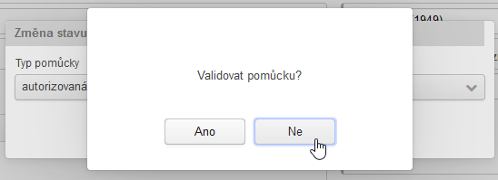

### Pořádání přírůstků do pomůcek dle "starých pravidel"

V podstatě existují 3 možnosti podle rozsahu pořádaných přírůstků. Příslušnou volbu musí schválit nadřízený (ředitel SOkA / vedoucí 1. oddělení / vedoucí 4. oddělení - vždy po konzultaci s  vedoucí 2. oddělení).

!!! warning "Důležité"

    Před pořádáním přírůstků většího rozsahu a formou reinventarizace je potřeba **uložit stávající verzi** ve [„Správě verzí pomůcek](../proarchiv/../proarchiv/manual_proarchiv.md#520-sprava-verzi-pomucek)“ s adekvátním popisem (provádí správce pomůcek/operátor PEVY).

#### Přírůstek malého rozsahu

Jde o jednotky archiválií. Uplatňuje se stejný princip jako při doplňování/dopořádání dle "nových pravidel". Archiválie se dopíše do stávajícího pořádacího schématu na místo, kam logický patří. Hodnota inventárního čísla naváže na poslední použitou hodnotu původní verze pomůcky. Např. při doplnění druhého dílu kroniky by u pomůcky, která končila inv. číslem 100 následoval po prvním díle kroniky s inv. č. 5 druhý díl s inv. č. 101. Použijí se výhradně kategorie "původní inv./kat. záznam". Pokud náleží archiválie do tematické databáze, zapíše se poté ještě jednou, a to ze strany tematické databáze.

Přírůstek je vždy nutno správně zaevidovat v Evidenci NAD, v tištěné pomůcce změny doplnit.

#### Přírůstek většího rozsahu

Ve stávající pomůcce se založí na konci hierarchie série 1. úrovně (úroveň vnořená hned pod sérii typu pomůcka) s názvem "Dodatek". Do něj se standardně dopořádá celý přírůstek včetně pořádacího schématu. Na úrovních složka jednotlivost se použijí výhradně kategorie "původní inv./kat. záznam". Pokud náleží archiválie do tematické databáze, zapíše se poté ještě jednou, a to ze strany tematické databáze.

Přírůstek je vždy nutno správně zaevidovat v Evidenci NAD, v tištěné pomůcce změny doplnit.

#### Reinventarizace dle "nových pravidel"

Třetí možností je samozřejmě kompletní reinventarizace dle "nových pravidel".

U původní autorizované pomůcky je potřeba změnit stav pomůcky z "autorizovaná" na "rozepsaná". Poté změnit Pravidla na "NZP". Dále postupujeme jako při pořádání podle "nových" pravidel.

!!! warning "Důležité"

    **Při reinventarizaci je potřeba v poli "Původní/jiné označení" změnit typ "Inv. číslo" na "Původní inv. číslo" - hodnota zůstavá!**
    Taktéž je potřeba dořešit "neinventarizované" záznamy ze série NEZAŘAZENÉ.

!!! tip "Tip"

    Při změně pravidel ze "Stará pravidla" na "NZP" nebudou záznamy kategorie "původní inv./kat. záznam" v záložce Detailní popis zobrazovat žádná pole. Vše bude v záložce Ostatní pole. Je to dáno tím, že ona kategorie není pro NZP přípustná. Abychom jednoduše původní data mohli využít i v nové pomůcce, je potřeba aplikovat následující funkci - viz Manuál - [5.3.1.1 Změna kategorie původní inv./kat. záznam](../proarchiv/../proarchiv/manual_proarchiv.md#5311-zmena-kategorie-puvodni-invkat-zaznam). 

### Pořádání podle "nových" základních pravidel (se zaměřením na tiskový výstup)

!!! warning "Důležité"

    **Veškerý archivní popis vzniklý při pořádaní podle "nových" pravidel vzniká primárně v pořádací aplikaci ProArchiv17, a to i <u>včetně úvodu pomůcky</u>!** Tiskový výstupu zprostředkovaný ve formátu .docx (MS Word) je pouhým derivátem platným k datu výtisku.

#### Úvod pomůcky dle "nových" pravidel

V úvodu archivní pomůcky má badatel získat v přehledném, srozumitelném a stručně zpracovaném výkladu základní informace o archivním souboru, jeho zpracování a jeho původci/původcích.

"Úvod" se vytváří na úrovni "archivní soubor", respektive "série typu pomůcka", a to strukturovaným zápisem do patřičných polí:

| Kapitola                                                     | Úroveň                                         | Popisné pole*                                                |
| ------------------------------------------------------------ | ---------------------------------------------- | ------------------------------------------------------------ |
| **I. Dějiny původce archivního souboru**                     | archivní soubor, *případně série typu pomůcka* | [Původce](metodika_zao.md#typ-popis-puvodce) - napojení na přístupový bod typu popis původce. Je třeba respektovat pořadí původců podle Pravidel - [kapitola 4.3.1, pravidlo 2](../../zp/zp_hlavni_text-04/#431-dejiny-puvodcu-jednotky-popisu) / [kapitola 6.2.1](../../zp/zp_hlavni_text-06/#621-popis-puvodcu) |
| **[II. Dějiny archivního souboru](metodika_zao.md#ii-dejiny-archivniho-souboru)** | série typu pomůcka                             | Dějiny jednotky popisu (2. kap. úvodu) + Přímý zdroj akvizice (2. kap. úvodu) - viz dále |
| **[III. Archivní charakteristika archivního souboru](metodika_zao.md#iii-archivni-charakteristika-archivniho-souboru)** | série typu pomůcka                             | Archivní charakteristika jednotky popisu (3. kap. úvodu) + Pravidla - popis + Způsob uspořádaní (3. kap. úvodu) + Budoucí přírůstky (3. kap. úvodu) + Odkazy na příbuzné dokumenty + Fyzický stav - popis + Práva k jednotce - viz dále |
| **[IV. Tematický popis archivního souboru](metodika_zao.md#iv-tematicky-popis-archivniho-souboru)** | série typu pomůcka                             | Tematický popis (4. kap. úvodu) - viz dále                   |
| **[V. Záznam o uspořádání archivního souboru a sestavení archivní pomůcky](metodika_zao.md#v-zaznam-o-usporadani-archivniho-souboru-a-sestaveni-archivni-pomucky)** | série typu pomůcka                             | Zpracovatel jednotky popisu + Datum popisu + Prameny a literatura + Seznam použitých zkratek - viz dále |

\*) Všechny informace z vyjmenovaných polí budou v rámci tiskové sestavy do úvodu automaticky agregovány.

##### II. Dějiny archivního souboru

<u>**Dějiny archivního souboru**</u> (= obsah pole *"Dějiny jednotky popisu (2. kap. úvodu)"*):

- informace o vytvoření, shromáždění či jiném způsobu nabytí materiálu během činnosti/existence původce, včetně časového vymezení

- způsob a místo ukládání původcem, případně i personál zajišťující tyto úkoly – pokud nevíme, je vhodné uvést tuto skutečnost  a případně rovněž spekulovat; např. nevíme, kde byly písemnosti kláštera shromažďovány a uloženy, můžeme se pouze domnívat, že u převora či v knihovně kláštera

- pokud je známý způsob ukládání spisů, označení spisů apod. (např. ze seznamu spisů, ukládacího seznamu, signatur na spisech), je vhodné tyto skutečnosti uvést, případně se pokusit o rekonstrukci spisového plánu – vždy je však vhodné si těchto skutečností všímat a uvést je, protože po našem zásahu již mohou být obtížněji zjistitelné


**<u>Přímý zdroj akvizice</u>** (= obsah pole *"Přímý zdroj akvizice (2. kap. úvodu)"*):

- uvést všechny dohledatelné informace o skartacích, případných přírůstcích a změnách u původce a jejich uložení

- převzetí materiálu do archivu a jeho uložení

- uvést všechny dohledatelné informace o skartacích, případných přírůstcích a úbytcích k fondu v archivu


##### III. Archivní charakteristika archivního souboru

**<u>Archivní charakteristika archivního souboru</u>** (= obsah pole *"Archivní charakteristika jednotky popisu (3. kap. úvodu)"*):

- pokud byl fond (či jeho část) již archivně zpracován, uvést kým, kdy a kde a do jaké podoby (např. prozatímní inventář, manipulační seznam, inventář …), případně doplnit souvislosti, proč byla zvolena příslušná forma apod. 

- popis stavu fondu před reinventarizací: metráž, charakteristika materiálu, ev. jednotky, časový rozsah + případná priora a posteriora

- zdůvodnění, proč bylo v současnosti (uvést rok) přistoupeno k revizi zpracování (reinventarizaci) fondu


**<u>Způsob uspořádání</u>** (= obsah pole "Způsob uspořádaní (3. kap. úvodu)"):

**!!! Veškeré změny a zásahy do podoby archivního souboru je v této kapitole nezbytné uvést, aby každý další potenciální zpracovatel byl schopen rozpoznat původní podobu a případně rekonstruovat některé části!!!**

**!!! Pokud zvolí zpracovatel nějaké méně obvyklé řešení, např. upřednostní v kapitole úřední knihy přísně chronologické řazení před tematickým, je nezbytné tuto skutečnost uvést a zdůvodnit!!!** 

- popis zvoleného pořádacího schématu a jeho zdůvodnění (např. podle spisového plánu původce, uměle vytvořené pořádací schéma …), včetně jeho rozepsání 
- uvedení způsobu a rozsahu vnitřních a vnějších změn se zdůvodněním, tj. delimitací (např. části písemností jiného původce přimíchané při stěhování) a skartací (např. duplicity, účetní doklady) – i v případě, že nebylo nic skartováno, je vždy nutné tento fakt uvést!!!
- popis nového stavu fondu po inventarizaci: metráž, charakteristika materiálu, ev. jednotky (v případě méně obvyklých ev. j. jako fascikl je vhodné zdůvodnění), časový rozsah
- při výčtu ev. jednotek se uvádí zvlášť počet v analogové a digitální podobě, analogové se počítají na kusy, u digitálních se uvádí velikost v bytech
- u tisků do roku 1800 je nezbytné uvést, o jaký druh tisku se jedná (brožura, leták)
- u ev. jednotky jiné je potřeba specifikovat, o jaký materiál se jedná (numismatický, faleristický, jiné); vždy je potřeba konkretizovat typ materiálu, např. jiné-předměty faleristické povahy (vyznamenání, plaketa, náprsní velkostuhy), jiné-jiné (vzorník)
- u kinematografických děl/záznamů je nutné uvést počet filmových pásů a jejich šíři
- u cenných papírů je nezbytné uvést nejen počet, ale i jejich typ (akcie, kuksy, podílové listy, směnky)
- jsou-li jednotliviny, vykazované jako samostatné evidenční jednotky, např. listiny, mapy, technické výkresy, fotografie, tisky..., uložené v kartonech z důvodu účelnosti (manipulace, podmínky uložení), je
  nutné tuto skutečnost uvést
- nezapomenout uvést  případná priora a posteriora, včetně vymezení /*posteriorum tvoří ….*/ 
- časová a obsahová dochovanost a úplnost fondu /*úplný – mezerovitý – torzovitý*/
- užívaný jazyk fondu – uvést všechny, pokud možno s orientační kvantifikací, který převažuje apod. Navíc všechny užívané jazyky uvést i v samostatném poli **"Jazyk"**. 


**<u>Pravidla zpracování jednotky popisu</u>** (= obsah pole "Pravidla - popis (3. kap. úvodu)"):

- uvedení zvolené metodiky při zpracování archivního materiálu (např. Základní pravidla pro zpracování archiválií. Druhé, opravené a rozšířené vydání. M. Wanner a kol., Praha 2015; nejrůznější metodická návody vydané AS MVČR či v AČ nebo SAP)

**<u>Budoucí přírůstky a odkazy na příbuzné dokumenty a archiválie</u>** (= pole "Budoucí přírůstky (3. kap. úvodu)"):

- není-li fond uzavřený a je možné očekávat přírůstky, je vhodné uvést tuto skutečnost, včetně informace, odkud je lze očekávat

- uvést, existují-li někde příbuzné dokumenty a archiválie (stručná charakteristika s odkazem na archiv, fond, inv. č) – nutné zvláště jedná-li se o části fondu z různých důvodů rozptýlené – lze detailizovat v příloze 


**<u>Odkaz na příbuzné dokumenty a archiválie</u>** (= obsah pole "Odkazy na příbuzné dokumenty")

**<u>Fyzický stav archivního souboru</u>** (= obsah pole "Fyzický stav - popis")

- fyzický stav archiválií (nepoškozený/poškozený), případně charakter poškození (křehký / lámavý – trhliny / přelomení – poškozený plísněmi (hmyzem, hlodavci, ohněm, teplem, vodou, rzí, vlivem elmag. pole, prachem, světlem) / jiné)
- u fotografických a audiovizuálních archiválií je potřeba uvést, zda se nejedná o nestabilní materiál, např. nitrocelulózy a acetylcelulózy

**<u>Podmínky přístupu, práva k jednotce popisu a její reprodukci</u>** (= obsah pole "Práva k jednotce")

- informace o omezení přístupnosti je nezbytné uvést vždy, pokud je omezena právně (např. zákon 101/2000 Sb. či depozitní smlouva), špatným fyzickým stavem archiválií či technickými možnostmi archivu – vždy nezbytné uvést zdůvodnění, ideálně s odkazem na právní autoritu (např. zákon č. 499/2004 Sb., o archivnictví a spisové službě)

- pokud je nějak omezena možnost zhotovování reprodukcí, je nezbytné uvést informaci o tom, jak je omezena, včetně odkazu na příslušné ustanovení zákona či depozitní smlouvu apod.  

##### IV. Tematický popis archivního souboru

(= obsah pole "Tematický popis (4. kap. úvodu)")

- tematický popis obsahu archivního souboru (co se dochovalo, např. jaké části agendy původce), časově jej vymezit (s charakteristikou prior a posterior) a případně doplnit o geografický rozsah (působnost) 
- vypíchnout to nejzajímavější z dochovaného materiálu, případně upozornit na jeho význam a limity

- upozornit na možnosti badatelského využití celého archivního souboru, jeho částí či jednotlivin pro nejrůznější obory, korporace, osoby apod.

##### V. Záznam o uspořádání archivního souboru a sestavení archivní pomůcky

**<u>Zpracovatel jednotky popisu:</u>** 

- syntaxe zápisu - viz [Autorství záznamu: Zpracovatel jednotky popisu vs. Vytvořil/Upravil](metodika_zao.md#autorstvi-zaznamu-zpracovatel-jednotky-popisu-vs-vytvorilupravil)

**<u>Datum popisu:</u>** 

- rok zpracování

**<u>Prameny a literatura:</u>**

- seznam zdrojů nebo odkaz na informační prameny v kapitole I. archivní pomůcky

- používat ČSN ISO 690 (01 0197), v případě pochybností lze použít nástroj pro tvorbu citací na [www.citace.com](http://www.citace.com)

!!! note "Poznámka"

    Dílčí sekce (pole) kapitol 2, 3, 4 se sice primárně vyplňují na úrovni „série typu pomůcka“, ale mohou se vyplňovat i na úrovních „série“, kde by mohly být tyto informace adresnější. Pravidla to takto umožňují (princip hierarchického popisu). Do tištěného úvodu k pomůcce se pak ty informace z vnořených sérií zagregují.

#### Obsah pomůcky dle "nových" pravidel

V aplikaci se nikde nezapisuje, generuje jej automaticky tisková sestava pro tisk pomůcky podle "nových" pravidel.

#### Seznam použitých zkratek

Speciální pole pro záznam zkratek použitých při sepisování "úvodu" pomůcky. Požadovaný zápis:

```
zkratka - název v nezkrácené podobě
```

Každou zkratku zapisovat na nový řádek.

Seznam povolených zkratek - viz [Zkratky](metodika_zao.md#zkratky).

#### Soupis jednotek popisu v pomůcce dle "nových" pravidel

Soupisem jednotek popisu je chápán samotný seznam popisovaných jednotek vyjádřených sériemi, složkami, jednotlivostmi a částmi jednotlivostí. V tiskovém výstupu je prezentován v zhuštěnější "odstavcové" podobě. Tisková sestava rovněž generuje automaticky pořadová čísla, která propojují rejstříková hesla v analogové formě s archivním popisem.

#### Rejstříky v pomůcce dle "nových" pravidel

Přístupové body se převádějí do analogové (rozuměj "tištěné") pomůcky automaticky.

#### Tiráž pomůcky dle "nových" pravidel

V aplikaci se nikde nezapisuje, generuje jej automaticky tisková sestava pro tisk pomůcky podle "nových" pravidel. Jedině u tiráže je nutné doplnit údaje: 

- Rozsah archivní pomůckou zpřístupněných archiválií
- Stav archivní pomůckou zpřístupněných archiválií ke dni
- Počet stran archivní pomůcky
-  Archivní pomůcku schválil

#### Změna stavu pomůcky / technická finalizace pomůcky

Viz Manuál - [5.11 Stav pomůcky](../proarchiv/../proarchiv/manual_proarchiv/#511-stav-pomucky)

Pokud **zpracovatel** považuje svou práci za hotovou, přepne **stav pomůcky z „rozepsaná“ na „zpracovaná“**. Pomůcka je tak připravena ke schvalovacímu procesu a může být následně zaslána oponentovi na posouzení. 

Pokud proběhne schvalovací proces úspěšně, **operátor PEVY** (v roli "správce pomůcek") přepne **stav pomůcky ze "zpracovaná" na "autorizovaná"**. V tomto kroku proběhne i **generování referenčního označení**.

**Do programu PEvA operátor pomůcku zapíše jako elektronickou pomůcku dle EAD.**

**Formální schvalovací proces je upraven samostatným pokynem ředitele:** [odkaz na stažení (formát pdf)](attachments/Zasady_pro_schvalovani_archivnich_pomucek_2019-04-08.pdf)

##### Dočasné opatření ohledně vkládání úvodů:

Vzhledem k tomu, že současná verze Digitálního archivu neumí zobrazovat kapitoly úvodu ve strukturované podobě tak, jak jsou zapisovány v ProArchivu, je potřeba u autorizované pomůcky vygenerovat do jednoho souboru pdf titulní list + úvod pomůcky a připojit jej s možností stažení k sérii typu pomůcka. Soubor pdf má následující syntaxi: *č.listuNAD_č.AP_nazev.pripona = např. 11_1083_mnv_bila.pdf*.

#### Volba tiskové šablony

Viz Manuál - [5.17 Tisky](../proarchiv/../proarchiv/manual_proarchiv.md#517-tisky)

Pro tisk inventářů dle "nových" Pravidel použijte tiskovou sestavu "Pomůcka dle NZP - inventář - kompletní". Zde vyberte vždy šablonu s označením [OFICIÁLNÍ].

#### Pořadové číslo

Pořadové číslo zobrazené v tiskovém výstupu je údaj, který slouží k propojení jednotky popisu s hesly v sekci Rejstříky. **Hodnota pořadové číslo se neukládá do dat (do aplikace)**, je vždy generována až při tisku a v následné tiskové verzi pomůcky je opět vygenerována nová číselná řada. **Nejde tedy o žádnou konstantu, proto nemůže sloužit k identifikaci archiválií!** 

#### Úprava finální tiskové verze pomůcky

***Úprava finální tiskové verze*** (rozuměj "ve Wordu") je ***povolena pouze po formální a typografické stránce***: úprava zarovnání, tvorba odrážek, převod určitých pasáží textu do tabulky, odřádkování, užívání spojovníků a pomlček apod. Obsahové změny nejsou povoleny, musí být vždy provedeny v primárních datech = v pořádací aplikaci. Výjimku tvoří tiráž.

!!! warning "Důležité"

    **Formální a typografické úpravy provádějte až na tiskové verzi pomůcky ve stavu "autorizovaná" po vygenerování referenčního označení!** 

Problematika nevalidních konců řádků - problémy se zarovnáním do bloku apod. je řešena v [Manuálu - Nahrazení konce řádků ve wordovském dokumentu](../proarchiv/../proarchiv/manual_proarchiv.md#nahrazeni-konce-radku-ve-wordovskem-dokumentu).

### Metodický návod pro vytváření archivní pomůcky Manipulační seznam prvního typu

Cílem tvorby manipulačního seznamu 1. typu v ZAO je zpřístupnit širší veřejnosti informace o nově uložených materiálech (archiváliích) z přejímek, které bez těchto pomůcek doposud zůstávají před badateli „ukryty“ ve spisech o fondu. Za účelem zpřístupnění informací o nově přejímaných archiváliích do archivu bude v ZAO vytvářen manipulační seznam prvního typu. Vše podstatné je popsáno v níže připojených dokumentech:

| dokument                                                     | info                                                         |
| ------------------------------------------------------------ | ------------------------------------------------------------ |
| **[metodika_pro_tvorbu_manipulacniho seznamu_prvniho_typu.pdf](attachments/ms/metodika_pro_tvorbu_manipulacniho seznamu_prvniho_typu.pdf)** | **znění interního metodického pokynu k tvorbě manipulačních seznamu prvního typu z přírůstků** |
| [tabulka_pro_tvorbu_manipulacniho_seznamu_prvniho_typu.ods](attachments/ms/tabulka_pro_tvorbu_manipulacniho_seznamu_prvniho_typu.ods) | šablona pro tvorbu manipulačního seznamu v LibreOffice, určeného k následnému importu do ProArchivu |
| [protokol_o_schvaleni_archivni_pomucky.docx](attachments/ms/protokol_o_schvaleni_archivni_pomucky.docx) | šablona protokolu o schválení archivní pomůcky typu manipulační seznam |
| [603_840_zakladni_skola_mala_moravka_c_prirustku_2023_61.pdf](attachments/ms/603_840_zakladni_skola_mala_moravka_c_prirustku_2023_61.pdf) | ukázkový výstup manipulačního seznamu 1. typu                |

### Nakládání s původními záznamy tematických databází v nových pomůckách nebo při "reinventarizaci"

Množí se případy nesprávného nakládání s původními záznamy tematických databází při pořádání nových pomůcek nebo při „reinventarizaci“. Uživatelé nepožívají původní záznamy tematických databází. Chybně vytvářejí jejich kopie (pomocí funkce Kopírovat) nebo je zapisuji zcela nově.

Jak tedy správně nakládat se záznamy tematických databází?

#### Scénář 1: Archivní soubor nemá zatím žádnou pomůcku, avšak některé archiválie jsou zpracovány v tematických databázích

Zpracované záznamy z tematických databází, které nejsou umístěny v pomůcce, naleznete ve speciální sérii „NEZAŘAZENÉ“:

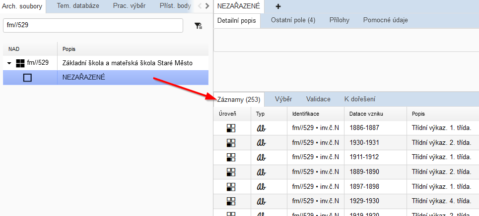

Po založení nové pomůcky nezapomeňte sérii „NEZAŘAZENE“ vypořádat následujícím způsobem:

Přesuňte záznamy pomocí funkce Kopírování / Přesun do správného umístění v nové pomůcce. Použijte vždy finální příkaz **Přesunout**, nikoli Kopírovat.

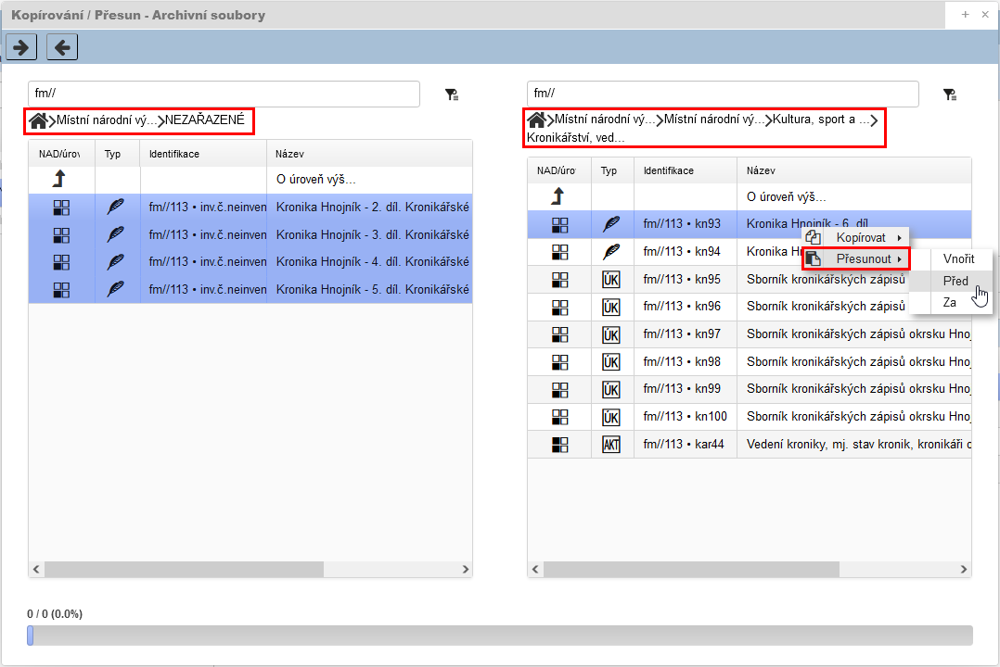

V ideálním případě (když pořádáte celý fond) by měla být série „NEZAŘAZENÉ“ po dokončení pořádacích prací prázdná!

#### Scénář 2: Provádíme „reinventarizaci“ a v původní pomůcce se nacházejí záznamy z tematických databází

Postupujeme analogicky jako ve scénáři 1. Použijeme původní záznamy tematických databází „zapouzdřené“ ve staré pomůcce pod inventárním záznamem. Nevytváříme nové, ani ty původní nekopírujeme do pomůcky nové. Nýbrž opět použijeme **přesun**! Aby přesun fungoval, musí být původní pomůcka přepnuta ze stavu „autorizovaná“ na „rozpracovaná“, případně „zrušena“. Přepnutím stavu pomůcka zmizí z Digitálního archivu. 

Umístění záznamů tematických databází v pomůcce podle "starých" pravidel:

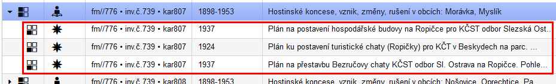

Přesun do pomůcky nové:

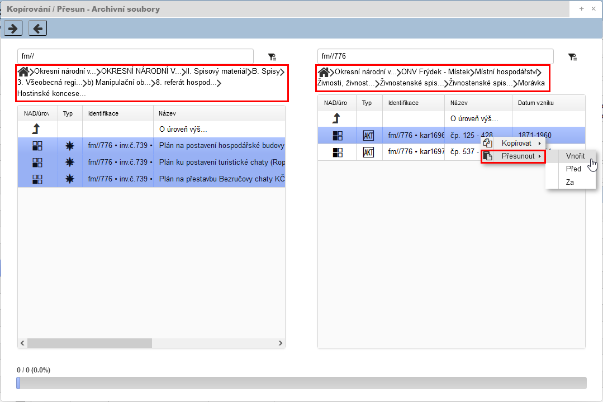

Při „reinventarizaci“ se **přesun** používá i pro původní inventární záznamy, které mají připojené přílohy (skeny). 

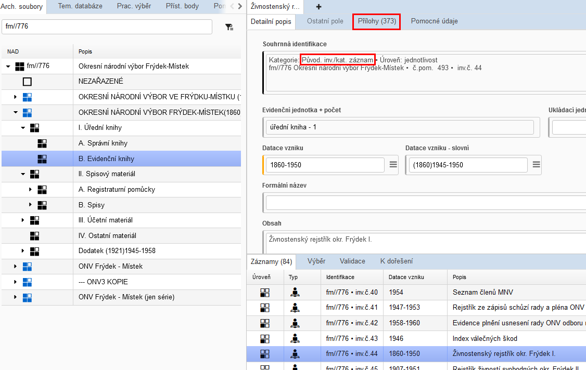

Jen je potřeba před přesunem změnit kategorii z „původní inv./kat. záznam“ na novou. Viz Různé funkce > Změny > Změna kategorie pův. inv. záznam: 

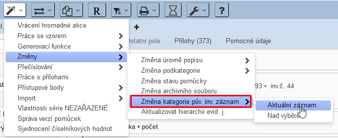

#### Důvody, proč se musí ve výše zmíněných situacích vždy použít PŘESUN

1) Při založení nového záznamu nebo vytvoření kopie původního funkcí kopírování vždy dojde vytvoření nového záznamu, jenž bude strojově identifikován novým identifikátorem UUID. Identifikátory UUID hrají klíčovou roli pro stabilitu permalinku v Digitálním archivu. Na novém nebo zkopírovaném záznamu nebude původní permalink fungovat! Navíc pak bude v Digitálním archivu tematický záznam jedné archiválii 2x, což badatele mate!

2) Při kopírování nedojde ke kopírování příloh (skenů). Ke zkopírovanému záznamu by se tedy musely znovu připojovat skeny, což je neefektivní.

### Prohlubování popisu

V autorizované pomůcce je možno prohlubovat popis (rozuměj zakládat nové jednotky popisu) do záznamů, které mají definovanou evidenční jednotku. Např. popisování jednotlivostí ve složkách (technické výkresy ve spisech / fotografie v souborech fotografií); popisování částí jednotlivostí v jednotlivostech (fotografie v kronikách / veduty v aktovém materiálu) atd.

### Pořádání přírůstků do pomůcek dle "nových pravidel"

Tzv. reinventarizace  se u pomůcek dle "nových pravidel"  neuplatňuje. Doplňování/dopořádání nových jednotek popisu se řeší následujícím způsoben: nový záznam se dopíše do stávajícího pořádacího schématu na místo, kam logický patří. To platí nejen pro složky a jednotlivosti, ale i pro série.

Pří následné autorizaci dojde u nově vytvořených záznamů k vygenerování referenčního označení dle algoritmu - viz Pravidla - [4.2.1 Referenční označení (Pořadové číslo)](../../zp/zp_hlavni_text-04/#421-referencni-oznaceni-poradove-cislo-pro-manipulacni-seznam) - Pravidlo 5.

Na závěr je potřeba na "sérii typu pomůcka" aktualizovat pole "Datace vzniku - generovaný údaj", "Evidenční jednotky + součet", "Zpracovatel jednotky popisu" a "Datum popisu", případně obsah dalších polí.

*Kdy/zda vůbec se mění číslo pomůcky? Kdy se bude tisknout další verze pomůcky? Tyto otázky budou dořešeny později.*

### Rušení pomůcek

#### Rušení pomůcek při reinventarizaci

1. U původní pomůcky se provede vytvoření nové verze ve „[Správě verzí pomůcek](../proarchiv/../proarchiv/manual_proarchiv.md#520-sprava-verzi-pomucek)“ s popisem „stav při zrušení, pův. č. pom. XY“ *(provádí správce pomůcek/operátor PEVY)*.

2. Původní pomůcka přejde do stavu „rozpracovaná“ = nebude se zobrazovat v Digitálním archivu *(provádí správce pomůcek/operátor PEVY)*.

3. Přímo nad touto původní pomůckou proběhnou reinventarizační práce, tzn. uzlový bod, tj. série typu pomůcka, nebude smazán, obsahově se ale samozřejmě změní *(provádí archivář)*.

4. Po dokončení reinventarizace proběhne autorizace pomůcky = bude se zobrazovat v Digitálním archivu  *(provádí správce pomůcek/operátor PEVY)*.

5. Poté se vytvoří nová verze ve „Správě verzí pomůcek“ s popisem „stav po reinventarizaci, nové č. pom. XY“ *(provádí správce pomůcek/operátor PEVY)*.

#### Rušení pomůcek při delimitaci

<u>Akce na straně archivu, **odkud** se delimituje:</u>

1. U původní pomůcky se ještě před delimitací provede [export do XML](../proarchiv/../proarchiv/manual_proarchiv.md#518-importexport-pomuckyserie) a zašle cílovému archivu *(provádí správce pomůcek/operátor PEVY)*.

2. Dále se tato pomůcka převede do stavu „zrušená“ = nebude se zobrazovat v Digitálním archivu *(provádí správce pomůcek/operátor PEVY)*.

3. Poté, kdy cílový archiv potvrdí, že delimitaci (import pomůcky) provedl úspěšně, provede se výmaz pomůcky *(provádí správce pomůcek/operátor PEVY)*.

<u>Akce na straně archivu, **kam** se delimituje:</u>

4. V novém umístění (v nové NADce v archivu, kam delimitace směřovala) se provede [import z XML](../proarchiv/../proarchiv/manual_proarchiv.md#518-importexport-pomuckyserie) *(provádí správce pomůcek/operátor PEVY v archivu; předpokládá se vzájemná komunikace obou archivu a výměna xml souboru)*.

5. U naimportované pomůcky se provede vytvoření nové verze ve „Správě verzí pomůcek“ s popisem „stav po nabytí (delimitace)“ *(provádí správce pomůcek/operátor PEVY)*.

6. Dále se u této pomůcky opraví identifikační údaje (číslo pomůcky atd.) a poté se pomůcka převede do stavu „autorizovaná“ = bude se zobrazovat v Digitálním archivu *(provádí správce pomůcek/operátor PEVY)*.

### Jak správně psát popis (regest/obsah)

Popis (regest) je zde chápán šířeji. Nejde jen o pole Obsah, ale také o další popisná pole na formuláři, kde je uplatňován volný textový zápis informací.

Pravidla pro formální úpravu regestů:

- **popisné informace zapisovat adresně - vždy do určených polí.** Pokud např. metodika pro úřední knihy před rokem 1850 stanoví formální popis knihy (rozměry, vazba, jazyk, stav), nezapisují se tyto údaje do pole Obsah, ale do samostatných polí Rozměry, Množství, Technická poznámka, Fyzický stav apod.
- při tvorbě regestu nepoužívat odrážky, tj. regest graficky nečlenit
- regesty nejsou zakončovány tečkou
- velká písmena se používají na začátku regestu, dále výhradně u názvů a jmen
- z důvodu jednoduššího zápisu mohou být pomlčky nahrazeny spojovníky/znakem minus
- používání uvozovek je možné, např. pro zdůraznění názvu díla
- použití zkratek - viz [Zkratky](metodika_zao.md#zkratky).

#### Syntaxe regestu

- Klíčový je jednotný přístup. 

- Popis obsahu záznamu se formuluje stručně a výstižně tak, aby postihl hlavní a nejdůležitější jevy, které archiválie dokumentují.

- Informace z názvu série se v nižších úrovních zpravidla neopakují. Někdy je to však účelné, nebo se nelze užití stejného slova vyhnout.

  Např.: 

  *Série 1. úrovně:* Volby do zastupitelských sborů

  *Série 2. úrovně:* Volby do národních výborů

  *Série 3. úrovně:* Volební výsledky, sumáře

  *Složka:* Výsledky voleb 1954

#### Výčet a výběr

 **Výčet** = **jednotlivé položky se uvedou podle významu za pomlčku**

 Např.: *Volby do obecního zastupitelstva – seznamy voličů, korespondence, výsledky, pokyny*

 **Výběr** =  **vybrané položky se uvedou za čárku a zkratku mj.** (mimo jiné)

 Např.: *Volby do obecního zastupitelstva, mj. seznamy voličů, výsledky*

#### Užívání interpunkce a závorek při tvorbě regestů

Klasická věta, tedy věta s přísudkem a dalšími větnými členy a případnou interpunkcí, je akceptována výlučně u listin.

V obsahové části regestu používáme výhradně čárky, kterými oddělujeme typy agendy, materiálu či jednotlivá sdělení. Další interpunkci jako dvojtečky, středníky, otazníky, vykřičníky nepoužíváme, nejde-li o součást názvu.

Závorky se používají výhradně pro vysvětlení nějakého pojmu, nikoliv jako doplnění či konkretizace, např.:

*Kniha nákupu mohéru (látka z vlny argonské kozy)*

*Platby laudemia (převodní dávka)* 

#### Speciální požadavky záznamů tematických databází 

!!! warning "Upozornění"   

    U záznamů, jejichž kategorie se rovnají tematickým databázím, se tvorba popisu řídí **primárně** pokyny z kapitoly [5 Metodika pro kategorie záznamů rovnající se tematickým databázím](metodika_zao.md#5-metodika-pro-kategorie-zaznamu-rovnajici-se-tematickym-databazim)!

Např. u zápisu do TD Kroniky se metodicky žádá, aby regest začínal názvem kroniky s označením lokality (Kronika obce Bílá). Při pohledu ze strany zpracování pomůcky je údaj o lokalitě nadbytečný, uvedeme jej však, neboť metodika pro danou TD má přednost.

### Princip dědičnosti / neopakování informací při hierarchickém popisu  

!!! warning "Výjimka pro všechny záznamy kategorií TD a jednotlivostí ostatních kategorií"   

    Pokud tvoří jednotku popisu **záznam TD** na jakékoli úrovni (složka, jednotlivost či část jednotlivosti) nebo **záznam ostatních kategorií na úrovni jednotlivost a část jednotlivosti**, musí být vždy popsán tak, aby byl jeho popis **jednoznačný, nezávisel na dědičnosti z vyšších úrovní a byl na kontextu pomůcky / hierarchickém zařazení nezávislý. **U těchto záznamů lze ale naopak počítat s dědičnost přístupových bodů**, jež je vždy odvozena z primárního pohledu přes Archivní soubory. Vzhledem k tomu, že zobrazení dědičnosti bylo implementováno až později, je duplicita „zděděného“ PB a napojeného PB u těchto záznamů možná a není vnímaná jako chyba.
    **Prakticky je tak dědičnost archivního popisu v poli „Obsah“ uplatňována na záznamy úrovně „složka“, které jsou kategorie mimo TD.** Většinově tedy hlavně na složky aktového materiálu. 

#### Neopakování informací při používání složek

##### Varianta 1 – vynucené použití v případě rozdělení jedné agendy do více ukládacích jednotek

Použití složky a vnořené složky v případě, když máme jeden typ (povětšinou aktového) materiálu, který je třeba rozdělit mezi dvě množstevní evidenční jednotky. U složky se bude v poli *Evidenční jednotka a Ukládací jednotka* uvádět *definováno v podřízených jednotkách popisu*. Pole *Obsah* společné pro všechny podřízené jednotky popisu se vyplňuje pouze na úrovni složka.

Správně (v pořádací aplikaci):

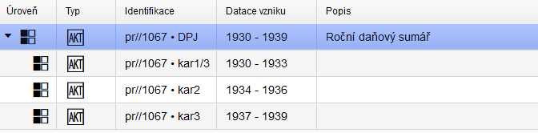

Správně (v tiskovém výstupu):

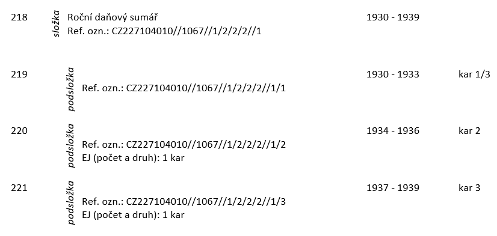

Chybně:

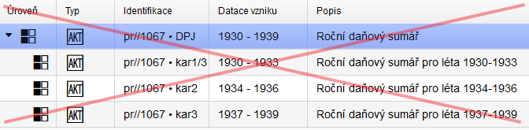

##### Varianta 2 – použití při akcentaci společné charakteristiky popisovaného materiálu

Použití složky a vnořené složky v případě, když máme více jednotek popisu v podobě složek, které mají stejný charakteristický znak, chceme je popisovat zvlášť a není účelné použít namísto nadřazené složky nižší sérii. U složky se bude v poli *Evidenční jednotka a Ukládací jednotka* uvádět rovněž *definováno v podřízených jednotkách popisu*. Pole *Obsah* společné pro všechny podřízené jednotky popisu se vyplňuje na úrovni složka informací společnou pro všechny vnořené složky.

Pokud je potřeba vyplňovat obsahové pole regestu vnořené složky, je potřeba vzít v úvahu následující informace. Obsahová část regestu „nadřízené“ složky a vnořené složky tvoří logický celek. Dle principu dědění informací jde o hierarchicky skládanou větu (sled slovních spojení), ve které se informace neopakují. Informace v její první části (tj. v obsahové části regestu „nadřízené“ složky) jsou obecnější a společné pro druhé části (tj. v obsahových částech regestů vnořených složek), která obsahují konkréta popisovaných jednotek. Při tvorbě obsahového pole regestu je potřeba se vyhnout nejen slovesům (s výjimkou tvaru přechodníku), ale také předložkám na počátku a konci slovních spojení. Pokud je to nezbytné, tak předložku použít vždy na začátku obsahu nižší části.

Příklad 1)

– složka: Finanční plán

–– podsložka: na 3. Pětiletku

Není nutné užít předložku a lze zapsat jako:

– složka: Finanční plán

–– podsložka: 3 pětiletka

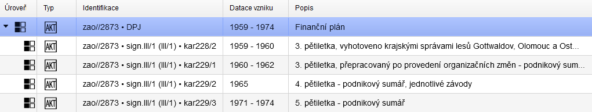

Příklad 2)

– složka: Korespondence ….

–– podsložka: v letech 1973-1980

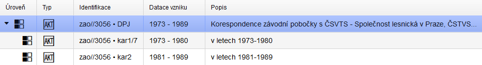

#### Zásady pro obsahové části regestu u nadřízených a vnořených složek

U tvorby obsahové části regestu **<u>nadřazené složky</u>** je potřeba, kromě výše zmíněných obecných pravidel, dodržovat:

- zvolenou hloubku popisu
- slovní spojení charakterizující vnořené složky užívat v nominativu singuláru nebo plurálu
- výčet a výběr užívat pouze pokud je to nezbytně nutné, aby vzniklá věta byla srozumitelná, tj. informace z podřízené složky navazovaly na informace z nadřízené
- vyvarovat se opakování informace o jménu a sídlu původce 
- na konci neužívat interpunkci

U tvorby obsahové části regestu **<u>vnořené složky</u>** je potřeba, kromě výše zmíněných obecných pravidel, dodržovat:

- zvolenou hloubku popisu
- slovní spojení v nominativu
- výčet a výběr užívat pouze pokud je to nezbytně nutné, aby vzniklá věta byla srozumitelná – pokud byly použity v popisu nadřízené složky, tak použít pouze konkréta
- na konci neužívat interpunkci

!!! warning "Upozornění"   

    Pokud se použije výčet nebo výběr v obsahové části regestu „nadřízené“ složky, neměl by být užit v obsahové části regestu vnořené složky!

##### Psaní předložek v hierarchicky skládaném regestu

Když je regest hierarchicky skládáná věta, ve které chceme použít předložky "z", "na", "za", postupujeme následovně:

– složka: Korespondence

–– podsložka: z let 1980-1981

– složka: Finanční plán

–– podsložka: na 3. Pětiletku

##### Dědičnost připojených přístupových bodů u vnořených složek

U vnořených složek záznamů z kategorií mimo TD se akceptuje dědičnost přístupových bodů z vyšších úrovní pořádacího schématu, tzn. není je potřeba znovu připojovat. Tato dědičnost ale není tvořena skutečným "propisem" přístupového bodu (u vnořených složek se automaticky nevytvoří skutečná vazba na přístupový bod).

### Soubor jednotlivostí vs. jednotlivost

**Zápis souborů technických výkresů, fotografií**

Jednotliviny se popisují z hlediska úrovně popisu zpravidla vždy jako **jednotlivost**.

V případech, je-li to účelné z hlediska popisu a zpřístupnění, je možné popsat více jednotlivin jako **soubor** technické dokumentace/fotografií, tj. z hlediska vymezení úrovně popisu jako **složku**:

- mělo by se jednat především o moderní technickou dokumentaci k jedné stavební akci, fotografie k jedné události/akci …

- povinně by zápis vypadal takto: „Soubor technické dokumentace/fotografií k (akce XY):“ následoval by popis odpovídající skutečnosti (v případě technické dokumentace názvy jednotlivých listů)

- do ostatních polí by se zapisovaly údaje popisující všechny ks souboru. Např. pro 10 ks technických výkresů, jejichž autory by byl Novák (1-5), Vyorálek (6-9), Janota (10), s rozměry 100x56 cm (1-8) a 35x58 cm (9-10), měřítkem 1:50 (1-3) a 1:20 (7-10) se použije popis: 
    - přístupové body v roli "Autoři" = Janota / Novák / Vyorálek (dle pravidel pro zápis přístupových bodů; každý zvlášť)
    - *měřítko metrické*: 1:50, 1:20
    - *rozměry, hmotnost, velikost*:  šířka 100 cm, výška 56 cm; šířka 35 cm, výška 58 cm (jednotlivé páry rozměrů oddělovat středníkem) 
    - analogicky pak i u dalších polí popisu

- vykazování evidenčních jednotek (EJ): 
    - technické výkresy – jednotlivina = 1 EJ, soubor = 1 EJ o X ks (kusy se zapisují do pole Množství)
    - fotografie - jednotlivina = 1 EJ, soubor = kolik ks, tolik EJ

### Problematika názvů

#### Formální název

Možno uvést původní název archiválie (např. cizojazyčný). Jde o nepovinný údaj.

Uvádí se zde i český název, který není zcela srozumitelný (např. archaický). **Srozumitelný český originální název archiválie se bude zapisovat do pole Obsah** (na první řádek).

Do pole Formální název se nově zapisuje i **název autorského díla**, pokud je archiválie jako autorské dílo chápána. 

Pravidla předpokládají při popisu autorského díla rovněž vytvoření přístupového bodu třídy "dílo/výtvor". Toto se provádí vytvořením nového přístupového bodu typu "dílo" v roli "ostatní entity zachycené jednotkou popisu" v [plovoucím okně pro zápis přístupových bodů](../proarchiv/../proarchiv/manual_proarchiv.md#5931-plovouci-okno-pro-zapis-pristupovych-bodu).

Pokud však založení takového přístupové bodu není účelné (např. rukopisy a jiné archiválie malého lokálního významu, které by se jako přístupové body již jinde nepoužily), název autorského díla se uvede, avšak přístupový bod není potřeba zakládat.

### Zkratky

**Používání zkratek v archivním popisu je důrazně omezeno na zkratky z následujícího výčtu:**

u korporací:

| Zkratka       | Název v nezkrácené podobě                                    |
| ------------- | ------------------------------------------------------------ |
| a. s.         | akciová společnost                                           |
| ČR            | Česká republika                                              |
| ČSFR          | Česká a Slovenská Federativní Republika                      |
| ČSR           | Československá republika, od roku 1968 Česká socialistická republika |
| ČSSR          | Československá socialistická republika                       |
| GŘ            | generální ředitelství                                        |
| JZD           | jednotné zemědělské družstvo                                 |
| k. p.         | koncernový podnik                                            |
| k. s.         | komanditní společnost                                        |
| KSČ           | Komunistická strana Československa                           |
| n. p.         | národní podnik                                               |
| NSDAP         | Nationalsozialistische deutsche Arbeiterpartei               |
| o. p.         | oborový podnik                                               |
| SA            | Sturmabteilung                                               |
| SD            | Sicherheitsdienst                                            |
| SdP           | Sudetendeutsche Partei                                       |
| s. p.         | státní podnik                                                |
| s. r. o.      | společnost s ručením o(b)mezeným                             |
| spol. s r. o. | společnost s ručením o(b)mezeným                             |
| SS            | Schutzstaffel                                                |
| SSSR          | Svaz sovětských socialistických republik                     |
| UNRRA         | akce Spojených národů na pomoc zemím postiženým válkou       |
| USA           | Spojené státy americké                                       |
| VHJ           | výrobní hospodářská jednotka                                 |
| v. o. s.      | veřejná obchodní společnost                                  |
| YMCA          | Křesťanské sdružení mladých mužů                             |
| YWCA          | Křesťanské sdružení mladých žen                              |

\+ pro všechny stupně národních výborů (ÚNV, KNV, ONV, MNV, ObNV, MěNV, JNV)

\+ zkratky evidenčních jednotek

\+ další vžité zkratky:

| Zkratka     | Název v nezkrácené podobě |
| ----------- | ------------------------- |
| inv. č.     | inventární číslo          |
| sig.        | signatura                 |
| ref. ozn.   | referenční označení       |
| čj. / č. j. | číslo jednací             |
| čp. / č. p. | číslo popisné             |
| k. ú.       | katastrální území         |
| mj.         | mimo jiné                 |
| sv.         | svatý                     |

### Autorství záznamu: Zpracovatel jednotky popisu vs. Vytvořil/Upravil

U každé jednotky popisu a přístupového bodu je v záložce Detailní popis k dispozici pole Zpracovatel jednotky popisu, zároveň v záložce Pomocné údaje automaticky generovaný údaj Vytvořil a Upravil (dle přihlášeného uživatele). Proto je důležité, abyste používali pořádací aplikaci vždy pod svým účtem. Data z Vytvořil a Upravil budou při exportech převedena do správné podoby. Např. r.michna = Michna Radomír, Mgr. (údaje z Active Directory/LDAP serveru).

**Hodnoty z Vytvořil/Upravil jsou vždy primární (generují se automaticky).**

**Povinné vyplnění pole Zpracovatel jednotky popisu bude pouze:**

- na úrovni "série typu pomůcka"
- tam, kde je třeba údaj Vytvořil a Upravil upřesnit. Např. na tvorbě popisu se podílely dvě a více osob, ale ve Vytvořil nebo Upravil je jen jedna (která byla při zápisu přihlášena). V tom případě se do pole Zpracovatel jednotky popisu vypíší všechny osoby.

Syntaxe zápisu: Příjmení Jméno, titul; např. *Michna Radomír, Mgr.*

### Datování záznamu: Datum popisu vs. Vytvořeno/Upraveno

U každé jednotky popisu je v záložce Detailní popis k dispozici pole Datum popisu, zároveň v záložce Pomocné údaje automaticky generovaný údaj Vytvořeno a Upraveno (časový otisk při ukládání). Data z Vytvořeno a Upraveno budou při exportech převedena do správné podoby.

**Hodnoty z Vytvořeno/Upraveno jsou vždy primární (generují se automaticky).**

**Povinné vyplnění pole Datum popisu bude pouze:**

- na úrovni "série typu pomůcka"
- tam, kde je třeba údaj Vytvořeno a Upraveno upřesnit. Např. při určení časového rozsahu pořádacích prací; při antidatování kvůli přepisu starších pomůcek apod. 

### Možnost zveřejnění

Určení formy přístupnosti badatelům, resp. možnosti zveřejnění informací v prezentačním systému archivu, tj. v Digitálním archivu ZAO (dále DA). V určitých kombinacích ovlivňuje i export dat, tiskové výstupy apod. 

**Existuje víceúrovňový systém možností zveřejnění:**

- Možnost zveřejnění aktuálního záznamu
- Zveřejnění jednotlivých příloh
- Možnosti zveřejnění v souvislosti se zákonem na ochranu osobních údajů - *s touto nejpodrobnější úrovní nastavení zveřejnění přílohy ještě neumí Digitalní achiv pracovat!*

Podrobněji viz Manuál - [6.4.3 Možnost zveřejnění](../proarchiv/../proarchiv/manual_proarchiv.md#643-moznost-zverejneni) 


#### Možnosti zveřejnění v souvislosti se zákonem na ochranu osobních údajů

S ohledem na zákon č. 101/2000 Sb., o ochraně osobních údajů, ve znění pozdějších předpisů, je potřeba brát ohled na zápis informací o žijících osobách jak v obsahovém popisu archiválie, tak hlavně při zakládání přístupových bodů!

Srozumitelnou analýzu poskytuje Znalostní model INTERPI:

!!! summary "Citace zdroje"

    BALÍKOVÁ, Marie, Miroslav KUNT, Jana ŠUBOVÁ a Nadežda ANDREJČÍKOVÁ. *Znalostní model INTERPI* [online]. [cit. 2017-07-13]. Dostupné z: http://www.interpi.cz/metodika/ 

Citace vybraných pasáží:

Záznam o **žijící fyzické osobě** smí obsahovat pouze  údaje, které byly oprávněně (v souladu s právním řádem) zveřejněny.  Jedná se např. o informace z autorských biogramů v publikacích, z  veřejných rejstříků (členství v orgánech obchodních společností,  živnostenský rejstřík – adresy, datum narození, příjmení za svobodna  atd.), z webových stránek, z periodického tisku. Zpracovávat lze také osobní údaje „o veřejně činné osobě, funkcionáři či zaměstnanci veřejné  správy, které vypovídají o jeho veřejné anebo úřední činnosti, o jeho  funkčním nebo pracovním zařazení“[^1] získané např. na základě práva na informace.[^2]  Takovéto údaje požívají – s ohledem na postavení dané fyzické osoby –  nižší míru ochrany. U těchto osob je možné např. zpracovávat údaj o  členství v KSČ (nejedná se o citlivý údaj, citlivým údajem je politický  postoj, nikoli členství ve straně)[^3] apod. Zpracovávat v žádném případě nelze:

- neoprávněně zveřejněné osobní údaje (např. prokazatelně odcizené osobní údaje zveřejněné na internetu nebo v tisku),
- rodné číslo, a to ani v případě, že je dosud dostupné v některém z veřejných rejstříků,[^4]     
- osobní údaje žijících osob získané z neveřejných informačních systémů archivy pro výkon své působnosti[^5] nebo z nezveřejněných dokumentů a archiválií; použití těchto údajů může  zakládat trestněprávní odpovědnost zpracovatele záznamu.

Všechny ostatní osobní a všechny citlivé údaje lze zpracovávat pouze  se souhlasem příslušné fyzické osoby – subjektu údajů.

Při zpracování záznamů musí být vždy respektováno právo na ochranu osobnosti[^6] - vážnost, čest, soukromí a projevy osobní povahy[^7]. Toto právo není vázáno na život člověka[^8]. Znamená to především, že i v případě, kdy již zákon o ochraně osobních údajů v zásadě nebrání zpracování osobních údajů (**nežijící fyzická osoba**[^9]),  nesmí být používány subjektivní hodnotící a dehonestující charakteristiky. 

K doplnění záznamů nežijících fyzických osob lze využít i  nepublikovaných zdrojů informací, zejména archiválií. Údaje o datu a  místě narození nebo úmrtí nežijící osoby mohou archivy získat z  neveřejných informačních systémů na základě ust. § 37 odst. 5 zákona č.  499/2004 Sb.; jiné údaje z těchto informačních systémů se  nezpracovávají.[^10]

!!! warning "Upozornění"

    **U archivního popisu či přístupových bodů není poveleno zapisovat data obsahující nezveřejnitelné osobní údaje!**

#### Možnosti zveřejnění v souvislosti s autorským zákonem

**V souvislosti s autorským zákonem je potřeba vhodně upravit hodnoty pole Možnost zveřejnění u archiválií typu: fotografie, pohlednice, rukopis, grafický list a kresba, audio/video záznamy apod!**

Zde je "autorství" určováno převážně formou rolí přístupových bodů. Je proto potřeba příslušné role vždy vyplnit. Pokud není autor uveden, použijí se tzv. ["neuvedené" přístupové body](metodika_zao.md#neurcene-neuvedene-pristupove-body).

#### Možnosti zveřejnění dané smluvním vztahem

**Pokud je zveřejnění omezeno smluvním vztahem (např. na základě depozitní smlouvy) je taktéž potřeba vhodně upravit hodnoty pole Možnost zveřejnění.**

#### Práva k jednotce popisu

**K výše zmíněným či jiným omezením zveřejnění** jednotky popisu (nebo jen digitalizátů) formou číselníkového pole "Možnost zveřejnění" **je potřeba ještě vysvětlit tyto skutečnosti v poli "Práva k jednotce popisu"** - viz Pravidla - [4.4 Univerzální prvky popisu – oblast podmínek přístupnosti a využití](../../zp/zp_hlavni_text-04/#441-podminky-pristupu-prava-k-jednotce-popisu-a-jeji-reprodukci).

### Ukládací jednotka

Podrobněji viz Manuál - [6.3.9 Ukládací jednotka](../proarchiv/../proarchiv/manual_proarchiv.md#639-ukladaci-jednotka).

**V ZAO bude pro každý typ ukládací jednotky v rámci jedné pomůcky uplatněna jedna souvislá řada čísel (případně v kombinaci se znaky) od 1 do x.** Např. kniha 1-12, karton 1-5, mapovnice II-2-5.

Souvislou řadou se myslí to, že při číslování typu ukládací jednotky, která je umístěna v depozitáři pospolu, by nemělo být vynecháno číslo. Pozor! Požadavek souvislé řady je vztažen k pročíslování, nikoli k fyzickému uložení.

Vysvětleno na příkladu: Uspořádaný materiál je umístěn do 5 kartonů (kartony č. 1, 2, 3, 4, 5 = souvislá řada od 1 do 5). Nicméně je irelevantní pořadí očíslovaných kartonů v rámci hierarchického pořadí jednotek popisu (dále JP). JP s pořadovým číslem 3 může být umístěna v kartonu č. 4, přičemž následující JP s pořadovým číslem 4 je umístěna v kartonu č. 3, protože tam zbývalo ještě tolik místa, že se tam tato JP vešla, kdežto jí předcházející JP (poř. č. 3) ne. Proto si pořadí v kartonech prohodily. Zkrátka: umístění JP v ukládacích jednotkách nemusí na sebe nutně navazovat.

Proč tomu tak je? Aby se předešlo stávajícím nešvarům, kdy bývaly některé kartony poloprázdné a některé naopak přeplněné, jen proto, aby se neporušila návaznost inventárních záznamů na čísla kartonu. Oddělením ukládací jednotky od dříve kombinovaného typu evidenční jednoty a čísla evidenční jednotky se stala ukládací jednotka svébytným nositelem informace o uložení, de facto jedinečným identifikačním prvkem archiválie. Umožní to lepší využití prostoru v rámci "skladového hospodářství" archivu.

Toto v praxi znamená, že například restaurované technické výkresy vyňaté ze spisového materiálu mohou být uloženy mimo karton. Postačí je popsat v samostatné JP (v tomto případě jako jednotlivost vnořená ve složce) se samostatným určením ukládací jednotky.

#### Manipulační číslo

Ukládací jednotky typu "karton" a "fascikl" zahrnují většinou více jednotek popisu. Jejich detailnější rozlišení by bylo možné jen na základě referenčního označení. Toto ale není pro běžnou praxi (objednávání archiválii a jejich přípravu, GI) příliš použitelné. Proto bude v rámci ZAO používáno tzv. manipulační číslo. 

**Jde o pole pro zápis pouze číselné hodnoty. Metodicky bude vyžadováno jeho vyplňování v kombinaci s typem ukládací jednotky "karton" nebo "fascikl" následovně:**

- Pokud daná ukládací jednotka bude obsahovat více než jednu jednotku popisu, zapíše se do pole "manipulační číslo" číselná hodnota od 1 do x. V rámci jedné ukládací jednotky bude uplatněna vždy samostatná číselná řada. Konkrétní číslo (pořadí) se odvíjí od postavení v hierarchické struktuře pomůcky.

Manipulační číslo bude ve výstupech z aplikace (tisky, exporty do DA) prezentováno pospolu s ukládací jednotkou. Např. kar 4/1, kar 4/2...

**Manipulační číslo se bude vyplňovat nejen u aktového materiálu, ale i u jednotlivostí uložených v kartonech/fasciklech.** 

**Konkrétní manipulační číslo se uvádí pouze jednou. V případě, že je popis záznamu s uvedeným manipulačním číslem dále prohlubován, jeho hodnota se dědí.**

Vizuálně je manipulační číslo spolu s ukládací jednotkou prezentováno společně v jedné komponentě. Čistě technicky je ale hodnota manipulačního čísla datově samostatná, není vázaná na číslo ukládací jednotky. To by mělo umožnit např. přečíslování čísel ukládacích jednotek beze změny manipulačního čísla. 

### Zápisy do polí časových údajů

**V ZAO je uplatňován výhradně strojově čitelný způsob zápisu časových údajů s přesně definovanou syntaxí.** Podrobně viz Manuál - [6.1.4 Pole pro zápis časových rozsahů / Syntaxe zápisu časových údajů](../proarchiv/../proarchiv/manual_proarchiv.md#614-pole-pro-zapis-casovych-rozsahu-syntaxe-zapisu-casovych-udaju). **Tato syntaxe zápisu je závazná je v souladu s Pravidly** - [4.2.5 Datace vzniku jednotky popisu](../../zp/zp_hlavni_text-04/#425-datace-vzniku-jednotky-popisu) a [5.2.1 Jiné datace jednotky popisu než datace vzniku jednotky popisu](../../zp/zp_hlavni_text-05/#521-jine-datace-jednotky-popisu-nez-datace-vzniku-jednotky-popisu)!

Do pole Datace vzniku je možno zapsat solitérní údaj nebo dataci s maximální možnou přesností. Není tedy třeba zapisovat pouze letopočty (jak tomu bylo zvykem v aplikaci Bach Inventáře), je vhodnější to vyjádřit podrobněji. Např. u podacích protokolů: místo "1908-1923" uvedeme rovnou "9.2.1908-14.11.1923".

#### Vyjádření prior a posterior

Vyjádření **[prior a posterior](../proarchiv/../proarchiv/manual_proarchiv.md#priorum-a-posteriorum)** je povinné pouze na úrovni série typu pomůcka. Provádí se do pole **Datace vzniku - slovní** dle  [Pravidla - 4.2.6 Textový způsob zápisu datace](../../zp/zp_hlavni_text-04/#426-textovy-zpusob-zapisu-datace).. Na úrovni složka/jednotlivost se neuvádí.

#### Datace v jiném kalendáři než gregoriánském

Aplikace ProArchiv má napevno nastaveno používání gregoriánského kalendáře. Zapisovat strojově čitelné datační údaje v jiných kalendářích není možné. Takový údaj je možno zapsat pouze slovně do pole **Datace vzniku - slovní**. Viz [Pravidla - 4.2.6 Textový způsob zápisu datace](../../zp/zp_hlavni_text-04/#426-textovy-zpusob-zapisu-datace).

#### Časové hiáty/průrvy

Časové hiáty (rozuměj průrvy) znamenají, že popisované dokumenty (jako jedna jednotka popisu) netvoří souvislou chronologickou řadu. Např. aktový materiál datovaný 1918-1939 je dochován v souvislých dílčích celcích 1918-1925, 1933, 1935-1939. Hiáty se vyjadřují v obsahu/regestu.

Pokud máme aktový materiál, který není kompletně (časově) dochovaný, např. 1949-1958 a 1968-1980 je potřeba to zapsat takto:

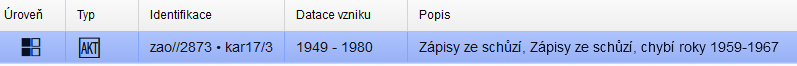

Základní pravidla sice umožňují obojí druh zápisu - chybí zápisy z let … / obsahuje zápisy z let …(viz Pravidla 4.2.3 Obsah, regest), ale jde fakticky o to, aby regesty nebyly zbytečně dlouhé a autor volil kratší a jasnější vyjádření, tzn. buď "chybí zápisy z let …" nebo "obsahuje zápisy z let ...".

### Technika záznamu / Nosič záznamu / Barevnost vs. Technická poznámka

Pole **Technika záznamu / Nosič záznamu / Barevnost jsou číselníková pole**, která umožňují výběr pouze z přednastavených hodnot. Hodnoty se mohou lišit dle kategorie záznamu. Jejich správu (opravu, doplnění) má na starosti příslušný garant tematické databáze. Umožňuje výběr více hodnot (např. v případě popis jednotné kolekce černobílých a barevných fotografií v rámci jedné složky).

Pole **Technická poznámka** slouží k doplnění informací formou textové informace. Jednotlivé kategorie záznamů nemusí nutně používat všechna tři číselníková pole, minimálně Technickou poznámku však obsahuji vždy. Do té se pak zapíše to, co se nedá vyjádřit pomocí číselníkových hodnot (číselníkové hodnoty potřebují dovysvětlit nebo nejsou v dané kategorii k dispozici vůbec).

Všechna zmíněná pole se vztahují k prvku popis [Pravidel - 5.2.8 Technika, adjustace, nosič a látka záznamu](../../zp/zp_hlavni_text-05/#528-technika-adjustace-nosic-a-latka-zaznamu). Speciální požadavky dle interních metodik ZAO viz dále u jednotlivých tematických databází.

### Dochování

Použití dle [Pravidel - 5.2.3 Způsob a forma dochování](../../zp/zp_hlavni_text-05/#523-zpusob-a-forma-dochovani)

### Rozměry, hmotnost, velikost / Množství

Použití dle [Pravidel - 5.2.4 Rozměry, hmotnost, velikost, množství](../../zp/zp_hlavni_text-05/#524-rozmery-hmotnost-velikost-mnozstvi). Uvádí se vždy, o *jaký rozměr* se jedná, nejen hodnota a zkratka jednotky. Např. *výška* 150 mm, *šířka* 100 mm.

U pole Množství se obecně uplatňuje povinnost vyplnění na úrovních složka pro soubory jednotlivostí. U jednotlivostí není nutné toto pole vyplňovat (předpokládá se vždy 1ks).

### Měřítko metrické vs. měřítko jiné

Obojí dle [Pravidel - 5.2.5 Měřítko](../../zp/zp_hlavni_text-05/#525-meritko)

Do pole **<u>Měřítko metrické</u>** se zapisuje měřítko vždy ve tvaru 1:M. Např. 1:50000.

Do pole **<u>Meřítko jiné</u>** se uvádí přepis grafického měřítka dle pravidla č. 5 pro Pravidla - 5.2.5 Měřítko. Např.:  *grafické měřítko 20 Öst. Meilen = 20 mm [1:380 000]*.

### Souřadnice

Použití dle [Pravidel - 5.2.6 Souřadnice](../../zp/zp_hlavni_text-05/#526-souradnice) + [Pravidla - 6.3.11 Souřadnice](../../zp/zp_hlavni_text-06/#6311-souradnice)

Způsob zadávání - viz [Manuál - 6.4.2 Souřadnice](../proarchiv/../proarchiv/manual_proarchiv.md#642-souradnice).

### Orientace

Použití dle [Pravidel - 5.2.7 Orientace z hlediska světových stran](../../zp/zp_hlavni_text-05/#527-orientace-z-hlediska-svetovych-stran)

### Díl, část, pořadí, vydání

Použití dle [Pravidel - 5.2.9. Díl, část, pořadí vydání jednotky popisu](../../zp/zp_hlavni_text-05/#529-dil-cast-poradi-vydani-jednotky-popisu)

### Jazyk / Písmo

Viz [Pravidla - 5.2.10 Jazyk, písmo](../../zp/zp_hlavni_text-05/#5210-jazyk-pismo)

**<u>Jazyk</u>** - výběr z číselníkových hodnot dle [Pravidel - Příloha 2 – Jazyky jednotky popisu](../../zp/zp_hlavni_text-priloha02/). Umožňuje výběr více hodnot v případě, že popisovaný materiál je vícejazyčný.

### Fyzický stav vs. Fyzický stav - popis

Vychází z [Pravidel - 4.4.4 Fyzický stav jednotky popisu a technické požadavky](../../zp/zp_hlavni_text-04/#444-fyzicky-stav-jednotky-popisu-a-technicke-pozadavky)

**<u>Fyzický stav</u>** - pole napojené na číselník. Slouží k základní rychlé kategorizaci fyzického stavu archiválie:

| Hodnota                      | Vysvětlení                                                   |
| ---------------------------- | ------------------------------------------------------------ |
| dobrý                        | Archiválie je v dobrém stavu (dle zažitých archivních měřítek). |
| poškozený                    | Archiválie je poškozená. Poškození není vážné, nemá progresi a nevyžaduje akutní konzervaci. |
| poškozený - konzervace nutná | Archiválie je poškozená natolik, že vyžaduje akutní konzervační zásah. **Povinná položka.** |
| restaurováno                 | Archiválie již byla konzervována. **Povinná položka.**       |

**U záznamů tematických databází je u pole Fyzický stav kontrolováno vyplnění. U záznamů ostatních kategorií je vždy povinné uvádět stavy "poškozený - konzervace nutná" a "restaurováno".**

Povinná zpětná vazba - oprava hodnoty fyzického stavu po konzervaci! Zodpovědnost má příjemce konzervované archiválie.

**<u>Fyzický stav - popis</u>** - pole pro detailnější popis fyzického stavu volnou textovou formou. U poškozené archiválie je vhodné blíže specifikovat charakter poškození (např. degradace (sprašování) písma, uvolněná vazba, plíseň, kus mapy utržen a chybí apod.), u zrestaurované archiválie kdo a kdy restaurování provedl. Zde se uvádějí i technické požadavky: např. pokyny k nakládání s materiálem, záznam o vystavování archiválie apod.

### Edice a literatura

Použití dle [Pravidel - 5.2.11 Edice a literatura](../../zp/zp_hlavni_text-05/#5211-edice-a-literatura)

### Nezpracovaná data

Speciální dočasné pole - zobrazuje data, která se nepodařilo napojit do jednotlivých polí po prvotním importu (únor 2019). Zobrazuje se v záložce Ostatní pole. Je účelné tato data přepsat do patřičných prvků popisu v záložce Detailní popis. Poté je potřeba provést vymazání obsahu tohoto pole (u číselníkových polí zvolit <neurčeno>), načež po přeuložení záznamu toto pole zmizí.

## 5 Metodika pro kategorie záznamů rovnající se tematickým databázím

**Dokud nebude vydána nová oficiální metodika ZAO, budou primárně uplatňována Pravidla a celostátní metodiky dle Pravidel. Pouze v případech, které Pravidla nepopisují, mohou být uplatněny stávající části interních metodik.** Např. u polí nad rámec Pravidel.

#### Garanti tematických databází

U každé tematické databáze je uveden její garant, který má na starosti:

1. interní metodické pokyny nad rámec Pravidel - poskytuje případnou metodickou pomoc při zpracování daného typu archiválií v ZAO
2. shromažďuje a vyhodnocuje požadavky na úpravu nebo rozšíření číselníkových hodnot speciálních polí a předává je administrátorovi aplikace k zapracování

### Fotografie, pohlednice, tisková vyobrazení

------

<u>Garant tematické databáze:</u> **Šíl Jiří, Mgr. Ph.D.**, archivář Zemského archivu v Opavě, tel: +420 553 607 246, [j.sil@zao.archives.cz](mailto:j.sil@zao.archives.cz)

#### Vazba na Pravidla

Tematická databáze (TD) Fotografie, pohlednice, tisková vyobrazení spadá v rámci požadavků na rozšířený popis do [Pravidel - 5.12 Fotografické archiválie](../../zp/zp_hlavni_text-05/#512-fotograficke-archivalie) a [5.16 Pohlednice](../../zp/zp_hlavni_text-05/#516-pohlednice). Pro potřeby ZAO je uplatňován podrobnější zápis.

<u>Další použité zdroje:</u>

Výzkumná zpráva projektu *„Zpracování postupu na záchranu světlocitlivých archivních dokumentů na skleněné podložce (deskové negativy), jejich ošetření, archivaci (dlouhodobé uložení), zabezpečení a zpřístupnění“*. Projekt výzkumu a vývoje č. NA 3671/2007-12. Dostupné [on-line] z WWW < [http://www.nacr.cz/Z-files/negativy_01.pdf](http://www.nacr.cz/Z-files/negativy_01.pdf) > a < [http://www.nacr.cz/Z-files/negativy_02.pdf](http://www.nacr.cz/Z-files/negativy_02.pdf) >.

#### Co zapisovat?

**Databáze slouží primárně ke katalogizaci fotografických dokumentů a pohlednic.** Fotografický dokument je jedna z variant obrazového dokumentu, vzniklý postupem statického fotografického zobrazení – **negativy, pozitivy, klasické papírové fotografie**. Z hlediska vhodnosti popisných polí se zde evidují i **pohlednice**, ač se technicky vzato nejedná o fotografický dokument, neboť do roku 1960 byly zhotovovány technikou ušlechtilých fotografických tisků, po roce 1960 pak ofsetovým tiskem. 

V opodstatněných případech lze do databáze evidovat i jiný obrazový materiál – tisková vyobrazení, a to ve smyslu fotografií (vyobrazení) vytištěných na papíře, pocházejících z dobových publikací, periodik, pamětních
listů, pozvánek apod.

V databázi by měly být evidovány pouze výše zmíněné dokumenty, které jsou **archiváliemi** (v evidenci NAD). Fotografické reprodukce archiválií (reprodukce archiválií k uživatelským účelům a bezpečnostní kopie (POCO)) by zde neměly být evidovány. Jde vlastně analogicky o stejný princip jako u digitálních reprodukcí. Např. pokud k listině nemáme digitální reprodukci, ale máme kvalitní fotografickou reprodukci, můžeme ji po naskenování připojit k příslušnému záznamu v databázi Listiny. Stejný sken však již neevidujeme v této TD.

Dalším příkladem **„nearchiválií“** jsou fotografické dokumenty, které se v archivu nasbírají jakožto skeny originálů z jiných archivních a kulturních institucí nebo od soukromých osob. Zde je sice vhodné k jejich evidenci použít tuto TD. **V tomto případně je však nutno přikročit k přísnému oddělení, tzn. vytvořit pro tyto záznamy samostatnou kapitolu, evidovat v rámci "pseudo" NAD a v poli Možnost zveřejnění musí být zvolena hodnota <u>„Nepublikovat“</u>!!!**

**U fotografických dokumentů by měl být vždy uplatňován provenienční princip.** Fotografie by neměly být přesouvány z fondů původce do uměle vytvořených sbírek. 

#### Stanovení evidenční jednotky

Správné vymezení fotografických archiválií viz Pravidla - [2.9.3 Druhy evidenčních jednotek - 10. Fotografické archiválie](../../zp/zp_hlavni_text-02/#10-fotograficke-archivalie).

**Pozor! Mnoho fotografických archiválií je však součástí množstevních evidenčních jednotek (karton, fascikl, balík) a takto se i evidují!**

##### Na co si dát pozor?

- V případě, že fotografická archiválie je na nestabilním materiálu a došlo k jejímu zničení, uchovaná kopie je vykazována jako originál.
- **S pohlednicí nelze zaměňovat fotografii, která na první pohled nese znaky poštovní korespondence** (tj. z jedné strany obraz a z druhé strany místo pro psaný vzkaz). Rozhodující pro určení ev. j. je způsob zhotovení: fotografickou cestou (fotografie), tiskovou technikou (pohlednice).

U souboru fotografií viz [Soubor jednotlivostí vs. jednotlivost](metodika_zao.md#soubor-jednotlivosti-vs-jednotlivost).

#### Úroveň popisu

Lze uplatnit jako ***složku*** (např. soubor fotografií), ***jednotlivost*** nebo i jako ***část jednotlivosti*** (např. fotografie nalepená v kronice). 

#### Podkategorie záznamu

U této TD se rozlišují tři podkategorie:

- **fotografie** - vymezení v souladu s evidenční jednotkou "fotografické archiválie" - viz [Pravidla - 5.12 Fotografické archiválie](../../zp/zp_hlavni_text-05/#512-fotograficke-archivalie).
- **pohlednice** - vymezení v souladu s evidenční jednotkou "pohlednice" - viz [Pravidla - 5.16 Pohlednice](../../zp/zp_hlavni_text-05/#516-pohlednice). 
- **tisk** - fotografie (vyobrazení) vytištěné na papíře, pocházející z dobových publikací, periodik, pamětních listů, pozvánek apod. Jako evidenční jednotka je vymezen různě.

**Evidenční jednotka není pro zařazení do podkategorie rozhodující!** Pokud je např. fotografie součástí aktového materiálu (EJ = karton), popíše se jako jednotlivost vnořená ve složce (kategorie/podkategorie záznamu = Fotografie, pohlednice, tisková vyobrazení/fotografie).

#### Datum vzniku

U analogového nosiče záznamu, který byl použit v okamžiku pořízení fotografického záznamu (například negativ) a u digitální fotografie (z digitálního snímače) se zde zapisuje čas, kdy došlo k zachycení statického fotografického zobrazení – expozice. Nikoli datum vyvolání snímku.

#### Obsah

Pro popis obsahu obecně platí, že se popisuje, co je **vidět** na jednotlivých fotografiích, pohlednicích – žádné domněnky, předpoklady, dedukce. Při popisu postupujeme obvykle od levé dolní části do pravého horního rohu. Popis může být narativní (ve větách) nebo formou klíčových slov.

#### Orientace

Viz [Pravidla - 5.2.7 Orientace z hlediska světových stran](../../zp/zp_hlavni_text-05/#527-orientace-z-hlediska-svetovych-stran).

Pokud je možné, zachytit pozici objektů na snímku vůči fotografovi. Např. pomocí světových stran, vztažením k poloze jiného objektu.

#### Rozměry

U fotografií je technicky správnější zápis ve sledu **výška x šířka**. Tento způsob vychází ze standardizovaných rozměrů negativů a pozitivů, které byly uváděny právě v pořadí výška x šířka, v oblasti odborné fotografie je tento sled vžit. Např. výška 180 mm, šířka 130 mm.

Vhodnější je uvádět rozměry v mm (většinově dle Pravidel), nicméně použití cm není zapovězeno. Vždy je však potřeba uvést použitou jednotku.

U fotografií neadjustovaných a nerámovaných lze uvádět přímo rozměr papírové podložky Taktéž u fotografií s úzkým „bílým rámečkem“ kolem samotného zobrazení. V případě, že se výrazně
liší rozměr podložky a obrazového pole, je možno to uvést  (např. fotografie výška 130 mm, šířka 90 mm, obrazové pole čtvercové 120 x 120 mm). Pokud je fotografie zarámovaná nebo adjustována třeba na kartonu (pasparta), je potřeba popsat zvlášť rozměr fotografie a zvlášť podkladu - pasparty, rámu (např. … fotografie výška 180 mm, šířka 130 mm; pasparta výška 280, šířka 200 mm). V případě kulatých obrazů se uvádí průměr v cm (např. … průměr 100 mm); v případě oválu se uvádí délka obou os - vertikální i horizontální (např. ovál (výška x šířka) 100 mm x 150 mm).

#### Technika záznamu

Pole napojené na číselník. Výběr z následujících hodnot:

| Hodnota                                               | Vysvětlení                                                   |
| ----------------------------------------------------- | ------------------------------------------------------------ |
| klasická fotografie                                   | Klasická fotografie na papírové podložce, negativ, diapozitiv, pohlednice (poštovní korespondence) zhotovené metodou "pravé fotografie". |
| tisk                                                  | Tisková technika: např. pohlednice (ofset); fotografie otištěná v publikaci,   periodiku. |
| digitální fotografie                                  | Digitální fotografie pořízená digitálním fotoaparátem uložená ve standardním obrazovém formátu (většinou JPG, TIF apod.) |
| historická fotografická technika nebo ušlechtilý tisk | Konkrétní vyjádření techniky se uvede do pole Technická poznámka. |
| jiné                                                  | Zejména instantní metody zhotovení fotografického pozitivu 2. poloviny 20. století (např. POLAROID). Typ instantní metody pomůže určit garant tematické databáze. |

V případě pochybností o technice záznamu (zda je fotografická nebo tisková), je možno kontaktovat garanta tematické databáze. Obdobně při určení historických fotografických technik nebo ušlechtilých tisků (1839 -cca 1960).

#### Technická poznámka

Mimo jiné je zde možno okomentovat i obrazovou kvalitu (např. přeexponováno, podexponováno).

#### Možnost zveřejnění / Práva k jednotce 

U fotografického materiálu je zvláště důležité dbát na případné autorské právo autora snímku nebo jeho dědiců. Zpravidla se pak volí hodnota "Popisná data + přílohy bez možnosti stažení" a do pole Práva k jednotce se poté zapisuje formulace "Stažení reprodukce neumožňují licenční podmínky."

#### Přístupové body - povinné a doporučené role

Následuje výčet rolí, u kterých by měl být napojen přístupový bod, pokud je znám.

##### A) Podkategorie Fotografie

| Role                         | Třída                                 | Povinnost                | Vysvětlení                                                   |
| ---------------------------- | ------------------------------------- | ------------------------ | ------------------------------------------------------------ |
| **fotograf**                 | osoba/bytost / korporace              | **vždy** u jednotlivost  | Subjekty, které pořídily fotografický záznam ve smyslu prvotního zachycení obrazu na citlivý povrch. Pokud je v případě fotografických živností známa pouze korporace a nikoli konkrétní fotograf, který pořídil fotografický záznam, uvede se název korporace, pokud jsou známy oba subjekty, uvedou se oba, a to i tehdy, když se jedná o podnikající fyzickou osobu. ***Pokud není autor uveden, je potřeba vyjádřit tzv. ["neuvedeným" přístupovým bodem](metodika_zao.md#neurcene-neuvedene-pristupove-body)!*** |
| příjemce                     | osoba/bytost / korporace / rod/rodina | -                        | Zde subjekty: - které si vytvoření fotografických záznamů objednaly ve vztahu zákazník – dodavatel pro svou úřední nebo soukromou potřebu (například   zákazníci fotografických živností). / - jimž byly fotografické záznamy dedikovány. / - jimž byly určeny fotografie nesoucí znaky poštovní   korespondence. |
| odesilatel                   | osoba/bytost / korporace / rod/rodina | -                        | Subjekty, které zaslaly fotografie nesoucí znaky poštovní korespondence. |
| výrobce nosiče záznamu       | osoba/korporace                       | -                        | Výrobci kinofilmů, fotografických papírů, papírových podložek, dále pak subjekty, které vyvolaly fotografie atp. Pokud bylo vyvolání provedeno v zaměstnaneckém poměru, uvádí se pouze korporace. |
| **místo fotografování**      | geografický objekt                    | **vždy** u jednotlivostí | U všech fotografických archiválií se zde uvádí místo vzniku fotografického záznamu ve smyslu zachycení obrazu prostřednictvím optické soustavy = jde o místo, kde stál při fotografování fotografický přístroj. V případě pořízení více záznamů na jeden nosič na více místech se uvedou všechna místa. To platí i pro případnou dvojexpozici na jedno políčko. |
| místa vzniku jednotky popisu | geografický   objekt                  | -                        | Používá se pro místo vzniku archiválie (tj. fotoalba, fotografie vyvolané z negativu či z digitální fotografie, při převodu z formátu RAW atp.), je-li odlišné od místa fotografování. |
| související entita           | vše                                   | -                        | Viz výše - evidují se zde místa, události, osoby, objekty apod., jež byly při pořízení záznamu zachyceny. Např. fotografie zachycující masív Lysé hory, focená z protějšího kopce Ondřejník. Jako "místo expozice" uvedeme Ondřejník, jako "ostatní entity zachycené jednotkami popisu" pak Lysou horu. |

##### B) Podkategorie Pohlednice a Tisky

| Role                                   | Třída                                 | Povinnost                                               | Vysvětlení                                                   |
| -------------------------------------- | ------------------------------------- | ------------------------------------------------------- | ------------------------------------------------------------ |
| vydavatel/nakladatel                   | osoba/bytost / korporace / rod/rodina | -                                                       |                                                              |
| odesilatel                             | osoba/bytost / korporace / rod/rodina | -                                                       | Jako nepovinný údaj např. u pohlednic prošlých poštou.       |
| příjemce                               | osoba/bytost / korporace / rod/rodina | -                                                       |                                                              |
| fotograf                               | osoba/bytost / korporace              | -                                                       |                                                              |
| tvůrce výtvarné stránky                | osoba/bytost / korporace              | -                                                       | Včetně tvůrců štočků.                                        |
| tiskárna/tiskař                        | osoba/bytost / korporace              | -                                                       |                                                              |
| místo vydání                           | geografický   objekt                  | -                                                       |                                                              |
| místo vzniku předlohy popisované kopie | geografický   objekt                  | -                                                       | Používá se pro místo vzniku zničené archiválie, která byla předlohou pro popisovanou kopii, jež ji nahrazuje. |
| související entita                     | vše                                   | **vždy** u jednotlivostí pro třídu "geografický objekt" | Evidují se zde **místa**, události, osoby, objekty apod., jež byly při pořízení záznamu zachyceny. |

Ostatní role jsou dobrovolné.

#### Ostatní prvky popisu

Ostatní prvky popisu dle kapitoly [4 Společná pravidla zpracování archiválií v ZAO](metodika_zao.md#4-spolecna-metodika-pro-zpracovani-archivalii-v-zao).

### Grafické listy a kresby

------

<u>Garant tematické databáze:</u> **Peterka Jiří, Mgr.**, archivář Zemského archivu v Opavě, tel.: +420 553 607 258,  [j.peterka@zao.archives.cz](mailto:j.peterka@zao.archives.cz)

#### Vazba na Pravidla

Tematická databáze (TD) Grafické listy a kresby byla vytvořena zcela nově. Byla do ní naimportována data, původně "nevhodně" zařazena do databáze Fotoarchiv. Dle Pravidel spadá v rámci požadavků na rozšířený popis do [Pravidel - 5.11 Grafické listy, kresby](../../zp/zp_hlavni_text-05/#511-graficke-listy-kresby).

#### Co zapisovat?

Databáze slouží ke katalogizaci grafik a kreseb. Veduty tvoří samostatnou tematickou databázi.

#### Stanovení evidenční jednotky

Správné vymezení grafických listů a kreseb z hlediska evidenčních jednotek viz Pravidla - [2.9.3 Druhy evidenčních jednotek - 9. Mapy, plány, atlasy, technické výkresy, grafické listy, kresby](../../zp/zp_hlavni_text-02/#9-mapy-atlasy-technicke-vykresy-graficke-listy-kresby).

**Pozor! Mnoho grafických listů a kreseb je však součástí množstevních evidenčních jednotek (karton, fascikl, balík) a takto se i evidují!**

##### Na co si dát pozor?

- **Jako dílčí EJ "grafický list" se neevidují plakáty!**
- Dílčí EJ "kresba": **Uvádí se počet jednotlivých kreseb a jejich svázaných souborů.**

#### Úroveň popisu

Lze uplatnit jako ***složku***, ***jednotlivost*** nebo teoreticky i jako ***část jednotlivosti***. 

Dále viz [Pravidla - Příloha 1 – Příklady jednotek popisu a úrovní popisu - příklady 9](../../zp/zp_hlavni_text-priloha01/#9-graficke-listy-kresby).

#### Podkategorie záznamu

U této TD se rozlišují dvě podkategorie:

- **grafický list** - vymezení v souladu s dílčí evidenční jednotkou "grafický list" - viz [Pravidla - 2.9.3 Druhy evidenčních jednotek - 9.4 Grafický list](../../zp/zp_hlavni_text-02/#9-mapy-atlasy-technicke-vykresy-graficke-listy-kresby).
- **kresba** - vymezení v souladu s dílčí evidenční jednotkou "kresby" - viz [Pravidla - 2.9.3 Druhy evidenčních jednotek- 9.5 Kresba](../../zp/zp_hlavni_text-02/#9-mapy-atlasy-technicke-vykresy-graficke-listy-kresby). Do kreseb se zařazují i výjimečně uchované malby.

**Evidenční jednotka není pro zařazení do podkategorie rozhodující!** Pokud je např. grafický list součástí aktového materiálu (EJ = karton), popíše se jako jednotlivost vnořená ve složce (kategorie/podkategorie záznamu = Grafické listy a kresby/grafický list).

#### Přístupové body - povinné a doporučené role

Následuje výčet rolí, u kterých by měl být napojen přístupový bod, pokud je znám:

| **Role**                      | **Třída**                             | **Povinnost**            | **Vysvětlení**                                               |
| ----------------------------- | ------------------------------------- | ------------------------ | ------------------------------------------------------------ |
| vydavatel/nakladatelé         | osoba/bytost / korporace / rod/rodina | -                        |                                                              |
| příjemci                      | osoba/bytost / korporace / rod/rodina | -                        |                                                              |
| tvůrce výtvarné stránky       | osoba/bytost / korporace              | **vždy** u jednotlivostí | Tvůrci včetně autorů předloh (malíři, grafici apod.). ***Pokud není autor uveden, je potřeba vyjádřit tzv. ["neuvedeným" přístupovým bodem](metodika_zao.md#neurcene-neuvedene-pristupove-body)!*** |
| tvůrce technického zpracování | osoba/bytost / korporace              | **vždy** u jednotlivostí | Tvůrci technického zpracování (například rytci). ***Pokud není autor uveden, je potřeba vyjádřit tzv. ["neuvedeným" přístupovým bodem](metodika_zao.md#neurcene-neuvedene-pristupove-body)!*** |
| tiskárna/tiskař               | osoba/bytost / korporace              | -                        |                                                              |
| místo vzniku jednotky popisu  | geografický objekt                    | -                        |                                                              |
| související entita            | vše                                   | -                        |                                                              |

Pokud je potřeba k určité roli zapsat více přístupových bodů, je potřeba uživatelsky přidat další řádek s totožnou rolí.

#### Ostatní prvky popisu

Ostatní prvky popisu dle kapitoly [4 Společná pravidla zpracování archiválií v ZAO](metodika_zao.md#4-spolecna-pravidla-zpracovani-archivalii-v-zao).

### Kartotéky

------

<u>Garant tematické databáze:</u> **Michna Radomír, Mgr.**, archivář, informatik SOkA Frýdek-Místek, tel: +420 558 432 076, +420 734 696 568, [r.michna@fm.archives.cz](mailto:r.michna@fm.archives.cz)

#### Vazba na Pravidla

Tematická databáze (TD) Kartotéky vznikla z potřeby digitalizační akce Evidence obyvatel (2013-2014). Dle Pravidel spadá v rámci požadavků na rozšířený popis do [Pravidla - 5.4 Úřední knihy, registraturní pomůcky, kartotéky](../../zp/zp_hlavni_text-05/#54-uredni-knihy-registraturni-pomucky-kartoteky) Pro potřeby ZAO je uplatňován podrobnější zápis.

#### Co zapisovat?

**Kartotékou se rozumí** soubor systematicky seřazených (!!!) samostatných listů obsahujících informace k určité agendě či tématu a vedených obvykle v předepsané nebo účelově vytvořené formě. V evidenci NAD se uvádí počet kartotéčních zásuvek či krabic. Existují však případy, kdy je kartotéka ve starých pomůckách evidovaná jako karton. **Pro zápis do této TD je tedy rozhodující forma archiválie, nikoli evidenční jednotka.**

#### Stanovení evidenční jednotky

Správné vymezení kartoték z hlediska evidenčních jednotek viz Pravidla - [2.9.3 Druhy evidenčních jednotek - 5. Kartotéky](../../zp/zp_hlavni_text-02/#5-kartoteky)

##### Na co si dát pozor?

- V evidenci NAD se uvádí počet kartotéčních zásuvek či krabic. Pokud se v jedné zásuvce nachází více druhů kartoték, jedná se o jednu evidenční jednotku. Analogicky, nachází-li se v jedné úřední knize oddělené zápisy k více druhům agendy, jedná se stále o jednu úřední knihu.
- Evidenční pomůcka (podací protokol, indexy apod.) v podobě kartotéky je evidována jako příslušná jednotlivina.

#### Úroveň popisu

Lze uplatnit pouze jako ***jednotlivost*** (i v manipulačním seznamu).  V případě, že kartotéka fyzicky přesahuje rozsah dle pravidla uvedeného v [Pravidlech - kapitole 3.4.1](../../zp/zp_hlavni_text-03/#341-manipulacni-seznam) *(tzn., že rozsah archiválií je větší než jeden karton, jeden dataset, jeden fascikl, nebo jiná takovému množství odpovídající jednotka s přihlédnutím ke způsobu předkládání)*, rozepisuje se na ***části jednotlivosti*** (např. na jednotlivé kartotéční zásuvky) tak, aby bylo dosaženo požadovaného rozsahu. Poté je uplatněna na úrovni "jednotlivost" výjimka, díky které je možno změnit číslici 1 v poli "Evidenční jednotka + počet" na požadovaný počet.

Dále viz [Pravidla - Příloha 1 – Příklady jednotek popisu a úrovní popisu - příklady 2.7 a 2.8](../../zp/zp_hlavni_text-priloha01/#2-uredni-knihy-registraturni-pomucky-kartoteky).

<u>Příklad 2.7 – Monotematická kartotéka ve více zásuvkách</u>

Každá jednotlivá zásuvka je jednotkou popisu, zásuvky se rozlišují ukládacím číslem:

|   **AP** |   **EJ** |   **Jednotlivost** | **Část jednotlivosti 1. úrovně** | **Část jednotlivosti 2. úrovně** | **Část jednotlivosti 3. úrovně** |
| --- | --- | --- | --- | --- | --- |
| I, K | Kartotéka | Kartotéka | - | - | - |
| I, K | - | - | Zásuvka 1 | - | - |
| K | - | - | - | Kartotéční lístek 1 | - |
| K | - | - | - | - | fotografie osoby |
| K | - | - | - | Kartotéční lístek 2… | - |
| I, K | - | - | Zásuvka 2 | - | - |
| K | - | - | - | Kartotéční lístek 100 | - |
| K | - | - | - | Kartotéční lístek 101… | - |

<u>Příklad 2.8 – Kartotéka výpisků z několika městských úředních knih rozdělená tematicky a nacházející se ve více zásuvkách:</u>

| **AP** | **EJ** | **Jednotlivost** | **Část jednotlivosti 1. úrovně** | **Část jednotlivosti 2. úrovně** | **Část jednotlivosti 3. úrovně** |
| --- | --- | --- | --- | --- | --- |
| I, K | Kartotéka | Kartotéka | - | - | - |
| I, K | - | - | Tematická sekce kartotéky 1 | - | - |
| I, K | - | - | - | Zásuvka 1 | - |
| K | - | - | - | - | Kartotéční lístek 1 |
| K | - | - | - | - | Kartotéční lístek 2… |
| I, K | - | - | - | Zásuvka 2 | - |
| K | - | - | - | - | Kartotéční lístek 100 |
| K | - | - | - | - | Kartotéční lístek 101… |
| I, K | - | - | Tematická sekce kartotéky 2 | - | - |
| I, K | - | - | - | Zásuvka 3 | - |
| K | - | - | - | - | Kartotéční lístek 200 |
| K | - | - | - | - | Kartotéční lístek 201… |

#### Typ kartotéky

Povinný údaj; pole napojené na číselník. Na základě opodstatněných požadavků lze číselníkové hodnoty centralizovaně doplňovat - zajišťuje garant s pomocí administrátora.

#### Formální název

Nepovinný údaj. Jde o původní název kartotéky, může být i cizojazyčný.

#### Obsah

Povinný údaj; obsahuje český název / charakteristiku kartotéky.

#### Abecední a číselný rozsah

Slouží ke stručnému rozlišení dílčích celků kartotéky. Uvádí se např. v podobě „A – Bo“ u abecedně řazených karet nebo v podobě „č. p. 1 – 620“ u číselně řazených karet apod.

#### Přístupové body - povinné a doporučené role

Následuje výčet rolí, u kterých by měl být napojen přístupový bod, pokud je znám:

| Role               | Třída | Povinnost | Vysvětlení                                                   |
| ------------------ | ----- | --------- | ------------------------------------------------------------ |
| související entita | vše   | -         | např. geografický objekt kvůli teritoriálnímu vymezení kartotéky / pojem pro obsahové (tematické) vymezení kartotéky (upřesnění nad rámec pole Typ kartotéky) apod.* |

Ostatní role jsou dobrovolné.

#### Ostatní prvky popisu

Ostatní prvky popisu dle kapitoly [4 Společná pravidla zpracování archiválií v ZAO](metodika_zao.md#4-spolecna-metodika-pro-zpracovani-archivalii-v-zao).

V případě dodatečné digitalizace lze využít případné pasáže z původní metodiky *"EVIDENCE OBYVATEL - závazný postup pro přípravu k digitalizaci"*, které ale nesmí být v rozporu s Pravidly:  - [Odkaz na stažení (formát pdf)](attachments/EVIDENCE_OBYVATEL-zavazny_postup_pro_pripravu_k_digitalizaci.pdf). ***Pozor však na nové pojímání úrovní u kartoték: jednotlivost vs. část jednotlivosti!***

### Kroniky

------

<u>Garant tematické databáze:</u> **Michna Radomír, Mgr.**, archivář, informatik SOkA Frýdek-Místek, tel: +420 558 432 076, +420 734 696 568, [r.michna@fm.archives.cz](mailto:r.michna@fm.archives.cz)

#### Vazba na Pravidla

Tematická databáze (TD) Kroniky vznikla z potřeby tematické prezentace kronik a pamětních knih, kde vedle inventarizovaných kronik šlo hlavně o to, podchytit i kroniky neinventarizované, u kterých nebyla možnost zveřejnění přes pomůcku.  Dle Pravidel spadá v rámci požadavků na rozšířený popis do [Pravidel - 5.4 Úřední knihy, registraturní pomůcky, kartotéky](../../zp/zp_hlavni_text-05/#54-uredni-knihy-registraturni-pomucky-kartoteky) a [Pravidel - 5.5 Rukopisy](../../zp/zp_hlavni_text-05/#55-rukopisy) Pro potřeby ZAO je uplatňován podrobnější zápis.

#### Co zapisovat?

Databáze slouží ke katalogizaci kronik (pamětních knih) různého typu.

#### Stanovení evidenční jednotky

Vymezení kronik z hlediska evidenčních jednotek viz Pravidla - [2.9.3 Druhy evidenčních jednotek - 3. Úřední knihy a rukopisy](../../zp/zp_hlavni_text-02/#3-uredni-knihy-a-rukopisy)

##### Na co si dát pozor?

- Novodobé pamětní knihy (kroniky) se mezi **úřední knihy** zařazují, pokud byly vedeny na základě ustanovení zákona nebo vnitřní normy či roz­hodnutí původce nebo autor zápisů byl vedením pamětní knihy pověřen anebo zápisy měly oficiální charak­ter a byly kontrolovány nebo ověřovány statutárními orgány původce. Pamětní knihy, které tyto podmínky (nebo většinu z nich) nesplňují, se řadí mezi **rukopisy**.

#### Úroveň popisu

Lze uplatnit pouze jako ***jednotlivost*** nebo teoreticky i jako ***část jednotlivosti*** (např. samostatný popis konkrétní významnější části nebo listu/strany). 

#### Podkategorie záznamu

U Kronik se rozlišují dvě podkategorie:

- **úřední** - v rámci evidence NAD jsou evidovány jako EJ "úřední knihy".
- **neúřední** - v rámci evidenci NAD jsou evidovány jako EJ "rukopisy". 

#### Typ kroniky

Povinný údaj. Pole napojené na číselník. Výběr z následujících hodnot:

| Hodnota                               | Vysvětlení                                                   |
| ------------------------------------- | ------------------------------------------------------------ |
| obecní                                | Obecní a městské kroniky - vycházející jak "ze zákona", tak ty vedené již před zákonnou povinností nebo kroniky neoficiální (které ale mají podobnou úpravu jako oficiální). |
| školní                                |                                                              |
| farní                                 |                                                              |
| četnická                              | Mohou mít i pokračování jako kroniky SNB, byly však založené jako četnické. |
| spolková                              |                                                              |
| společenské nebo politické organizace |                                                              |
| podniková                             |                                                              |
| rodinná                               | Rodinné i rodové kroniky.                                    |
| jiná                                  | Např. neoficiální okresní kroniky.                           |
| nezjištěno                            |                                                              |
| nelze určit                           |                                                              |

#### Formální název

Nepovinný údaj. Uvádí se původní (i cizojazyčný) název z titulního listu. Pokud je název rozčleněn do vícero logických celků, je možno jako oddělovač použít znak / (např. "Pamětní kniha MNV / Kronika I. díl / Obec Řeka okres Frýdek-Místek"). Pokud kronika titulní list neobsahuje, je možno použít název z vazby knihy (z přední desky, případně z hřbetu knižní vazby). Tento název ale musí nést konkrétní informaci. Obecné názvy typu "Kronika" nebo "Školní kronika" bez dalšího upřesnění se za formální název nepovažují. 

Dále viz [Problematika názvů](metodika_zao.md#problematika-nazvu). 

#### Datace vzniku

Údaj musí odrážet časové období, kdy byla kronika skutečně vedena (datum vzniku - prvního zápisu - jakožto spodní časová hranice; datum posledního zápisu, jenž vznikl u původce, jakožto horní časová hranice), nikoli skutečnost, ke kterým letům se kronikářské zápisy vztahují (dále viz Jiné datace). 

#### Jiné datace

Typ **Datace obsahu jednotky popisu** - umožňuje zaznamenat skutečnou dataci či časové rozmezí, ke kterému se kronikářské zápisy vztahují. Např. u kroniky vedené v letech 1945-1960, ve které se retrospektivně popisují i události z období 2. světové války, se uvede: *1939 - 1960*. U hodnot je aplikovaná kontrola syntaxe zápisu.

#### Obsah

Systematicky vytvořený umělý název, který kroniku stručně vystihuje, včetně označení případného dílu (např. Kronika obce Staříč, 1. díl, Kronika obecné školy Morávka - Nytrová, 2. díl).

Na dalším řádku může následovat popis kroniky. Možno zmínit zvláště důležité zápisy, stručně vypsat tematickou skladbu zápisů, existenci a typy rejstříků, existenci integrálních příloh - vložených (adjustovaných) fotografických dokumentů apod.

Následovat mohou i základní údaje o retrospektivě. Uvést, zda kronika zpětně popisuje události před vznikem kroniky.

#### Technická poznámka

Popis fyzické formy (úpravy) kroniky. Je možno rozepsat typ vazby: celokožená, polokožená, celoplátěná, vazba se syntetickým potahem (imitace kůže) aj.; formu zápisu: ručně psaná, tištěná; umělecká vazba – jméno autora, popis vazby (např. přední deska zdobena polodrahokamem apod.).

#### Odkazy na příbuzné dokumenty

Odkazy na přílohy ke kronice, které jsou evidovány samostatně (jako jiné jednotky popisu, resp. evidenční jednotky).

#### Přístupové body - povinné a doporučené role

Následuje výčet rolí, u kterých by měly být napojen přístupový bod, pokud je znám:

| Role                         | Třída                    | Povinnost                              | Vysvětlení                                                   |
| ---------------------------- | ------------------------ | -------------------------------------- | ------------------------------------------------------------ |
| autor textu                  | osoba/bytost / korporace | **pouze u obecních kronik**            | = kronikáři. Pokud nejsou známi, nevyplňují se.              |
| související entita           | geografický objekt       | **pouze u obecních a školních kronik** | = lokalita, ke které se popis váže. *Analogie s polem Místní označení ve starých pořádacích aplikacích.* |
| související entita           | korporace                | **pouze u obecních a školních kronik** | = korporace, ke které se popis váže                          |
| místo vzniku jednotky popisu | geografický objekt       | **vždy**                               | = lokalita, ve které kronika vznikla                         |
| tvůrce výtvarné stránky      | osoba/bytost / korporace | -                                      | = tvůrci ozdobných prvků, kaligrafie, kreseb apod.           |
| výrobce                      | osoba/bytost / korporace | -                                      | = výrobci nosiče záznamu (výrobce vazby, ručního papíru apod.) |

Ostatní role jsou dobrovolné.

#### Ostatní prvky popisu

Ostatní prvky popisu dle kapitoly [4 Společná pravidla zpracování archiválií v ZAO](metodika_zao.md#4-spolecna-metodika-pro-zpracovani-archivalii-v-zao).

### Listiny

------

<u>Garant tematické databáze:</u> **Kozák Petr, Mgr. Ph.D.**, archivář ZAO, tel.: +420 553 607 246, [p.kozak@zao.archives.cz](mailto:p.kozak@zao.archives.cz)

#### Vazba na Pravidla

Tematická databáze (TD) Listiny v rámci požadavků na rozšířený popis spadá do [Pravidel - 5.3 Listiny do roku 1850 a po roce 1850](../../zp/zp_hlavni_text-05/#53-listiny-do-roku-1850-a-po-roce-1850).

#### Co zapisovat?

Databáze slouží ke katalogizaci listin.

#### Stanovení evidenční jednotky

Vymezení listin z hlediska evidenčních jednotek viz Pravidla - [2.9.3 Druhy evidenčních jednotek - 1. Listiny do roku 1850](../../zp/zp_hlavni_text-02/#1-listiny-do-roku-1850)  a [2.9.3 Druhy evidenčních jednotek - 2. Listiny po roce 1850](../../zp/zp_hlavni_text-02/#2-listiny-po-roce-1850)

##### Na co si dát pozor?

- Listiny, které jsou součástí jiné archiválie (např. inserty a transumpty v listinách, opisy listin v úředních
  knihách a jiných rukopisech, listiny vložené do spisu – např. stejnopisy smluv, nevyzvednuté osobní doklady apod.) se jako jednotliviny neevidují a považují se za její část.

#### Úroveň popisu

Lze uplatnit pouze jako ***jednotlivost*** nebo ***část jednotlivosti***.

Dále viz [Pravidla - Příloha 1 – Příklady jednotek popisu a úrovní popisu - příklady 1.1 až 1.5](../../zp/zp_hlavni_text-priloha01/#1-listiny-do-roku-1850-a-po-roce-1850).

Jako části jednotlivosti se uvádí inzert, konfirmace. Viz Pravidla - [2.9.3 Druhy evidenčních jednotek - 1. Listiny do roku 1850](../../zp/zp_hlavni_text-02/#1-listiny-do-roku-1850) a [2.9.3 Druhy evidenčních jednotek - 2. Listiny po roce 1850](../../zp/zp_hlavni_text-02/#2-listiny-po-roce-1850)

#### Obsah

Stručný a výstižný obsah listiny narativní formou – kdo komu co vydává/potvrzuje apod.

Připojené pečeti nebo razítka se popisují vždy jako samostatné jednotky popisu = část jednotlivosti kategorie záznamu "Otisk typáře".

#### Jiné datace

Pro popis listin se uplatňují zejména typy:

**Datace obsahu jednotky popisu**: Používá se, pokud se liší od datace fyzického vzniku. Např.  u listiny z roku 1600, která konfirmuje listiny z let 1400 a 1500 se uvede: *1400-1600*.

**Datace zpečetění jednotky popisu:** Používá se pouze u listin, pokud se liší od datace vydání nebo okamžiku fyzického vzniku.

**Datace vydání listiny:** Používá se pouze u listin, pokud se liší datace vydání od datace fyzického vzniku listiny.

**Datace insertu/transsumptu:** Závazný příklad zápisu konfirmace/vidimusu, pokud se zpracovatel záznamu rozhodne popsat i insert/transsumpt v ní obsažený:

- Záznam konfirmace/vidimusu: **Obsah, regest, název** = Rudolf II. potvrzuje privilegia města z let 1400, 1500 / **Datace vzniku** = 1600 / **Datace obsahu dokumentu** = *1400-1600*
- Podřízený záznam insertu, resp. transsumptu z roku 1400: **Obsah / regest** = Václav IV. uděluje právo trhu / **Datace insertu/transsumptu** = *1400*
- Podřízený záznam insertu, resp. transsumptu z roku 1500: **Obsah / regest** = Vladislav Jagelonský uděluje právo trhu  / **Datace insertu/transsumptu** = *1500*

U hodnot je aplikovaná kontrola syntaxe zápisu.

#### Počet otisků

Povinné pole dle [Pravidel - 5.7.4 Počet otisků původní a současný](../../zp/zp_hlavni_text-05/#574-pocet-otisku-puvodni-a-soucasny).

#### Přístupové body - povinné a doporučené role

Následuje výčet rolí, u kterých by měl být napojen přístupový bod, pokud je znám:

| **Role**                                       | **Třída**              | **Povinnost**                             | **Vysvětlení**                                               |
| ---------------------------------------------- | ---------------------- | ----------------------------------------- | ------------------------------------------------------------ |
| vydavatel    | osoba/bytost / korporace / rod/rodina | **vždy**       | Pokud listinu vydává korporace prostřednictvím pověřené fyzické osoby, uvádí se oba subjekty. |
| pečetitel                                | osoba/bytost / korporace / rod/rodina | **vždy**       |  |
| příjemce                                 | osoba/bytost / korporace / rod/rodina | **vždy**                                   |                                                              |
| žadatel                                  | osoba/bytost / korporace / rod/rodina | -                                         | Používá se pouze tehdy, není-li žadatel (tj. petent) o vyhotovení listiny totožný s příjemcem. |
| svědek | osoba/bytost | - | V případě kombinace rolí svědek a pečetitel u jedné listiny, se uvádějí pouze svědci, kteří nejsou totožní s pečetiteli. |
| ručitel (rukojmě) | osoba/bytost / rod/rodina | - | V případě kombinace rolí ručitel a pečetitel u jedné listiny, se uvádějí pouze ručitelé, kteří nejsou totožní s pečetiteli. |
| písař | osoba/bytost | - |  |
| místo vydání                             | geografický objekt | **vždy kromě kopií, inzertů a transumptů** | Uvede se místo vydání listiny. U kopií, inzertů a transumptů se nepoužívá - viz role Místa vzniku jednotek popisu. |
| místo vzniku jednotky popisu | geografický objekt | **pouze u kopií, inzertů a transumptů** | Používá se v těchto případech: je-li místo vzniku listiny odlišné od místa vydání; pro místo vzniku kopie, která byla prohlášena za archiválii nahrazující archiválii zaniklou; pro místo vzniku inzertu, resp. transumptu. |
| související entita | vše | - |  |
|Pokud je potřeba k určité roli zapsat více přístupových bodů (např. více pečetitelů k jedné listině), je potřeba uživatelsky přidat další řádek s totožnou rolí.||||

#### Ostatní prvky popisu

Ostatní prvky popisu dle kapitoly [4 Společná pravidla zpracování archiválií v ZAO](metodika_zao.md#4-spolecna-pravidla-zpracovani-archivalii-v-zao).

### Mapy, atlasy, technické výkresy

------

<u>Garant tematické databáze:</u> **Tesař Petr, Mgr.**, archivář Zemského archivu v Opavě, tel.: +420 553 607 244, [p.tesar@zao.archives.cz](mailto:p.tesar@zao.archives.cz)

Tematická databáze (TD) Mapy, atlasy, technické výkresy v rámci požadavků na rozšířený popis spadá do [Pravidel - 5.9 Mapy, mapová díla, atlasy](../../zp/zp_hlavni_text-05/#59-mapy-mapova-dila-atlasy) a [5.10 Technické výkresy](../../zp/zp_hlavni_text-05/#510-technicke-vykresy)

#### Co zapisovat?

Databáze slouží ke katalogizaci map, atlasů a technické dokumentace.

#### Stanovení evidenční jednotky

Správné vymezení map, plánů a technických výkresů z hlediska evidenčních jednotek viz Pravidla - [2.9.3 Druhy evidenčních jednotek - 9. Mapy, plány, atlasy, technické výkresy, grafické listy, kresby](../../zp/zp_hlavni_text-02/#9-mapy-atlasy-technicke-vykresy-graficke-listy-kresby).

**Pozor! Mnoho map a technických výkresů je však součástí množstevních evidenčních jednotek (karton, fascikl, balík) a takto se i evidují!**

##### Na co si dát pozor?

- V rámci dílčí EJ "mapa" se vykazuje **jedno mapové dílo jako jedna evidenční jednotka**. U této evidenční jednotky se rovněž uvádí počet listů (sekcí) uchovaných v archivním souboru. **Výjimku tvoří mapy vztahující se ke stabilnímu katastru - evidenční jednotkou je zde mapa pro katastrální obec.** V případě plánů zobrazujících urbanizované území (zpravidla město, dvory, pozemky plány zobrazující za­sazení budov v krajině apod.), ortofotomap a souborů kolmých leteckých snímků pořizovaných podle pravidel fotogrammetrie se postupuje analogicky jako u mapových děl. Šikmé letecké snímky jsou považovány za fo­tografie, pokud mají formu pohlednic (nikoli pravých fotografií), vykazují se jako pohlednice.
- Dílčí EJ "atlas": Atlas je opatřen titulním listem a obsahuje zpravidla další náležitosti (doprovodný text, rejstříky), což jej odlišuje od souboru map. Atlasy se vykazují jako jednotliviny. **Atlasy se nevykazují jako staré tisky**.
- Dílčí EJ "technický výkres": Soubor technických výkresů/map k jedné akci je jednou evidenční jednotkou
  o příslušném počtu listů. **Situační stavební plány** (jako samostatná jednotlivina) zobrazující např. situaci zasazení stavby v krajině, území apod. **se vykazují jako dílčí EJ "mapa"**!

#### Úroveň popisu

Lze uplatnit jako ***složku***, ***jednotlivost*** nebo ***část jednotlivosti*** (např. plán vlepený v kronice).

Dále viz [Pravidla - Příloha 1 – Příklady jednotek popisu a úrovní popisu - příklady 7.1 až 7.8 + 8.1 až 8.3](../../zp/zp_hlavni_text-priloha01/#7-mapy-mapova-dila-atlasy).

#### Podkategorie záznamu

U této TD se rozlišují tři podkategorie:

- **mapa** - vymezení v souladu s dílčí evidenční jednotkou "mapa" - viz [Pravidla - 2.9.3 Druhy evidenčních jednotek - 9. Mapy, plány, atlasy, technické výkresy, grafické listy, kresby - 9.1 Mapa](../../zp/zp_hlavni_text-02/#9-mapy-atlasy-technicke-vykresy-graficke-listy-kresby)
- **atlas** - vymezení v souladu s dílčí evidenční jednotkou "atlas" - viz [Pravidla - 2.9.3 Druhy evidenčních jednotek - 9. Mapy, plány, atlasy, technické výkresy, grafické listy, kresby - 9.2 Atlas](../../zp/zp_hlavni_text-02/#9-mapy-atlasy-technicke-vykresy-graficke-listy-kresby)
- **technický výkres** - vymezení s dílčí evidenční jednotkou "technický výkres" - viz [Pravidla - 2.9.3 Druhy evidenčních jednotek - 9. Mapy, plány, atlasy, technické výkresy, grafické listy, kresby - 9.3 Technický výkres](../../zp/zp_hlavni_text-02/#9-mapy-atlasy-technicke-vykresy-graficke-listy-kresby)

**Evidenční jednotka není pro zařazení do podkategorie rozhodující!** Pokud je archiválie součástí aktového materiálu, popíše se jako jednotlivost vnořená ve složce (např. technický výkres jako podkategorie záznamu = technický výkres). 

#### Typ mapy

Povinný údaj pro podkategorii "mapa" a "technický výkres"; pole napojené na číselník:

| Typ                   | Podkategorie     |
| --------------------- | ---------------- |
| administrativní mapa  | mapa             |
| cyklistická mapa      | mapa             |
| dopravní mapa         | mapa             |
| důlní mapa            | mapa             |
| evidenční mapa        | mapa             |
| fyzikální mapa        | mapa             |
| generální mapa        | mapa             |
| geologická mapa       | mapa             |
| geonomická mapa       | mapa             |
| honební mapa          | mapa             |
| hospodářská mapa      | mapa             |
| hraniční mapa         | mapa             |
| jazyková mapa         | mapa             |
| jiný                  | mapa             |
| katastrální mapa      | mapa             |
| lesní mapa            | mapa             |
| lesohospodářská mapa  | mapa             |
| letecká mapa          | mapa             |
| meliorační mapa       | mapa             |
| montánní mapa         | mapa             |
| mýtní mapa            | mapa             |
| nivelační mapa        | mapa             |
| obrysová mapa         | mapa             |
| organizační mapa      | mapa             |
| orientační mapa       | mapa             |
| pedologická mapa      | mapa             |
| politická mapa        | mapa             |
| polnohospodářská mapa | mapa             |
| polygonová mapa       | mapa             |
| porostní mapa         | mapa             |
| průměrková mapa       | mapa             |
| rekonstrukční mapa    | mapa             |
| schématická mapa      | mapa             |
| situační plán         | mapa             |
| speciální mapa        | mapa             |
| správní mapa          | mapa             |
| stavební dokumentace  | technický výkres |
| stavební plán         | technický výkres |
| strojní dokumentace   | technický výkres |
| strojní plán          | technický výkres |
| školní mapa           | mapa             |
| technická dokumentace | technický výkres |
| technický plán        | technický výkres |
| terénní mapa          | mapa             |
| těžební mapa          | mapa             |
| topografická mapa     | mapa             |
| turistická mapa       | mapa             |
| vodohospodářská mapa  | mapa             |
| vojenská mapa         | mapa             |
| vrstevnicová mapa     | mapa             |
| zaměřovací mapa       | mapa             |
| zeměpisná mapa        | mapa             |
| železniční mapa       | mapa             |

#### Formální název / Název autorského díla

Viz [Problematika názvů](metodika_zao.md#problematika-nazvu).

#### Obsah

Na prvním místě se uvádí český originální název archiválie; případně volný český překlad cizojazyčného názvu (z pole Formální název); nebo upravený český název, odvozený od českého originálního názvu, který nebyl zcela srozumitelný (z pole Formální název).

Je-li archiválie bez titulu, uvede se náhradní, odvozený z jejího obsahu (neuvádíme do hranatých závorek).

Dále se uvádí základní obsahový popis (např., že obsahuje různá vyobrazení jako parergy, heraldické znaky, veduty apod).

#### Díl, část, pořadí, vydání

Nepovinný údaj. Možno vyjádřit díl, část, sekci mapového díla.

#### Upřesnění místa

Slouží pro upřesnění místa (lokality, území), kterou archiválie znázorňuje nebo se k ní váže. Toto místo je primárně vyjádřeno formou přístupového bodu (třídy "geografický objekt" s rolí: Ostatní entity zachycené jednotkami popisu). V poli Upřesnění místa pak může být tato informace rozšířena volnější textovou formou. Např. specifikace čp., ulice, parcelního čísla apod.

<u>Příklad: Technický výkres k domu čp. 4 v obci Baška</u>

1.  vyplněn přístupový bod v roli *Ostatní entity zachycené jednotkami popisu* = `Baška (Frýdek-Místek, Česko)`
2. doplněn údaj v poli *Upřesnění místa* = `čp. 4`

#### Souřadnice

Doporučený údaj pro podkategorii "mapa". Jak zapisovat? - viz [Souřadnice](metodika_zao.md#souradnice).

#### Přístupové body - povinné a doporučené role

Následuje výčet rolí, u kterých by měl být napojen přístupový bod, pokud je znám:

**<u>Podkategorie Mapa a Atlas:</u>**

| **Role**                      | **Třída**                             | **Povinnost**             | **Vysvětlení**                                               |
| ----------------------------- | ------------------------------------- | ------------------------- | ------------------------------------------------------------ |
| vydavatel/nakladatel          | osoba/bytost / korporace / rod/rodina | **vždy**, pokud je uveden | Pokud je uveden a jako přístupový bod bude sloužit i k dalším záznamům, musí být vytvořen,  jinak zapsat do obsahu. Pokud je vyjádřen jen zkratkou či nečitelným textem, uvést taktéž pouze do obsahu. Pokud není uveden vůbec, nevyplňuje se. |
| kartograf                     | osoba/bytost / korporace              | **vždy**, pokud je uveden | Tvůrce (autor) mapy. Pokud je uveden a jako přístupový bod bude sloužit i k dalším záznamům, musí být vytvořen,  jinak zapsat do obsahu. Pokud je vyjádřen jen zkratkou či nečitelným textem, uvést taktéž pouze do obsahu. Pokud není uveden vůbec, nevyplňuje se. |
| objednatel / příjemce         | osoba/bytost / korporace / rod/rodina | -                         | Subjekty, které si u vydavatele/nakladatele objednaly vydání díla, nebo subjekty, kterým byly mapy dedikovány. |
| autor textu                   | osoba/bytost / korporace              | -                         | Tvůrce legendy mapy nebo doprovodných textů (například vlastivědných informací k místům na mapě zachyceným, úvodního slova atlasu apod.). |
| tvůrce výtvarné stránky       | osoba/bytost / korporace              | -                         | Například tvůrce ilustrací.                                  |
| tvůrce technického zpracování | osoba/bytost / korporace              | -                         | Tvůrci technického zpracování (například rytci).             |
| fotograf                      | osoba/bytost / korporace              | -                         |                                                              |
| redaktor                      | osoba/bytost                          | -                         |                                                              |
| editor                        | osoba/bytost                          | -                         |                                                              |
| kreslič                       | osoba/bytost                          | -                         | Používá se pouze tehdy, není-li kreslič totožný s tvůrcem mapy nebo tvůrcem obsahu mapové části. |
| výrobce nosiče záznamu        | osoba/bytost / korporace              | -                         | Výrobci nosiče záznamu (výrobce vazby, ručního papíru atp.) s výjimkou tiskáren. |
| tiskárna/tiskař               | osoba/bytost / korporace              | -                         |                                                              |
| místo vzniku jednotky popisu  | geografický objekt                    | -                         | Pozor! Nutno odlišit místo vzniku archiválie od míst, které znázorňuje (viz níže). |
| související entita            | geografický objekt                    | -                         | = lokalita nebo území, které mapa nebo plán znázorňuje. *Analogie s polem Místní označení ve starých pořádacích aplikacích.* |
| související entita            | vše                                   | -                         |                                                              |

**<u>Podkategorie Technický výkres:</u>**

| **Role**                                        | **Třída**                | **Povinnost**                                        | **Vysvětlení**                                               |
| ----------------------------------------------- | ------------------------ | ---------------------------------------------------- | ------------------------------------------------------------ |
| objednatel/příjemce                             | osoba/bytost / korporace | **vždy**, pokud je uveden                            | Subjekty, které si technické výkresy objednaly, nebo subjekty, kterým byly technické výkresy určeny. Pokud je uveden a jako přístupový bod bude sloužit i k dalším záznamům, musí být vytvořen,  jinak zapsat do obsahu (např. u ***soukromé výstavby***). Pokud je vyjádřen jen zkratkou či nečitelným textem, uvést taktéž pouze do obsahu. Pokud není uveden vůbec, nevyplňuje se. |
| autor                                           | osoba/bytost / korporace | **vždy**, pokud je uveden                            | Projektanti, konstruktéři, architekti, designéři apod. Pokud technický výkres zhotovil zaměstnanec korporace, uvedou se oba subjekty. Pokud je tvůrce totožný se stavitelem / výrobcem, uvádějí se obě role. Pokud je uveden a jako přístupový bod bude sloužit i k dalším záznamům, musí být vytvořen,  jinak zapsat do obsahu. Pokud je vyjádřen jen zkratkou či nečitelným textem, uvést taktéž pouze do obsahu. Pokud není uveden vůbec, nevyplňuje se. |
| schvalovatel technického výkresu                | osoba/bytost / korporace | -                                                    | Subjekty, které technický výkres přezkoušely a schválily.    |
| stavitel                                        | osoba/bytost / korporace | -                                                    | Subjekty, které realizaci stavby provedly nebo měly provést. |
| výrobce                                         | osoba/bytost / korporace | -                                                    | Subjekty, které předmět technického výkresu vyrobily nebo měly vyrobit. |
| kreslič                                         | osoba/bytost / korporace | -                                                    |                                                              |
| místo vzniku jednotky popisu                    | geografický objekt       | -                                                    | Pozor! Nutno odlišit místo vzniku archiválie od míst, které znázorňuje (viz níže). |
| související entita                              | geografický objekt       | **vždy u technických výkresů pro nemovité objekty**  | = lokalita, ve které se nemovité objekty (stavby) z technického výkresu nacházejí. Analogicky je to vhodné použít i u map a plánů. *Analogie s polem Místní označení ve starých pořádacích aplikacích.* |
| související entita                              | vše                      | -                                                    |                                                              |
| typové označení a název výrobku a typové stavby | dílo/výtvor              | **povinné u typových staveb a typizovaných výrobků** |                                                              |

Pokud je potřeba k určité roli zapsat více přístupových bodů, je potřeba uživatelsky přidat další řádek s totožnou rolí.

#### Ostatní prvky popisu

Ostatní prvky popisu dle kapitoly [4 Společná pravidla zpracování archiválií v ZAO](metodika_zao.md#4-spolecna-metodika-pro-zpracovani-archivalii-v-zao).

### Otisky typářů

------

<u>Garant tematické databáze:</u> **Štěpánová Seichterová Hana, Mgr. DiS**, archivářka Zemského archivu v Opavě - pobočky Olomouc, tel.: +420 585 236 132, [h.seichterova@ol.archives.cz](mailto:h.seichterova@ol.archives.cz)

#### Vazba na Pravidla

Tematická databáze (TD) Otisky typářů v rámci požadavků na rozšířený popis spadá do [Pravidel - 5.7 Typáře a jejich otisky](../../zp/zp_hlavni_text-05/#57-typare-a-jejich-otisky)

Samotná Pravidla v této oblasti vycházejí z **metodiky vydané v roce 1996 pro účely celostátního soupisu pečetí, pečetidel a otisků** (Růžek Vladimír: Pečetě. Diferenční příručka pro přechod z programu Pečetě (AS MV ČR) do programu Pečetě (Bach systems s. r. o.). Program pro evidenci a rešerše ze sfragistického materiálu (pečetě, pečetidla a sbírkové odlitky), Praha 2011, 61 s.).

#### Co zapisovat?

Databáze slouží ke katalogizaci otisků typářů - pečetí na dokumentech, samostatných pečetí, otisků razítek (viz podkategorie záznamu).

#### Stanovení evidenční jednotky

Vymezení otisku typářů z hlediska evidenčních jednotek viz Pravidla - [2.9.3 Druhy evidenčních jednotek - 6. Typáře a jejich samostatné otisky](../../zp/zp_hlavni_text-02/#6-typare-a-jejich-samostatne-otisky).

**Pozor! V případě, že se popisují otisky pečetí a razítek na dokumentech, jenž jsou součástí množstevních evidenčních jednotek (karton, fascikl, balík), takto se i evidují!**

##### Na co si dát pozor?

- U dílčí evidenční jednotky "Samostatné pečetě, odlitky pečetí a otisky typářů" se v případě více otisků na
  jednom podkladovém listu eviduje každý otisk zvlášť.

#### Úroveň popisu

Lze uplatnit pouze jako ***složku***, ***jednotlivost*** nebo ***část jednotlivosti*** (viz podkategorie).

Dále viz [Pravidla - Příloha 1 – Příklady jednotek popisu a úrovní popisu - příklady 5.1 až 5.4](../../zp/zp_hlavni_text-priloha01/#5-sfragisticky-material).

##### Úroveň popisu u oboustranných pečetí

U oboustranných pečetí se **každá strana popisuje jako samostatná jednotka popisu**. V obou podkategoriích - "pečetě na dokumentech" i "pečetě - sbírkové odlitky a otisky" - se zvolí vždy úroveň popisu = **část jednotlivosti**.

*Pokud je oboustranná pečeť popisována jako nezpracovaný materiál jen ze strany TD, vyjádří se vazba mezi oběma stranami vzájemným propojením - vazbou.* [DOPRACOVAT - *Tato funkce zatím není implementována!*]

#### Podkategorie záznamu

U této TD se rozlišují čtyři podkategorie:

- **pečetě na dokumentech** - evidují se zde pečetě, které souvisejí svojí ověřovací či uzavírací funkcí s diplomatickým materiálem, tj. zpravidla jsou přivěšeny nebo přitištěny na listinách a listech a s tímto materiálem tvoří nedílnou evidenční jednotku; jsou vždy ***části jednotlivosti*** onoho dokumentu.
- **otisky razítek na dokumentech** - evidují se zde otisky razítek, které mají stejnou funkci analogicky k "pečetím na dokumentech"; rovněž netvoří samostatnou evidenční jednotku, jsou vždy ***části jednotlivosti*** dokumentu.
- **pečetě - sbírkové odlitky a otisky** - evidují se zde pečetní otisky nebo odlitky, které jsou soustředěny do umělé sbírky. Součástí těchto sbírek mohou být jak originální pečetě, původně přivěšené nebo přitištěné na diplomatickém materiálu a posléze od něho násilně oddělené (odstřižené přivěšené pečetě nebo vystřižené přitištěné pečetě), anebo sbírkotvornou činností vyhotovené otisky nebo odlitky
  obrazů pečetidel nebo originálních pečetí do umělých materiálů (sádra, tmel, polymery) pouze za účelem evidence jejich obrazového obsahu. Tvoří samostatnou dílčí evidenční jednotku "samostatné pečetě, odlitky pečetí a otisky typářů" - viz [Pravidla - 2.9.3 Druhy evidenčních jednotek - 6. Typáře a jejich samostatné otisky - 6.3 Samostatné pečetě, odlitky pečetí a otisky typářů](../../zp/zp_hlavni_text-02/#6-typare-a-jejich-samostatne-otisky). 
- **sbírkové otisky razítek** - evidují se zde otisky razítek, které jsou soustředěny do samostatných sbírek nebo tvoří samostatnou část archivního souboru (např. vzorové otisky razítek). Jde o samostatnou dílčí evidenční jednotku "samostatné pečetě, odlitky pečetí a otisky typářů" - viz [Pravidla - 2.9.3 Druhy evidenčních jednotek - 6. Typáře a jejich samostatné otisky - 6.3 Samostatné pečetě, odlitky pečetí a otisky typářů](../../zp/zp_hlavni_text-02/#6-typare-a-jejich-samostatne-otisky). 

**<u>Následující metodika pro popis do jednotlivých polí vychází plně z:</u>**

!!! summary "Citace zdroje"

    Růžek Vladimír: *Pečetě. Diferenční příručka pro přechod z programu Pečetě (AS MV ČR) do programu Pečetě (Bach systems s. r. o.).* Program pro evidenci a rešerše ze sfragistického materiálu (pečetě, pečetidla a sbírkové odlitky), Praha 2011, 61 s. (dále jen Metodika "Pečetě")
    Došlo však k nutným úpravám textu, aby odpovídal funkcionalitám aplikace ProArchiv a Pravidlům! Pokud chcete studovat celý obsah v původní tištěné podobě, využijte [odkaz na stažení (formát pdf)](attachments/Pecete-metodicka_prirucka_AS.pdf).

**Aplikace umožňuje rovněž popis razítek a otisku razítek. Metodicky se uplatňuje analogie s Metodikou "Pečetě". Mnohé položky však nejsou u razítek uplatňovány!**

Názvy polí byly upraveny do obecnější podoby: pečeť >> otisk typáře, pečetidlo >> typář, listina >> dokument apod.

#### ID – sfrag. s. (Původní/jiné označení) / Další strana (ID – sfrag. s.)

*V Metodice "Pečetě" jako Pořadové číslo.*

Zde byla naimportována pořadová čísla pečetí a typářů z předchozí pořádací aplikace. Jde o ID záznamu v celostátním soupisu sfragistického materiálu. Tento údaj byl rovněž dublován do pole **Odkazy na příbuzné dokumenty**.

U oboustranných pečetí je potřeba zajistit, aby u jednotky popisu první strany pečetě byla hodnota ze ***Původní/jiné označení - typ: ID – sfrag. s.*** při popisu druhé strany pečetě zapsána do samostatného pole ***Další strana (ID – sfrag. s.)*** a naopak (druhá do první).

#### Majitel typáře

Majitel typáře je zapisován výhradně formou přístupového bodu do plovoucího okna Přístupové body - role Majitelé typářů. Popis musí entitu majitele popisovat obecně v souladu s principy zápisu přístupových bodů. 

Ostatní doplňující informace k majiteli typáře (pečetiteli) se zapisují již přímo do detailu formuláře, neboť jsou poplatné popisované archiválii a stávají se tak tedy výhradně součástí jejího popisu. Někdy se může zdát vypisování následujících polí zbytečné (duplikace s údaji v přístupovém bodu), ale je to kvůli kompatibilitě požadavků na celostátní soupis.

##### Typ majitele

Tento údaj se samostatně nevyplňuje, neboť vychází automaticky ze zvolené třídy přístupového bodu v roli Majitele typářů - buď osoba nebo korporace.

##### Pečetitel (role)

***Uplatněno pouze u podkategorie "pečetě na dokumentech" a "pečetě - sbírkové odlitky a otisky".***

Pole napojené na číselník:

| Hodnota        | Vysvětlení                                                   |
| -------------- | ------------------------------------------------------------ |
| vydavatel      | Vyjadřuje, že listinu či list vydává jediná osoba, uvedená v intitulaci listiny. |
| spoluvydavatel | Vyjadřuje, že listinu či list vydává více osob současně (např. opovědné listy šlechty, výroky ubrmanů, opravců apod.). |
| rukojmě        | Vyjadřuje, že pečetitel přivěsil pečeť jako rukojmě právního pořízení (trhy, kvitance, ležení apod.). |
| svědek         | Vyjadřuje, že pečetitel přivěsil pečeť jako svědek právního aktu při vydávání listiny a je též v eschatokolu uveden v závěrečné svědečné řadě a ohlášen v koroboraci. |

##### (FO) Pohlaví majitele typáře

Pole na pojené na číselník. Doplňuje se jen v případě, že majitel typáře je třídy "osoba".

##### (FO) Stav majitele typáře

***Uplatněno pouze u podkategorie "pečetě na dokumentech" a "pečetě - sbírkové odlitky a otisky".***

Pole napojené na číselník. Doplňuje se jen v případě, že majitel typáře je třídy "osoba".

Rubrika umožňuje zařadit osoby do skupin podle sociálního postavení, jež odpovídají třídní struktuře společnosti středověku a raného novověku (tedy období pro sběr pečetního materiálu pramenně historicky nejdůležitějšího). Volba skupin a jejich podskupin (např. u skupin panovnický dům, šlechta, duchovní) byla volena záměrně rámcově, neboť detailní členění není definovatelné vzhledem k značné šíři a proměnám stavovských titulů v čase a prostoru. Při nejistotě jednoznačného přiřazení a nechcete-li stav odhadovat, zvolte volbu vždy vyšší obecné specifikace (např. nevíte-li, zda příslušník šlechty náležel k vyšší či nižší šlechtě, volte pouze „šlechta“, podobně např. nelze-li určit, zda měšťan náležel k patriciátu, či byl obchodníkem nebo řemeslníkem, volte obecně „měšťan“). 

| Hodnota        | Vysvětlení                                                   |
| -------------- | ------------------------------------------------------------ |
| panovnický dům | Volba je určena pro příslušníky a příslušnice dynastických rodů císařských, královských, knížecích a vévodských. Tuto volbu je možno dále specifikovat v podvýběru na označení „vládnoucí panovník“, jíž se vyjádří, že evidovaná pečeť náleží osobě právě vykonávající svrchovaná panovnická práva v dané zemi, anebo na označení „člen dynastie“, jíž se vyjádří příslušnost osoby k rodu a rodině právě vládnoucí dynastie. |
| šlechta        | Volba je určena pro příslušníky aristokracie staré i nové (tj. nobilitované), vyšší i nižší, tedy privilegovaného svobodného obyvatelstva všech označení a stupňů (mimo nejvyšší  feudalitu  zahrnutou do volby „panovnický dům“). Volbu je možno dále specifikovat na označení „vyšší“, jíž se rozumí příslušníci stavu panského v Čechách a na Moravě, popř. hraběcího v německých zemích (popř. odpovídajícího stavu v jiných zemích), anebo „nižší“, jíž se rozumí u nás příslušníci vladycké šlechty, jež se zhruba od poloviny 15. století uzavírala v rytířský stav, popř. jiných stavovských stupňů (vladyků, panošů) a v Německu se označovali složitou strukturou titulů, např. Herr, Freiherr, Ritter a dalších. Mezi nižší šlechtu je třeba počítat i nižší šlechtické many a nápravníky. Pro správné zařazení osoby mezi vyšší či nižší šlechtu bude zvláště pro 13. a 14. století (tj. pro období nevyhraněné a neuzavřené společenské skladby aristokracie) rozhodující správná interpretace pramene a erudice zpracovatele záznamu. |
| duchovní       | Volba je určena pro příslušníky církevní hierarchie od nejvyššího po nejnižší stupeň a držitele všech církevních funkcí (hodností). Jediné rozlišení umožňuje buď podvýběr „světský“, jíž se vyjadřuje příslušnost k světskému kléru (papež, kardinál, arcibiskup, biskup, arcijáhen, děkan, probošt, farář apod.), a nebo „řádový“, jíž se vyjadřuje příslušnost pečetitele k rytířským řádům, mnišským řádům a kongregacím, ať je jakékoliv funkce a titulu. Bližší specifikaci pečetitele je možno vyjádřit v rubrice „(FO) Funkce / profese majitele typáře“. |
| měšťan         | Volba je určena pro svobodné obyvatele královských měst jakož i pro obyvatele poddanských měst jakéhokoliv sociálního postavení. Bližší specifikaci je možno zvolit podvýběrem: „patriciát“ pro nejbohatší a vedoucí vrstvu ve městě, rekrutující se z nejbohatších obchodníků a od poloviny 14. století i z řemeslníků; „obchodník“ pro měšťany zabývající se převážně obchodem a „řemeslník“ pro měšťany zabývající se řemeslem. |
| svobodník      | Volba je určena pro příslušníky zbytkové skupiny sociálně svobodných obyvatel – svobodníků, nápravníků, dědiníků apod., rovněž i Chodů a tzv. Králováků, kteří podléhali fiskálně přímo královské komoře a soudně zemskému soudu, avšak nebyli příslušníky šlechtického stavu. |
| erbovník       | Volba je určena pro zpravidla svobodné obyvatele měst či svobodníky, kteří nebyli povýšeni do šlechtického stavu (nebyli nobilitováni), avšak byl jim panovníkem či palatinem udělen erb. |
| poddaný        | Volba je určena pro vesnické poddané obyvatele bez rozdílu jejich sociálního postavení. |
| inteligence    | Volba je určena pro příslušníky různých sociálních tříd a stavů, kteří se však svojí převažující intelektuální činností jednoznačně uplatňují v oborech vědecké, umělecké a učitelské činnosti. Této specifikaci odpovídají i volby podvýběru. Využití těchto voleb zvláště pro starší období se bude ovšem prolínat se zařazením pečetitele mezi duchovní osoby a bude záležet na zpracovateli záznamu, zda danou osobu zařadí podle jejího převažujícího profilu mezi církevní hierarchii či již podle moderního pojetí mezi emancipovanou inteligenci. |
| jiný           |                                                              |
| nezjištěno     |                                                              |
| nelze určit    |                                                              |

##### (FO) Úřad majitele typáře

Doplňuje se jen v případě, že majitel typáře je třídy "osoba".

Zde je možno uvést název úřadu, jehož je pečetitel činitelem a v rubrice „(FO) Funkce / profese majitele typáře“ je možno navíc specifikovat označení činnosti pečetitele. Např. Úřad desk zemských (a v rubrice „(FO) Funkce / profese majitele typáře“: komorník); Česká kancelář dvorská (a v rubrice „(FO) Funkce / profese majitele typáře“: registrátor); Dvorský soud (a v rubrice „(FO) Funkce / profese majitele typáře“: dvorský sudí apod.). 

Pokud je to vhodné, analogicky použít i u razítek a jejích otisků.

##### (FO) Funkce / profese majitele typáře

Doplňuje se jen v případě, že majitel typáře je třídy "osoba".

Zde se označí činnost pečetitele ve vztahu k úřadu, v němž je činitelem (např. zemský soudce, nejvyšší purkrabí pražský, komorník, taxátor apod.). V případě, že pojmy označující osoby je možno považovat za tituly, které je možno též chápat jako hodnosti (typicky v označení osob církevní hierarchie - kardinál, probošt apod.), avšak ty jsou současně spojeny s výkonem určité institucionální funkce, je třeba taková označení uvést v této rubrice.

##### (K) Typ prav. osoby majitele typáře

Pole napojené na číselník. Doplňuje se jen v případě, že majitel typáře je třídy "korporace". 

Zde je možno vybrat volbu správního okruhu, do něhož je možné zařadit pečetitele. Názvy voleb v číselníku jsou formulovány jednoznačně a nevyžadují zvláštní výklad, předpokládají však orientaci v pojmech dějin správy.

Analogicky použít i u razítek a jejích otisků.

##### Specifikace právnické osoby

Toto pole není v aplikaci ProArchiv uplatňováno. Požadované údaje jsou součástí přístupového bodu v roli Majitele typářů. 

##### Místo působení majitele typáře

Pole napojené na přístupové body třídy "geografický objekt" - slouží k výběru lokality (město/obec), která je sídlem nebo působištěm majitele typáře v době vytvoření otisku.

##### Země (území) působení majitele typáře

Pole napojené na přístupové body třídy "geografický objekt" - slouží k výběru území (země), odkud majitel typáře v době vytvoření otisku pocházel. Uvádí se, pokud je to možné, název historické země (např. Čechy, Morava, Slezsko, Braniborsko, Franky, Languedoc, Burgundsko apod.) spíše než obecná moderní označení velkých územních celků (jako např. Německo, Francie apod.).

#### Pravost dokumentu

Pole napojené na číselník. U listin hodnoty přiřadíme na základě dosavadního diplomatického rozboru (např. v edicích) nebo aktuálního posouzení.

#### Pravost otisku typáře

Pole napojené na číselník.  U pečetí a pečetidel přiřadíme hodnotu na základě dosavadního diplomatického rozboru listiny (např. v edicích), nebo sfragistického rozboru pečetě (pečetidla) a nebo aktuálního posouzení.

#### Datace vzniku / Datace vydání dokumentu

Postupuje se dle: [Zápisy do polí časových údajů](metodika_zao.md#zapisy-do-poli-casovych-udaju).

#### Koroborace dokumentu

Do této rubriky se zapisuje listinná formule (tzv. koroborace) ohlašující na závěr listinného formuláře ověřovací prostředky (zpravidla pečetě), jimiž získává listina právní platnost. Jestliže listina či spíše list neobsahuje koroborační formuli, uveďte „Bez koroborace“,  čímž vyjádříte, že v listině skutečně koroborace chybí, a nikoliv, že jste ji pouze pominuli. Do této formule se nevypisují jména svědků.

#### Pořadí otisku

*V Metodice "Pečetě" jako Počty pečetí a jejich pořadí.*

Počet původních a dochovaných pečetí se uvádí na formuláři TD Listiny - viz [Počet otisků](metodika_zao.md#pocet-otisku)

V poli „Pořadí otisku“ se uvede číslovkou pořadí pečetě v řadě původního počtu pečetí uvedených v poli „Počet otisků“ v TD Listiny. Za číslovkou se **nepíše** tečka jako za pořadovou číslovkou!

U otisku razítek se pole nevyplňuje.

#### Velikost a rozměr

Velikost - rozměr x / Velikost - rozměr y / Velikost pův. - rozměr x / Velikost pův. - rozměr y

Do rubriky „Velikost - rozměr x“ vypište číslovku vyjadřující buď skutečnou dochovanou velikost průměru pečetního pole u okrouhlé pečetě, nebo pečetní desky pečetidla nebo výšku u ostatních tvarů. Do rubriky „Velikost - rozměr y“ vypište číslovku vyjadřující skutečnou dochovanou šířku pečetních polí u pečetí či pečetidel štítových, zašpičatěle oválných, oválných nebo vícehranných. **Rozměry se udávají v milimetrech**. Podobně v rubrice „Velikost pův. - rozměr x:“ a „Velikost pův. - rozměr y:“ **Pozor!** Velikostí a původní velikostí se rozumí u pečetí velikost skutečného otisku, tj. čisté plochy pečetidla, které pečeť vytváří; tedy do rozměrů se nezahrnuje velikost pečetní látky, která po vtlačení pečetidla přebývá mimo rozměr pečetního obrazu.

Údaj „Velikost - rozměr x/y“ přeneste do rubriky „Velikost pův. - rozměr x/y“. Rubriky původních velikostí využijte k úpravě údajů tehdy, je-li možnost rekonstrukce původní velikosti pečetě, která se dochovala např. ve zlomku nebo v takovém stupni poškození, že se její dochovaná velikost značně liší od původních rozměrů.

Analogicky postupujte i u razítek.

#### Tvar pečet. plochy (otisku)

Pole napojené na číselník.

Nabídka hodnot s nejčastěji přicházejícími tvarovými variantami pečetí a pečetních desek pečetidel. V případě, že popisovaná pečeť svým tvarem neodpovídá žádnému z nabízených tvarů, zvolte volbu „jiný“ a tvar pečetě popište v rubrice „Veřejná poznámka“*.*

#### Látka otisku

*V Metodice "Pečetě" jako Pečetní látka*

Pole napojené na číselník s výběrem všech reálných materiálů, z nichž byly pečetě na listinách a listech, jakož i pečetní otisky zpravidla v umělých sbírkách zhotovovány. Je třeba nezaměňovat včelí vosk se španělským voskem. Včelí vosk byl používán po celý středověk, ať v přírodní bezbarvé podobě, nebo zbarvený přísadami (rumělka, měděnka a pod.). Konzistence včelího vosku se měnila přísadami, jako byl terpentýn, pryskyřice, lněný olej). Španělský vosk byl k nám importován ze španělského Nizozemí až v 16. století. Zpočátku sloužil k pečetění listů. V průběhu 17. a 18. století se stal běžnou pečetní látkou a vytlačil z běžného užívání včelí vosk. Měl konzistenci laku, který se nanášel horký na psací látku, s níž se po vtisku pečetidla pevně spojil. Je lesklý a křehký. Užívá se dodnes v různých barevných provedeních, obvykle v barvě červené. Dnes ho užíváme též pod názvem bankovní vosk. Velké pečetě panovnické, zvláště Jiřího z Poděbrad, Jagellonců a Habsburků jsou však zhotoveny z včelího vosku zbarveného červeně a nikoliv z vosku španělského (tj. pečetního laku), i když určitá podobnost mezi oběma látkami je patrná.

Pro potřeby otisku razítek byla přidána hodnota "inkoust".

#### Barva otisku

Pole napojené na číselník s nejčastěji přicházejícími barevnými variantami vosku pečetí. V případě, že popisovaná pečeť svojí barvou neodpovídá žádné z nabízených barev, zvolte volbu „jiná“ a barvu uveďte v rubrice „Veřejná poznámka“.

Pro potřeby otisku razítek byla přidána hodnota "modrá".

#### Forma otisku

***Uplatněno pouze u podkategorie "pečetě na dokumentech" a "pečetě - sbírkové odlitky a otisky".*** 

Pole napojené na číselník:

| Hodnota                    | Vysvětlení                                                   |
| -------------------------- | ------------------------------------------------------------ |
| pečeť volná                | Pečetidlo bylo vtlačeno do předem vytvarovaného kusu pečetní látky (vosku), aniž by vytvořený pečetní obraz byl jakkoliv chráněn. Vlastní pečetní obraz tvoří kompaktní součást celé pečetě. Tyto pečetě byly obvyklé od 12.  do 15. století. |
| pečeť ve voskové misce     | Nejprve byla vyhotovena vosková miska, zpravidla okrouhlá nebo zašpičatěle oválná a zespodu zaoblená. Do ní bylo pečetidlo vtlačeno, tak, že pečetní obraz byl  chráněn po obvodu vystupujícími okraji. Do misky se též vléval pečetní vosk jiné barvy a teprve poté došlo k otisku pečetidla. Tento typ pečetě se objevuje zhruba od poloviny 14. století až do století 16. |
| pečeť v dřevěném pouzdře   | Voskovou misku nahradilo okrouhle vysoustružené dřevěné pouzdro jednodílné i dvoudílné (uzavíratelné a zapadající do sebe), do jehož základní části byl nalit vosk k otištění pečetidla. Tento typ pečetí se objevuje od 16. století. |
| pečeť v kovovém pouzdře    | Dřevěné pouzdro bylo nahrazeno kovovým, zpravidla dvoudílným, rovněž uzavíratelným a do sebe zapadajícím pláštěm. Výroba vlastního pečetního tisku zůstala stejná jako v případě předchozích typů pečetních forem. Tato forma byla obvyklá zvláště v 18. století. |
| pečeť pod papírovým krytem | Na psací látku (zpravidla papír) byla nanesena pečetní látka (pečetní vosk nebo těsto, čili tzv. oplatka), přes ni byl položen ústřižek papíru a teprve poté do něho vtlačeno pečetidlo a vytvořen pečetní obraz. Tato forma byla obvyklá od 16. století. |

#### Připevnění

***Uplatněno pouze u podkategorie "pečetě na dokumentech" a "pečetě - sbírkové odlitky a otisky".*** 

Pole napojené na číselník. Zde jsou volbami určeny druhy závěsů a umístění pečetí na diplomatickém materiálu:

| Hodnota    | Vysvětlení                                                   |
| ---------- | ------------------------------------------------------------ |
| přivěšená  | Rozumí se pečeť, která je samostatným pergamenovým proužkem nebo samostatným svazkem hedvábných nebo konopných nití připoutána k listině tak, že dříve vystřižený proužek nebo svazek nití je provlečen otvorem v pergamenové listině na jejím dolním ohybu (v její tzv. plice) a na druhém konci zapuštěn do voskové hmoty přivěšené pečeti. |
| zavěšená   | Rozumí se pečeť, která je k listině připoutána pergamenovým proužkem, který vznikl naříznutím spodního okraje pergamenu listiny a není tedy od listiny fyzicky oddělen. Proužek je na konci zapuštěn do voskové hmoty pečetě. |
| přitištěná | Rozumí se pečeť, jejíž vosková hmota s otiskem pečetidla spočívá přímo na ploše psací látky (pergamenu, papíru). |
| uzavírá    | Rozumí se pečeť přitištěná na ploše psací látky proto, aby uzavírala tuto psací látku (papír), složenou přehyby do formy dopisu. |

#### Otisk

***Uplatněno pouze u podkategorie "pečetě - sbírkové odlitky a otisky" a "sbírkové otisky razítek".*** 

Pole napojené na číselník s výběrem voleb určujících charakter sbírkového pečetního otisku:

| Hodnota                          | Vysvětlení                                                   |
| -------------------------------- | ------------------------------------------------------------ |
| originální pečeť (otisk razítka) | Jde o originální pečeť, původně přivěšenou, zavěšenou nebo přitištěnou na listině či listu a druhotně od psací látky oddělenou a v případě přitištěných pečetí pak vystřiženou, např. proto, aby se stala součástí uměle vytvořené sbírky. |
| pozitivní   kopie                | Pozitivní kopie – jde o pozitivní kopii (otisk pečetidla nebo odlitek originální pečetě) do materiálů jako bankovní vosk, vosk, tmel, sádra, nověji polymer. |
| negativ                          | Negativ – jde o matrici, z níž se zpravidla   pořizovaly otisknutím či odlitím pozitivní kopie pečetí. |

Analogicky postupujte i u sbírkových otisků razítek.

#### Typ otisku

***Uplatněno pouze u podkategorie "pečetě na dokumentech" a "pečetě - sbírkové odlitky a otisky".*** 

Pole napojené na číselník:

| Hodnota                                        | Vysvětlení                                                   |
| ---------------------------------------------- | ------------------------------------------------------------ |
| pečeť   jednostranná                           | Rozumí se pečeť, kde otisk pečetidla se nalézá pouze na jedné, lícní straně pečetní hmoty. Tuto volbu je dále možno specifikovat. |
| pečeť   jednostranná, velká pečeť              | Pečeť se vyznačuje skutečně většími až velkými rozměry a výpravností provedení. V   kanceláři majitele (zpravidla v kanceláři panovnické a městské) byla považována za pečeť hlavní. V koroboracích se nazývá sigillum   magnum, sigillum maius, sigillum authenticum. V panovnických kancelářích byla podle charakteru pečetního obrazu též nazývána sigillum maiestatis, a podobně v kancelářích biskupských sigillum pontificale. Velká pečeť byla užívána k zpečetění listin trvalé platnosti   a zvláště významných a slavnostních, tzv. diplomů. |
| pečeť   jednostranná, malá pečeť               | Pečeť   se vyznačuje menšími rozměry a jednoduchým provedením obrazu a opisu. V   kanceláři byla považována za vedlejší pečeť, nedosahující právní závažnosti   pečetě hlavní. Bývala užívána k zpečetění běžných či méně významných   písemností, a proto byla v kanceláři běžněji dostupná. V koroboracích bývala   nazývána sigillum minus, sigillum parvum, sigillum commune nebo zvláštními   názvy podle jejího upotřebení pro příslušné úřední agendy (např. sigillum ad causas, sigillum ad   contractus), kdy se stávala pečetí speciální.   Jestliže se pečeť určí jako „malá pečeť“, pak se předpokládá, že v kanceláři   fyzické nebo právnické osoby se užívá i „velká pečeť“ a užívání obou se řídí   pravidly kanceláře při vyřizování různých typů agend. Velkou a malou pečeť   proto využívaly především velké kanceláře panovníků, měst a církevních   institucí. |
| pečeť   jednostranná, osobní hlavní            | Většina šlechty či nešlechtických osob užívala jednu či postupně více pečetí stejné   ověřovací síly bez ohledu na jejich skutečnou fyzickou velikost. Pro tento standardní druh pečetí nebyl v dosavadní sfragistické literatuře užíván žádný speciální termín, proto pro potřeby formulace nabídkového číselníku programu Pečetě bylo třeba vytvořit nový neutrální pojem „osobní hlavní“. Rozumí se jím pečeť, která má společné rysy s velkou množinou běžných pečetí zpravidla šlechtických, ale i nešlechtických osob v průběhu staletí. Reprezentuje svého vlastníka k zpečeťování všech druhů písemností a nemá rysy pečetě velké a menší (které jsou užívány ve velkých institucionálních kancelářích) ani sekretu nebo signetu (v kancelářích soukromých). Nemusí být pečetí v kanceláři šlechtice (měšťana) výlučnou či jedinou. To znamená, že může být užívána střídavě či souběžně s jinou osobní hlavní pečetí (pokud osoba vlastní více různých typářů téže povahy) a může být nahrazena postupně jinou osobní hlavní pečetí. V koroboracích bývá označována prostě jako sigillum bez bližší specifikace. Její provedení bývá u šlechtických i měšťanských pečetí výtvarně standardní v závislosti na výtvarném slohu. Pečetní obraz bývá zpravidla portrétní (pěší se znaky, jezdecký se znaky a výjimečně i trůnní bez insignií) a nejčastěji znakový (ve všech variantách). Je-li pečetidlo užito na dvoustranné pečeti, pak pečeť osobní hlavní bývá současně hlavní lícní. Jde o pečeť soukromou včetně užití v soukromých kancelářích u významnějších šlechticů. |
| pečeť   jednostranná, sdružená                 | Společná pečeť dvou a více osob, které spolu stojí v určitém právním vztahu (zpravidla vzájemné vztahy rodové, majetkové, např. nedíl). Tyto pečetě jsou obvyklé v   Německu od 12. století. |
| pečeť   jednostranná, sekret                   | Pečeť   zpočátku čistě osobní, vyznačující se malými rozměry a jednoduchým provedením obrazu a stručnou legendou. Sekret měl v různých dobách různé použití, nebyl však uznán nikdy za pečeť autentickou. V koroboracích je označován jako sigillum secretum. Původně byl sekret osobní soukromou pečetí k zpečeťování   soukromé korespondence (listů), hodné utajení. Postupně začal být sekret též   užíván jako pečeť rubní (contrasigillum) k pečeti hlavní, kde plnil i funkci kontroly dispozice s   hlavní pečetí. Nejstarší doklad sekretu jako rubní pečetě v Německu je z 2. čtvrtiny 13. století. Od 2. poloviny 13. století se sekret objevuje též samostatně pro jednoduché a běžné písemnosti a dostává tak povahu pečetě menší. Tím přechází správa sekretu ze soukromých rukou ke kancelářskému personálu, a proto v průběhu 14. století přestává užívání sekretů jako kontrolní pečetě rubní, jejíž funkci začíná plnit pečeť prstenová (signet), jako pečeť výlučně osobní soukromá. K tomu srov. volbu „pečeť oboustranná, dvoustranná, rubní“. |
| pečeť   jednostranná, signet                   | Drobná, čistě osobní soukromá pečeť, nejčastěji vytvořená pečetním prstenem s velmi prostou obrazovou výbavou (nejčastěji jen erb, event. s monogramem).   Rozšířila se od 14. století s širším použitím papíru, na nějž byla   přitiskována. V pramenech se označuje jako signetum, sigillum anuli. Signetu se užívalo k pečetění soukromé a tajné korespondence a od 14. století též jako pečetě rubní (viz sekret). Jako pečeti sekretní užívali papežové tzv. rybářský prsten (anulus piscatoris)   již od 12. století. Největšího rozšíření nabyl signet od poloviny 16. století, kdy se ustálila i jeho forma s erbem nebo iniciálami majitele. K tomu srov. volbu „pečeť oboustranná, dvoustranná, rubní“. |
| pečeť   oboustranná                            | Rozumí   se pečeť, kde otisk pečetidla se nalézá na obou stranách pečetní hmoty, tj.   lícní (averzní) i rubní (reverzní). Viz též nápověda k rubrice „Další strana (ID – sfrag. s.)“. Tuto volbu je dále možno specifikovat. |
| pečeť   oboustranná, dvoustranná               | Pečeť nese otisk dvou typářů na lícní i rubní straně, přičemž pečetní otisk na   lícní straně není velikostí ani obrazem totožný s otiskem na rubu pečetě. Oba typáře, s jejichž pomocí byla dvoustranná pečeť vytvořena, mohou být využity i pro samostatné jednostranné pečeti. Daný záznam pečetě v programu se specifikuje v číselníku konečnou volbou „hlavní lícní“ nebo „rubní“: |
| pečeť   oboustranná, dvoustranná, hlavní lícní | Při   této volbě bude zřejmé, že daný záznam popisu pečetě se vztahuje na hlavní   lícní stranu dvoustranné pečetě, na níž bývá zpravidla otisk typáře tzv. velké pečetě (pečetě autentické) nebo osobní hlavní pečetě (viz nápověda k volbě „pečeť jednostranná“). |
| pečeť   oboustranná, dvoustranná, rubní        | Při této volbě bude zřejmé, že daný záznam popisu pečetě se vztahuje na rubní   stranu dvoustranné pečetě, na níž bývá zpravidla otisk typáře sekretu nebo signetu (resp. prstenového pečetidla) ve funkci kontrasigila (viz nápověda k volbě „pečeť jednostranná“). |
| pečeť   oboustranná, mincovní                  | Rozumí   se pečeť, kde otisk pečetidel se nalézá na obou stranách pečetní hmoty,   přičemž na každé straně se nalézá jiný pečetní obraz, avšak bylo užito dvou   pečetidel stejné velikosti. Mincovní pečeť tvoří jednotu (i v symbolice   pečetních obrazů) a otisky jejích typářů zpravidla nepřicházejí na samostatných pečetích. Typickými příklady mincovních pečetí jsou voskové pečetě posledních Přemyslovců, zlaté buly a olověné papežské buly. Daný záznam pečetě v programu se specifikuje v číselníku konečnou volbou „averz“ nebo „reverz“: |
| pečeť   oboustranná, mincovní, averz           | Při   této volbě bude zřejmé, že daný záznam popisu pečetě se vztahuje na lícní   (averzní) stranu mincovní pečetě, na níž bývá vyobrazena nejdůležitější část   pečetní symboliky (např. panovník v majestátu, obraz sv. Pavla a Petra na   papežských bulách apod.). |
| pečeť   oboustranná, mincovní, reverz          | Při   této volbě bude zřejmé, že daný záznam popisu pečetě se vztahuje na rubní   (reverzní) stranu mincovní pečetě, na níž bývá vyobrazena doplňková, vedlejší část pečetní symboliky (např. svatováclavská strana panovnických pečetí Přemyslovců, obraz Říma na Zlaté bule Karla IV., jméno papeže na papežských bulách apod.). |

#### Opis / Nápis / Exerque

**Opis** je textová legenda probíhající po obvodu (okraji) pečetě, resp. pečetidla, která zpravidla ohlašuje vlastníka pečetě. Text bývá oddělen od pečetního pole nebo okraje pečetě prostou linkou (popř. dvojlinkou) nebo dekorativní linkou, např. perlovcem, bodovcem, linií stylizovanou do provazce a později, od 16. století častěji, do květinového nebo vavřínového věnce, popř. jinou ozdobnou formou linie, např. římsou. Od 15. století se objevuje též text na pásce či stuze; pokud ta též probíhá po obvodu pečetidla, považujeme text na ní rovněž za opis.

**Nápis** je textová legenda umístěná mimo oblast obvodového opisu, tj. uprostřed v pečetním poli, a to např. na stuze nebo volně ve formě slov, ale i písmen, iniciál, monogramů, letopočtů apod. Nápis může doprovázet opis, nebo může být jediným textem na pečeti.

**Exerque** je textová legenda, vlastně opis, umístěný na hraně pečetě. Typicky se objevuje na mincovních pečetích (např. Přemysla Otakara II.). Tato forma opisu je převzata z francouzské sfragistiky.

**<u>Způsob psaní nápisu, opisu a exerque:</u>**

1. V případě, že text skutečně není čitelný v důsledku značné deformace či otěru pečetě, napište do rubriky „Nečitelné“.

2. Užívá se verzálek pro psaní majuskulních písmen a minusek pro psaní minuskulních a unciálních písmen; oba typy písmen se mohou kombinovat, obráží-li text epigraficky smíšený charakter majuskuly a unciály, typicky v gotickém majuskulním písmě, např.: +S´ IOhAnnIS DE DOBROCZOW.

3. V popisu se užívá všech dostupných znaků na klávesnici, kterými v textu lze vyjádřit obvyklé oddělovače slov či různé značky užívané v opisu (nápisu) pečetě, např. „.“ (tečka), „*“ (hvězdička), „:“ (dvojtečka), „+“ (křížek), „~“ (tilda), „´“ (apostrof), „x“, „ד (ležatý křížek). V edici opisů a nápisů se tato znaménka nevkládají mezi uvozovky! Je možno ovšem využít i sady znaků, které nabízí grafické prostředí windows po volbě Vložit – Symbol.

4. Ligatury dvojhlásek AE, OE atd. v textu opisu (nápisu) se vyjadřují podtržítkem, např. A_E, O_E.

5. Zkratky vyjádřené kontrakčním či suspenzním znaménkem nebo jen prostým stažením písmen není třeba rozvádět. Pokud se zpracovatel popisu pečetě k tomu odhodlá, je třeba, aby rozvedený text zkratky umístil výlučně do hrotitých závorek, např.: D\<OMI>NI, PR\<E>S\<BI>T\<E>R, apod.

6. Rytcem pečetidla omylem obráceně vyrytá písmena (často „Z“, „S“) se v přepisu vyznačují korektně, neboť dostupné znaky na klávesnici ani jinou možnost nenabízejí. To platí i o jiných netypických písmenech a značkách, které je třeba v přepisu převézt do standardní podoby. Je možno ovšem využít i sady znaků, které nabízí grafické prostředí windows po volbě Vložit – Symbol.

7. Je-li text opisu (nápisu) přerušen pečetním obrazem, vyjádří se toto přerušení lomítkem „/“, pokračuje-li text na druhém a dalším řádku, vyjádří se toto přerušení dvěma svislými čarami „||“ (dostupnými okamžitě po stisku pravé klávesy AltGr + W).

8. Je-li text porušen v důsledku fyzického poškození, vyjádří se chybějící písmeno, resp. písmena dvěma hranatými závorkami s mezerou (!) mezi nimi [ ], např.: +S´ BENES [ ]ENBERG. Je-li možno počet chybějících písmen odhadnout, doplní se jejich počet tečkami, např. [....]. Je možno též doplnit chybějící písmena podle interpretace zpracovatele, ale v tom případě je nutno umístit je výlučně do hranatých závorek, např.: HIn[KO]nIS.

9. Pokud v opisu začíná text na jiné pozici než na 12 hod. pomyslného ciferníku, je třeba počáteční pozici vyjádřit číslovkou v závorce, např.: (15,oo) +S´ AnSELmI ...

Analogicky postupujte i u razítek.


#### Písmo (typáře a otisky)

Pole napojené na číselník s volbami určujícími nejčastější epigrafické typy písma, přicházejícího v opisu, nápisu nebo exerque. Výběr typů je stanoven pro prostředí české, resp. středo- a západoevropského latinského okruhu. Při výskytu písma mimo tuto typologii zvolte položku „ostatní“ a slovně ji objasněte v rubrice „Poznámka“.

Analogicky postupujte i u razítek.


#### Jazyk

Postup dle [Jazyk / Písmo - Jazyk](metodika_zao.md#jazyk-pismo); Pole napojené na číselník. Volba jazyka je určena jak užitými termíny označujícími pečeť (např. sigillum, peczet, siegel), tak zvláště titulaturaturami (pan, dominus; purgravius, burgraf; prepositus) a užitnými předložkami (de, z, von) před predikáty a domicily. Nezřídka přicházejí pečetě s opisy, u nichž je jazyková forma nevyhraněná. Např. je formálně latinská, ale tvar osobních jmen a syntax je česká (s´ jan de vranina). V takových případech volíme příslušnou jazykovou kombinaci, jako např. v uvedeném příkladu volbu „latina" + "čeština“.

Analogicky postupujte i u razítek.

#### Typ obrazu

Pole napojené na číselník:

| Hodnota                                                      | Vysvětlení                                                   |
| ------------------------------------------------------------ | ------------------------------------------------------------ |
| **<u>Pečeť obrazová</u>**                                    | Skupina s největší šíří výtvarných námětů a témat ze všech čtyř skupin. Rozmanitost obrazové náplně pečetí této skupiny je dána všeobecnou oblibou užívání symbolů jako smluvních ideogramů, a proto vznikem rozličných ikonografických schémat ve středověku. Pečetě této skupiny byly ve starší   době nejvíce rozšířeny v okruhu měst, duchovních osob a církevních institucí. Pečetě této skupiny se rozdělují na další podskupiny: |
| ***Pečeť   obrazová, typ topografický***                     | V pečetním poli přichází jako dominantní motiv architektury (světské i církevní) v zobrazení celých budov, větších stavebních celků, části budov anebo budov doprovázených jinými motivy. |
| *Pečeť   obrazová, typ topografický, s celou budovou*        |                                                              |
| *Pečeť   obrazová, typ topografický, části budov*            |                                                              |
| *Pečeť   obrazová, typ topografický, budovy s jinými motivy* |                                                              |
| ***Pečeť obrazová, typ věcný***                              | V pečetním poli jsou zobrazovány náměty zvířecí, rostlinné a předmětové (zvláště jsou oblíbeny obrazy nářadí a nástrojů z oblasti zemědělství, řemesla (zvláště rozšířené v pečetích cechů) a umění, motivy hotových výrobků, rovněž i předměty z oblasti duchovní (liturgické předměty, pokud nejsou součástí obecné církevní ikonografie, viz typ hagiografický), právní (předměty symbolizující právo v oblasti tzv.   právní archeologie, umělecké a jiné). |
| *Pečeť   obrazová, typ věcný, motivy zvířecí*                |                                                              |
| *Pečeť   obrazová, typ věcný, motivy rostlinné*              |                                                              |
| *Pečeť   obrazová, typ věcný, předměty*                      |                                                              |
| ***Pečeť   obrazová, typ fantastický***                      | V pečetním poli jsou zobrazena bájná, fantastická zvířata, např. bazilišek, gryf, harpyje apod. (pokud nejde o heraldickou figuru umístěnou volně v pečetním poli, viz typ „Pečeť znaková“) anebo fantastické scény, zpravidla inspirované antickou mytologií. |
| *Pečeť   obrazová, typ fantastický, zvířata fantastická*     |                                                              |
| *Pečeť   obrazová, typ fantastický, scény fantastické*       |                                                              |
| ***Pečeť   obrazová, typ hagiografický***                    | V pečetním poli jsou zobrazeny náboženské náměty, tj. biblické výjevy, náboženské scény, postavy svatých s atributy, předměty, které náležejí do obecné křesťanské symboliky. |
| *Pečeť   obrazová, typ hagiografický, světci*                |                                                              |
| *Pečeť   obrazová, typ hagiografický, symboly církevní*      |                                                              |
| *Pečeť   obrazová, typ hagiografický, scény religiózní*      |                                                              |
| **<u>Pečeť portrétní</u>**                                   | Skupina pečetí, které zachycují obraz (portrét) majitele pečetě v četných formách. Tento typ pečetí byl užíván po dlouhou dobu trvání feudalismu, jeho rozkvět spadá do období středověku, kdy byl uplatňován v prostředí největších feudální pánů - panovníků, knížat a vysokého duchovenstva. Pečetě této skupiny se rozdělují na další podskupiny: |
| ***Pečeť   portrétní, typ antický (gema)***                  | Jde o otisk pečetidla rytého do kamene a zobrazujícího portrét římského antického vládce či provinciálního správce (zpravidla se zobrazením jeho hlavy). Raně středověkými panovníky byly antické gemy užívány buď původní, nebo přeryté, eventuálně zasazené do nového pečetidla. |
| ***Pečeť   portrétní, typ majestátní***                      | V pečetním poli je vyobrazena polopostava (poprsí) nebo sedící celá postava panovníka na trůně (stolci), popř. stojící postava a to vždy s odznaky moci, tj. s korunou (čelenkou) na hlavě, s říšským jablkem (sférou) a žezlem (sceptrem) nebo mečem, popř. s praporcem (gonfanonem) a štítem v rukou. Sedící postava bývá doprovázena znaky. Jde o tzv. vyobrazení panovníka v majestátu. Tento typ zobrazení je užíván zpočátku českými knížaty a posléze králi a obecně evropskými králi. |
| *Pečeť   portrétní, typ majestátní, poprsí*                  |                                                              |
| *Pečeť   portrétní, typ majestátní, sedící postava*          |                                                              |
| *Pečeť   portrétní, typ majestátní, stojící postava*         |                                                              |
| ***Pečeť   portrétní, typ trůnní bez insignií***             | V pečetním poli je vyobrazena sedící postava   vlastníka pečetě na stolci bez odznaků panovnické moci, zpravidla doprovázena   znaky. |
| ***Pečeť   portrétní, typ pěší***                            | V pečetním poli je zobrazena celá stojící postava vlastníka pečetě, u mužů ve zbroji, u žen v dvorském oděvu. Postava může vystupovat v pečetním poli samostatně, doprovázená architekturou a také znaky, které ji rodově určují. Užívání tohoto typu spadá do období 13. – 16. století. |
| *Pečeť   portrétní, typ pěší, se znaky*                      |                                                              |
| *Pečeť   portrétní, typ pěší, samostatný*                    |                                                              |
| *Pečeť   portrétní, typ pěší, s architekturou*               |                                                              |
| ***Pečeť   portrétní, typ jezdecký***                        | V pečetním poli je zobrazen vlastník pečetě jako jezdec na koni, zpravidla v podobě rytíře ve zbroji, a tedy v době heraldické doprovázen znaky, nebo v podobě civilní jako jezdec na lovu (tzv. lovčí pečeť, kterou užívali nejen muži, ale i ženy). Tento typ pečetě byl oblíben mezi nejvyšší feudalitou ještě v 16. století. |
| *Pečeť   portrétní, typ jezdecký, rytířský se znaky*         |                                                              |
| *Pečeť   portrétní, typ jezdecký, lovecký*                   |                                                              |
| ***Pečeť   portrétní, typ pontifikální***                    | V pečetním poli je vyobrazena postava církevního hodnostáře „in pontificalibus“, tedy v kněžském rouchu s odznaky a gesty jeho hodnosti a vlády (berla, mitra, pallium, bible, žehnající ruka apod.) Vyobrazeno může být poprsí postavy, sedící postava, stojící postava nebo zřídka klečící postava. Tento typ pečetě byl užíván vysokými církevními hodnostáři (kardinálové, arcibiskupové, biskupové, opati, proboštové a další) po celou dobu středověku a též i v novověku. |
| *Pečeť   portrétní, typ pontifikální, poprsí*                |                                                              |
| *Pečeť   portrétní, typ pontifikální, sedící postava*        |                                                              |
| *Pečeť   portrétní, typ pontifikální, stojící postava*       |                                                              |
| *Pečeť   portrétní, typ pontifikální, klečící postava*       |                                                              |
| **<u>Pečeť znaková</u>**                                     | Skupina pečetí, které zachycují znak (nebo jeho část) majitele pečetě. Jde o nejrozšířenější typ pečetě po celou dobu trvání feudalismu. Znakové pečetě zpočátku (od 3. třetiny 12. století)   užívala výhradně šlechta vyšší, krátce nato i nižší, a od 2. poloviny 13. století i měšťané. Později ve 14. století se objevují znakové pečetě i u   nižšího duchovenstva, spjatého rodově se šlechtou. Při úvaze o zařazení   pečetě do této skupiny či podskupiny je třeba se řídit pravidlem, že je-li   jakýkoliv předmět - symbol umístěn do štítu (lhostejno jakého slohového   tvaru), a tento znak je hlavním motivem, čili ústředním obrazem pečetního   pole, pak jde o „Pečeť znakovou“ (zpravidla „s erbovní figurou na štítu“). Není podstatné, zda tento znak je v pečetním poli provázen vedlejšími motivy,   jako je např. štítonoš(i), protože tento štít – znak stále zůstává nejdůležitějším a dominujícím prvkem, který určuje vlastníka pečetě. Jestliže naopak znak jen doplňuje hlavní motiv, např. doprovází postavu hodnostáře   (panovníka, duchovního, jezdce), pak nejde o znakovou pečeť, nýbrž o „Pečeť   portrétní“, určenou příslušným typem. V případě předmětů umístěných volně v   pečetním poli, bez štítového orámování, vládne určitá nejistota, do jakého typu je třeba pečeť zařadit, to je, zda náleží typu „Pečeť obrazová“ a některého jejího podtypu, a nebo pod „Pečeť znakovou, erbovní figura v pečetním poli“. Zde je třeba vycházet z určitých zásad povahy těchto předmětů. Jsou-li tyto předměty, resp. jejich konfigurace, zjevným přepisem znaku, např. typicky ve šlechtických a městských pečetích, pak tyto předměty mají charakter erbovních figur umístěných v pečetním poli a takovou pečeť je třeba zařadit do typu „Pečeť znaková, erbovní figura v pečetním poli“. Naopak v případě cechovních pečetí a pečetidel, objeví-li se v pečetním poli volně symbol(y) řemesla či řemesel bez štítového orámování, neváhejte takovou pečeť zařadit do typu „Pečeť obrazová, typ věcný, předměty“, neboť cechovní   heraldika je volnou a nevázanou tvorbou a takovou kompozici emblémů nelze ještě považovat z hlediska heraldického za znak. Pouze tehdy, jsou-li tyto cechovní předměty umístěny ve štítu, čímž se deklaruje určitá snaha po vytvoření cechovního znaku ve smyslu heraldickém, zařaďte je bez rozpaků do typu „Pečeť znaková, s erbovní figurou na štítu“. Pečetě této skupiny se rozdělují na další podskupiny podle úplnosti zobrazeného znaku: |
| ***Pečeť znaková,   erbovní figura v pečetním poli***        | Jde o zobrazení heraldicky stylizované erbovní figury v pečetním poli volně, bez položení na štít. Tento typ byl nejčastěji užíván v nejstarším období aplikace heraldiky na pečetích. Např. nejstarší česká šlechtická pečeť velmože Hroznaty z roku 1197 nese v pečetním poli tři paroží. Setkáme se s ním však i později ve století 14. Do této kategorie náleží též i mladší pečetě měšťanů či řemeslníků s vyobrazenou osobní značkou (merkou) v pečetním poli. |
| ***Pečeť znaková, s erbovní figurou na štítu***              | V pečetním poli je zobrazen štít a na něm heraldicky stylizovaná erbovní figura. Tento velmi rozšířený typ se objevuje častěji již od 13. století. |
| ***Pečeť znaková, s klenotem v pečetním poli***              | V pečetním poli je zobrazen heraldický helm s tzv. klenotem (byl chápán jako alternativní a plnohodnotný rodový symbol ke štítu s erbovní figurou). Tento typ se stává rozšířeným od 14. století. |
| ***Pečeť znaková, s úplným znakem***                         | V pečetním poli je zobrazen úplný znak, tj.   štít s erbovní figurou, nad nímž spočívá helm s klenotem. Tento typ se stává rozšířeným od 2. poloviny 13. století. Pečeť zařazená do tohoto typu je správně typologicky zařazena jen tehdy, je-li v pečetním poli skutečně přítomen úplný znak, to je štít s erbovní figurou (může být i štít rozdělený na více polí s více erbovními figurami) a klenot na přilbě (či klenoty na   více přilbách) spočívající na horní hraně štítu. Pokud některá z obou komponent chybí, nejde o „Pečeť znakovou s úplným znakem“, nýbrž může jít pouze o „Pečeť znakovou, s klenotem v pečetním poli“, to znamená, že je vyobrazen pouze klenot a nikoliv štít. Přítomnost či nepřítomnost jiných znakových součástí, jako např. plášťů, stanů, trofejí, přikrývadel, korun a točenic na helmách a pod. není pro správné typologické zařazení důležitá a „úplnost“ znaku neurčuje! |
| **<u>Pečeť nápisová</u>**                                    | Skupina pečetí, které v pečetním poli zobrazují pouze písmo, resp. text. Značného rozšíření došly až v 18. století u osob a především úřadů, institucí a korporací. Pečetě této skupiny se rozdělují podle povahy textu na další podskupiny: |
| ***Pečeť   nápisová, s jménem (názvem)***                    | V pečetním poli je napsáno jméno, resp. jeho   část v úplnosti, resp. název vlastníka a uživatele pečetě. |
| ***Pečeť   nápisová, s monogramem (iniciálami)***            | V pečetním poli jsou napsána jednotlivá   začáteční písmena částí jména vlastníka pečetě. |
| ***Pečeť   nápisová, s heslem (sentencí)***                  | V pečetním poli je napsáno heslo či průpovídka   oblíbená u vlastníka pečetě. |
| <u>**Razítko nápisové**</u>                                  |                                                              |
| **<u>Razítko znakové</u>**                                   |                                                              |
| **<u>Razítko obrazové</u>**                                  |                                                              |

#### Popis pečetního obrazu

Toto editační pole je rubrikou pro detailnější individuální popis pečetního pole, který má poskytnout uživateli podrobnější informace o podobě obrazové výbavy pečetě, a to nad rámec předchozí volby „Typ pečetního obrazu“. Popis by měl být stručný, věcný a přesný. V popisu by neměly být evidovány podružné detaily, které netvoří podstatu ikonografie pečetě. Pozornost je třeba věnovat celkové charakteristice obrazu a evidenci jeho podstatných reálií. Např. předmětům, objektům a znakům. Znaky se popisují stručně podle heraldických pravidel. Heraldické znaky (tj. štít s erbovní figurou, klenot, štítonoši) se popisují pro stranovou orientaci heraldicky. To znamená, že užíváme výrazy „pravý“ a „levý“ nikoliv z pozice pozorovatele čelně hledícího na štít, nýbrž z hlediska toho, kdo drží štít. To znamená, že např. figura v levé polovině štítu z hlediska pozorovatele je **heraldicky** (čili z hlediska toho, kdo štít drží) v pravé polovině štítu. Při popisu znaků se tedy zvláště nezdůrazňuje, že strana je heraldicky pravá či levá a heraldická stranová orientace se rozumí sama sebou. Při popisu neheraldických výjevů a kompozic předmětů, které nejsou rámovány štítem a jsou položeny volně v pečetním poli, není však důvod heraldický popis užívat a vše je možno popisovat přirozeně z hlediska pozorovatele čelně hledícího na pečetní obraz. Jestliže však popisujete obsah pečetního pole, kde jsou sice volně zobrazeny různé předměty a heraldické figury, jež jsou jindy orámovány štítem, a tedy jsou doloženě znakem (např. u šlechtických a městských pečetí), a předtím jste pečeť z toho důvodu typologicky zařadili mezi “Pečeť znakovou,...“, pak je na místě obraz pečetního pole popisovat heraldicky a také to **zdůraznit** (např.: „heraldicky vlevo je...“). Při popisu lidských i zvířecích figur se užívá samozřejmě přirozené stranové orientace jejich končetin z hlediska zobrazované figury: např. biskup pravicí žehnající a v levici držící berlu. Při popisu pečetního pole a zvláště znaků a erbovních figur se neobávejte své  neznalosti  heraldické  terminologie  a  pokud si nevíte rady (např. pro nezřetelnost otisku či neznalost předmětů či erbovní figury), popisujte obraz přirozeně s pomocí připodobňování.

Analogicky postupujte i u razítek.

#### Poznámka k popisu

Toto pole se v aplikaci neuplatňuje. Jakýkoliv podrobnější a zpřesňující komentář k předchozím rubrikám a volbám, se zapisuje do pole "Veřejná poznámka". 

#### Fyzický stav (typáře a otisky)

Pole napojené na číselník s volbami určujícími charakteristiky fyzického stavu pečetě, pečetidla nebo otisku. Jsou nabízeny tyto charakteristiky:

| Hodnota      | Vysvětlení                                                   |
| ------------ | ------------------------------------------------------------ |
| nepoškozeno  | Pečeť, pečetidlo či otisk se zachoval v neporušeném stavu v ideálním či téměř ideálním stavu, blížícím se stavu v době svého vzniku. |
| zachovalé    | Pečeť, pečetidlo či otisk se zachoval v dobrém stavu, jen s drobným nebo   nepodstatným poškozením. Charakter pečetě, její čitelnost a jasnost obrazu zůstala zachována. Pečeť je dobře interpretovatelná. |
| obraz setřen | Pečeť, pečetidlo či otisk se zachoval ve stavu, kdy bez ohledu na fyzický stav ostatních částí pečetě je pečetní obraz (opis a pečetní pole) poškozen otěrem tak, že nedovoluje nesporně interpretovat text opisu, obraz nebo obojí z pečetě samotné. Písmena opisu, obraz či části obrazu jsou zcela setřeny nebo otěrem neartikulované a obsah těchto částí si můžeme nanejvýš více či méně jen domýšlet. |
| poškozeno    | Pečeť, pečetidlo či otisk se zachoval nerovnoměrně. Obraz i opis jsou silně   poškozeny odlomením či otěrem na jednom či více místech, zatímco jiné části zůstaly alespoň zachovalé. Interpretace takové pečetě je více či méně ztížena, je však možná. |
| zlomek       | Z pečetě, pečetidla či otisku se zachovala pouze část, zatímco zbývající část   nenávratně zanikla po odlomení. Zbývající zlomek je možno interpretovat   úměrně velikosti zachovalému zbytku. |

Analogicky postupujte i u razítek. 

#### Poškození obrazu, opisu, misky, držadla

Tato editační pole navazují na volby „Fyzický stav (typáře a otisky)“ a blíže určují místní rozsah poškození pečetě či pečetidla v jednotlivých jeho podstatných částech. Do editačního pole se vyznačují číslicemi, oddělenými od sebe čárkami, jaký plošný kvadrant pečetě (pečetidla) je poškozen. Pro názornost si představte, že obrazová plocha pečetě (pečetidla) jakéhokoliv tvaru je křížem rozdělena na čtyři pole čili výseče – kvadranty. Plocha výseče vlevo nahoře je kvadrant 1, vpravo nahoře je kvadrant 2, vlevo dole kvadrant 3, vpravo dole kvadrant 4. Je-li např. pečeť poškozena v opisu vlevo nahoře  a vlevo dole  a dále v pečetním obrazovém poli vpravo dole, zapíšete do rubriky „Poškození obrazu“ číslovku „4“, a do rubriky „Poškození opisu“ číslovky „1,3“ (mezi čárkou a další číslovkou **nepište** mezeru!). Je-li např. pečeť poškozena v části opisu po celém obvodu, bude zápis v rubrice „Poškození opisu“ vypadat takto: „1,2,3,4“. Je-li poškozen střed obrazového pole, vyjádřete tuto skutečnost písmenem „S“. Zápis poškození obrazu může potom vypadat např. takto: „S,1,4“. Podobně se vyjádří poškození misky, resp. rubu pečetní hmoty nebo držadla u pečetidel. Takto zachycený stav poškození pečetě k datu zpracování záznamu dovolí srovnání změn stavu poškození v budoucnu.

Analogicky postupujte i u razítek.

#### Datum poslední konzervace

Uvádí se datum, kdy byla popisovaná pečeť naposledy odborně restaurována či konzervována. Zápis dle pravidel pro zápis časových údajů.

Číslo konzervačního protokolu a zpřesňující komentář k předchozím rubrikám a volbám, které zpracovatel vyplňoval k tématice konzervace a restaurace pečetí, se zapisuje do pole "Veřejná poznámka" [NEBO do pole "Fyzický stav - popis"???]

#### Potřeba konzervace

Pole napojené na číselník s volbami určujícími stupeň potřeby konzervátorského či restaurátorského zásahu popisované pečetě, pečetidla či otisku. Jsou nabízeny tyto možnosti:

| Hodnota       | Vysvětlení                                                   |
| ------------- | ------------------------------------------------------------ |
| není          | Pečeť, pečetidlo, otisk je zachován v takovém stavu, že nevyžaduje konzervátorský ani restaurátorský zásah, a to buď v důsledku svého výborného stavu, nebo že pečeť (pečetidlo, otisk) byla již dříve konzervována. |
| doporučuje se | Pečeť, pečetidlo, otisk je v takovém stavu, že nevyžaduje nutnou, tím méně naléhavou   konzervaci. Drobné defekty, které pečeť poznamenávají, zásadně pečeť (pečetidlo, otisk) nedegradují, a proto nehrozí v jejich důsledku rychlé zhoršování fyzického stavu. Prohlubování jejich poškození je však možno očekávat spíše v dlouhodobém (šesti a víceletém) časovém výhledu. Konzervátorský zásah se proto doporučuje, aby relativně dobrý stav pečetě (pečetidla, otisku) zůstal zachován a předešlo se nežádoucím změnám. Při plánování priorit konzervátorských zásahů zařazujeme tuto pečeť jako třetí v   pořadí. |
| nutná         | Pečeť, pečetidlo, otisk je zachován v takovém stavu, že nevyžaduje akutní   restaurátorský nebo konzervátorský zásah, avšak poškození je takového rázu, že lze očekávat ve střednědobém (dvou až pětiletém) časovém výhledu pokračující zhoršování fyzického stavu (např. v důsledku mechanického namáhání při využívání listiny), které může mít vliv na postupné snížení vypovídací pramenné hodnoty pečetě, a proto je konzervátorský zásah třeba hodnotit jako nutný a potřebný k tomu, aby dosavadní stav alespoň pojistil. Při plánování priorit konzervátorských zásahů zařazujeme tuto pečeť jako druhou v pořadí. |
| naléhavá      | Pečeť, pečetidlo, otisk je zachován v takovém stavu, který vyvolává akutní potřebu   konzervátorského nebo restaurátorského zásahu, neboť hrozí úplná degradace pečetě či zánik její vypovídací pramenné hodnoty. Zařazení této pečetě do   konzervátorských prací je prioritní. |

#### Edice a literatura

Nahrazuje původní skupinu polí: Název publikace, Autor/Editor a Publikace.

Původní pole "Druh publikace" se neuplatňuje.

#### Přístupové body - povinné a doporučené role

Následuje výčet rolí, u kterých by měly být napojen přístupový bod, pokud je znám:

| **Role**                               | **Třída**                             | **Povinnost**            | **Vysvětlení**                                               |
| -------------------------------------- | ------------------------------------- | ------------------------ | ------------------------------------------------------------ |
| majitel typáře                         | osoba/bytost / korporace / rod/rodina | **vždy**                 | Viz [Majitel typáře](metodika_zao.md#majitel-typare).        |
| výrobce                                | osoba/bytost / korporace              | -                        | Výrobci odlitků / otisků typářů.                             |
| místo vzniku jednotky popisu           | geografický objekt                    | **vždy**                 | Místo, kde otisk vznikl (například místo zpečetění dokumentu, provedení sekundárního otisku atd.). *V případě, že je popisována kopie otisku, jde o místo, kde byla kopie otisku vyrobena*. Pokud není známo vůbec, nevyplňuje se. |
| místo vydání                           | geografický objekt                    | -                        | Místo vydání dokumentu, jehož byl popisovaný originální otisk součástí. Používá se pouze, pokud se liší od místa vzniku otisku. Jde v podstatě kvůli kompatibilitě s celostátním soupisem o dublování informace, která je již uvedena u daného dokumentu (taktéž role Místa vydání). *Viz v Metodice "Pečetě" jako Místo vydání listiny.* |
| místo vzniku předlohy popisované kopie | geografický objekt                    | ***jen u kopií otisků*** | Místo, kde vznikla předloha kopie (většinou originální typář či otisk) |
| související entita                     | vše                                   | -                        | Pod touto rolí je možno napojit přístupové body, jimiž charakterizujete podstatu popisované pečetě, pečetidla nebo otisku. Případné heslo je možno volit z oblasti popisu pečetního obrazu, heraldického popisu, prosopografických údajů, konzervace pečetí či libovolně jiného oboru. Je zbytečné zde psát např. „znak“ nebo  „štít“, jestliže jste předtím pečeť typologicky zařadili do „Pečeť znaková, s erbovní figurou na štítu“. Je naopak žádoucí intenzivně  ukládat pojmenování předmětů a erbovních figur z pečetního pole, tedy obecně důležité prvky ikonografického obsahu pečetního pole, též i výrazy titulatury, označení řemesla (např. mlynáři) apod. Správné užívání hesel zvyšuje informační hodnotu budoucí celostátní databáze a její vyhledávací možnosti. |

Pokud je potřeba k určité roli zapsat více přístupových bodů, je potřeba uživatelsky přidat další řádek s totožnou rolí.

#### Ostatní prvky popisu

Ostatní prvky popisu dle kapitoly [4 Společná pravidla zpracování archiválií v ZAO](metodika_zao.md##4-spolecna-metodika-pro-zpracovani-archivalii-v-zao).

### Veduty

------

<u>Garant tematické databáze:</u> **Peterka Jiří, Mgr.**, archivář Zemského archivu v Opavě, tel.: +420 553 607 258,  [j.peterka@zao.archives.cz](mailto:j.peterka@zao.archives.cz)

#### Vazba na Pravidla

Tematická databáze (TD) Veduty v rámci požadavků na rozšířený popis spadá do [Pravidel - 5.11 Grafické listy, kresby](../../zp/zp_hlavni_text-05/#511-graficke-listy-kresby) Pro popis vedut platí pravidla celostátního Soupisu vedut vzniklých do roku 1850. Převodník prvků je uveden [Příloze 5 – Převodník prvků celostátního soupisu vedut](../../zp/zp_hlavni_text-priloha05/).

**<u>Následující metodika pro popis do jednotlivých polí vychází plně z:</u>**

!!! summary "Citace zdroje"

    Metodika odboru archivní správy a spisové služby MV ČR k soupisu vedut. Popis online prezentační aplikace Veduty v českých archivech. Dostupné [on-line] z WWW <[http://veduty.bach.cz](http://veduty.bach.cz)>. Dalé jako Metodika "Veduty".

#### Co zapisovat?

TD slouží ke katalogizaci vedut. Navazuje na soupisovou akci archivní správy „Soupisu vedut vzniklých do roku 1850“, jejíž data jsou v databázi obsažena. Databáze nemá časové omezení, naopak je určena k popisu všech vedut, tedy vzniklých i po roce 1850.

**V případě, že veduta je umístěna na grafickém listu, uvádí se vždy jako "část jednotlivosti" do TD Veduty!**

#### Stanovení evidenční jednotky

Vymezení vedut z hlediska evidenčních jednotek se odvíjí od toho, na jakém archivním materiálu se nachází.

#### Úroveň popisu

Lze uplatnit pouze teoreticky jako ***složku***, ***jednotlivost*** nebo spíše většinově jako ***část jednotlivosti***.

Dále viz [Pravidla - Příloha 1 – Příklady jednotek popisu a úrovní popisu - příklady 6.19, 7.1 a 16.1](../../zp/zp_hlavni_text-priloha01/#6-archivalie-evidovane-vyhradne-prostrednictvim-evidencnich-jednotek-karton-a-fascikl).

#### Druh dokumentu (umístění)

Pole napojené na číselník s výběrem hodnot, které by měly nejlépe vystihnout *druh dokumentu*, na kterém je veduta zobrazena: volný list / list v publikaci / dopisní papír / výuční list / tovaryšský list / mapa / technický výkres / frontispis / účetní doklad / cenný papír / diplom / jiný

#### Umístění - popis

Pole pro detailnější určení části dokumentu, kde se veduta nalézá *(např. levý horní roh, záhlaví, parerga aj.)*.

#### Obsah

Na prvním místě je uveden název lokality v češtině nebo českém přepisu. U vedut měst může za názvem lokality následovat čárka a název čtvrti nebo městské části *(např. Kutná Hora, Sedlec)*. Po pomlčce následuje popis zobrazené lokality. 

#### Legenda 

Uveden je nápis na vyobrazení v původním jazyce a znění (Viz [Pravidla - 5.11.1 Legenda](../../zp/zp_hlavni_text-05/#5111-legenda)). 

#### Doplňující popis

Pole pro případné další popisné údaje - popis objektů na vedutě s vysvětlujícími poznámkami *(Např. plán Studénky a okolí s vyznačením samostatně stojících budov, mostů apod., včetně vodních toků a zemské hranice (označeno písmeny); ve spodní části připojena vysvětlující legenda – příloha ke spisům týkajícím se soukromého mýta na statku Studénka)*. 

Pokud se podařilo identifikovat dílo, ze kterého byl grafický list extrahován, je uvedena plná citace tohoto díla včetně strany, resp. fólia, případně další údaje spojené s identifikací původu veduty *(např. původně z díla Martina Zeilera, Topographia Hassiae et Regionum Vicinarum. Das ist beschreibung und eygentliche Abbildung der vornehmsten Stätte und Plätze in Hessen unnd denen benachbarten Landschaften als Buchen /Wetterau /Westerwaldt /Löhngaw /Nassaw /Solms /Henaw /Witgenstein und andern. Franckfurt a. M., Merianische Erben 1655, Sectio 1, fol. 12 – určeno podle hlavního rejstříku - Haupt=Register Uber weiland Martini Zeileri Samptliche so wohl Hoch- und Nieder-Teutsche als auch Franzosische Topographias. Franckfurt am Mayn, in Verlegung Matthaei Merians Seel. Erben 1672)*. U děl, u kterých editor nemohl ověřit plnou citaci, buď proto, že dílo není v České republice dostupné, nebo se v knihovnách zachovalo v natolik zdevastovaném stavu, že obsahovalo pouze zlomek vyobrazení, je uvedeno pravděpodobné určení díla.

#### Rozměry - dokument

Uvedeny jsou maximální rozměry (šířka x výška) celého dokumentu v milimetrech. V případě, že jsou uvedeny pouze rozměry celého dokumentu, odpovídá rozměr veduty, resp. rámečku rozměru celého dokumentu. 

#### Rozměry - obr. pole

Uvedena je maximální šířka a maximální výška neohraničeného obrazového pole veduty, resp. velikost rámečku. Uvádí se v milimetrech.

#### Rozměry - rámeček

Uveden je rozměr rámečku ohraničujícího vedutu. Uvádí se v milimetrech. V závorce za tímto údajem může být uvedeno další číslo, které označuje šířku tohoto rámečku. 

#### Množství

Zde je uváděn **počet listů**, které tvoří zmíněnou vedutu. Při vytváření soupisu není brán ohled na počet exemplářů dané veduty v jednotlivém archivu. Tento údaj je vhodné uvádět v poli Poznámka. 

#### Svazek listinného soupisu

Uvedeno je číslo listinného soupisu (Soupis vedut vzniklých do roku 1850, sv. **II/1** Státní oblastní archivy. Praha 1999; Soupis vedut vzniklých do roku 1850, sv. **II/2** Státní okresní archivy. Praha 2001; Soupis vedut vzniklých do roku 1850, sv. **II/3** Státní okresní archivy. Praha 2003; Soupis vedut vzniklých do roku 1850, sv. **II/4** Státní oblastní archivy a státní okresní archivy. Praha 2008), ve které záznam byl nebo bude publikován. *(Např. II/2)*. Pokud nebyl záznam publikován, nevyplňujeme.

#### Číslo ve svazku

Uvedeno je číslo průběžného číslování, pod kterým byl nebo bude záznam publikován v příslušném svazku (viz výše). Pokud nebyl záznam publikován, nevyplňujeme.

#### Číslo v archivu

Uvedeno je průběžné číslo záznamu v rámci jednotlivého archivu. Toto pole se vyplňuje pouze u nově zapsaných vedut do roku 1850 (pro potřebu celorepublikového soupisu vedut), u vedut po roce 1850 se nevyplňuje.

#### Odkazy na příbuzné dokumenty

Dle Metodiky "Veduty" se do tohoto pole mají úvádět údaje z polí Svazek listinného soupisu a Číslo ve svazku. ***Vy zde tyto údaje neuvádějte.*** Toto se vyřeší automaticky až na straně exportu.

#### Veřejná poznámka

Obsahuje specifické údaje, neobsažené v ostatních rubrikách. Zde se například zapisují údaje o multiplicitním výskytu uvedeného vyobrazení. V tomto případě se uvádějí všechny dostupné informace o výskytu téhož typu veduty v tomtéž nebo jiném archivním fondu (sbírce) v archivu a také údaje ukazující, čím se příslušný exemplář liší od příslušného záznamu. Většinou jde o citaci jiného dokumentu, záznamy o jeho velikosti, fyzickém stavu, archivním souboru a dalším určení. U vedut na tovaryšských listech mohly archivy, které měly k dispozici dílo Klause Stoppa o vedutách (Klaus Stopp, Die Handwerkskundschaften mit Ortsansichten. Beschreibender Katalog der Arbeitsattestate wandernder Handwerksgesellen (1731-1830). Sv. 1-15, Stuttgart 1982-1985), na tomto typu archiválií určit typ veduty alespoň podle základního čísla.

#### Přístupové body - povinné a doporučené role

Následuje výčet rolí, u kterých by měl být napojen přístupový bod, pokud je znám:

| Role                          | Třída                                 | Povinnost                                      | Vysvětlení                                                   |
| ----------------------------- | ------------------------------------- | ---------------------------------------------- | ------------------------------------------------------------ |
| tvůrce výtvarné stránky       | osoba/bytost / korporace              | **vždy** u jednotlivostí/částí jednotlivostí   | Tvůrci včetně autorů předloh (malíři, grafici apod.). Dle Metodiky "Veduty" jde o autory předlohy. ***Pokud není autor uveden, je potřeba vyjádřit tzv. ["neuvedeným" přístupovým bodem](metodika_zao.md#neurcene-neuvedene-pristupove-body)!*** |
| tvůrce technického zpracování | osoba/bytost / /korporace             | **vždy** u jednotlivostí/částí jednotlivostí   | Tvůrci technického zpracování (například rytci). Dle Metodiky "Veduty" jde o autory technického zpracování. ***Pokud není autor uveden, je potřeba vyjádřit tzv. ["neuvedeným" přístupovým bodem](metodika_zao.md#neurcene-neuvedene-pristupove-body)!*** |
| vydavatel/nakladatel          | osoba/bytost / korporace / rod/rodina | -                                              |                                                              |
| příjemce                      | osoba/bytost / korporace / rod/rodina | -                                              |                                                              |
| tiskárna/tiskař               | osoba/bytost / korporace              | -                                              |                                                              |
| místo vzniku jednotky popisu  | geografický   objekt                  | -                                              |                                                              |
| související entita            | geografický objekt                    | **vždy** u jednotlivostí a částí jednotlivostí | Dle Metodiky "Veduty" se zde napojují: "Lokality" – uvedeny jsou všechny další (vyjma místa vzniku) geografické objekty přiřazené k záznamu. Slouží k specifikaci místa – od konkrétního místa, které veduta   znázorňuje (+ případné jazykové mutace) až po vyšší územní celky, zároveň pro evidenci ostatních geografických objektů na vyobrazení (řeky, pohoří apod.). Pokud není možné podrobněji specifikovat místo (město, obec apod.), které veduta znázorňuje, uvede se alespoň dle Metodiky "Veduty" "země" - uváděn geografický objekt z Území a lidská sídla na úrovni = stát. U českých, moravských a slezských lokalit se uvádí Česko. |
| související entita            | osoba/korporace                       | -                                              | Dle Metodiky "Veduty" jde o neurčené osoby - tato rubrika byla zavedena na základě zkušeností, které byly získány v průběhu tvorby soupisu. Většinou se zde uvádějí jména tiskařů, majitelů nebo knihkupců, může však jít o jakákoli jiná jména, vztahující se k předchozím rubrikám, která však nebylo možno blíže identifikovat. |
| související entita            | zbylé                                 | -                                              |                                                              |

Pokud je potřeba k určité roli zapsat více přístupových bodů, je potřeba uživatelsky přidat další řádek s totožnou rolí.

#### Ostatní prvky popisu

Ostatní prvky popisu dle kapitoly [4 Společná pravidla zpracování archiválií v ZAO](metodika_zao.md#4-spolecna-metodika-pro-zpracovani-archivalii-v-zao).

### Třídní výkazy

------

<u>Garant tematické databáze:</u> **Michna Radomír, Mgr.**, archivář SOkA Frýdek-Místek, tel: +420 558 432 076, +420 734 696 568, [r.michna@fm.archives.cz](mailto:r.michna@fm.archives.cz)

#### Vazba na Pravidla

Tematická databáze (TD) Třídní výkazy vznikla z potřeby digitalizační akce Třídní výkazy (2014-2015). Dle Pravidel spadá v rámci požadavků na rozšířený popis do [Pravidla - 5.4 Úřední knihy, registraturní pomůcky, kartotéky](../../zp/zp_hlavni_text-05/#54-uredni-knihy-registraturni-pomucky-kartoteky) Pro potřeby ZAO je uplatňován podrobnější zápis.

#### Co zapisovat?

Databáze slouží ke katalogizaci třídních výkazů (katalogů) a školních matrik.

#### Stanovení evidenční jednotky

Většinově se třídní výkazy/matriky evidují jako úřední knihy - viz Pravidla - [2.9.3 Druhy evidenčních jednotek - 3.1 Úřední knihy](../../zp/zp_hlavni_text-02/#3-uredni-knihy-a-rukopisy)

Jako aktový materiál (EJ karton) se evidují katalogové listy.

#### Úroveň popisu

Lze uplatnit jako ***jednotlivost*** nebo teoreticky i jako ***část jednotlivosti*** (např. samostatný popis listu se záznamem vztahujícím se k významné osobnosti).

#### Název školy 

Povinný údaj. Uvádí se název školy (instituce) v českém jazyce, platný k datu vzniku popisované archiválie.

#### Typ školy

Povinný údaj; pole napojené na číselník. Číselníkové hodnoty převzaty z tematické evidence PEvA:

| Typ školy                                                    |
| ------------------------------------------------------------ |
| mateřské školy                                               |
| školy hlavní a farní (triviální)                             |
| školy obecné a národní                                       |
| školy měšťanské (střední do roku 1953)                       |
| osmileté a devítileté školy                                  |
| školy střední (gymnázia, reálná gymnázia, reálky, jedenáctileté střední školy apod.) |
| školy odborné                                                |
| školy odborné - učitelské ústavy (pedagogická gymnázia, pedagogické školy) |
| školy odborné - průmyslové (vyšší a nižší)                   |
| odborné školy - zemědělské (hospodářské) a lesnické (včetně školních statků), zahradnické |
| odborné školy - ekonomické (obchodní akademie, obchodní školy a školy hospodářské) |
| odborné školy - zdravotnické, sociálně - zdravotní, sociální, hospodyňské (výživy) |
| odborné školy - ostatní (jazykové, hudební, výtvarné apod.)  |
| vysoké školy                                                 |
| učňovské a živnostenské školy                                |
| odborná učiliště, střední odborná učiliště                   |
| zvláštní školy (pro tělesně a duševně postižené)             |
| ostatní školy                                                |
| nezjištěno                                                   |
| nelze určit                                                  |

#### Vyučovací jazyk

Povinný údaj; pole napojené na číselník. Určuje národnostní charakter školy, to znamená, zda je škola česká, německá, polská atd.

#### Obsah

Název archiválie, např.: Třídní výkaz / Třídní katalog / Školní matrika / Hlavní katalog a třídní kniha + upřesňující údaj ke specifikaci tříd nebo učebních oborů. Např. 4. A / 1. třída - obor pekařský apod. Používáme pouze arabské číslice a velká písmena!

Celkově např.: *Třídní výkaz 1. A / Katalog 1. třídy - obor pekařský.*

#### Přístupové body - povinné a doporučené role

Následuje výčet rolí, u kterých by měl být napojen přístupový bod, pokud je znám:

| Role                         | Třída              | Povinnost | Vysvětlení                                                   |
| ---------------------------- | ------------------ | --------- | ------------------------------------------------------------ |
| místo vzniku jednotky popisu | geografický objekt | vždy      | = lokalita, kde byl výkaz veden = jde prakticky o určení sídla školy. *Analogie s polem "Sídlo školy" ve starých pořádacích aplikacích.* |
| související entita           | vše                | -         |                                                              |

Ostatní role jsou dobrovolné.

#### Ostatní prvky popisu

Ostatní prvky popisu dle kapitoly [4 Společná pravidla zpracování archiválií v ZAO](metodika_zao.md#4-spolecna-metodika-pro-zpracovani-archivalii-v-zao).

### Typáře

------

<u>Garant tematické databáze:</u> **Štěpánová Seichterová Hana, Mgr. DiS**, archivářka Zemského archivu v Opavě - pobočky Olomouc, tel.: +420 585 236 132, [h.seichterova@ol.archives.cz](mailto:h.seichterova@ol.archives.cz)

#### Vazba na Pravidla

Tematická databáze (TD) Otisky typářů v rámci požadavků na rozšířený popis spadá do [Pravidel - 5.7 Typáře a jejich otisky](../../zp/zp_hlavni_text-05/#57-typare-a-jejich-otisky)

Samotná Pravidla v této oblasti vycházejí z **metodiky vydané v roce 1996 pro účely celostátního soupisu pečetí, pečetidel a otisků** (Růžek Vladimír: Pečetě. Diferenční příručka pro přechod z programu Pečetě (AS MV ČR) do programu Pečetě (Bach systems s. r. o.). Program pro evidenci a rešerše ze sfragistického materiálu (pečetě, pečetidla a sbírkové odlitky), Praha 2011, 61 s.).

#### Co zapisovat?

Databáze slouží ke katalogizaci typářů - pečetidel a razítek (viz podkategorie záznamu).

#### Stanovení evidenční jednotky

Vymezení otisku typářů z hlediska evidenčních jednotek viz Pravidla - [2.9.3 Druhy evidenčních jednotek - 6. Typáře a jejich samostatné otisky](../../zp/zp_hlavni_text-02/#6-typare-a-jejich-samostatne-otisky).

#### Úroveň popisu

Lze uplatnit pouze jako ***složku***, ***jednotlivost*** nebo čistě teoreticky ***část jednotlivosti***.

Dále viz [Pravidla - Příloha 1 – Příklady jednotek popisu a úrovní popisu - příklady 5.1 až 5.4](../../zp/zp_hlavni_text-priloha01/#5-sfragisticky-material).

#### Podkategorie záznamu

U této TD se rozlišují dvě podkategorie:

- **pečetidlo** - tvoří samostatnou dílčí evidenční jednotku "pečetidlo (razidlo, raznice apod.)" - viz [Pravidla - 2.9.3 Druhy evidenčních jednotek - 6. Typáře a jejich samostatné otisky - 6.1 Pečetidlem (razidlem, raznicí apod.)](../../zp/zp_hlavni_text-02/#6-typare-a-jejich-samostatne-otisky).
- **razítko** - Tvoří samostatnou dílčí evidenční jednotku "razítko" - viz [Pravidla - 2.9.3 Druhy evidenčních jednotek - 6. Typáře a jejich samostatné otisky - 6.2 Razítkem](../../zp/zp_hlavni_text-02/#6-typare-a-jejich-samostatne-otisky).

**<u>Následující metodika pro popis do jednotlivých polí vychází plně z:</u>**

!!! summary "Citace zdroje"

    Růžek Vladimír: *Pečetě. Diferenční příručka pro přechod z programu Pečetě (AS MV ČR) do programu Pečetě (Bach systems s. r. o.).* Program pro evidenci a rešerše ze sfragistického materiálu (pečetě, pečetidla a sbírkové odlitky), Praha 2011, 61 s. (dále jen Metodika "Pečetě")
    Došlo však k nutným úpravám textu, aby odpovídal funkcionalitám aplikace ProArchiv a Pravidlům! Pokud chcete studovat celý obsah v původní tištěné podobě, využijte [odkaz na stažení (formát pdf)](attachments/Pecete-metodicka_prirucka_AS.pdf).

**Aplikace umožňuje rovněž popis razítek a otisku razítek. Metodicky se uplatňuje analogie s Metodikou "Pečetě". Mnohé položky však nejsou u razítek uplatňovány!**

Názvy polí byly upraveny do obecnější podoby: pečeť >> otisk typáře, pečetidlo >> typář, listina >> dokument apod.

Většina polí je společná s [Otisky typářů](metodika_zao.md#otisky-typaru), proto zde budou zmíněna jen pole, která se u otisků neuplatňují:

#### Materiál typáře

Pole napojené na číselník s výběrem voleb charakterizujících materiál, z něhož je pečetidlo vyrobeno. Jsou uvedeny všechny nejobvyklejší materiály – kovy, slitiny, kámen.

Analogicky postupujte i u razítek (doplněna hodnota "plast"). 

#### Forma typáře

Pole napojené na číselník s výběrem voleb určujících formu vnějšího uzpůsobení typáře. Nabízí se tyto volby:

| Hodnota             | Vysvětlení                                                   |
| :------------------ | ------------------------------------------------------------ |
| pečetní deska       | Nejobvyklejší forma pečetidla, kdy pečetní   kovová nebo kamenná deska s vyrytým obrazem je buď odlita, nebo vysekána společně s držadlem různých forem a tvarů na jejím rubu nebo je deska zasazena druhotně do předem vyrobeného držadla (např. dřevěného). |
| prsten              | Pečetidlo   má formu skutečného prstenu nositelného na prstech ruky. |
| kalota              | Forma   kulového otočného pečetidla. Na kouli jsou zbroušením (odlitím) vytvořeny   zpravidla tři plochy a do každé z nich je vyryt samostatný pečetní obraz. Tento útvar je provrtán a opatřen rámem s osou, kolem níž se může kombinované pečetidlo otáčet a k pečetění nastavovat příslušnou pečetní plochu. Tato forma pečetidla je obvyklá až v 17. století. |
| kleště              | Pečetní   plocha (pečetní deska) je součástí jedné nebo dvou čelistí kleští. Pečetní   obraz se vytvoří umístěním pečetní látky mezi čelisti a stiskem držadla   kleští. |
| razítkovací strojek | Razítko umožňující nastavení hodnot (např. datumovka apod.)  |

#### Držadlo

Pole napojené na číselník s výběrem voleb určujících tvar držadla pečetní desky / razítkovací plochy. Nabízí se tyto volby:

| Hodnota           | Vysvětlení                                                   |
| ----------------- | ------------------------------------------------------------ |
| kobylka s   očkem | Na rubu pečetní desky je nízko či výše profilované žebro, krátké anebo jdoucí středem zpravidla po celé délce průměru desky, na jejímž konci je zakončeno vytvarovaným očkem s otvorem na provlečení řetízku. Tento tvar byl obvyklý od 13. do 15. století. |
| křídlo            | Z rubu pečetní desky vystupuje kolmo na ni druhá deska polokruhová či jinak tvarovaná a často ozdobně profilovaná nebo prořezávaná, která slouží k uchopení pečetidla. Profil pečetidla je podoben písmenu „T“. Křídlo tvoří s pečetní deskou pevnou součást. Tento tvar byl obvyklý od 14. století. |
| sklopné křídlo    | Tvar držadla je totožný s předchozím držadlem označeným jako „křídlo“, jen s tím   rozdílem, že netvoří s pečetní deskou pevnou součást, nýbrž křídlo je umístěno na pantu a je sklopitelné na plochu pečetní desky. Tento tvar byl obvyklý od 15. století. |
| očko              | Na rubu pečetní desky je přiletováno prosté oko či více ok k provlečení závěsného řetízku. Pečetidla 12. a 13. století mají také oko umístěno na hraně obvodu pečetní desky, tak, že toto oko vystupuje výrazně ven. Ve 13. století se toto oko přesouvá na rub desky a prodlužuje se v žebro s očkem (viz i volba kobylka s očkem). |
| kuželka           | Držadlo vybíhající kolmo na rubu pečetní desky a tvořící s ní pevnou součást je   profilováno do rozmanitých tvarů připomínajících kuželku. U gotických pečetidel mívalo např. typicky tvar čtyř či vícehranné zužující se nohy (štílku) zakončené ouškem ve tvaru gotického trojlistu. Mladší dřevěná držadla bývala rozmanitě soustružena do figurálních, kuželovitých či hruškovitých tvarů. |
| neuplatňuje se    | Zvolí se, pokud hodnoty z pole "Formy typáře" nabývají hodnot „prsten“, „kalota“ a „kleště“. |

#### Popis typáře

Toto editační pole je rubrikou pro detailnější individuální popis pečetidla a zvláště jeho pečetní desky, který má poskytnout uživateli podrobnější informace o fyzické podobě pečetidla a jeho obrazové výbavě, a to nad rámec předchozí volby „Typ pečetního obrazu“ či, jestliže to okolnosti vyžadují, je třeba rozšířit popis nad  rámec  předdefinovaných  voleb  v  menu  „Tvar  pečetní  plochy“, „Forma pečetidla“, „Držadlo“. Popis by měl být stručný, věcný a přesný. V popisu by neměly být evidovány podružné detaily, které netvoří podstatu ikonografie pečetidla a jeho fyzické podoby. Pozornost je třeba věnovat celkové charakteristice obrazu na pečetní desce a evidenci jeho podstatných reálií. Např. předmětům, objektům a znakům. Znaky se popisují stručně podle heraldických pravidel. Pozor! Obraz na pečetidle popisujte podle jeho otisku, tedy ze stanoviska pozorovatele, který hledí na hotovou pečeť a nikoliv na negativní rytbu pečetidla.

Analogicky postupujte i u razítek.

#### Velikost a rozměr

Velikost - rozměr x / Velikost - rozměr y / Výška typáře

U typářů pro míry typářů postupujeme analogicky jako pro míry otisku typářů. Velikostí se zde rozumí míry pečetní desky/plochy pro otisk: Do rubriky „Velikost - rozměr x“ vypište číslovku, vyjadřující buď skutečnou dochovanou velikost průměru pečetního pole/pole pro otisk u okrouhlé pečetě nebo pečetní desky pečetidla nebo výšku u ostatních tvarů. Do rubriky „Velikost - rozměr y“ vypište číslovku, vyjadřující skutečnou dochovanou šířku pečetních polí u pečetí či pečetidel štítových, zašpičatěle oválných, oválných nebo vícehranných. **Rozměry se udávají v milimetrech**. 

Do rubriky „Výška typáře“ se udává rozměr mezi plochou pečetní desky, která vytváří pečetní otisk, a vrcholem držadla pečetidla. **Rozměr se rovněž udává v milimetrech.**

Analogicky postupujte i u razítek.

#### Poškození držadla

Viz [Poškození obrazu, opisu, misky, držadla](metodika_zao.md#poskozeni-obrazu-opisu-misky-drzadla).

#### Přístupové body - povinné a doporučené role

Následuje výčet rolí, u kterých by měly být napojen přístupový bod, pokud je znám:

| **Role**                               | **Třída**                             | **Povinnost**      | **Vysvětlení**                                               |
| -------------------------------------- | ------------------------------------- | ------------------ | ------------------------------------------------------------ |
| majitel typáře                         | osoba/bytost / korporace / rod/rodina | **vždy**           | Viz [Majitel typáře](metodika_zao.md#majitel-typare).        |
| výrobci                                | osoba/korporace / korporace           | -                  |                                                              |
| tvůrce výtvarné stránky                | osoba/bytost / korporace              | -                  |                                                              |
| místa vzniku jednotky popisu           | geografický objekt                    | **vždy**           | Pokud není známo vůbec, nevyplňuje se.                       |
| místo vzniku předlohy popisované kopie | geografický objekt                    | jen u kopií typářů | Místo, kde byla vyrobena předloha kopie typáře.              |
| související entita                     | vše                                   | -                  | Pod touto rolí je možno napojit přístupové body, jimiž charakterizujete podstatu popisované pečetě, pečetidla nebo otisku. Případné heslo je možno volit z oblasti popisu pečetního obrazu, heraldického popisu, prosopografických údajů, konzervace pečetí či libovolně jiného oboru. Je zbytečné zde psát např. „znak“ nebo  „štít“, jestliže jste předtím pečeť typologicky zařadili do „Pečeť znaková, s erbovní figurou na štítu“. Je naopak žádoucí intenzivně  ukládat pojmenování předmětů a erbovních figur z pečetního pole, tedy obecně důležité prvky ikonografického obsahu pečetního pole, též i výrazy titulatury, označení řemesla (např. mlynáři) apod. Správné užívání hesel zvyšuje informační hodnotu budoucí celostátní databáze a její vyhledávací možnosti. |

Pokud je potřeba k určité roli zapsat více přístupových bodů, je potřeba uživatelsky přidat další řádek s totožnou rolí.

#### Ostatní prvky popisu

Ostatní prvky popisu dle kapitoly [4 Společná pravidla zpracování archiválií v ZAO](metodika_zao.md#4-spolecna-metodika-pro-zpracovani-archivalii-v-zao).

### Matriky

------

<u>Garant tematické databáze:</u> **Gebauerová Ivana**, archivářka Zemského archivu v Opavě, tel.: +420 553 607 257, +420 737 266 131, [i.gebauerova@zao.archives.cz](mailto:i.gebauerova@zao.archives.cz)

[DOPRACOVAT]

### Urbáře a pozemkové knihy

------

<u>Garant tematické databáze:</u> **Dudysová Marcela**, archivářka Zemského archivu v Opavě, tel.: +420 553 607 259, +420 731 636 492, [m.dudysova@zao.archives.cz](mailto:m.dudysova@zao.archives.cz)

#### Vazba na Pravidla

Tematická databáze (TD) Urbáře a pozemkové knihy v rámci požadavků na rozšířený popis spadá do [Pravidel - 5.4 Úřední knihy, registraturní pomůcky, kartotéky](../../zp/zp_hlavni_text-05/#54-uredni-knihy-registraturni-pomucky-kartoteky) Pro potřeby ZAO je uplatňován podrobnější zápis.

#### Co zapisovat?

Databáze slouží ke katalogizaci pozemkových knih a urbářů.

#### Stanovení evidenční jednotky

Většinově se urbáře a pozemkové knihy evidují jako úřední knihy - viz Pravidla - [2.9.3 Druhy evidenčních jednotek - 3.1 Úřední knihy](../../zp/zp_hlavni_text-02/#3-uredni-knihy-a-rukopisy)

Mohou ale nastat případy, kdy se daná agenda eviduje jako aktový materiál (EJ karton).

#### Úroveň popisu

Lze uplatnit pouze jako ***jednotlivost*** nebo teoreticky i jako ***část jednotlivosti*** (např. popis dílčího zápisu k významnému objektu či osobnosti).

Dále viz [Pravidla - Příloha 1 – Příklady jednotek popisu a úrovní popisu - analogicky](../../zp/zp_hlavni_text-priloha01/#2-uredni-knihy-registraturni-pomucky-kartoteky).

#### Podkategorie záznamu

U této TD se rozlišují dvě podkategorie:

- **urbář** - jde o soupis poddanských povinností vůči vrchnosti vyplývající z držby rustikální půdy.
- **pozemková kniha** - jde o evidenci převodů nemovitého, zvláště pozemkového majetku a s nimi souvisejících platů, poplatků, dluhů a jiných břemen.

#### Formální název

Slouží k zápisu původního názvu knihy. Nepovinný údaj. Viz [Problematika názvů](metodika_zao.md#problematika-nazvu).

#### Obsah

Na prvním místě se uvádí český originální název archiválie; případně volný český překlad cizojazyčného názvu (z pole Formální název); nebo upravený český název, odvozený od českého originálního názvu, který nebyl zcela srozumitelný (z pole Formální název).

Je-li archiválie bez titulu, uvede se náhradní, odvozený z jejího obsahu (neuvádíme do hranatých závorek).

Dále se uvádí základní obsahový popis (např., že obsahuje různá vyobrazení apod).

#### Díl, část, pořadí, vydání

Uvádí se, pokud má kniha více dílů. Např. *2. díl, II. díl*.

Je možno použít podle zvyklostí arabské či římské číslice s tečkou s následným vyjádřením, jestli jde o část / díl / svazek atd.

#### Způsob zápisu

Pole napojené na číselník s výběrem hodnot:

| Hodnota                          | Vysvětlení                                         |
| -------------------------------- | -------------------------------------------------- |
| chronologicky                    | Záznamy jsou vedeny čistě chronologicky.           |
| zvláštní složka pro každý objekt | Záznamy jsou seskupeny podle jednotlivých objektů. |
| smíšený                          | Kombinace předchozích dvou možností v jedné knize. |

#### Typ knihy

Uplatňuje se u podkategorie "pozemková kniha".

Používejte následující hodnoty:

- kniha dominikálních polí
- kniha gruntovní
- kniha sirotčí
- kniha hlavní
- kniha hypoték (hypoteční)
- kniha listin
- kniha obligací
- kniha svatebních smluv
- kniha pasek
- kniha purkrechtní
- kniha testamentů

#### Index

Pole napojené na číselník s výběrem hodnot:

| Hodnota | Vysvětlení              |
| ------- | ----------------------- |
| ano     | Kniha obsahuje index.   |
| ne      | Kniha index neobsahuje. |

#### Územ. rozsah = územní rozsah

Povinné pole; napojené na přístupové body třídy "geografický objekt" - slouží k výběru lokalit (město/obec), které popisovaná pozemková kniha nebo urbář teritoriálně zahrnuje.

#### Množství

Do tohoto pole byla naimportována data z původních rubrik: ***Folia (celkem / popsaná / nepopsaná); Folia nepopsaná výčet; Vložené listy (počet/umístění)***. Pro nové záznamy se již tak detailní výčet nepožaduje.

#### Přístupové body - doporučené role

Následuje výčet dobrovolných rolí:

| Role                                       | Třída              | Povinnost | Vysvětlení                                                   |
| ------------------------------------------ | ------------------ | --------- | ------------------------------------------------------------ |
| Místa vzniku popisovaných jednotek         | geografický objekt | -         | Jde o místo vzniku archiválie. Nezaměňovat s polem Územní rozsah. |
| Ostatní entity zachycené jednotkami popisu | vše                | -         | Hodnoty z pole Územní rozsah se zde znovu neuvádějí.         |

V případě potřeby je možné přidat další role.

#### Ostatní prvky popisu

Ostatní prvky popisu dle kapitoly [4 Společná pravidla zpracování archiválií v ZAO](metodika_zao.md#4-spolecna-metodika-pro-zpracovani-archivalii-v-zao).

### Video a audio záznamy

------

<u>Garant tematické databáze:</u> **Tesař Petr, Mgr.**, archivář Zemského archivu v Opavě, tel.: +420 553 607 244, [p.tesar@zao.archives.cz](mailto:p.tesar@zao.archives.cz)

!!! warning "Důležité"

    **Metodika k video a audio záznamům ještě není plně dokončena. V dohledné době bude dopracována. Pokud budete mít do té doby nějaké nejasnosti, kontaktujte garanta databáze.**

#### Vazba na Pravidla

Tematická databáze (TD) Video a audio záznamy v rámci požadavků na rozšířený popis spadá do  [Pravidel - 5.13 Kinematografické filmy](../../zp/zp_hlavni_text-05/#513-kinematograficke-filmy) - [5.14 Zvukové archiválie](../../zp/zp_hlavni_text-05/#514-zvukove-archivalie). Pro potřeby ZAO je uplatňován podrobnější zápis.

**Následující metodika pro popis záznamů této TD vychází z metodiky pro zpracování audiovizuálních dokumentů (filmových pásů), kterou vytvořila PhDr. Emilie Benešová z Národního archivu, dále pak byla rozpracovaná Mgr. Martou Šopákovou (ZAO).**

#### Co zapisovat?

Databáze slouží ke katalogizaci zvukových a kinematografických archiválií.

Popis dokumentů se váže vždy k originálu archiválie. Toto je potřeba si uvědomit převážně u popisu technických parametrů vzhledem k uskutečněné digitalizaci analogových filmů. Nepopisujeme zde formáty digitálních reprodukcí původních analogových filmů, ale přímo analogové originály. V databázi by měly být evidovány pouze dokumenty, které jsou **archiváliemi** (v evidenci NAD). 

#### Stanovení evidenční jednotky

Správné vymezení fotografických archiválií viz Pravidla - [2.9.3 Druhy evidenčních jednotek - 11. Kinematografické filmy](../../zp/zp_hlavni_text-02/#11-kinematograficke-filmy) a [12. Zvukové archiválie](../../zp/zp_hlavni_text-02/#12-zvukove-archivalie).

##### Na co si dát pozor?

**<u>Dílčí EJ "Kinematografické filmy":</u>**

- **Hlavní evidenční jednotka se dělí na dílčí evidenční jednotky podle zpracovanosti.** Pro <u>**nezpracované**</u> je určující kategorií nosič: ***filmový pás***, ***jiný nosič analogových jednotek*** a ***nosič digitálního záznamu***. Pro <u>**zpracované**</u> je to výhradně ***kinematografický záznam*** nebo ***kinematografické dílo*** na nosiči či bez.
- V archivních souborech máme obvykle dochované tzv. distribuční (promítací) kopie, vyrobené obvykle po dokončení filmového díla, a to z důvodu poškozování filmového pásu při promítání. Jedná se o kinematografické dílo/záznam. Pokud je rozděleno na více částí na vlastních filmových pásech, jedná se o jednu ev. jednotku na příslušném počtu pásů.
- Může nastat situace, kdy máme dochovánu kopii filmového díla/záznamu na filmovém pásu bez zvukové stopy a zvlášť záznam zvuku na magnetofonovém pásku různé šíře. Jedná se opět o jednu ev. jednotku. Je nezbytné uvést počet filmových pásů a magnetofonových pásků.

**<u>Dílčí EJ "Zvukové archiválie":</u>**

- Hlavní evidenční jednotka se dělí na dílčí evidenční jednotky podle zpracovanosti. Pro <u>**nezpracované**</u> se užívají (dle nosiče): ***fonografický váleček***, ***fonografický drát (fonodrát)***, ***gramofonová deska***, ***matrice***, ***magnetofonový pásek***, ***audiokazeta***, ***kompaktní disk***. Pro <u>**zpracované**</u> pak výhradně ***zvukový záznam*** a ***zvukové dílo***.

#### Úroveň popisu

Lze uplatnit jako ***složku***, ***jednotlivost*** nebo ***část jednotlivosti***.

Dále viz [Pravidla - Příloha 1 – Příklady jednotek popisu a úrovní popisu - příklady 11 a 12](../../zp/zp_hlavni_text-priloha01/#a-priklady-jednotek-popisu-a-urovni-popisu-pro-jednotlive-druhy-archivalii-a-evidencnich-jednotek-u-archivni-pomucky-inventar-a-katalog).

!!! warning "Upozornění"

    Určení správné úrovně popisu se může jevit jako komplikované. Věnujte tomu proto zvýšenou pozornost.

[DOPRACOVAT] *Patrně bude vhodné dovysvětlit. Ukázky z pravidel jsou závazné a vhodné pro zpracování v rámci pořádání archivního souboru, pokud se bude evidovat video nebo audio dokument pouze v TD, tuto úrovňovost nelze uplatnit - viz Veřejná poznámka.* 

#### Podkategorie záznamu

U této TD se rozlišují dvě podkategorie:

- **kinematografické filmy** - vymezení v souladu s hlavní evidenční jednotkou "kinematografické filmy" - viz [Pravidla - 2.9.3 Druhy evidenčních jednotek - 11. Kinematografické filmy](../../zp/zp_hlavni_text-02/#11-kinematograficke-filmy)

- **zvukové archiválie** - vymezení v souladu s hlavní evidenční jednotkou "zvukové archiválie" - viz [Pravidla  - 2.9.3 Druhy evidenčních jednotek - 12. Zvukové archiválie](../../zp/zp_hlavni_text-02/#12-zvukove-archivalie)

#### Evidenční jednotka + počet

!!! warning "Upozornění"

    Určení správné dílčí evidenční jednotky se může jevit jako komplikované. Věnujte tomu proto zvýšenou pozornost. Je zde zásadní rozdíl mezi nezpracovaným a zpracovaným materiálem.

[DOPRACOVAT] *Patrně bude vhodné dovysvětlit.*

#### Původní/jiné označení

Jako typy pro jiné označení byly naimportovány původní pole **Další evidenční údaje** a **Evidenční číslo listu**. Slouží k případnému upřesnění evidenčních údajů s ohledem na dřívější praxi.

#### Datace vzniku

Jde o **datum vzniku (výroby) díla/záznamu.** Rok výroby (respektive dokončení) je obvykle uveden buď v titulcích, nebo napsán na filmovém pásu, obalu či v přiloženém aktovém materiálu. Výjimečně tvoří datum výroby přesně i den a měsíc zhotovení.

#### Jiné datace

Slouží k dalšímu datování dle typu. Např.:

Typ **Datace pořízení filmového / zvukového záznamu** zachyceného na jednotce popisu (například časový rozsah, v němž byl obraz zachycován na filmový pás, nebo v němž byl zvuk zachycován na magnetofonovou pásku). Používá se pouze tehdy, pokud je třeba odlišit dataci pořizování záznamu od datace vzniku konečné podoby díla nebo některé z jeho verzí, nebo od pořízení popisované kopie.

[DOPRACOVAT] *Jak to bude s datem výroby kopie, když popisuji film/audio, který mám na kopii filmového/zvukového pásu? Datace vzniku popisuje datum výroby, kde zapíšu datum výroby kopie?*

[DOPRACOVAT] *Používat i typ Datace vzniku matrice, z níž byla jednotka popisu zhotovena?: Datace vzniku tiskového štočku, tiskové matrice, matrice gramofonové desky, typáře apod., z níž byla jednotka popisu zhotovena???*

#### Formální název 

Uvádí se název audiovizuálního či zvukového dokumentu, který je uveden přímo v titulcích, nebo napsán na filmovém pásu či na obalu. V případě odchylek je samozřejmě jako výchozí brán ten, který je uveden v titulcích. Pokud film nemá titulky, je zde uvedeno „bez názvu“ a opsán popis z filmového pásu či obalu. Výjimečně není název žádný a film či zvukový záznam charakterizuje až jeho obsah.

V rámci formuláře pro popis přístupového bodu se kromě názvu uvedou pouze povinné základní prvky popisu (např. doplněk "autor/tvůrce" a doplněk "obecný"). Detailnější popis se pak rozepisuje již v detailu formuláře této TD v kombinaci s určenými rolemi přístupových bodů!

#### Obsah

Pole pro podrobnější popis obsahu dokumentu.

#### Druh film. nosiče

***Uplatněno pouze u podkategorie "kinematografické filmy".***

Pole napojené na číselník s volbami:

| Hodnota                          | Vysvětlení                               |
| -------------------------------- | ---------------------------------------- |
| filmový pás – 16 mm, negativní   |                                          |
| filmový pás – 16 mm, pozitivní   |                                          |
| filmový pás – 35 mm, negativní   |                                          |
| filmový pás – 35 mm, pozitivní   |                                          |
| filmový pás – 8 mm, negativní    |                                          |
| filmový pás – 8 mm, pozitivní    |                                          |
| filmový pás – jiný               | atypické formáty jako 9 a 9,5 mm         |
| videokazeta                      | VHS,   Video8, Hi8, Betamax, Betacam aj. |
| digitální nosič – CD-R           |                                          |
| digitální nosič – DVD+-R         |                                          |
| digitální nosič – DV páska       | DV,   D-VHS, Digital8 aj.                |
| digitální nosič – Blu-ray (BD)   |                                          |
| digitální nosič – jiný           |                                          |
| digitální nosič – paměťová karta |                                          |
| jiný                             |                                          |

#### Materiál film. pásu

***Uplatněno pouze u podkategorie "kinematografické filmy".***

Pole napojené na číselník s volbami:

| Hodnota                    | Vysvětlení                                                   |
| -------------------------- | ------------------------------------------------------------ |
| nitrát   celulózy          | Trinitrát celulózy (nitrocelulóza) – nejstarší. Nevýhoda: snadná vznětlivost, vysoce   hořlavá (u nás zakázána od roku 1961). |
| acetát                     | Diacetát a triacetát celulózy – odolá teplotě 300°C aniž by začal hořet po dobu 10min.   Má minimální smrštivost. Je méně odolný než polyester. |
| polyester                  | Polyethylen teraftalát (polyester) – Nejnovější z předchozích materiálů. Extrémně odolný. |
| - (nejedná se o film. pás) | Pokud se nejedná o filmový pás.                              |
| jiný                       |                                                              |

#### Formát videostopy

***Uplatněno pouze u podkategorie "kinematografické filmy".***

Pole napojené na číselník s volbami:

| Hodnota            | Vysvětlení                                                  |
| ------------------ | ----------------------------------------------------------- |
| analogový          | filmový pás, VHS aj.                                        |
| MPEG-1             | digitální video kodek (VCD)                                 |
| MPEG-2             | digitální video kodek (DVD, SVCD)                           |
| MPEG-4 ASP         | digitální video kodek (DivX, Xvid, MOV)                     |
| H.264 (MPEG-4 AVC) | digitální video kodek (HD video, MP4)                       |
| H.265 (HEVC)       | digitální video kodek (High Efficiency Video Coding - HEVC) |
| WMV                | digitální video kodek - Windows Media Video                 |
| Dirac              | digitální video kodek (původní vývoj pod BBC)               |
| HuffYUV            | digitální video kodek (vývoj do 2002)                       |
| RealVideo          | digitální video kodek                                       |
| Theora             | digitální video kodek, součást projektu Ogg                 |
| jiný               |                                                             |

#### Formát audiostopy

***Uplatněno pouze u podkategorie "kinematografické filmy".***

Pole napojené na číselník s volbami:

| Hodnota             | Vysvětlení                                                   |
| ------------------- | ------------------------------------------------------------ |
| COM MAG             | analogový, kombinovaný záznam zvuku a obrazu s magnetickým záznamem zvuku. Filmový pás obsahuje jednak obrazová pole, jednak je na jednom okraji magnetická   stopa zvuku (souvislý hnědý proužek). |
| COM OPT             | analogový, kombinovaný záznam zvuku a obrazu s optickým záznamem zvuku. Filmový pás obsahuje jednak políčka s obrazem, jednak je na jednom okraji optická stopa zvuku (dva až tři tenké světlé proužky nebo jeden rozkmitaný světlý proužek na tmavém podkladě). |
| SEP MAG             | analogový, filmový pás s obrazem (bez zvuku) + separátní záznam zvuku s magnetickým záznamem zvuku. Filmový pás obsahuje pouze na jednom okraji magnetickou stopu zvuku (souvislý hnědý proužek), nebo je tato stopa přes celou šířku filmového pásu (převážně u filmového nosiče šířky 16 mm). |
| SEP OPT             | analogový, filmový pás s obrazem (bez zvuku) + separátní záznam zvuku s optickým záznamem zvuku. Filmový pás obsahuje pouze na jednom okraji optickou stopu zvuku (dva až tři tenké světlé proužky nebo jeden rozkmitaný   světlý proužek na tmavém podkladě). |
| MUTE                | analogový, pouze filmový pás s obrazem, tzn. němý film       |
| AAC                 | digitální                                                    |
| AC-3                | digitální                                                    |
| Apple Lossless      | digitální                                                    |
| ATRAC               | digitální                                                    |
| FLAC                | digitální                                                    |
| MP3                 | digitální                                                    |
| Vorbis              | digitální                                                    |
| WAV                 | digitální                                                    |
| WMA                 | digitální                                                    |
| více zvukových stop | Poté rozepsat v technické poznámce!                          |
| jiný                |                                                              |

#### Barevnost

***Uplatněno pouze u podkategorie "kinematografické filmy".***

Pole napojené na číselník.

#### Prostorové vyjádření zvuku

Pole napojené na číselník.

#### Metráž

***Uplatněno pouze u podkategorie "kinematografické filmy".***

Viz [Pravidla- 5.2.4 Rozměry, hmotnost, velikost, množství](../../zp/zp_hlavni_text-05/#524-rozmery-hmotnost-velikost-mnozstvi) - Příklady ke zvukovým a filmovým záznamům na analogových nosičích.

#### Časová délka záznamu

Viz [Pravidla - 5.13.1 Délka filmového záznamu](../../zp/zp_hlavni_text-05/#5131-delka-filmoveho-zaznamu) a [5.14.1 Délka zvukového záznamu](../../zp/zp_hlavni_text-05/#5141-delka-zvukoveho-zaznamu)

#### Druh zvuk. nosiče

***Uplatněno pouze u podkategorie "zvukové archiválie".***

Pole napojené na číselník s volbami:

| Hodnota                   | Vysvětlení                                                   |
| ------------------------- | ------------------------------------------------------------ |
| gramofonová deska (LP-33) | long play – průměr 30 cm, rychlost přehrávání 33 ot./min     |
| gramofonová deska (EP-45) | extended play -  průměr 30 cm, rychlost   přehrávání 45 ot./min |
| gramofonová deska (SP-45) | single play - průměr 17 cm, rychlost přehrávání 45 ot./min   |
| gramofonová deska (78)    | starý typ, rychlost přehrávání 78 ot./min                    |
| magnetofonový pás         |                                                              |
| audiokazeta (AC)          | magnetofonová kazeta                                         |
| digitální nosič           |                                                              |
| mikrokazeta               | používáno v diktafonech apod.                                |
| jiný                      |                                                              |

#### Materiál zvuk. nosiče

***Uplatněno pouze u podkategorie "zvukové archiválie".***

Pole napojené na číselník s volbami:

| Hodnota                           | Vysvětlení                                     |
| --------------------------------- | ---------------------------------------------- |
| šelak                             | starší typ gramofonové desky                   |
| vinyl                             | novější typ gramofonové desky                  |
| AC Typ - I Ferric                 | audiokazeta - nepoužívanější / nejrozšířenější |
| AC Typ - II   Chrome              | audiokazeta                                    |
| AC Typ - III   Ferrochrome        | audiokazeta - užívaný krátce                   |
| AC Typ - IV   Metal               | audiokazeta - nejkvalitnější                   |
| - (nejedná se o analogový záznam) | u digitálních záznamů se neurčuje              |

#### Formát zvuk. záznamu

***Uplatněno pouze u podkategorie "zvukové archiválie".***

Pole napojené na číselník s volbami:

| Hodnota        | Vysvětlení |
| -------------- | ---------- |
| analogový      |            |
| WAV            | digitální  |
| MP3            | digitální  |
| AAC            | digitální  |
| AC-3           | digitální  |
| WMA            | digitální  |
| Vorbis         | digitální  |
| Apple Lossless | digitální  |
| ATRAC          | digitální  |
| FLAC           | digitální  |
| jiný           |            |

#### Jazyk

Uvádí se jazyková verze dokumentu. Možnost kombinace.

#### Technická poznámka

Slouží k doplnění informací o technice záznamu, nosiči apod., které nebylo možno uvést v samostatných polích napojených na číselníky. 

Taktéž je zde možno uvést i informaci o obalu. *Analogie s polem Obal ve starých pořádacích aplikacích:* Obalem se rozumí kotouč, na který je filmový či zvukový pás navinut, a krabice, do které je uložen. Kotouč
je buď středový (tzv. středovka) a uvedený průměr filmu je skutečný naměřený; nebo cívka tvořená jádrem a dvěma čely, kdy je uveden průměr celé cívky, ale film nemusí být navinut až do jejího konce. Kotouče jsou převážně plastové, méně často se vyskytují i kovové. Filmový pás je na středovku či cívku navinut emulzí ven nebo dovnitř. Krabice jsou většinou papírové čtvercového tvaru nebo plechové kulaté. Jejich šířka většinou odpovídá šířce vloženého filmového nebo zvukového pásu. Některé kotouče jsou obaleny pouze do papíru, či nemají obal žádný. Jde o nepovinný údaj, neboť podoba obalu se může během manipulace a deponování měnit.

#### Fyzický stav

Pole napojené na číselník. Zde se kategorizuje pouze kvalita nosiče!

#### Fyzický stav - popis

Pole pro detailnější textový popis fyzického stavu. Zvlášť je potřeba popsat stav (kvalitu) obrazu a zvuku, zvlášť stav nosiče. Kvalita obrazu a zvuku se zjišťuje při přehrávání digitální reprodukce filmu na nosiči DVD nebo je uvedená na obalu či přiloženém aktovém materiálu. Fyzický stav obrazu a zvuku může být dobrý, ale též horší kvality, obraz tmavý, neostrý, málo kontrastní apod. Stav nosiče - filmový pás může být slepovaný (kvalitně i nekvalitně a slepky pak mohou při přehrávání rušit), s potrhanou perforací (tj. děrování - otvory normalizovaných rozměrů a umístění, ražené na okrajích filmového pásu), napaden plísněmi, poškrábaný apod. Kvalita je dána mírou opotřebení filmu, fyzické poškození nevhodnou manipulací, stářím filmu a má na ni vliv i skladování.

#### Přímý zdroj akvizice (2. kap. úvodu)

[DOPRACOVAT] *Pro import níže zmíněných původních polí bylo zvoleno pole Přímý zdroj akvizice. Ale data byla brána jako neveřejná informace!!! Nyní se ale obsah tohoto pole automaticky agreguje do tištěného úvodu pomůcky. Co s tím? Vysvětit metodicky, ať se to z úvodu před finálním tiskem vymaže? Zároveň toto pole vyloučit ze zobrazení v DA???*

Při pořízení dokumentu v mimoskartačním řízením je důležité vyplnit údaje:

**Způsob nabytí** – údaje o způsobu nabytí (koupě, dar – od koho, odkaz na smlouvu) / **Datum nabytí** / **Pořizovací náklady**.

#### Existence kopií JP - popis

Pole pro zápis např. identifikačních údajů o nosiči kopie/reprodukce. Předpokládá se kopie digitální, pokud by se vyskytla analogová, je třeba uvést. Rovněž je možno uvést i případné technické parametry reprodukce.

#### Veřejná poznámka

[DOPRACOVAT] *Původní formulace: Zde jsou v případě potřeby více rozepsány některé výše uvedené rubriky. Jsou zde údaje o existenci totožných kopií, kopiích filmu s komentářem v jiném jazyce a podobně. Jsou zde uvedeny typy aktového (písemného) materiálu, které jsou přiloženy k filmovému či zvukovému záznamu jako například kontrolní list výrobce, záznam o stavu rozmnožovacího materiálu (určen k zaznamenávání pravidelných technických kontrol fyzického stavu), text komentáře a podobně. Aktový materiál je popsán jeho názvem, datací a počtem listů. (??? V případě zpracovávání v rámci pořádání archivního souboru by měl byt uplatňován spíše samostatný hierarchický rozpad do více jednotek popisu - viz úroveň popisu. Pokud se bude evidovat pouze v TD, přijde mi vhodnější použít prvek popisu Odkaz na příbuzné dokumenty ???)*

#### Přístupové body - povinné a doporučené role

Následuje výčet rolí, u kterých by měl být napojen přístupový bod, pokud je znám:

| Role   entit                       | Typy   entit                          | Povinnost                            | Vysvětlení                                                   |
| ---------------------------------- | ------------------------------------- | ------------------------------------ | ------------------------------------------------------------ |
| produkční společnost/producent     | osoba/bytost / korporace / rod/rodina | **vždy**                             | Subjekty, které tvorbu financovaly. Pokud není známo, neuvádí se. |
| objednatel/příjemce                | osoba/bytost / korporace / rod/rodina | -                                    | Zde subjekty, které si vytvoření   filmových záznamů objednaly ve vztahu zákazník – dodavatel, nebo subjekty,   jimž byly filmové záznamy dedikovány. Analogie s polem   Původce ve starých pořádacích aplikacích. |
| distributor                        | osoba/bytost / korporace              | -                                    |                                                              |
| režisér                            | osoba/bytost                          | **vždy**                             | ***Pokud není režisér uveden, je potřeba vyjádřit tzv. ["neuvedeným" přístupovým bodem](metodika_zao.md#neurcene-neuvedene-pristupove-body)!*** |
| scenárista                         | osoba/bytost                          | **vždy**                             | ***Pokud není scenárista uveden, je potřeba vyjádřit tzv. ["neuvedeným" přístupovým bodem](metodika_zao.md#neurcene-neuvedene-pristupove-body)!*** |
| kameraman                          | osoba/bytost                          | **vždy** u  kinematografických filmů | ***Pokud není kameraman uveden, je potřeba vyjádřit tzv. ["neuvedeným" přístupovým bodem](metodika_zao.md#neurcene-neuvedene-pristupove-body)!*** |
| autor námětu                       | osoba/bytost / korporace              | **vždy**                             | ***Pokud není autor námětu uveden, je potřeba vyjádřit tzv. ["neuvedeným" přístupovým bodem](metodika_zao.md#neurcene-neuvedene-pristupove-body)!*** |
| autor dialogu                      | osoba/bytost / korporace              | **vždy**                             | Pokud není známo, neuvádí se.                                |
| autor hudby/skladatel              | osoba/bytost / korporace              | **vždy**                             | Původní i použité hudby včetně autorů textové složky. Pokud není známo, neuvádí se. |
| autor komentáře                    | osoba/bytost / korporace              | - (pouze kinematografické filmy)     |                                                              |
| autor choreografie/choreograf      | osoba/bytost / korporace              | - (pouze kinematografické filmy)     |                                                              |
| autor triků a speciálních   efektů | osoba/bytost / korporace              | -                                    |                                                              |
| interpret hudby                    | osoba/bytost / korporace              | -                                    | Včetně dirigentů.                                            |
| tvůrce výtvarné stránky            | osoba/bytost / korporace              | -                                    | Tvůrci výpravy, kostýmů, architekti atd. Dále tvůrci plakátů, obalů DVD apod., pokud nejsou tyto jednotky popisovány samostatně. |
| dramaturg                          | osoba/bytost                          | - (pouze kinematografické filmy)     |                                                              |
| střih                              | osoba/bytost / korporace              | -                                    |                                                              |
| zvuk/zvukař                        | osoba/bytost / korporace              | -                                    |                                                              |
| účinkující                         | osoba/bytost / korporace              | -                                    | Korporace – soubory včetně   divadelních, hudebních, tanečních, šermířských, kaskadérských atp. Fyzické   osoby – herci, dabéři, dubléři, tanečníci, zpěváci, moderátoři, reportéři,   redaktoři, respondenti, soutěžící atd. |
| překladatel                        | osoba/bytost / korporace              | -                                    |                                                              |
| zpracovatel nosiče záznamu         | osoba/bytost / korporace              | -                                    | Filmové laboratoře, postprodukční společnosti apod.          |
| výrobce nosiče záznamu             | osoba/korporace                       | -                                    | Výrobci filmových pásů apod.                                 |
| místo natáčení                     | geografický objekt                    | -                                    | Lokace, na nichž se natáčelo.                                |
| místo výroby jednotky popisu       | geografický objekt                    | -                                    |                                                              |
| související entita                 | vše                                   | -                                    |                                                              |

#### Ostatní prvky popisu

Ostatní prvky popisu dle kapitoly [4 Společná pravidla zpracování archiválií v ZAO](metodika_zao.md#4-spolecna-metodika-pro-zpracovani-archivalii-v-zao).

### Plakáty

------

<u>Garant tematické databáze:</u> **Šíl Jiří, Mgr. Ph.D.**, archivář Zemského archivu v Opavě, tel: +420 553 607 246, [j.sil@zao.archives.cz](mailto:j.sil@zao.archives.cz)

#### Vazba na Pravidla

Tematická databáze (TD) Plakáty byla vytvořena zcela nově. Dle Pravidel spadá v rámci požadavků na rozšířený popis do [Pravidel - 5.17 Plakáty](../../zp/zp_hlavni_text-05/#517-plakaty).

#### Co zapisovat?

Databáze slouží k evidenci plakátů.

#### Stanovení evidenční jednotky

Správné vymezení EJ viz Pravidla - [2.9.3 Druhy evidenčních jednotek - 13 Tisky - 13.4 Plakáty](../../zp/zp_hlavni_text-02/#13-tisky).

##### Na co si dát pozor?

- Mezi plakáty řadíme rovněž **netištěné (rukopisné) plakáty**. 
- Jako plakáty se naopak **neoznačují vylepované úřední vyhlášky**.

#### Úroveň popisu

Lze uplatnit jako ***složku***, ***jednotlivost*** nebo teoreticky i jako ***část jednotlivosti***. 

Dále viz [Pravidla - Příloha 1 – Příklady jednotek popisu a úrovní popisu - příklady 15](../../zp/zp_hlavni_text-priloha01/#15-plakaty).

#### Typ plakátu

Povinné pole; napojeno na číselník:

| Hodnoty                    |
| -------------------------- |
| divadelní                  |
| filmový                    |
| hudební produkce           |
| agitační                   |
| propagace společenské akce |
| propagace sportovní akce   |
| propagace manifestace      |
| jiný                       |

#### Přístupové body - povinné a doporučené role

Následuje výčet rolí, u kterých by měl být napojen přístupový bod, pokud je znám:

| **Role**                     | **Třída**          | **Povinnost**            | **Vysvětlení**                                               |
| ---------------------------- | ------------------ | ------------------------ | ------------------------------------------------------------ |
| vydavatel/nakladatel         | osoba/korporace    | -                        |                                                              |
| autor textu                  | osoba/korporace    | -                        |                                                              |
| autor výtvarné stránky       | osoba/korporace    | **vždy** u jednotlivostí | ***Pokud není autor uveden, je potřeba vyjádřit tzv. ["neuvedeným" přístupovým bodem](metodika_zao.md#neurcene-neuvedene-pristupove-body)!*** |
| fotograf                     | osoba/korporace    | -                        |                                                              |
| tiskárna/tiskař              | osoba/korporace    | -                        |                                                              |
| místo vydání                 | geografický objekt | -                        |                                                              |
| místo vzniku jednotky popisu | geografický objekt | -                        |                                                              |
| související entita           | vše                | -                        |                                                              |

Pokud je potřeba k určité roli zapsat více přístupových bodů, je potřeba uživatelsky přidat další řádek s totožnou rolí.

#### Ostatní prvky popisu

Ostatní prvky popisu dle kapitoly [4 Společná pravidla zpracování archiválií v ZAO](metodika_zao.md#4-spolecna-metodika-pro-zpracovani-archivalii-v-zao).

### Sčítací operáty

------

<u>Garant tematické databáze:</u> **Michna Radomír, Mgr.**, archivář SOkA Frýdek-Místek, tel: +420 558 432 076, +420 734 696 568, [r.michna@fm.archives.cz](mailto:r.michna@fm.archives.cz)

!!! warning "Upozornění"

    **Evidence sčítacích operátů se provádí v samostatném modulu. Jeho ovládání je popsáno v samostatné sekci manuálu - viz [ProArchiv - Sčítací operáty](../../proarchiv/manual_census).**

**Metodika kopíruje původní metodiku ke sčítacím operátům z roku 2015, vůči které neobsahuje žádné zásadní změny popisu.**

#### Vazba na Pravidla

Tematická databáze (TD) Sčítací operáty byla vytvořena importem dat z původní stejnojmenné webové aplikace. Dle Pravidel nevznikají žádné speciální požadavky na rozšířený popis. Naopak, použité prvky popisu jdou dalece nad rámec Pravidel.

#### Co zapisovat?

Databáze slouží k evidenci sčítacích operátů.

#### Stanovení evidenční jednotky

Správné vymezení EJ viz Pravidla - [2.9.3 Druhy evidenčních jednotek - 13 Tisky - 7. Kartony](../../zp/zp_hlavni_text-02/#7-kartony) a [2.9.3 Druhy evidenčních jednotek - 13 Tisky - 8. Fascikly](../../zp/zp_hlavni_text-02/#8-fascikly).

#### Úroveň popisu

V modulu Sčítací operáty nejsou úrovně dle Pravidel uplatňovány. Záznam jsou děleny do dvou typů - **lokace** a **objekty sčítání**. Viz [ProArchiv - Sčítací operáty - 3.1 Struktura dat](../../proarchiv/manual_census/#31-struktura-dat).

#### Navigátor

Hierarchická struktura navigátoru odpovídá stavu v době sčítání. Jako obec se zde eviduje lokalita, která tehdy skutečně status obce měla, byť dnes to část obce nebo jen nižší sídlení jednotka (místní název, osada, samota) apod.

#### Současná lokalita

Povinně se vyplňuje u lokace typu *obec*; u úrovně *část obce* a *ulice* je vyplnění doporučeno.

Odpovídá současnému statusu lokality. Pokud je evidovaná lokace typu *obec*, neboť v době sčítání byla samostatná a měla status obce, ale nyní již odpovídá např. části obce, připojí se přístupový bod charakterizující dnešní část obce apod.

V poli **Děděná současná lokalita** se zobrazují v needitačním režimu současné lokality připojené na vyšších úrovních. Tím je zajištěna dědičnost připojených přístupových bodů směrem níže.

#### Země (lokace)

Povinné pole, přímá dědičnost do nižších úrovní. Uvádí se název země přeložený do češtiny (Morava, Slezsko). Netvoří hierarchii, je doplňkovým popisem k páteřnímu údaji *politický okres*.

#### Politický okres (lokace)

Povinné pole, přímá dědičnost do nižších úrovní. Uvádí se název politického okresu přeložený do češtiny jako podstatné jméno v nominativu, nikoli jméno přídavné (např. Místek, Přerov apod.). Tvoří hierarchii – páteřní údaj.

#### Soudní okres (lokace)

Povinné pole, přímá dědičnost do nižších úrovní. Uvádí se název soudního okresu přeložený do češtiny jako podstatné jméno v nominativu, nikoli jméno přídavné (např. Místek, Přerov apod.). Netvoří hierarchii, je doplňkovým popisem k páteřnímu údaji *obec*.

#### Obec (lokace)

Povinné pole, přímá dědičnost do nižších úrovní. Uvádí se název města nebo obce přeložený do češtiny. Tvoří hierarchii – páteřní údaj.

#### Část obce (lokace)

Nepovinné pole (může být přeskočeno); přímá dědičnost do nižších úrovní. Tento údaj je podstatný u větších lokalit, které se dělí na městské části se samostatnými číselnými řadami pro č. p. (u obcí pak osady se samostatnými číselnými řadami). V případě užití tvoří hierarchii – páteřní údaj.

#### Série č. popisných (objekt sčítání)

Nepovinné pole; není dědičné, neboť nejde o pole lokační nýbrž o popisné pole vztahující se k objektu sčítání. Proto může mít jedna lokace typu obec nebo část obce více sérií čísel popisných. Toto pole vzešlo z potřeby struktury dat zdroje Bach u prvotního importu. U zdroje Elsyst se nevyskytuje. Je chápáno jako pole dočasné, neboť v ideálním případě dojde k následnému „rozpadu“ série č. popisných na nižší úrovně typu č. popisné (dům). Pokud dojde k úplnému rozpadu, toto popisné pole se svým objektem sčítání ztratí smysl (nebude obsahovat žádné reprodukce) a může dojít k jeho odstranění.

#### Ulice (lokace)

Nepovinné pole (může být přeskočeno); přímá dědičnost do nižších úrovní. Tento údaj se vypisuje pouze u lokalit, kde existoval ulicový systém. V případě užití tvoří hierarchii – páteřní údaj. Při prvotním importu:

a)   u zdroje Bach byl uplatněn tam, kde jednotlivé bloky ulic tvořily sčítací obvody (např. sčítání z roku 1921) a zároveň byly sčítací archy podle tohoto uličního systému uspořádány (čísla popisná netvoří vzestupnou řadu, ale tvoří uzavřené skupiny ke konkrétní ulici).

b)   u zdroje Elsyst byl uplatněn tam, kde se vyskytovaly údaje o ulicích přímo na sčítacích arších.

#### Číslo popisné (=dům) (lokace)

Povinné pole pro vyplývající z potřeby užití; přímá dědičnost do nižších úrovní. V případě užití tvoří hierarchii – páteřní údaj. Uvádí se konkrétní údaj o č. p. přímo z domovního sčítacího archu. Pokud není údaj uváděn, pole se označí pomlčkou „-“.

#### Č. popisné staré (lokace)

Nepovinné pole; přímá dědičnost do nižších úrovní. Uplatňuje se zejména v případech, kdy došlo v lokaci k přečíslování. Netvoří hierarchii, je doplňkovým popisem k páteřnímu údaji *č. popisné*.

#### Č. orientační (lokace)

Nepovinné pole; přímá dědičnost do nižších úrovní. Vychází z reálné existence v dané lokaci, uměle se nevytváří. Netvoří hierarchii, je doplňkovým popisem k páteřnímu údaji *č. popisné*.

#### Majitel domu (lokace)

Nepovinné pole; přímá dědičnost do nižších úrovní. Vychází z reálné existence v dané lokaci, uměle se nevytváří. Netvoří hierarchii, je doplňkovým popisem k páteřnímu údaji *č. popisné*.

#### Číslo bytu (=byt) (lokace)

Povinné pole pro L vyplývající z potřeby užití. V případě užití tvoří hierarchii – páteřní údaj (nejnižší úroveň). Uvádí se konkrétní údaj o č. p. přímo z bytového sčítacího archu. Pokud není údaj uváděn, pole se označí pomlčkou „-“.

#### Sumář (objekt sčítání)

Povinné pole. Informuje o přítomnosti sumářů jako jsou *přehledy sběracích archů* (např. arch sběrací popisův – Sammelbogen) a *obecní* *přehledy*. Pole napojené na číselník; výběr z následujících hodnot:

| [neurčeno]                        |                                     | *výchozí* *stav* |
| --------------------------------- | ----------------------------------- | ---------------- |
| Ne                                | OS neobsahuje žádné sumáře.         | nepovinné        |
| Ano – společně se sčítacími archy | OS obsahuje sčítací archy i sumáře. | povinné          |
| Ano – výhradně                    | OS obsahuje výhradně jen sumáře.    | povinné          |

Princip evidence sumářů (Ano - výhradně):

Zaeviduje se jako nový objekt sčítání k dané úrovni, kterou popisuje. Např.:

1. Pokud sumář eviduje jednu obec (obecní přehledy) – OS sčítání se založí přímo v hlavní úrovni příslušné obce.
2. Pokud sumář eviduje více obcí najednou v rámci příslušného okresu (okresní přehledy) – OS sčítání se založí přímo v hlavní úrovni příslušného okresu.
3. Pokud jde o skupinu samostatných obecních sumářů k více obcím, vzniklou z důvodu uložení v jedné evidenční jednotce (= digitalizační sada) – OS sčítání se založí přímo v hlavní úrovni příslušného okresu, přičemž v budoucnu dojde v ideálním případě k „rozpadu“ na dílčí obecní sumáře pro lokace typu obec.

#### Úřední sčítání (objekt sčítání) 

Povinné pole. Pole napojené na číselník; výběr z následujících hodnot:

| [neurčeno] |                                                              | *výchozí* *stav* |
| ---------- | ------------------------------------------------------------ | ---------------- |
| Ano        | OS eviduje  materiály úředně (zákonem) nařízeného sčítání lidu z roku 1869, 1880, 1890,  1900, 1910 nebo 1921. | povinné          |
| Ne         | OS eviduje všechny  starší censy  nebo neúřední censy po roce 1869. | povinné          |

#### Popis (objekt sčítání)

Nepovinné pole; popisné pole. Umožňuje blíže popsat objekt sčítání. Navazuje a prohlubuje údaje vzešlé z lokačních polí (neduplikuje je), ke kterým je objekt sčítání připojen.

#### Poznámka (objekt sčítání)

Nepovinné pole; popisné pole. Umožňuje zapsat další informace, které mají jiný charakter nebo význam, než údaje v poli Popis. Ze zdrojů Bach zde byla naimportována data ze stejnojmenného pole pomocné databáze.

#### Fyzický stav (objekt sčítání)

Pole napojené na číselník:

| Výběr z následujících hodnot:                         |
| ----------------------------------------------------- |
| 1 – restaurováno                                      |
| 2 – nepoškozeno                                       |
| 3 – poškozeno - lehce                                 |
| 4 – poškozeno - jen  vybrané listy,  konzervace nutná |
| 5 – poškozeno - v celém bloku, konzervace nutná       |

#### Fyzický stav – popis (objekt sčítání)

Nepovinné pole; další možná detailnější charakteristika poškození.

#### Zdroj (objekt sčítání)

Nepovinné pole. Identifikuje zdroj prvotního importu.

#### Určil (objekt sčítání)

Povinné pole. Zapisuje se příjmení a jméno zpracovatele nebo osoby, která záznam aktualizovala. Např. Novák A., aktualizovala Nováková J.

#### Osoby (objekt sčítání)

Záložka Osoby slouží k zaznamenání informaci o osobách zapsaných na sčítacích arších.

| Položka      | Popis                                                        |
| ------------ | ------------------------------------------------------------ |
| Jméno        | Povinné pole vyplývající z potřeby užití. Křestní jméno - zapisuje se v podobě, v jaké je zaznamenáno na sčítacím archu. Pokud je potřeba zapsaný údaj opravit (více variant v případě nejasné transliterace; nepřesnost v porovnání s jinými zdroji; počeštění), opravný zápis se uvede za původní zápis do závorek. |
| Příjmení     | Povinné pole vyplývající z potřeby užití. Příjmení - zapisuje se v podobě, v jaké je zaznamenáno na sčítacím archu. Pokud je potřeba zapsaný údaj opravit (více variant v případě nejasné transliterace; nepřesnost v porovnání s jinými zdroji; počeštění), opravný zápis se uvede za původní zápis do závorek. *Např.* *Bayer (Bajer).* |
| Rok narození | Povinné pole vyplývající z potřeby užití. Uvádí se pouze letopočet. |

#### Přístupové body

Také k záznamům sčítacích operátů je možno připojit přístupový bod pomocí plovoucího okna Napojené přístupové body.

Např. pokud se na sčítacím operátu nachází významná osobnost, je vhodné k záznamu typu objekt sčítání připojit její přístupový bod.

Naopak přístupové body třídy geografický objekt se připojují k záznamům typu lokace do pole Současná lokalita v detailu formuláře. Do plovoucího okna Napojené přístupové body se pak již nepřidává.  

## 6 Metodika pro ostatní kategorie záznamů

Myšleny jsou tímto záznamy (kategorie záznamů), které nejsou označeny jako tematické databáze.

**Níže jsou uvedena specifika dle jednotlivých kategorií (ne všech). Mimo ně se postupuje podle Pravidel a celostátní metodiky AS apod.**

### Úřední knihy, registraturní pomůcky

U všech do roku 1850 se uvádí i formální popis knihy - rozměry, vazba, jazyk, fyzický stav.

**Rejstříky k úředním knihám (nikoli ke spisům) se vykazují v rámci evidenčních jednotek jako úřední knihy.** Přílohy k úředním knihám se evidují spolu s úřední knihou, pokud nemají charakter jiné jednotliviny (např. vázaná příloha k pamětní knize). Připojený aktový materiál se eviduje prostřednictvím množstevních evidenčních jednotek.

**Jako evidenční jednotka podací protokoly se zařazují rovněž rejstříky z činnosti justiční správy a dalších odvětví veřejné správy sloužící k evidenci spisové agendy**.

### Aktový materiál

V případě, že složka aktového materiálu obsahuje jednotlivosti typu mapy, technické výkresy, fotografie, pohlednice, numizmatické a faleristické předměty, plakáty apod., je potřeba toto uvést do pole Obsah včetně vyjádření počtů kusů. Tuto informaci je zpracovatel povinen uvést i na aktovou složku (přebal).

Významnější jednotlivosti je pak samozřejmě účelné zapisovat jako samostatné jednotky popisu vnořené do dané složky.

### Rukopisy

U všech do roku 1850 se uvádí i formální popis knihy - rozměry, vazba, jazyk, fyzický stav.

Za evidenční jednotku „rukopisy“ **se nepovažuje** korespondence, koncepty a korekturní verze finální podoby rukopisu, poznámky, přednášky a archiválie zařaditelné do jiných evidenč­ních jednotek (například tiskem vydané divadelní hry). **Pokud jsou archiválie svázány do konvolutu, považuje se za jeden
rukopis celý svazek.**

#### Přístupové body - povinné role

| Role                    | Třída                    | Povinnost                | Vysvětlení                                                   |
| ----------------------- | ------------------------ | ------------------------ | ------------------------------------------------------------ |
| autor                   | osoba/bytost             | **vždy** u jednotlivostí | ***Pokud není autor uveden, je potřeba vyjádřit tzv. ["neuvedeným" přístupovým bodem](metodika_zao.md#neurcene-neuvedene-pristupove-body)!*** |
| tvůrce výtvarné stránky | osoba/bytost / korporace | **vždy** u jednotlivostí | ***Pokud není autor uveden, je potřeba vyjádřit tzv. ["neuvedeným" přístupovým bodem](metodika_zao.md#neurcene-neuvedene-pristupove-body)!*** |

### Hudebniny

**Z hlediska vymezení evidenčních jednotek se hudebniny řadí mezi rukopisy.** Hudebniny jsou rukopisné i tištěné notové záznamy hudby včetně historických typů písemností jako jsou liturgické knihy s notací, kancionály, zpěvníky. Za hudebninu lze považovat i slovesné záznamy textů, jejichž nápěvy jsou obecně známé či na ně odkazují.

#### Přístupové body - povinné role

| Role                        | Třída                    | Povinnost                | Vysvětlení                                                   |
| --------------------------- | ------------------------ | ------------------------ | ------------------------------------------------------------ |
| autor hudby/skladatel       | osoba/bytost / korporace | **vždy** u jednotlivostí | ***Pokud není autor uveden, je potřeba vyjádřit tzv. ["neuvedeným" přístupovým bodem](metodika_zao.md#neurcene-neuvedene-pristupove-body)!*** |
| autor textové složky/textař | osoba/bytost / korporace | **vždy** u jednotlivostí | ***Pokud není autor uveden, je potřeba vyjádřit tzv. ["neuvedeným" přístupovým bodem](metodika_zao.md#neurcene-neuvedene-pristupove-body)!*** |

### Tisky

Z hlediska vymezení evidenčních jednotek - viz Pravidla - [2.9.3 Druhy evidenčních jednotek - 13 Tisky](../../zp/zp_hlavni_text-02/#13-tisky).

U evidenční jednotky "Tisky" se uvádí, je-li to možné: autor, název, vydavatel, místo a rok vydání, počet stran (vždy do příslušných polí a rolí přístupových bodů).

**Ne každý tisk je vykazován jako evidenční jednotka "Tisky":** např. vydané rozmnoženiny určené k šíření (zpravidla veřejnému), které jsou součástí spisů. Taktéž: Ostatní tištěné dokumenty (výstřižky, noviny a časopisy, propagační letáky a katalogy výstav) kromě map, atlasů, fotografií z tiskáren, plakátů, pohlednic, cenných papírů, štočků a grafických listů se evidují jako kartony nebo fascikly.

**Pro popis archiválie v rámci této kategorie není nutně vymezení evidenční jednotky "tisky" rozhodující! Mohou zde být zaznamenány i důležité tisky mimo tuto EJ.**

**Pohlednice se evidují výhradně v rámci kategorie "[Fotografie, pohlednice, tisková vyobrazení](metodika_zao.md#fotografie-pohlednice-tiskova-vyobrazeni)", plakáty v rámci kategorie "[Plakáty ](metodika_zao.md#plakaty)".**

#### Přístupové body - povinné role

| Role                 | Třída                                 | Povinnost                | Vysvětlení                                                   |
| -------------------- | ------------------------------------- | ------------------------ | ------------------------------------------------------------ |
| autor                | osoba/bytost / korporace              | **vždy** u jednotlivostí | ***Pokud není autor uveden, je potřeba vyjádřit tzv. ["neuvedeným" přístupovým bodem](metodika_zao.md#neurcene-neuvedene-pristupove-body)!*** |
| vydavatel/nakladatel | osoba/bytost / korporace / rod/rodina | **vždy** u jednotlivostí | ***Pokud není nakladatel/vydavatel uveden, je potřeba vyjádřit tzv. ["neuvedeným" přístupovým bodem](metodika_zao.md#neurcene-neuvedene-pristupove-body)!*** |
| místo vydání         | geografický objekt                    | **vždy** u jednotlivostí |                                                              |

### Faleristické předměty

Principy popisu a terminologie pro popis předmětů faleristické povahy vycházejí z návrhu pravidel K. Growky (viz Návrh pravidel pro inventarizaci a katalogizaci vyznamenání, in: Sborník Zemského archivu v Opavě 2017, s. 43-53.).

### Ostatní

**Kategorie pro popis archiválií, které nelze popsat některou z ostatních kategorií.**

**Nelze ji tedy zcela ztotožnit s konkrétní evidenční jednotkou.** Každopádně se předpokládá, že z hlediska vymezení evidenčních jednotek zde bude spadat většina archiválií dílčí evidenční jednotky „jiné“ - viz Pravidla - [2.9.3 Druhy evidenčních jednotek - 17.3 Jiné](../../zp/zp_hlavni_text-02/#17-jine).

**Avšak pozor!** Např. **pokud dílčí evidenční jednotka "jiné" popisuje typově archiválii, kterou lze zapsat v rámci kategorie rovnající se tematické databázi, bude tato upřednostněna**. Např. u smíšených alb (obsahující fotografie, pohlednice a výstřižky), se může toto album popisovat jako kategorie "Fotografie, pohlednice, tisková vyobrazení".

Naopak např. **významnější jednotlivost obsažená v aktovém materiálu** (ve složce kategorie „aktový materiál“), která je díky tomuto součástí evidenční jednotky „karton“, **může být popsána (pokud je to účelné) kategorií záznamu „ostatní“, pokud se nedá popsat některou jinou kategorií**. Např. diplomy, oběžníky, úřední vyhlášky, účetní závěrky, výroční zprávy, manuály a příručky, korespondence, účty, výstřižky, noviny a časopisy po roce 1800, propagační letáky, katalogy výstav, zhostné listy, tzv. zachovací listy, výuční listy, osobní doklady, statuty a stanovy organizací a spolků, soudní a notářské dokumenty – viz Pravidla - [2.9.3 Druhy evidenčních jednotek - 7. Kartony](../../zp/zp_hlavni_text-02/#7-kartony). ***Pozor! Pokud se ale tyto typy dokumentů popisují množstevně, tedy jako složka, volí se pro ně vždy kategorie „aktový materiál“.***

## 7 Pravidla pro zápis přístupových bodů

### Princip kooperace - sdílení přístupových bodů

Nová Pravidla přinášejí do praxe princip sdílení přístupových bodů a kooperaci při jejich zakládání, respektive doplňování. Přístupový bod (rejstříkové heslo, popis původce) je svébytným nositelem informace (svébytnou entitou - objektem v informačním systému). Nyní bylo "vaše" rejstříkové heslo pevně svázáno s "vaší pomůckou / tematickou databází". Nyní již přístupové body, které nově vytvoříte, nebudou jen "vaše", budou "společné". Ostatní kolegové je budou moci použít při pořádacích pracích, budou je moci obohatit/doplnit o další informace. Tato kooperace by měla v budoucnu ulehčit práci - nebude potřeba přístupový bod vytvářet, ale bude možno použít již vytvořený, pokud se s ním ztotožníte. Na druhou stranu to vnáší obavy, aby se při doplňování informací nestal z přístupového bodu zcela jiný, který popisuje úplně jinou entitu. Patrně ukáže až čas, zda tato teoreticky dobrá myšlenka zafunguje i v praxi.

V provozu je národní databáze archivních autoritních záznamů pod názvem **Centrální archivní modul pro správu archivních entit (dále IS CAM)**. Současné znění Pravidel (v3.0 a vyšší) již obsahuje komplexní metodiku pro popis archivních autoritních záznamů. **Modul ProArchiv - Přístupové body (dále jen modul) je s IS CAM plně kompatibilní.**

Práce s přístupovými body v pořádací aplikaci, respektive v modulu - viz kompletní sekce v Manuálu - [PROARCHIV - Přístupové body - modul pro správu přístupových bodů](../proarchiv/../proarchiv/manual_modul_ap/).

### Jak správně rejstříkovat?

!!! warning "Upozornění"

    **Přístupové body v roli původců mají zásadní prioritu a jejich popisu musí být vždy věnována maximální pozornost!**
    *Dále už o "rejstříkování" jen jako o připojování přístupových bodů v ostatních rolích k jednotkám archivního popisu…*

V Pravidlech se uvádí jen základní teze správného rejstříkování – viz[ ](https://proarchiv-test.archives.cz/proarchiv-help/zp/zp_hlavni_text-06/)[Pravidla - 6.2.4 Základní principy tvorby přístupových bodů](../../zp/zp_hlavni_text-06/):

- **PB odpovídající obsahu, formě, významu a hloubce popisu.** *Například obecný pojem „obecné školy“ versus „školy“ nebo „školství“.* 

- PB nemá nahrazovat regest (obsah), ale s **jistou dávkou abstrakce** vytvořit přístupový bod k němu.

- Rozlišovat, **v jakém kontextu PB** **vystupuje**. *Např. hrad (třída „dílo/výtvor“) vs. stejnojmenný vrch, na němž se hrad nachází (třída „geografický objekt“); živnostník jako firma (třída „korporace“) vs. fyzická osoba živnostníka (třída „osoba/bytost“).*

- **Nepřípustná kombinace záznamů více entit v rámci jednoho přístupového bodu**. *Například „obce - oslavy - Mimoň (Mimoň, Česká Lípa, Česko)“, nebo „obce - oslavy v Mimoni“.*

- Působnost přístupového bodu na nižších úrovních archivního popisu je zaručena **dědičností**.
- Počet přístupových bodů připojených k jednotce popisu není nijak omezen a v rámci komplexního popisu se používají relevantní archivní autoritní záznamy entit ze všech tříd a podtříd. **Nelze se tedy například omezit jen na entitu z „třídy osoba/bytost“ a třídy „geografický objekt“, pokud jednotka popisu současně zachycuje i korporaci a dílo/výtvor** (například u fotografie odhalení sochy jejím autorem v budově městského úřadu). **Téměř vždy se pak k jednotce popisu vytvářejí přístupové body s obecnými pojmy**.

> **Příklad:**
>
> Jednotka popisu: Oslava narozenin T. G. Masaryka v Mimoni v roce 1932
>
> Připojené archivní autoritní záznamy:
>
> \- třída entit „událost“:
>
> ​	**Oslava narozenin T. G. Masaryka** *(1932 : Mimoň, Česká Lípa, Česko)*
>
> \- třída entit „osoba/bytost“:
>
> ​	**Masaryk***, Tomáš Garrigue* *(prezident : 1850-1937)*
>
> \- třída entit „geografický objekt“:
>
> ​	**Mimoň** *(Mimoň, Česká Lípa, Česko)* – oslavy se odehrávaly jen v části dnešní obce Mimoň v rozsahu původního města bez později připojených částí
>
> \- třída entit „obecný pojem“ (jde o návodný výčet, nemusí být úplný)**:**
>
> ​	**oslavy**
>
> ​	**prezidenti** *(hlavy států)*
>
> ​	**narozeniny**

#### Jde vůbec nastavit nějakou optimální míru pro rejstříkování? 

Lze definovat přesné obecné zásady? Velmi těžko!

Lze ale apelovat:

- **Před založením nového PB se důsledně přesvědčte, zda již neexistuje!**
- **Rejstříkujte více!**
- **Využívejte rozvážně dědičnost přístupových bodů!** 
- **Vždy rejstříkujte neboli přiřazujte/zakládejte PB pro:** 
  - **geografické údaje**
  - **korporace**, jsou-li uvedené jasně a nezpochybnitelně 
  - **osoby**, pokud překračují rámec nevýznamnosti!

#### Dědičnost přístupových bodů

Vizuálně je děděný přístupový bod vidět v plovoucím okně [Napojené přístupové body](../proarchiv/../proarchiv/manual_proarchiv.md#okno-napojene-pristupove-body-nova-verze) (podbarven šedě). 

**Dědičnost** přístupových bodů je tedy bez zásahu (vypnutí) realizována v maximálním rozsahu **od nejvýše postavené série typu pomůcka až po nejníže položenou jednotlivost**. Z jednotlivosti do části jednotlivosti se přístupové body již nedědí!

V samotných datech podřízené jednotky popisu, ale není zděděný přístupový bod zapsán.

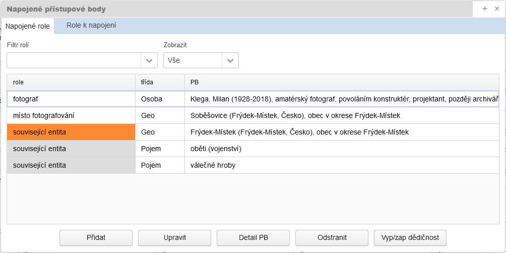

!!! warning "Upozornění"

    **Dědičnost přístupových bodů může ale způsobovat nechtěné stavy.**
    Např. pokud se k nadřazené složce „Povolování živností“ napojí vícero geografických objektů/lokalit dle jednotlivých obcí a pak dojde k rozpisu na jednotlivé podsložky „pro obec XY“, tak by každá taková podsložka zdědila všechny lokality z rodičovské složky, což by bylo chybně! V případě tohoto víceúrovňového popisu je napojení konkrétního geografického objektu účelné až na konkrétní podsložce.
    **PŘI NAPOJOVÁNÍ PŘÍSTUPOVÝCH BODŮ NA VYŠŠÍ ÚROVNĚ TEDY POSTUPUJEME OBEZŘETNĚ!**
    **Nově lze dědičnost přístupových bodů ovlivňovat, tzn. vypínat či znovu zapínat.** Neznamená to ale, že by se při napojování nemělo postupovat logicky a metodicky a případné problémy "hasit" vypnutím dědičnosti. Pokud je pozitivní efekt děděného přístupového bodu v menšině a převládá potřeba dědičnost vypnout, je zjevné, že není správně připojen! 

**U záznamu tematických databází (TD)** je kladen důraz na informační samonosnost záznamů. Z pohledu přes tematické databáze se dědičnost rovněž zobrazuje, je však vždy odvozena z primárního pohledu přes Archivní soubory. Vzhledem k tomu, že zobrazení dědičnosti bylo implementováno až později, je **duplicita „zděděného“ PB a napojeného PB možná** a není vnímaná jako chyba.

V prezentační aplikaci **Digitální archiv** budou u hierarchicky níže postavených jednotek popisu **děděné PB indexovány pro fulltextové vyhledávání**.

### Jak správně zakládat nové přístupové body?

!!! warning "Upozornění"

    **JE POTŘEBA DŮSLEDNĚ POSTUPOVAT PODLE AKTUÁLNĚ PLATNÝCH PRAVIDEL!**

#### Nové záznamy třídy Korporace a Geografický objekt

Přístupové body třídy "**<u>korporace</u>**" a "**<u>geografický objekt</u>**" je potřeba zakládat vždy, kdy to Pravidla a metodiky vyžadují.

#### Nové záznamy třídy osoba/bytost a rod/rodina

U třídy "**<u>osoba/bytost</u>**" a "**<u>rod/rodina</u>**" je vždy účelné zakládat takové přístupové body, u kterých se předpokládá jejich další využití u jiných jednotek popisu.

U žijících osob je třeba respektovat zákon na ochranu osobních údajů - viz [Možnosti zveřejnění v souvislosti se zákonem na ochranu osobních údajů](metodika_zao.md#moznosti-zverejneni-v-souvislosti-se-zakonem-na-ochranu-osobnich-udaju).

**Je možno zakládat přístupové body pro:**

- osoby působící ve veřejné sféře (mj. politici, umělci, činovníci korporací)
- autory děl

**Nedoporučuje se zakládat přístupové body pro osoby ze soukromé sféry** (žadatelé/objednavatelé technických výkresů, adresáti kolaudačních rozhodnutí apod.)

##### Jaké je minimum potřebných údajů pro zápis "osoby" zaslané ke schválení?    

V případě, že narazím v archiválii na osobu, kterou chci připojit ve specifické roli jako přístupový bod, je potřeba zvážit, zda mám v dané chvíli dostatek informací, které dokáži osobu charakterizovat i mimo kontext této konkrétní archiválie. U osob s občanských jménem je potřeba vedle povinného      příjmení znát alespoň iniciálu z křestního jména. Pokud je známo pouze příjmení, takový přístupový bod se nezasílá ke schválení. Ponechává se ve stavu "rozpracovaný", pokud je předpoklad, že danou osobu nalezneme i v dalším materiálu. Jde třeba o osoby v tzv. "tvůrčích" rolích, např. fotografové, autoři výtvarné stránky, autoři/autoři textů, kresliči, výrobci, stavitelé apod. Zde je pak nejhorší možnou kombinací  *osoba charakterizovaná pouze příjmením, působnosti v rámci jednoho roku* (tzn. odvozená z jednoho konkrétního archivního dokumentu nebo sady)  *a příliš jednoduchou stručnou charakteristikou* typu "kreslič", "autor textu" apod. 

Před zasláním ke schválení je vždy vhodné si položit otázku: **Je přístupový bod "Novák (působnost 1905), kreslič" dostatečně nosný, aby jej kdokoli mohl z IS CAM převzít a použít, případně obohatit? Bez toho, aniž by znal kontext, tedy onu archiválií, ze které "vzešel"?**

Zde se dostáváme i k potřebě **uvádět zdroje informací**. V daném případě je potřeba do kolonky Zdroje informací ocitovat archivní pramen. Nesmíme zapomínat, že IS CAM nevidí na seznam použití konkrétního přístupového bodu v pořádací aplikaci!

Rovněž je účelné **více rozpracovat stručnou charakteristiku**. Doplnit třeba informaci o místě působení, uvést jméno korporace, pro kterou osoba pracovala apod.

!!! summary "Obecně je možno deklarovat"

    **Pokud o osobě nemám dostatek potřebných informací, ale její další výskyt v archiváliích lze předpokládat, přístupový bod založím, ale ponechám ve stavu "rozpracovaný". Nechám jej takříkajíc "uzrát". Přístupový bod ve stavu "rozpracovaný" neblokuje autorizaci pomůcky. Až k němu časem připojím já nebo někdo jiný další potřebné informace, bude možno jej přepnout do stavu "ke schválení", schválit a zaslat do IS CAM.**
    **Pokud není výskyt osob předvídatelný i v dalších archivních dokumentech a nefiguruje v zásadních rolích pro archivní popis, pak přístupový bod nezakládám a základní informaci o osobě včetně role zapíšu do pole Obsah, případně do pole Veřejná poznámka.**

#### Nové záznamy zbylých tříd   

U ostatních tříd je vždy potřeba zvážit účelnost založení přístupového bodu.

**V případě, že není účelné nebo se nedoporučuje založení přístupového bodu, avšak informaci o entitě je důležité v zjednodušené formě zachovat, uvede se tato informace do pole Obsah, případně do pole Veřejná poznámka** (např. žadatelé/objednavatelé technických výkresů z řad osob). I v těchto případech je však potřeba brát ohled na zákon na ochranu osobních údajů.

### Co dělat, když přístupový bod není znám

Obecně platí, že anonymní a blíže neznámé entity se nezapisují. Viz jednotlivé kapitoly Pravidel - [7.2.2](../../zp/zp_hlavni_text-07/#722-anonymni-a-blize-nezname-fyzicke-osoby), [8.2.2](../../zp/zp_hlavni_text-08/#822-anonymni-a-blize-nezname-rodyrodiny), [9.2.4](../../zp/zp_hlavni_text-09/#924-anonymni-a-blize-nezname-korporace), [10.2.2](../../zp/zp_hlavni_text-10/#1022-anonymni-a-blize-nezname-udalosti), [11.2.4](../../zp/zp_hlavni_text-11/#1124-anonymni-a-blize-neznama-dilavytvory) a [12.2.7](../../zp/zp_hlavni_text-12/#1227-anonymni-blize-nezname-a-fiktivni-geograficke-objekty).

Dále viz - [Neurčené / neuvedené přístupové body](metodika_zao.md#neurcene-neuvedene-pristupove-body).

### Typy přístupových bodů dle účelu použití

Pravidla definují dva účely napojení archivních autoritních záznamů na archivní popis:

1. archivní autoritní záznam entity v roli původce (identifikace původce archiválií), 
2. archivní autoritní záznam entity v ostatních rolích. 

**Modul tyto typy dle účelu použití nerozlišuje.** 

#### <u>Popis původce</u>

**Původce**  je podle mezinárodního standardu ISAAR(CPF) „entita (korporace, rod nebo osoba), která vytvořila, shromáždila nebo spravovala dokumenty při provádění svých osobních nebo korporátních (úředních) aktivit.“ (viz [Pravidla - 2.6 Vymezení archivního souboru](../../zp/zp_hlavni_text-02/#26-vymezeni-archivniho-souboru)). Ve světle této definice mohou tvořit jeden fond i písemnosti více původců, a to tehdy, je-li to účelné, nebo pokud by rozdělení bylo obtížné či škodlivé.  

- je-li více původců, je potřeba popsat strukturovaně všechny – typickým příkladem je fond složený z archiválií rodu a správy velkostatku nebo firmy a jejích majitelů
- jako první se uvádí „původce největšího množství archiválií zpřístupněných v pomůcce“, nebo se záznamy původců řadí chronologicky (viz [Pravidla - 6.2.1 Popis původců](../../zp/zp_hlavni_text-06/#621-popis-puvodcu))
- pozor na výjimky u původců, kde se nemění původce, pouze jeho název v důsledku legislativních změn **Zde se čeká na stanovisko AS MV ohledně správného vymezení původců u škol apod. Poté bude doplněno!**
- **údaje o původci archivního souboru nelze zatěžovat tématy s jeho vývojem přímo nesouvisejícími, např. u MNV podrobnými dějinami obce do roku 1945. Hlavní smysl úvodu pomůcky spočívá v tom, že má badatele navést a zorientovat, nikoliv jej zahltit přílišnými podrobnostmi.**

##### Problematické vymezení některých původců

Viz Pravidla - [6.2.1 Popis původců](../../zp/zp_hlavni_text-06/#621-popis-puvodcu)

Pozor na změny původce!!! Některé změny názvu a organizace znamenají rovněž změnu původce v důsledku právních předpisů. Např. v rámci vývoje správy obce se rozlišují původci: rychtářský úřad a obecní úřad; u MNV pak třeba: místní správní komise a místní národní výbor.

##### Práce s původci v aplikaci

Údaj o původci je primárně svázaný s nejvyšší úrovní popisu = s archivním souborem. Detailní karta pro popis archivního souboru obsahuje pole Původce, kde se napojují záznamy o původcích z celé množiny přístupových bodů tříd: korporace, osoba/bytost, rod/rodina a událost.

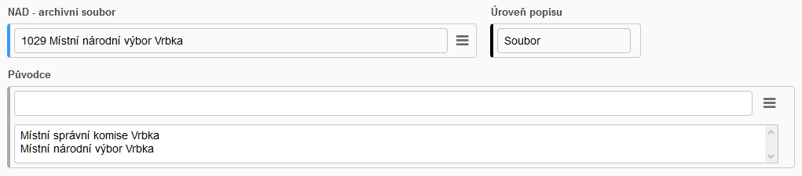

Takto připojený konkrétní popis původce se dědí i do sérií typu pomůcka a níže. Pokud má archivní soubor vícero pomůcek, popis původce je pro všechny stejný.

!!! warning "Upozornění"

    **Popis původce tvoří kompletní obsah první kapitoly úvodu pomůcky.** Uživatel údaje ze strukturovaně rozepsaného popisu původce do úvodu nikam nepřepisuje, aplikace je generuje sama až při tiskových exportech.

Archivní soubor může mít pochopitelně původců více. Pokud se některá z jeho pomůcek vztahuje pouze k jednomu původci z mnoha, lze tuto skutečnost vyjádřit tím, že se příslušný původce připojí do pole Původce i na úrovni "série typu pomůcka". Je tak připojen na obou úrovních (archivní soubor = primárně, série typu pomůcka = sekundárně). Obě připojení odkazují na jeden záznam původce = editují se jen jednou a na jednom místě. 

[DOPRACOVAT] Pole pro napojení původce bude uplatňováno i na "běžných" sériích, pokud si to okolnosti vyžádají.

V prezentační aplikaci **Digitální archiv** se nepočítá u hierarchicky níže postavených jednotek popisu se zaindexováním původců pro účely fulltextové vyhledávání (jak je tomu u ostatních rolí).

Určení a základní popis se provádí **v evidenci NAD (v programu PEvA II)** - *zodpovědnost: operátoři PEVY*. Aktuální webová verze PEVY II uplatňuje strukturovaný popis původců dle Pravidel v omezené struktuře (viz [Pravidla - příloha č. 9](../../zp/zp_hlavni_text-priloha09/)). PEVA II je napojena na IS CAM. Právě IS CAM slouží jako společné úložiště pro sdílení původců jakožto archivních autoritních záznamů mezi PEVOU a pořádací aplikací ProArchiv.

------

### Základní principy práce s přístupovými body

Jak pracovat s přístupovými body v pořádací aplikaci - viz Manuál [5.9 Práce s přístupovými body](../proarchiv/../proarchiv/manual_proarchiv.md##59-prace-s-pristupovymi-body).

Jak pracovat s přístupovými body v modulu pro správu přístupových bodů - viz Manuál [PROARCHIV - Přístupové body - modul pro správu přístupových bodů](../proarchiv/../proarchiv/manual_modul_ap/).

#### Harmonizace původních nevalidních přístupových bodů

V současné době jsou "v našeptávači" nabízeny veškeré přístupové body, tedy i ty nevalidní s [N]. Proč? Předpokládá se, že archiváři budou harmonizovat (doplňovat do validní struktury) původní rejstříková hesla a tím zkvalitní i dříve vytvořený archivní popis.

!!! warning "Upozornění"

    **POZOR! Při harmonizaci přístupového bodu je potřeba vždy ověřit, zda se jedná o stejnou entitu, ke které se váží všechny záznamy, které ji používají!** Např. rozhodneme se harmonizovat přístupový bod třídy osoba "[N] Josef Novák". Tento přístupový bod, je připojen k 15 záznamům. Z toho 10 záznamů je ze SOkA Karviná, 3 z Přerova a po jednom z Jeseníku a Olomouce. Toto teritoriálně roztroušené použití je podezřelé, datace u připojených záznamů je různorodá. Z největší pravděpodobnosti se jedná o více osob stejného jména. Proto v tomto případě harmonizaci provádět nebudeme! Založíme nový přístupový bod s přesnějšími informacemi (datace, místo narození, působení apod.)
    **<u>Při harmonizaci tedy postupujte obezřetně a zodpovědně! Pokud si nebudete se ztotožněním entity naprosto jisti, založte vždy nový přístupový bod!</u>**

**Proč se stalo, že např. původní rejstříkové heslo "Jan Novák" je připojeno k záznamům, které spolu nesouvisí, respektive odkazují na třeba na dvě různé osoby tohoto jména?** 

Je to proto, že hodnota "Jan Novák" byla použita ve všech těchto záznamech, ale její výpovědní hodnota není zcela jednoznačná. Proto Pravidla požadují upřesnění ve formě doplňků (viz níže). Např. Identita 1 = "Novák Jan (působil 1910-1930), učitel v Dolní Lhotě" vs. identita 2 = "Novák Jan (1921-1970), starosta Horní Lhoty". **Harmonizace tohoto "nejednoznačného" rejstříkového hesla** tedy nebude probíhat jeho prostým doplněním na identitu 1. Tím by u té množiny záznamů, kde bylo původní rejstříkové heslo chápáno jako identita 2, vzniklo nepravdivé tvrzení! Musí být nejprve založen nový přístupový bod jako identita 1 a něj přepojena část záznamů, kterých se to týká. U zbylých záznamů je pak možno harmonizovat původní rejstříkové heslo do podoby identity 2.

#### Seznam použití konkrétního přístupového bodu

**Klíčové pro správné ztotožnění přístupového bodu je určení jeho kontextu, tzn. k jakým záznamům je připojen. Jak zjistit seznam použití daného přístupového bodu?** 

V pořádací aplikaci je potřeba požadovaný přístupový bod vyhledat pomocí modálního okna Výběr/nahrazování přístupových bodů. Poté je seznam záznamů, ke kterým je zvolený přístupový bod napojen, viditelný v záložky **Seznam použití** (viz Manuál - [5.9.2 Hledání v přístupových bodech v prostředí pořádací aplikace](../proarchiv/../proarchiv/manual_proarchiv.md#592-hledani-v-pristupovych-bodech-v-prostredi-poradaci-aplikace).

#### **Harmonizace formou nahrazení nevalidního přístupového bodu za validní**

Pokud lze nevalidní přístupový bod plně nahradit za jiný validní, postupuje se dle [5.9.2.1 Nahrazení přístupového bodu za jiný](../proarchiv/../proarchiv/manual_proarchiv.md#5921-nahrazeni-pristupoveho-bodu-za-jiny). Použití této funkce jé vázáno na uživatelskou roli "Hromadné úpravy příst. bodů". V případě, že touto roli nedisponujete, požádejte o provedení náhrady některého ze schvalovatelů.

### Speciální "interní" stavy přístupových bodů

Mimo standardní schvalovací proces, kdy dochází ke změně stavů: rozpracovaný > ke schválení > schválený (schválený PB pak končí v IS CAM), umožňuje modul na správu přístupových bodů použít i speciální "interní" stavy. Ze stavu "rozpracovaný", lze přepnout do stavu **"interní ke schválení"**, který po schválení nabude stavu **"interní schválený"**.

Jak změna "ke schválení" > "schválený", tak "interní ke schválení" > "interní schválený" probíhá prostřednictvím shodného [schvalovacího procesu](../proarchiv/../proarchiv/manual_modul_ap.md#36-schvalovaci-proces). Na stav "interní schválený" jsou kladeny stejné požadavky (strojově hlídaná validace), jako na stav "schválený". Jediný rozdíl je v tom, že **"interní schválený" není určen k zaslání do IS CAM**.

Důvody pro zařazení stavu "interní schválený":

1. Pro shromažďování záznamů entit podtřídy "fyzická osoba" u nichž je známo, že stále žijí, nebo se to dá předpokládat (viz složitá [ochrana osobních údajů v IS CAM](https://cam.nacr.cz/redmine/projects/cam-metodika/wiki/Problematika_zápisu_potenciálně_žijících_osob_v_IS_CAM_))
2. Pro speciální záznamy tzv. [neuvedených, případně neurčených](metodika_zao.md#neurcene-neuvedene-pristupove-body) entit - viz níže.
3. Pro shromažďování záznamů entit, které nemají takový potenciál, aby bylo výhodné je sdílet v IS CAM (evidence měšťanů, majitelů domů, osoby z matrik, sčítacích operátů apod.) Jde o diskutabilní a značně subjektivní hledisko. Tento důvod bude ještě metodicky upřesněn.

Hlavně kvůli důvodu č. 1 bude potřeba nakonfigurovat chování/zobrazování záznamů entit ve stavu “interně schválené” v novém VadeMeCu/Digitálním archivu, tiskových sestavách apod. Řešení: Jako dostatečná anonymizace postačí propagace preferovaného označení bez doplňků. Takto budou dostatečně anonymizované záznamy potenciálně žijících osob a zároveň zůstane zachována i dostatečná informační hodnota u neurčených/neuvedených PB.

### Neurčené / neuvedené přístupové body

Před spuštěním modulu se využívaly tzv. **"neurčené"** přístupové body v situacích, kdy bylo potřeba zadat přístupový bod, aby byl daný záznam validní (validace vyplnění příslušné role).

!!! warning "Důležité"

    **Od používání "neurčených" přístupových bylo upuštěno, poté co byla zrušena technická validace vyplnění určitých rolí v plovoucím okně Přístupové body.**

**Postupně bude docházet k jejich hromadnému odpojování:**

| Třída              | Hodnota                                      |                                                              |               |
| ------------------ | -------------------------------------------- | ------------------------------------------------------------ | ------------- |
| Korporace          | **Neurčená korporace (NEPOUŽÍVAT)**          | bude odstraněno poté, co budou vazby na archivní popis odstraněny, nebo nahrazeny jiným PB | *v procesu*   |
| Osoba/bytost       | **Neurčená osoba (NEPOUŽÍVAT)**              | bude odstraněno poté, co budou vazby na archivní popis odstraněny, nebo nahrazeny jiným PB; mnohdy chybně používáno u autorských děl místo **Neuvedeno (osoba)** | *v procesu*   |
| Rod/rodina         | **Neurčený rod/rodina (?)**                  | odstraněno bez náhrady                                       | **provedeno** |
| Geografický objekt | *Neurčený kontinent ve světě (SN/kontinent)* | odstraněno bez náhrady                                       | **provedeno** |
| Geografický objekt | *Neurčený stát ve světě (SN/stát)*           | odstraněno bez náhrady                                       | **provedeno** |
| Geografický objekt | **Neurčené místo ve světě (SN/obec)**        | odstraněno bez náhrady                                       | **provedeno** |
| Geografický objekt | *Neurčený stát v Evropě (SN/stát)*           | ***přepojeno na "Evropa"***                                  | **provedeno** |
| Geografický objekt | **Neurčené místo v Evropě (NEPOUŽÍVAT)**     | bude odstraněno poté, co budou vazby na archivní popis odstraněny, nebo přepojeny na "Evropa" | *v procesu*   |
| Geografický objekt | *Neurčená oblast v Česku (NEPOUŽÍVAT)*       | bude odstraněno poté, co budou vazby na archivní popis odstraněny, nebo nahrazeny jiným PB | *v procesu*   |
| Geografický objekt | **Neurčené místo v Česku (NEPOUŽÍVAT)**      | bude odstraněno poté, co budou vazby na archivní popis odstraněny, nebo nahrazeny jiným PB | *v procesu*   |

Nadále tedy tyto "neurčené" přístupové body nepoužívejte ani nově nezakládejte! Podobně bude naloženo i s živelně vzniklými přístupovými  body typu "anonymní autor", "neznámý autor", "neznámá korporace" apod.

**Funkční zůstanou pouze "neuvedené" přístupové body**:

| Třída        | Hodnota                    |
| ------------ | -------------------------- |
| Korporace    | **Neuvedeno (korporace)**  |
| Osoba/bytost | **Neuvedeno (osoba)**      |
| Rod/rodina   | **Neuvedeno (rod/rodina)** |

U nich stále platí:

U archiválií, jichž se dotýká "autorský zákon", je ale naopak potřeba informaci o tom, že autor není uveden, sdělit. 

**Jde o důležité sdělení, že autor není v popisované archiválii uveden.**

V případě, že je autorství vyjádřeno např. iniciálami, jež nedokážeme s konkrétním autorem ztotožnit, nepoužijeme přístupový bod jako  "neuvedený". Přístupový bod nevyplňuji a iniciály uvedu do obsahu.

!!! warning "Důležité"

    "Neuvedené" přístupové body používejte vždy tam, kde je to interní metodikou nařízeno. Jde převážně o role vyjadřující autorství u záznamů kategorie Fotografie, pohlednice a tisková vyobrazení / Grafické listy a kresby / Veduty / Rukopisy / Mapy / Tisky / Hudebniny / Video a audio záznamy / Plakáty apod.

### Oficiální wiki stránky Kolegia - metodická podpora

Základní informace o IS CAM naleznete na [https://cam.nacr.cz/info/](https://cam.nacr.cz/info/).

V rámci Kolegia jsou řešeny **různé metodické dotazy**. Většina z nich je pak včetně řešení prezentována na wiki stránkách. Wiki stránky sloužící k doplnění a dovysvětlení metodiky související s popisem archivních autoritních záznamů:

[**https://cam.nacr.cz/redmine/projects/cam-metodika/wiki**](https://cam.nacr.cz/redmine/projects/cam-metodika/wiki)

### <u>Korporace (na co nezapomenout)</u>

#### Příloha č. 14 a 10

Držte se **[přílohy č. 14 (Závazné příklady popisu původců a entit v ostatních rolích)](../zp/attachments/ZP2022_priloha_c_14-Puvodci_v3-1_s_vyznacenim_zmen_-_20221006.xlsx)**, návodně **přílohy č. 10**. V případě přílohy č. 14 je potřeba správně vyhodnotit případné modré podbarvení polí (viz [úvodní vysvětlení](../../zp/zp_hlavni_text-priloha14/)). 

!!! warning "Pozor!"   

    **Příloha č. 14 není vždy nadřazená všem ostatním pravidlům, neboť výčet v ní uvedených příkladů nemusí být úplný. Pokud například daná fáze vývoje korporace není v příloze výslovně uvedena avšak jiné pravidlo, třeba změna korporativnosti, to vyžaduje, korporaci založíme.**
    Naopak striktně dominantní je příloha č. 14 v případě kritérií pro volbu preferovaného označení, pokud je v příloze uvedeno.

#### Veřejné a jiné rejstříky

Vytěžte informace z: 

- **[veřejných rejstříků](https://or.justice.cz/ias/ui/rejstrik)** 

a dalších: 

- [ARES](https://wwwinfo.mfcr.cz/ares/ares_es.html.cz) / [RES](https://apl.czso.cz/res/)
- [živnostenský rejstřík](https://www.rzp.cz/nahlizeni/)
- [rejstřík škol a školských zařízení](https://rejstriky.msmt.cz/rejskol/)
- [rejstřík politických stran a hnutí](https://www.hlidacstatu.cz/data/Index/seznam-politickych-stran)
- [rejstřík církví a náboženských společností](https://www-cns.mkcr.cz/cns_internet/)
- [spolkový rejstřík](https://www.spolkovyrejstrik.cz/)
- [národní registr
  poskytovatelů zdravotních služeb](https://nrpzs.uzis.cz/)
- [rejstřík veřejných výzkumných institucí](https://rvvi.msmt.cz/)
- [rejstřík honebních společenstev](https://ws1.uhul.cz/rhs/prehled.php)

U současných korporací by měl preferovaný název odpovídat rejstříkovému názvu, pokud to neodporuje příloze č. 14 (tedy pokud záznam v příloze č. 14 nemá název nebo sloupec A podbarven modře). Například názvy současných škol se přebírají z ARES či Rejstříku škol a školských zařízení; podniky z ARESu či obchodního rejstříku apod.

#### Správné vymezení jednotlivých etap vývoje korporace podle pravidla v bodě 4 kapitoly 9.2.1 Pravidel

Správné vymezení korporací má své záludnosti a jednou z nich je povinná tvorba samostatných záznamů korporací jako původců definovaných bodem č. 4 kapitoly 9.2.1. Pravidel a příkladů z přílohy č. 14. Jde o původce jako:

- zbytkové státní podniky
- podniky a jiné korporace v likvidaci
- podniky, živnosti či další korporace (např. zdravotnická zařízení a ordinace, právní kanceláře ad.) v národní či jiné vnucené nebo úřední správě zavedené v přelomové době a způsobené vnějšími, zejména politickými vlivy.

[Komentář k pravidlu 9.2.1 Rozlišování různých korporací bod 4 Základních pravidel](attachments/Puvodci_vysvetleni_dle_cl _4_kap_ 9-2-1-4.pdf)

#### Zjednodušený záznam podnikové entity

V případě nejasností a nemožnosti přesně určit korporaci z podtřídy „organizace založené za účelem podnikání“ je vhodné využívat tzv.[ ](https://proarchiv-test.archives.cz/proarchiv-help/zp/zp_hlavni_text-09/)**[zjednodušený záznam podnikové entity](../zp/zp_hlavni_text-09.md#923-zjednoduseny-zaznam-podnikove-entity)**.

#### Sídlo

Nezapomeňte na povinné uvedení ***sídla*** v sekci Jednoduché vztahy. Poté si nechte našeptat geografický doplněk.

#### Doplňky u korporace

***Chronologický doplněk*** označují Pravidla jako doporučený, tzn. pokud jsou datační údaje zpracovateli známé, do chronologického doplňku se vždy uvádějí! Respektive uveďte je primárně do datací u Vzniku / Zániku a poté si je nechte u chronologického doplňku našeptat.

***Obecný doplněk*** se vždy uvádí v následujících případech: 

1. „firma“ u podnikajících fyzických osob, např.  *Jan Novák (firma)*
2. „obec” při popisu obce jako původce = korporace podtřídy "administrativně vymezená území s vlastní správou".

a v případech uvedených v příloze č. 14!

***Geografický doplněk*** označují Pravidla jako doporučený, tzn. pokud jsou údaje o sídlu zpracovateli známé, do geografického doplňku se vždy uvádějí! Viz výše [Sídlo](metodika_zao.md#sidlo).

#### Korporace vs. osoba

Viz [níže](metodika_zao.md#osoba-vs-korporace).

### <u>Osoba/bytost (na co nezapomenout)</u>

#### Datace u osoby/bytosti

Nezapomeňte uvést ***dataci narození/úmrtí nebo působnost od/do***!

#### Doplňky u osoby/bytosti

Nezapomeňte uvést <u>VŽDY</u> ***chronologický doplněk***! Našeptejte si jej z vyplněné ***datace narození/úmrtí nebo působnosti od/do***!

***Obecný doplněk*** se uvádí jen u hlav států, svatých a pro vyjádření církevní hierarchie. Např. *Václav (kníže a svatý : asi 907-asi 935)*. <u>Rozhodně neslouží pro zápis profese, oboru činnosti apod!</u>

***Geografický doplněk*** se u osob <u>nepoužívá</u>!

#### Charakteristika

Nezapomeňte na ***charakteristiku*** pro bližší určení osoby! <u>Zapisují zde právě informace o profesi, oboru činnosti a geografické působnosti.</u> Např. "*spisovatel, novinář, středoškolský a vysokoškolský učitel*"; "*učitel a kronikář v obci Kozlovice*"; "*řemeslník v Bělé*". Začíná malým písmenem, tvoří se jako jedna věta bez tečky na konci.

#### Osoba vs. korporace

Třída osoba/bytost může zpracovatele při tvorbě přístupových bodů dostat do úzkých. Zpracování osoby jednotlivce jako přístupového bohu je poměrně jednoduché a nevyžaduje zvláštní úsilí. V některých případech však může nastat situace, kdy fyzická osoba by měla být vyjádřena jako korporace. Jedná se o případy, když fyzická osoba vykonává povolání pod svým jménem na základě živnostenského oprávnění, a to buďto pro svobodné, řemeslné nebo            koncesované živnosti. Obvykle se to v našich fondech týká případů zednických a tesařských mistrů, stavitelů, geometrů, litografů, fotografů apod., jejichž jména nacházíme na technických výkresech, mapách, fotografiích, grafických listech apod. Je proto zcela nezbytné, aby se zpracovatel zamyslel a zvážil,             v jakém kontextu osoba vystupuje a podle toho vytvořil/přiřadil přístupový bod. Např. pokud by stavitel vystupoval v roli autora technického výkresu, měl by být PB třídy korporace (za účelem podnikání), ale pokud by byl činný současně v obecní samosprávě a vystupoval v roli účastníka jednání, měl by být napojen jako PB podtřídy fyzická osoba.

> Příklad:
>
> Josef Řehoř Kremser, narozený 1859 v Hlavnici a zemřel po 1910 v Kateřinkách (1910 naposledy zachycen v pramenech), od roku 1883 doložen jako zednický a tesařský mistr, 1890 uváděn jako stavitel, poslední zmínka o realizaci stavby 1902.
>
> <u>Záznam třídy osoba/bytost:</u>        
>
> ***Kremser, Josef Řehoř (1859–působnost do 1910)**, zednický a tesařský mistr v Hlavnici, později stavitel v Kateřinkách*
>
> <u>Záznam třídy korporace (živnostník podnikající ve stavebnictví):</u>
>
> ***Josef Řehoř Kremser, stavitel v Kateřinkách (Kateřinky, Opava, Opava, Česko : působnost od 1883–působnost do 1902)**, podnikání ve stavebnictví*

### <u>Rod/rodina (na co nezapomenout)</u>

#### Datace u rodu/rodiny

Nezapomeňte uvést dataci vzniku či narození prvního známého člena rodu/rodiny; dataci zániku či úmrtí posledního známého člena rodu/rodiny nebo dataci působnosti!

#### Doplňky u rodu/rodiny

Nechte si našeptat ***chronologický doplněk*** z vyplněné datace.

### <u>Událost (na co nezapomenout)</u>

#### Místo konání

Zapisuje se v sekci Jednoduché vztahy. Jde o vazbu na záznam geografického objektu, na jehož území se událost odehrávala nebo odehrává. Povinně se uvádí u podtřídy „organizované akce a události“ s výjimkou celoplanetárních událostí (např. souborného záznamu pro všechny novodobé olympijské hry).

####  Doplňky u události

***Chronologický doplněk*** - povinně se uvádí, pokud je třeba od sebe odlišit dvě různé události se stejným označením, které nastaly v různém období. Pokud je letopočet součástí názvu, uvádí se v hlavní části, pak se ovšem již neuvádí v chronologickém doplňku.

***Obecný doplněk*** - uvádí se, pokud je potřeba blíže charakterizovat typ události, který nevyplývá z hlavní části jména a dále pokud označení události není jednoznačné a připomíná označení osoby, korporace nebo jiné události. Uvádí se proto například „svátek“, „slavnost“, „bouře“, „filmový festival“, „divadelní festival“ atp.

***Geografický doplněk*** - používá se, pokud jej lze vyjádřit údajem ze vztahu „místo konání“. Pak se tento údaj píše i do geografického doplňku (použijte našeptávač). Skutečnost, že místo konání je nebo není uvedeno již ve jméně události, nemá na tuto zásadu vliv.

***Pořadí události*** - pokud je potřeba uvádět, zapisuje se striktně jako číslo; římské číslice se převádí na arabské.

#### Datace

***Přesná datace*** se očekává u jednorázových nebo opakujících se událostí.

### <u>Geografický objekt (na co nezapomenout)</u>

!!! warning "Upozornění"   

    **Vzhledem k tomu, že geografické objekty jsou metodicky nejsložitější třídou přístupových bodů a zároveň má jejich harmonizace zásadní prioritu, věnujte této pasáží patřičnou pozornost!**

#### Jak správně při rejstříkování používat geografické objekty

- Vždy použít PB s co **nejpřesnějším teritoriálním určením**. 
- **Nezakládat** jako geografické objekty (nižší sídelní jednotka) různé **stavby** (dílo/výtvor). *Výjimka: jako geografický objekt se vytváří tehdy, je-li třeba vyjádřit sídelní jednotku – nejčastěji se používá v souvislosti se sčítáním obyvatel, zápisy do matrik a pozemkových knih apod.*
- **Vhodně kombinovat** geografické objekty s obecnými pojmy. *Např. záznam pro část obce či katastrální území + pojem „lesní cesty“. Není pak nutné zakládat pojmenované lesy, louky.*
- Nezapomínat na **souřadnice.**
- **Hierarchicky nedublovat**, tzn. nepřipojit NSJ v obci a zároveň obec. Digitální archiv bude v chystané nové verzi umět seskupovat připojené PB dle hierarchie (obec a níže). 

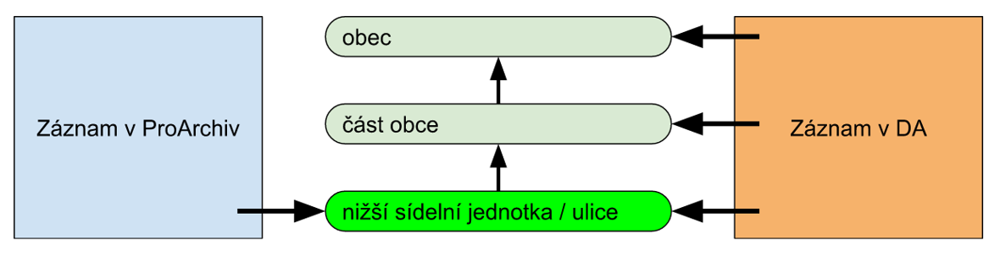

> **Příklad na plánované seskupování připojených geografických objektů dle hierarchie (obec a níže) v Digitálním archivu/VadeMeCu:** 
>
> Záznam s archivním popisem má v pořádací aplikaci připojen PB „Koloredov (Místek, Frýdek-Místek, Frýdek-Místek, Česko : nižší sídelní jednotka), původní samostatná obec“. 
>
> V Digitálním archivu se mimo tento PB bude objevovat u záznamu i PB „Frýdek (Frýdek-Místek, Frýdek-Místek, Česko), část obce…“ a „Frýdek-Místek (Frýdek-Místek, Česko), město…“, aby badatel, který bude hledat pomocí přístupového bodu „Frýdek-Místek (Frýdek-Místek, Česko), město…“ našel i záznam s „Koloredovem…“. 
>
> Opačným směrem se ale postupovat nebude. Pokud bude badatel hledat konkrétně „Koloredov…“, nevrátí mu to záznamy, kde je „Frýdek-Místek (Frýdek-Místek, Česko), město…“ a „Frýdek (Frýdek-Místek, Frýdek-Místek, Česko), část obce…“. Jen ty s napojeným PB „Koloredov…“.

#### Geografické objekty vyvíjející se v čase

**<u>Pro popis se vždy preferuje současný stav.</u>** Změny vyplývající z historického vývoje geografického objektu se zaznamenávají pomocí datovaných vztahů a událostí, pouze pokud je to nevyhnutelné, je některá z etap vyčleněna do samostatného záznamu.

U podtřídy “administrativně či jinak lidmi vymezená území” se postupuje následovně:

1. ***pro typy geografických objektů “obec” a hierarchicky nižších*** se preferuje současný stav a změny v historickém vývoji se uvádějí formou variantního označení s případnou datací použití jména
2. ***pro typy geografických objektů hierarchicky výše než “obec”*** se jednotlivé fáze historického vývoje evidují jako samostatné entity

#### Geografické objekty měnící polohu

Za různé geografické objekty se nepovažují entity měnící polohu v nepodstatné míře (zničená obec obnovená nedaleko od původního místa, nepodstatná změna koryta vodního toku, kontinenty měnící polohu nevýznamně s ohledem na délku lidského života apod.).

#### Anonymní a blíže neznámé geografické objekty

Není-li známo jméno ani dostatek údajů o geografickém objektu, takovou entitu jako geografický objekt nezakládáme. Není přípustné vytvářet entity typu „*neznámá Lhota v Česku“*; „*Lhotka (Česko)“*; *Hohenstein (Německo)*  apod., pokud nelze geografický objekt přesně lokalizovat. Jsou-li sousedící obce obdobného názvu (např. Horní Jiřetín a Dolní Jiřetín) v archiválii blíže nerozlišeny (jen jako Jiřetín), je řešením připojit oba přístupové body.

#### Obecný doplněk u geografických objektů

Jeho uvádění/neuvádění určuje [příloha č. 10](../zp/zp_hlavni_text-priloha10/#trida-geograficky-objekt). Použijte našeptávač pro jeho našeptání. Pouze u geografických objektů typu "městská část/obvod", "jiné vymezené území", "chráněná část přírody", "lesopark/park/sad", "jiné administrativně vymezené části přírody", "jiný přírodní útvar", "jiná vodní plocha/tok", "jiný pojmenovaný útvar" a "jiná část vesmíru" je potřeba provést ruční úpravu doplňku.

#### Geografický doplněk

<u>***Geografický doplněk*** je u většiny geografických objektu povinný!</u> Nevyplňuje se pouze na úrovních kontinent/světadíl, stát, oceán, moře, trvalý klimatický jev a většiny vesmírných těles.

Našeptává se z prvku popisu Administrativní zařazení. Nezobrazuje historický vývoj; skládá se ze současných názvů geografických objektů. Zapisuje se:

- **pro entity v Česku** primárně postupným řetězením informací o části obce, obci/vojenském újezdu, okrese a státu (vždy v současném znění). V případě, že tato konstrukce není dostatečná pro rozlišení entit, lze před část obce předřadit ještě katastrální území nebo některý typ ze skupiny nižších sídelních jednotek (ulice apod.).

    Okres se v geografickém doplňku povinně píše ve všech případech, tj. i u okresních měst, např. *Pardubice (Pardubice, Česko)*. Tím je bez pochybností a zcela jasné, že: 

    a) první pozice před výrazem „Česko“ znamená vždy okres,

    b) druhé pozice před „Česko“ znamená vždy obec,

    c) třetí pozice před „Česko“ znamená část obce, 

    d) čtvrtá pozice před “Česko” znamená další nižší část, např. ulice, katastrální území apod.

    Výjimku tvoří geografické objektu na území hlavního města Prahy. Ty včetně Prahy samotné v doplňku okres nemají uveden.

- **pro entity na Slovensku, v Polsku, Rakousku, Německu, Maďarsku a na Ukrajině** se doplněk vytváří řetězením informací o obci, okrese a státu (vždy v současném znění)

    Výjimku tvoří geografické objekty typu “obec se širší působností”, u kterých se okres v doplňku neuvádí; pouze stát. V Polsku jde o tzv. „miasta na prawach powiatu“ - např. *Bielsko-Biała (SÚ/obec se širší působností, Polsko)*, *Katovice (SÚ/obec se širší působností, Polsko)* - v hierarchii napojena přímo pod vojvodstvím; na Slovensku pouze dvě: *Bratislava (SÚ/obec se širší působností, Slovensko)* a *Košice (SÚ/obec se širší působností, Slovensko)*; v Rakousku tzv. statutární města - např. *Graz (SÚ/obec se širší působností, Rakousko)*; v Německu tzv. městské okresy - např. *Aachen (SÚ/obec se širší působností, Německo)*

- **pro entity z ostatních zemí** se doplněk vytváří řetězením informací o obci a státu (vždy v současném znění), např. *Athény (SÚ/obec, Řecko)*

U entit mimo ČR, u nichž je možné pro doplněk použít český překlad (exonyma jako například Paříž), se používá standard geografického názvosloví stanovený Českým úřadem zeměměřickým a katastrálním.

Pokud nelze entitu zařadit pod konkrétní stát, lze jako geografický doplněk použít název kontinentu/světadílu nebo název objektu ve vesmíru (planety, měsíce, hvězdy). U geografických objektů mimo pevninu, u kterých není možné určit příslušnost ke státu či kontinentu/světadílu, je možné použít moře či oceán.

Jednotlivé hierarchické části geografického doplňku se oddělují čárkou následovanou mezerou.

#### Chronologický doplněk u geografických objektů

Uplatňuje se u podtřídy “administrativně či jinak lidmi vymezená území” následujícím způsobem:

1. u entit s typem geografického objektu “obec” a hierarchicky níže se u nezaniklých chronologický doplněk neuvádí, bez ohledu na to, zda je vyplněna datace vzniku/první písemné zmínky. U zaniklých se zapisuje jako *“zaniklo”*. Např. *Barnov (Z/NSJ, Libavá, Olomouc, Česko : zaniklo)*
2. u entit s typem geografického objektu hierarchicky vyšším než “obec” se uvádí dle datačních hodnot či jejich zjednodušení (století apod.) většinou jen u zaniklých Pouze u okresů a krajů v ČR se uvádí otevřeným časovým intervalem i u současných.

U ostatních podtříd se uplatňuje výjimečně, jen pokud je to účelné. Např. při zániku přírodního útvaru (ledovce, útesy aj.)

#### Administrativní zařazení / hierarchická struktura

Vyjadřuje se vztahem na hierarchicky nadřazený nezaniklý geografický objekt z podtřídy “administrativně či jinak lidmi vymezená území”.

Jako nadřazená entita se vždy určuje nejnižší identifikovatelná úroveň v hierarchii, která plně popisovanou entitu obsáhne. 

**Hierarchická struktura se uplatňuje povinně pro všechny entity podtřídy “administrativně či jinak lidmi vymezená území”.**

Jak má správná hierarchická struktura vypadat?

##### Pro ČR a SR:

použije se vždy přesná hierarchie, tzn. stát > kraj > okres > obec > část obce > nižší sídelní jednotka (ulice, náměstí, nábřeží, nižší sídelní jednotka).

V případě, že existuje pouze jedna část obce totožného názvu jako obec, část obce se nezakládá.

##### U zahraničních entit:

1. buď se použije přesná hierarchie, tzn. stát > administrativně vymezená vnitřní část státu > obec > část obce > nižší sídelní jednotka (ulice, náměstí, nábřeží, nižší sídelní jednotka)
2. nebo je umožněno navázat obec nebo nižší sídelní jednotku přímo na stát bez nutnosti zadávat administrativně vymezenou vnitřní část státu, avšak za předpokladu, že jsou vyplněny souřadnice. Avšak ulice, nábřeží a náměstí musí být napojeny na obec. 

**U zaniklých lokalit** (v ČR i zahraničí) je umožněno navázat entitu na nejblíže určitelnou nadřazenou entitu bez ohledu na požadavek přesněji definovat hierarchii.

U zbylých podtříd je hierarchická struktura nepovinná. Ale je doporučeno ji uvádět ;-)

!!! warning "Upozornění"   

    U ulice, náměstí a nábřeží se ve vztahu Administrativní zařazení napojuje obec, nikoli část obce.

#### Souřadnice

**Uvádějí se vždy, když je u zahraničních entit  obec nebo nižší sídelní jednotka napojena v rámci hierarchické struktury přímo na stát!!!** <u>Je však výrazně doporučeno uvést u území a sídel bodové souřadnice vždy</u> - s ohledem na budoucí možnosti prezentace geografických objektů v mapových podkladech (jak interně v ProArchivu, tak v Digitálním archivu). [Jak na zápis souřadnic?](../proarchiv/../proarchiv/manual_modul_ap.md#61-wkt-editor-souradnic)

### <u>Dílo/výtvor (na co nezapomenout)</u>

#### Umělecká díla vs. stavby

**<u>Do podtřídy "autorská a umělecká díla"</u>** patří např. díla literární, divadelní, hudební, taneční, výtvarná, rozhlasová, filmová, televizní, vědecká, naučná, náboženská atd. U výtvarných děl je třeba rozlišovat mezi touto podtřídou a podtřídou “stavby…”. jako autorská a umělecká díla se považují sochy, reliéfy, fresky, mozaiky, nástěnné malby, náhrobky, pomníky apod.

<u>**Do podtřídy "stavby, trasy, zásahy do přírodních útvarů s vlastním jménem nebo jinou identifikací"**</u> patří objekty, trasy a jejich významné části (stanice, významné části objektů apod.) s různou rozlohou (bodové, plošné a liniové) a umístěním (podzemní, pozemní, nadzemní, podmořské, mořské, vesmírné). Z hlediska účelu se jedná například o stavby obytné, hospodářské, dopravní, správní, vojenské, bezpečnostní, sociální, zdravotnické, náboženské, kulturní, vzdělávací, sportovní, turistické, rekreační, místa těžby surovin, historické cesty a stezky. Za dílo se v uvedeném smyslu považují i plánovitě vytvořená speciální seskupení staveb s vlastním jménem jako například skanzeny a sídliště. Je ovšem třeba rozlišovat, kdy stavba vystupuje jako dílo a kdy jako korporace nebo geografický objekt – například v případě provozovatele obchodního domu, správy skanzenu, městské části atp. ***Výjimku u staveb představují umělé vodní plochy (vodní a plavební kanály, průplavy, údolní nádrže, rybníky, koupaliště, bazény), které jsou zařazeny do třídy geografických objektů.*** K dílům naopak patří vodohospodářské stavby typu kanalizace, vodovod, meliorační systém, kašna apod.

#### Označení u podtřídy „stavby, trasy, zásahy do přírodních útvarů s vlastním jménem nebo jinou identifikací“

!!! warning "Upozornění"   

    **Tvorba správného preferovaného označení u staveb je metodicky složitější. Věnujte proto náležitou pozornost Pravidlům - [Označení u podtřídy „stavby, trasy, zásahy do přírodních útvarů s vlastním jménem nebo jinou identifikací“](../zp/zp_hlavni_text-11.md#oznaceni-u-podtridy-stavby-trasy-zasahy-do-prirodnich-utvaru-s-vlastnim-jmenem-nebo-jinou-identifikaci).**

#### Doplňky u děl/výtvorů

***Obecný doplněk*** - povinně se uvádí u podtřídy „stavby, trasy, zásahy do přírodních útvarů s vlastním jménem nebo jinou identifikací“. Dále se uvádí, pokud je potřeba blíže charakterizovat typ díla/výtvoru, který nevyplývá z hlavní části jména. Jako obecný doplněk se používá pokud možno co nejobecnější pojem vyjadřující podstatu entity (její primární nebo hlavní účel).

***Doplněk autor/tvůrce*** - doporučený pouze pro podtřídu „autorská a umělecká díla“ za určitých okolností, v ostatních případech se neuvádí.

Uvede jméno autora s následující syntaxí: *jméno příjmení* (přímé pořadí jména = vedlejší a hlavní část bez čárky); dva autory oddělit pomocí “a”; 3 a více autorů = “kolektiv”. Např. *Jan Novák / Jan Novák a František Kulhavý / kolektiv*. Nebudeme však již jméno autora vepisovat před název do pole Jméno - hlavní část! Pokud je autor uveden v sekci Vznik jako vztah "autor/tvůrce", je možno využít našeptávač doplňku.

U staveb a příslušných autorských a uměleckých děl (např. pomníky s trvalým umístěním v exteriéru) se uvede ***geografický doplněk*** dle pravidel, která jsou uplatněna u geografických objektů. U jiných děl/výtvorů jen v případě jejich nutnosti.

***Chronologický doplněk*** se využívá u hudebních a literárních děl v případě, že existuje více verzí díla. Verze se označuje obvykle jako rok, resp. rozsah dat, pokud je potřebné uvést datum platnosti nebo vydání díla pro označení verze. Také slouží k rozlišení různých děl se stejným názvem.

### <u>Obecný pojem (na co nezapomenout)</u>

#### Jak správně při rejstříkování používat obecné pojmy

- **Využívat v maximální míře záznamy z IS CAM** (tzn. již **hotový tezaurus** -[ ](https://digi.ceskearchivy.cz/Aplikace-a-data-Hierarchie-obecnych-pojmu-v-CAM)[https://digi.ceskearchivy.cz/Aplikace-a-data-Hierarchie-](https://digi.ceskearchivy.cz/Aplikace-a-data-Hierarchie-obecnych-pojmu-v-CAM)[obecnych](https://digi.ceskearchivy.cz/Aplikace-a-data-Hierarchie-obecnych-pojmu-v-CAM)[-pojmu-v-CAM](https://digi.ceskearchivy.cz/Aplikace-a-data-Hierarchie-obecnych-pojmu-v-CAM)). 
- **Zakládat nové obecné pojmy jen v odůvodněných případech.**
- **Vhodně je kombinovat. Nepokoušet se vytvářet jejich kombinace jako nový PB.**
- Připojovat hlavně obecné pojmy, které regest vystihují, ale které nejsou přímo v textu regestu obsaženy.
- Připojovat i ty, které v regestu obsaženy jsou, tedy po *zaindexování* textu regestu budou fulltextově dohledatelné? Pravidla to sice vyžadují: „Téměř vždy se pak k jednotce popisu vytvářejí přístupové body s obecnými pojmy“, konečné rozhodnutí je ale na samotném zpracovateli archivního popisu. 

[^1]: § 5 odst. 2 písm. f) zákona č. 101/2000 Sb.
[^2]: Zákon č. 106/1999 Sb., o svobodném přístupu k informacím.
[^3]: Srv. např. nález Ústavního soudu I.ÚS 517/10 ze dne 15. 11. 2010.
[^4]: § 13c zákona č. 133/2000 Sb., zákon o evidenci obyvatel, ve znění pozdějších předpisů.
[^5]: Jedná se zejména o údaje získané na základě ust. § 37 odst. 4 zákona č. 499/2004 Sb., o archivnictví a spisové službě ze Základního registru obyvatel, Informačního systému evidence obyvatel a Informačního systému cizinců.
[^6]: čl. 10 Listiny základních práv a svobod.
[^7]: § 81 odst. 2 zákona č. 89/2012 Sb., občanský zákoník.
[^8]: „Po smrti člověka se může ochrany jeho osobnosti domáhat kterákoli z osob jemu blízkých.“ § 82 odst. 2 zákona č. 89/2012 Sb.
[^9]: K problematice působnosti zákona č. 101/2000 Sb. v případě nežijících fyzických osob srv. stanovisko Úřadu pro ochranu osobních údajů č. 4/2012.
[^10]: Srv. zejména § 3 písm. a) zákona č. 121/2000 Sb.FF
