# PROARCHIV - Sčítací operáty

***(uživatelská příručka)***

## 1 Úvod

***Uživatelská příručka k aplikaci ProArchiv17 je postupně doplňována! Neprošla jazykovou korekturou ;-)***

**[VERZE 2025-11-05]**

#### Seznam důležitých změn:

| Změny v aktuální verzi                                       | oproti verzi |
| ------------------------------------------------------------ | ------------ |
| Popis funkce [Najdi / Nahraď](manual_census.md#543-najdi-nahrad) | 2024-01-14   |
| Popis funkce [Nový objekt sčítání ze vzoru](manual_census.md#521-vytvoreni-noveho-objektu-scitani-ze-vzoru) | 2024-01-14   |

!!! tip "Tip"

    Pokud se vám objevuje neaktualizovaná podoba stránek, proveďte pomocí Ctrl+F5 jejich opětovné načtení s vymazáním cache. 

Uživatelská příručka si klade za cíl primárně vysvětlit fungování a ovládání speciálního modulu pro správu a editaci archivního popisu k tematické databázi Sčítací operáty.

## 2 Potřeba vzniku speciálního modulu Sčítací operáty

Původní webová aplikace Sčítací operáty a Lokality ZAO byla již morálně zastaralá. Integrace veškerého archivního popisu "pod jednu střechu", tedy do prostředí ProArchivu je efektivnější. Rovněž nový Digitální archiv počítá s čerpáním dat z jednotného databázového zdroje. 

## 3 Základní popis modulu

Modul Sčítací operáty funguje jako nadstavba pořádací aplikace ProArchiv. Využívá stejné vizuální prvky a stejné funkcionality. Otevírá se vždy v samostatné záložce prohlížeče.

### 3.1 Struktura dat

Základní členění popisných polí vychází ze struktury původní webové aplikace.

Existuji dva základní typy záznamů:

1. [lokace](manual_census.md#311-lokace)
2. [objekt sčítání](manual_census.md#312-objekt-scitani)

#### 3.1.1 Lokace

Jde o vymezení území, místa, prostoru vždy v určitém časovém okamžiku. Tyto lokace jsou hierarchicky (úrovňově) poskládané. Nejvyšší úroveň tvoří okres, nejnižší byt. Vždy každá konkrétní hierarchie je vymezená jedním společným časovým určením.

**Lokace se zobrazuji v části navigátor.**

| **Úroveň** | **Hodnota z číselníku typů  lokací**  *(tvoří hierarchii – páteřní lokace)* |
| ---------- | ------------------------------------------------------------ |
| úroveň  1  | **okres** (politický)                                        |
| úroveň  2  | **obec**                                                     |
| úroveň  3  | **část** **obce**                                            |
| úroveň  4  | **ulice**                                                    |
| úroveň  5  | **dům**                                                      |
| úroveň  6  | **byt**                                                      |

Lokace je podložena archivními prameny, ale vazbu na konkrétní archiválii neobsahuje. Taktéž samotná lokace bez objektu sčítání nesmí správně obsahovat reprodukce sčítacích archů.

Hierarchická (úrovňová, stromová) struktura lokací musí být při zápisu nových lokací nebo přesunu stávajících respektována. Aplikace nedovolí zápis vyšší úrovně do nižší. Některé nižší nepovinné úrovně (část obce, ulice) mohou být z důvodu jejich reálné neexistence přeskočeny. Např. v úrovni obec se vyskytují přímo úrovně typu dům. Nebo nastávají případy, kdy v úrovni obec se vyskytují přímo úrovně typu část obce a zároveň úrovně typu dům. Např.:

+ obec
  + část obce jiného názvu než obec
    + dům 3
    + dům 4
  + dům 1 */domy bez specifikované části obce; prakticky jde o část obce stejného jména jako obec/*
  + dům 2 */domy bez specifikované části obce; prakticky jde o část obce stejného jména jako obec/*

Z hierarchické struktury lokací vyplývá i dědičnost hodnot. Hodnoty z vyšších úrovní se dědí (propisují) do úrovní nižších. Např. hodnota pole okres je platná i pro úroveň byt v dané hierarchii.

Hierarchická struktura lokací tvoří základní kostru pro připojení objektů sčítání.

#### 3.1.2 Objekt sčítání

Tvoří jej konkrétní skupina údajů (např. osoby) vážících se k určitému archivnímu pramenu (skupině sčítacích archů, jednotlivému sčítacímu archu apod.) a jeho případné reprodukce. Objekt sčítání se váže vždy na určitou lokaci a pouze u něj je zaznamenána archivní identifikace. Lokace může obsahovat více objektů sčítání na stejné úrovni. Ne každá lokace ale musí obsahovat objekt(y) sčítání. Objekty sčítání se vyskytují zpravidla až na nejnižších úrovních dané hierarchie (výjimky tvoří např. sumáře – viz dále).

Reprodukce sčítacích archů se vždy připojují k objektu sčítání, nikoli k lokaci.

**Objekty sčítání se zobrazují v části tabulka.**

### 3.2 Informace o záznamech mimo editační formuláře

Pro orientaci v záznamech se vybrané údaje z nich „skládají“ do řádkové informace, která reprezentuje v co nejstručnější formě záznam mimo editační formulář **a zastupuje jej ve všech ostatních zobrazeních** (v navigátoru, tabulce, ve výsledcích výběrů, v přístupových bodech apod.). Tato informace je tvořena obsahem stanoveného pole či vícero polí. Definice, která stanoví, jaká pole pro danou kategorii záznamu tvoří tento "název", je naprogramovaná přímo v aplikaci.

V dalším textu příručky je uváděno jako „název (displayName)“. Vedle něj se mohou vyskytovat i agregované údaje o archivní identifikaci záznamu jako "identifikace (displayId").

V navigátoru se informace o lokaci zobrazuje ve formě lokace + rok sčítání + typ lokace.

V tabulce se informace o objektu sčítání zobrazuje jako záznam sčítaní se skupinou údajů pro vhodnou obsahovou identifikaci.

### 3.3 Validace

Validace není nyní v modulu Sčítací operáty v zásadě uplatňována. Validována jsou pouze pole pro zápis časových údajů (rok sčítání, rok narození sčítané osoby).

#### 3.3.1 Validace online

Zobrazuje se [stejným způsobem](manual_proarchiv.md#321-validace-online) jako v pořádací aplikaci.

## 4 Uživatelské rozhraní

### 4.1 Aplikační prostředí

Aplikace je webová, lze ji spustit ve standardním webovém prohlížeči. K doporučeným (testovaným) prohlížečům patří Mozilla Firefox, Microsoft Edge a Google Chrome.

!!! warning "Omezení"

    Aplikace není schopna reagovat na použití tlačítek „předchozí stránka“ a „následující stránka“ v prohlížeči. Intuitivnímu použití těchto tlačítek je třeba se vyhnout. 

#### 4.1.1 Přihlášení

Modul disponuje jak samostatným přihlášením, tak přejímá přihlášení z pořádací aplikace. 

Dvě možnosti spuštění:

1. Spuštění  pořádací aplikace, ve které je již uživatel přihlášen, a to pomocí tlačítka  v nástrojové liště. Uživatelská oprávnění pro modul jsou rovněž přebírána z pořádací aplikace.
2. Samostatně pomoci webové adresy https://proarchiv.archives.cz/proarchiv/census. Pokud uživatel ještě není přihlášen do pořádací aplikace, zobrazí se standardní [přihlašovací okno](manual_proarchiv.md#421-prihlaseni).

##### 4.1.1.1 Práva ke čtení/editaci

Záznamy sčítacích operátů nejsou závislé na  oblastech ani "přidělených" archivních souborech a jsou pro zápis určeny všem přihlášeným uživatelům.

#### 4.1.2 Vícenásobný běh aplikace ve stejném okamžiku

Pro vícenásobný běh modulu platí [stejná pravidla](manual_proarchiv.md#42-aplikacni-prostredi) jako pro pořádací aplikaci.  

#### 4.1.3 Ergonomie zobrazení

Pro velikost zobrazení aj. v modulu platí [stejná pravidla](manual_proarchiv.md#423-ergonomie-zobrazeni) jako pro pořádací aplikaci.

#### 4.1.4 Ukládaní nových záznamů a změn

Aplikace má implementováno:

1. uživatelem řízené uložení pomocí tlačítka  v nástrojové liště
2. automatické uložení při přechodu na jiný záznam (bez dalších otázek)

### 4.3 Základní rozdělení pracovní plochy modulu

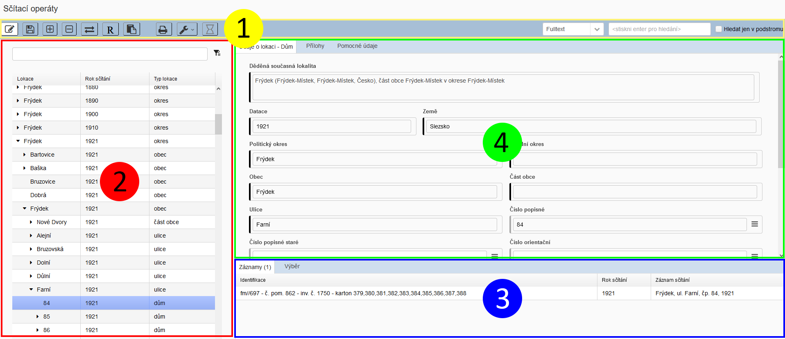

1 - [Lišta nástrojů (toolbar)](manual_census.md#44-lista-nastroju) | 2 - [Navigátor](manual_census.md#45-navigator) | 3 - [Tabulka](manual_census.md#46-tabulka) | 4 - [Detail](manual_census.md#47-detail)

### 4.4 Lišta nástrojů

 

####  Režim zápisu

- Přepínaní mezi režimem pro čtení (výchozí stav) a pro zápis (tlačítko "zbělá").

-------------------------

####   Uložení

- Pro ruční uložení všech typů záznamů.

-------------------------

####  Nový objekt sčítání

- Založí nový záznam typu **objekt sčítání**.

------

#### 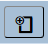 Nový objekt sčítání ze vzoru

- [Založí záznam dle vzoru](manual_census.md#521-vytvoreni-noveho-objektu-scitani-ze-vzoru) 

------

####  Odstranění zobrazeného záznamu

- Odstraní vybraný záznam, který je právě vidět v detailu (lokaci či objekt sčítání). 

------

#### 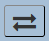 Synchronizace

- Synchronizuje záznam objektu sčítání s lokací (tedy záznam z tabulky s navigátorem).

------

#### 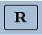 Napojené přístupové body

- Otevře plovoucí okno pro zobrazení a editaci napojených přístupových bodů k vybranému záznamu.

-----------------------
####  Různé funkce

- [Nastavit vzor](manual_census.md#521-vytvoreni-noveho-objektu-scitani-ze-vzoru) - nastaví zobrazený záznam objektu sčítání jako vzor

------

#### 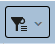 Výběr

- Přidat objekt sčítání do výběru - přidá záznam objektu sčítání do záložky Výběr k dalšímu využití
- Vyprázdnit výběr - vyprázdní záložku Výběr
- [Najdi / Nahraď](manual_census.md#543-najdi-nahrad)

------

#### 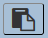 Schránka

- V nové záložce prohlížeče otevře okno pro zobrazení objektů, které jsou aktuálně ve schránce.

----------------------
#### 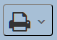 Tisky

- Výběr tiskových sestav.

----------------------
#### 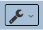 Nastavení / nástroje

Nabídka pomocných funkcí a nastavení:

- Odhlásit - dojde k odhlášení z aplikace
- <u>Zobrazit systémové info o entitě</u> - zobrazí podobu databázového zápisu (JSON).

---------------------
#### 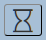 Úlohy

- Zobrazuje stav běžících úloh, které jsou spuštěny na pozadí. Ikona se dynamicky mění podle stavu úloh:

   nebo  = Žádná úloha neběží

   = Právě běžící úlohy...
  
  Funguje i jako proklik do [Seznamu úloh](manual_proarchiv.md#5131-seznam-uloh).

!!! warning "Upozornění"

    Zobrazuje úlohy na pozadí z celé aplikace ProArchiv, tedy i s pořádací části.  

### 4.5 Navigátor

Slouží k zobrazení hierarchického stromu lokací a vyhledávání v nich.

Lokace jsou řazeny automaticky vzestupně dle ABC, čísla (roky, čísla domů a bytů) jsou řazena jako čísla. Nejvyšší úroveň okresů je řazena dle názvů okresů a roku sčítání.

### 4.6 Tabulka

Záznamy jsou zobrazeny dle svého ["Názvu" (displayName)](manual_census.md#32-informace-o-zaznamech-mimo-editacni-formulare). Zobrazení v tabulce se člení do několika záložek:

### 4.7 Detail

Zobrazení všech dostupných strukturovaných informací k zobrazenému záznamu.

#### 4.6.1 Členění Detailu pro lokace

##### 4.6.1.1 Údaje o lokaci

Zobrazuje kompletní nabídku polí (prvků popisu), které jsou pro záznam typu **[lokace](manual_census.md#311-lokace)** k dispozici.

##### 4.6.1.2 Přílohy

Zobrazuje přílohy (digitalizáty, pdf soubory apod.).

##### 4.6.1.3 Pomocné údaje

Zobrazuje systémově generovaná data: uživatelská jména tvůrců a následných editorů záznamu včetně časových značek; taktéž jednoznačný identifikátor (UUID) záznamu a permalink.

#### 4.6.2 Členění Detailu pro objekty sčítání

##### 4.6.2.1 Objekt sčítání

Zobrazuje základní nabídku polí (prvků popisu), které jsou pro záznam typu **[objekt sčítání](manual_census.md#312-objekt-scitani)** k dispozici.

##### 4.6.2.2 Osoby

Zobrazuje formulář pro zápis sčítaných osob u zvoleného objektu sčítání.

##### 4.6.2.3 Odkazy

Umožňuje vytvářet vazby na jednotky archivního popisu z pořádací aplikace.

##### 4.6.2.4 Info o lokaci

Zobrazuje v režimu pro čtení informaci o lokaci, pod kterou je vybraný objekt sčítání připojen. 

##### 4.6.2.5 Přílohy

Zobrazuje přílohy (digitalizáty, pdf soubory apod.).

##### 4.6.2.6 Pomocné údaje

Zobrazuje systémově generovaná data: uživatelská jména tvůrců a následných editorů záznamu včetně časových značek; taktéž jednoznačný identifikátor (UUID) záznamu a permalink.

## 5 Funkčnost - případy užití

### 5.1 Vytváření nových lokací

Nové lokace se zakládají formou vnoření. Nejdříve se zvolí rodičovská lokace (zamodří se) a pak se z kontextového menu (pravé tlačítko myši) spustí příkaz Vnořit novou lokaci

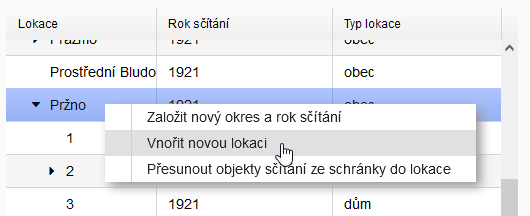 

Dle typu rodičovské lokace se bude odvíjet i nabídka možných typů nové lokace. Zde byla rodičovskou lokací obec, proto je možné vnořit část obec, ulici nebo dům:

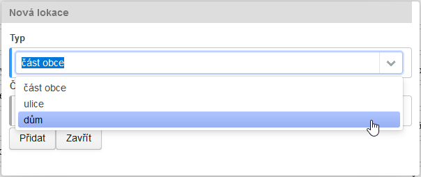 

#### 5.1.1 Editace již vytvořených lokací typu okres

U již vytvořených lokací typu okres se pole Datace a Politický okres editují/opravují pomocí funkce Upravit v hierarchii v Nástrojích:

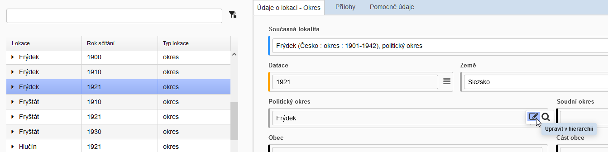

### 5.2 Vytváření nových objektů sčítání

Před vytvoření nového objektu sčítání je vždy potřeba mít vybranou lokaci, do které bude objekt sčítání vnořen. Samotné vytvoření objektu sčítání se provádí pomocí tlačítka  v nástrojové liště.

Zároveň je nabídnuta možnost **Aplikovat archivní identifikaci z objektu sčítání**, tzn. že se ukáže nabídka výše postavených objektů sčítání. Pokud je některý vybrán, zkopíruje se jeho archivní identifikace do nově zakládaného objektu sčítání:

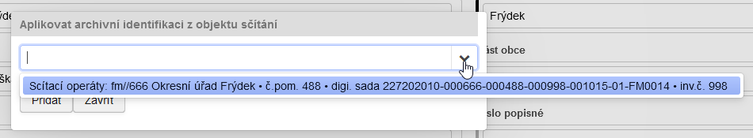

#### 5.2.1 Vytvoření nového objektu sčítání ze vzoru

Pokud je některý záznam objektu sčítání označen jako vzor, vytvoří se pomocí této funkce nový záznam objektu sčítání s předvyplněnými hodnotami ze vzorového záznamu.

!!! tip "Tip"

    Tato funkce je obzvláště užitečná při "rozbíjení" digitalizačních sad (např. pro obec) na menší části (domy, byty).

### 5.3 Editace speciálních polí / prvků popisu

#### 5.3.1 Lokace - Současná lokalita

Slouží k napojení přístupového bodu z třídy geografický objekt, který charakterizuje současnou lokalitu. V poli **Děděná současná lokalita** se pak hierarchicky zobrazuji přístupové body napojené v lokacích hierarchicky vyšších.

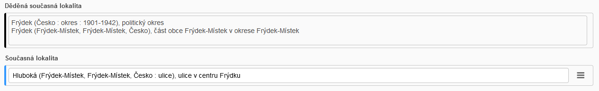

#### 5.3.2 Lokace - Adresář

Pole určené primárně k citaci dostupných historických adresářů, které mohou napomoci badatelům v přesnější lokalizaci hledaných osob, domů apod. Adresáře nejsou vesměs evidované jako archiválie, jsou většinou součástí knihovního fondu archivní knihovny. Uvádí se plná citace zdroje. Pole umožňuje vkládat formátovací znaky (odrážky) a odkazy (hyperlinky) na online elektronické zdroje = např. permalinky z Digitální knihovny ZAO.

K vytvoření odkazu je potřeba napsaná odkaz označit, zvolit Create Link

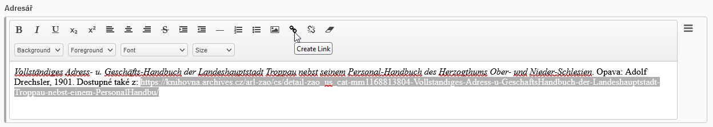 

a doplnit odkaz.

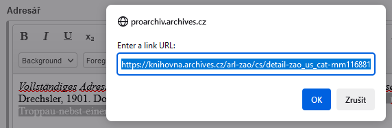 

Výsledný funkční odkaz by měl být podtržen a zbarven modře:

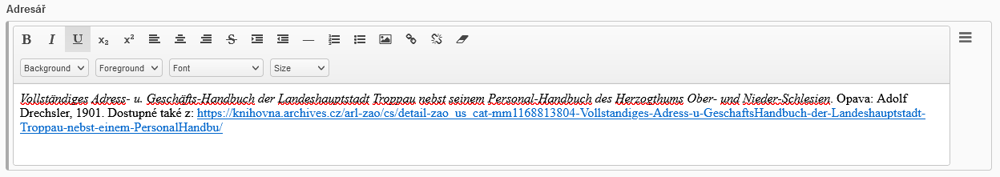 

#### 5.3.3 Objekt sčítání - odkazy

Záznam TD Sčítací operáty není standardní součástí pořádací aplikace. Z toho vyplývá absence některých vlastností, které jsou vlastní ostatním záznamům tematických databází. Jde hlavně o absenci přímé vazba na archivní soubor a nemožnost zařadit/zobrazit záznam v rámci hierarchie archivního pořádaní (tzv. pohled přes Archivní soubory).

Je však možnost tuto vazbu manuálně vytvořit:

1. Na straně pořádací aplikace vstoupíme na detail jednotky popisu, která odpovídá z hlediska archivní identifikace objektu sčítání, u které chceme vazbu vytvořit:

    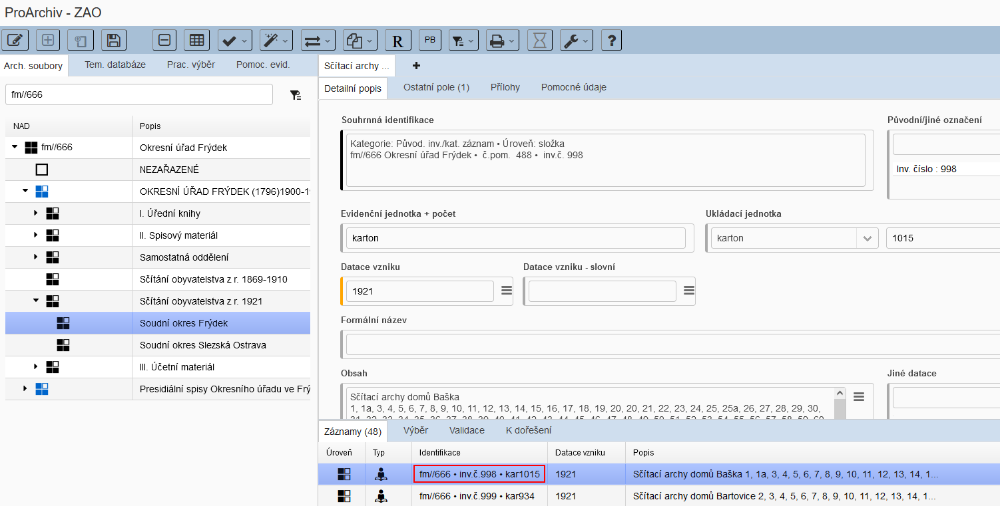

2. Zvolíme Různé funkce - Vložit záznam do schránky:

    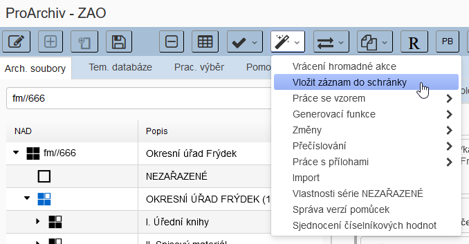 

3. V modulu Sčítací operáty vybereme příslušný objekt sčítání:

    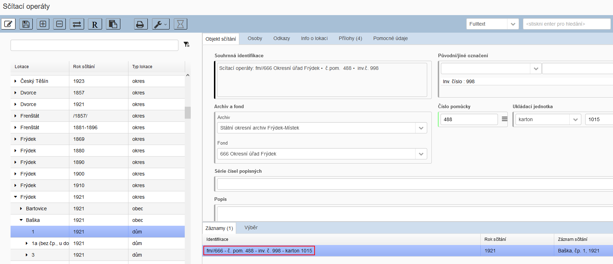

4. V okně Schránka se můžeme přesvědčit, že zde máme příslušný záznam z pořádací aplikace (proarchiv). Pomocí tlačítka 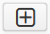 vytvoříme odkaz.

    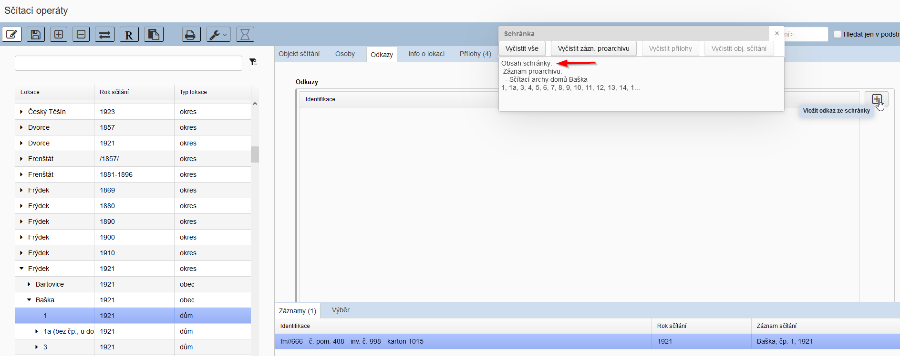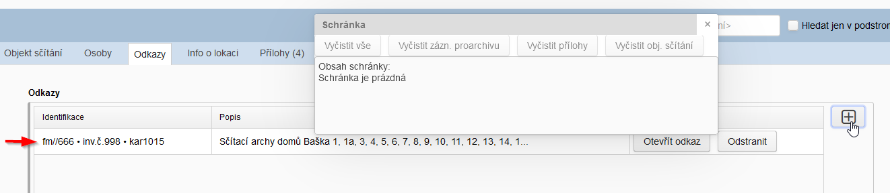

5. Pomocí tlačítka Otevřít odkaz lze zajistit otevření příslušné jednotky popisu v pořádací aplikaci, respektive dojde k vytvoření nové záložky v Detailu:

    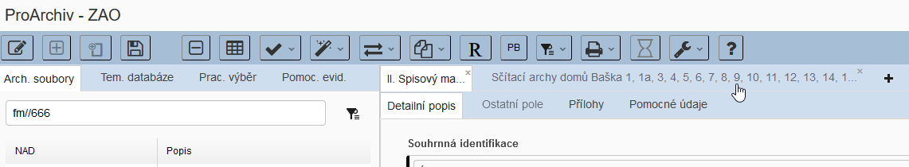

### 5.4 Hledání / Výběry / Hromadná nahrazení

#### 5.4.1 Výběr lokací

Výběr lokací se provádí v navigátoru.

Vedle jednoduchého postupného rozklikávání hierarchického stromu lze hledat i pomocí vyhledávacího pole.

Zde se zapisuje hledaný řetězec, načež se vrací našeptávač relevantních výsledků:

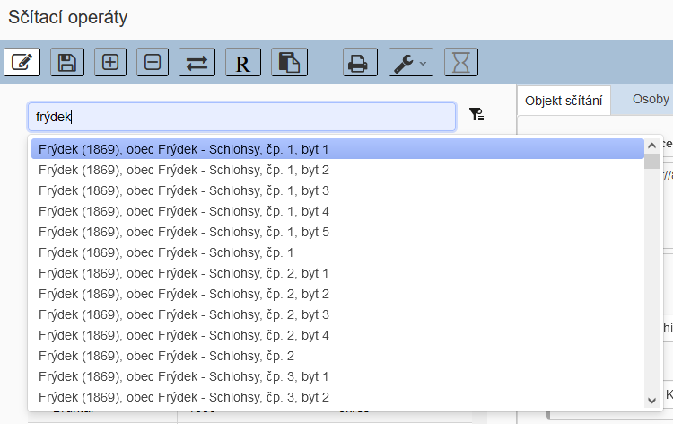 

Hledaný řetězec je kromě názvu lokality vhodné rozšířit i o rok sčítání, případně číslo domu:

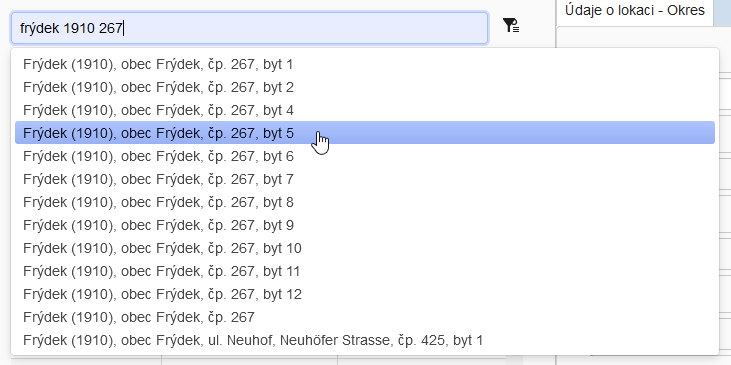 

Po kliknutí na položku z našeptávače se zobrazí konkrétní položka lokace v navigátoru.

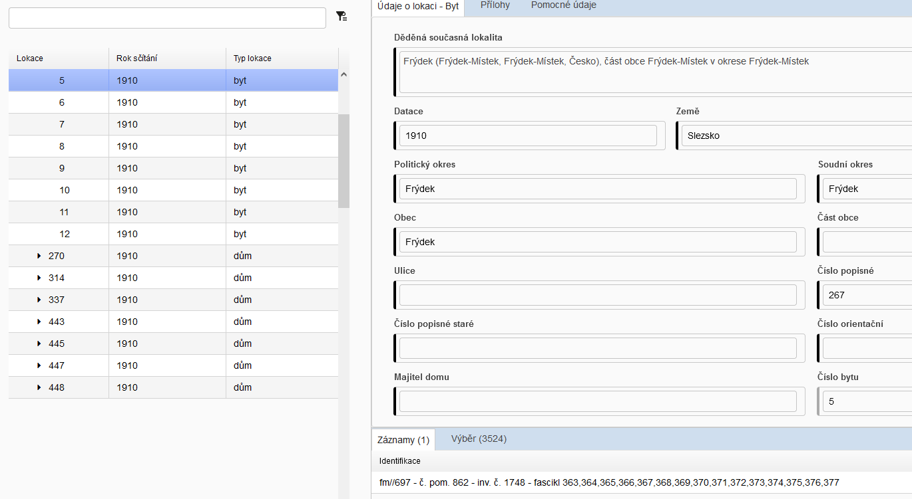 

!!! tip "Tip"

    Reset navigátoru se provádí klikem na ikonu šipky/trojhelníku u nejvyšší úrovně, tedy okresu.
    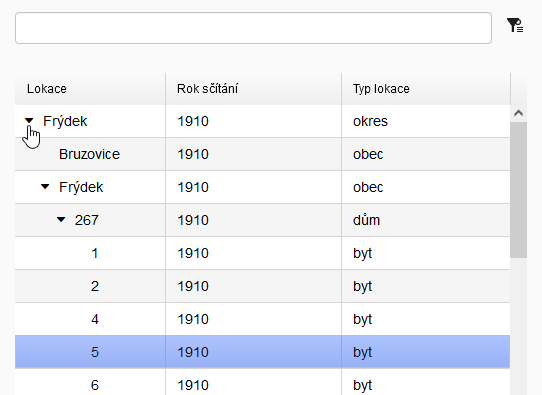 

#### 5.4.2 Výběr objektů sčítání

Hledání v objektech sčítání se provádí pomoci vyhledávacího dialogu v pravé straně nástrojové lišty:

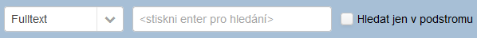 

Lze dále blíže specifikovat okruh:

| Okruh         |                                                              |
| ------------- | ------------------------------------------------------------ |
| Fulltext      | Vyhledává ve všech polích objektů sčítání. Hledaný výraz musí být vždy na začátku prohledávaného pole. |
| Příjmení osob | Vyhledává pouze v pole Příjmení v sekci Osoby. Hledání není striktní. Při vyhledání "Haj" nalezne i "Hájek", "Hajný"... Diakritika není zohledňována. Hledaný výraz ale musí být vždy na začátku příjmení. Při vyhledání "Haj" nenalezne "Zahajský" |
| Čísla popisná | Vyhledává pouze podle čísel popisných. Hledaní není striktní. Při vyhledání "2" nalezne 2, 21...29,...200, 201... Hledaná číslovka ale musí být vždy na začátku čísla popisného. Při vyhledání "2" nenalezne "12", "152"... |

Zatržením "**Hledat jen podstromu**" omezí okruh prohledávaných objektu sčítání jen na ty, které jsou součástí vnořené hierarchie aktivní/zamodřené lokace v navigátoru.

Nalezené objekty sčítání se shromáždí standardně v záložce Výběr.

Pro synchronizaci lokace (v navigátoru) s vybraným nalezeným objektem sčítání (v tabulce) se použije synchronizační funkce  z nástrojové lišty.

#### 5.4.3 Najdi / Nahraď

Funkce Najdi / Nahraď funguje nad prvky popisu objektů sčítání.

!!! warning "Upozornění"

    Pro správné fungování funkce Najdi / Nahraď musí být aplikace přepnuta do režimu editace 

**Postup:**

1. Nejprve je potřeba vybrat záznamy objektů sčítání určené k úpravě do záložky Výběr.

    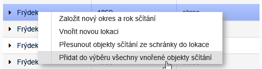

2. Pote se spustí dialog funkce Najdi / Nahraď z menu Různé funkce v hlavní nástrojové liště.

    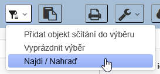

3. Nastaví se patřičné podmínky pro nalezení a nahrazení hodnot. Např. změna hodnoty pro pole Možnost zveřejnění z libovolné na "popisná data + přílohy s možností stažení":

    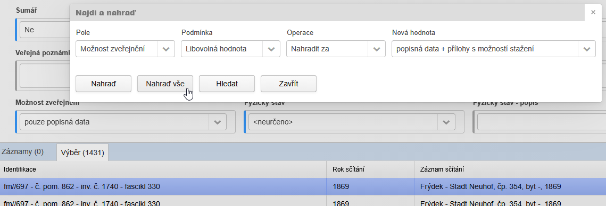

4. Po stisknutí tlačítka Nahraď vše proběhne nejprve analýza/prohledání záznamů ve Výběru, aby se zjistil počet, na který bude funkce aplikována. Poté se objeví potvrzovací okno k odsouhlasení akce. Po potvrzení (Ano) se průběh funkce zobrazuje pomocí ukazatele průběhu.

    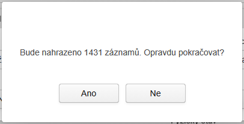

### 5.5 Práce se schránkou

Schránka slouží načtení záznamů či příloh, aby vybrané s nimi mohly pracovat vybrané funkce/operace:

1. vytváření [odkazů](manual_census.md#533-objekt-scitani-odkazy): záznam sčítacích operátů > záznam pořádací aplikace
2. [přesuny objektů sčítání](manual_census.md#56-presuny-objektu-scitani)
3. [přesuny příloh](manual_census.md#57-prace-s-prilohami) (vyjmout/vložit...)

Po provedení požadované akce, pracující se schránkou, se příslušná oblast schránky automaticky vyprázdní.

### 5.6 Přesuny objektů sčítání

Je možno přesouvat objekty sčítání mezi lokacemi. 

1. Nejprve vložíme pomocí funkce **Vložit záznamy sčítání do schránky** (viz kontextová nabídka (pravé tlačítko myši)) záznamy k určené k přesunu do schránky:

    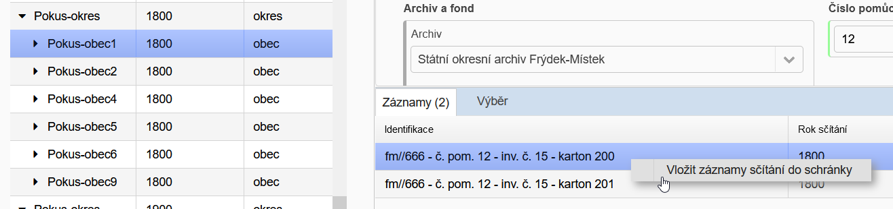

2. Poté si zobrazíme lokaci, do které chceme přesun provést, a pomocí funkce **Přesunout objekty sčítání ze schránky do lokace** (viz kontextová nabídka (pravé tlačítko myši)) přesun vyvoláme.

    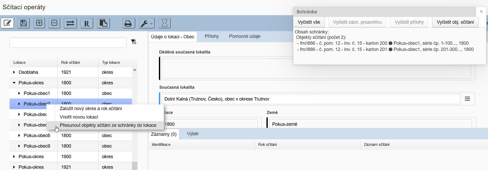

3. Po potvrzení a zahájení (start) dojde k přesunu:

    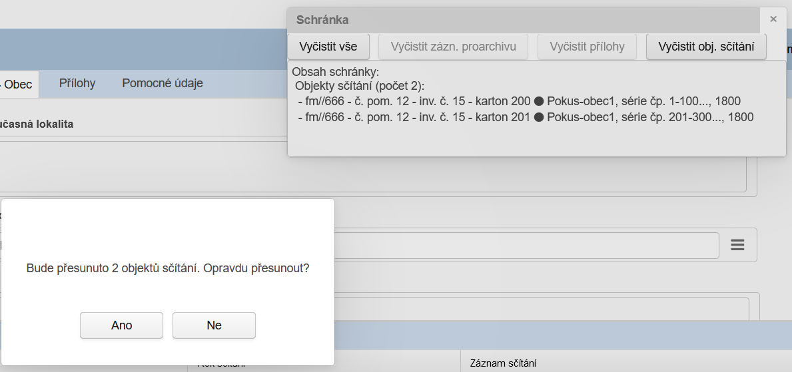

    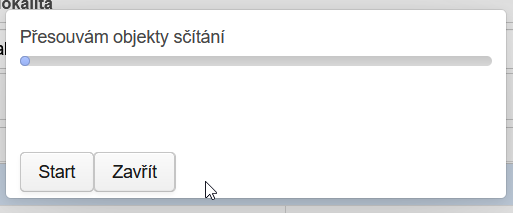

### 5.7 Práce s přílohami

Práce s přílohami je totožná jako v pořádací aplikaci. Jedinou podstatnou změnou je skutečnost, že lze používat funkci Vyjmout/Vložit... napříč záznamy. Je to potřebné pro "rozbíjení" digitalizačních sad na úrovni obce (série čísel popisných) na jednotlivé domy a byty.

Při vyjmutí příloh dochází k jejich přesunu do schránky, aby měl uživatel kontrolu, co a kam přesouvá:

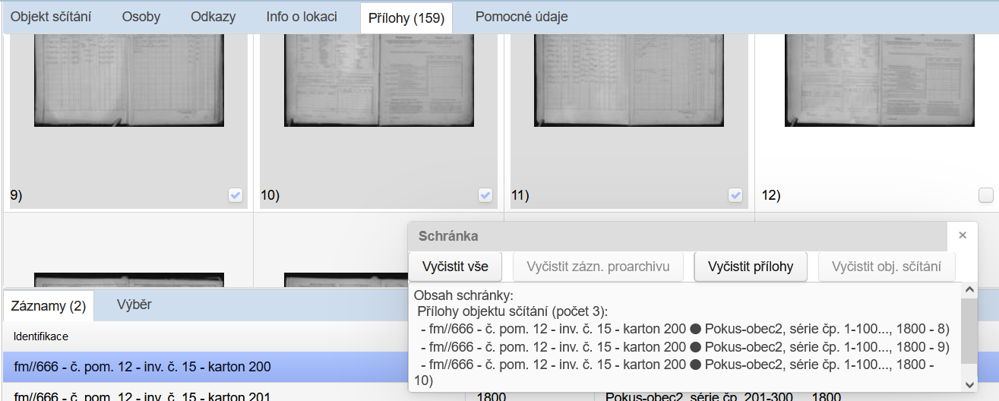

