# PROARCHIV - Přístupové body - modul pro správu přístupových bodů

***(uživatelská příručka)***

## 1 Úvod

***Uživatelská příručka k aplikaci ProArchiv17 je postupně doplňována! Neprošla jazykovou korekturou ;-)***

**[VERZE 2025-12-17]**

#### Seznam důležitých změn:

| Změny v aktuální verzi                                       | oproti verzi |
| ------------------------------------------------------------ | ------------ |
| [Návod na import souřadnic (linií i polygonů) z OpenStreetMap](attachments-ap/Ziskani_a_import_souradnic_z_OpenStreetMaps.pdf) | 2025-07-03   |
| Popis funkce [Generování doplňků](manual_modul_ap.md#5121-generovani-doplnku) | 2024-11-06   |
| Upraveno načítání fronty [Odchozí](manual_modul_ap.md#58-fronta-odchozi) | 2024-11-06   |
| Popis funkce [Vyhledání vzájemných vazeb mezi přístupovými body](manual_modul_ap.md#564-vyhledani-vzajemnych-vazeb-mezi-pristupovymi-body) | 2024-04-26   |
| [PB k nahrazení](manual_modul_ap.md#pb-k-nahrazeni)          | 2024-04-26   |
| Přidání nových stavů pro ["interní" schvalování](manual_modul_ap.md#35-stavy-pristupovych-bodu) (nepovinná funkcionalita) | 2023-08-21   |

!!! tip "Tip"

    Pokud se vám objevuje neaktualizovaná podoba stránek, proveďte pomocí Ctrl+F5 jejich opětovné načtení s vymazáním cache. 

Uživatelská příručka si klade za cíl primárně vysvětlit fungování a ovládání modulu pro správu přístupových bodů ProArchiv, nikoli vysvětlovat metodické postupy uvedené v [**Základních pravidlech pro zpracování archiválií**](../zp/index.md) (dále Pravidla) a v konkrétních metodických příručkách jednotlivých archivů (dále Metodika). Nicméně tyto dvě oblasti spolu maximálně souvisí a v mnoha pasážích tak došlo k provázání manuálu s metodikou.

Terminologie bude v této příručce i samotném aplikačním modulu oproti Pravidlům zjednodušena. [Archivní autoritní záznam](../../zp/zp_hlavni_text-06/#61-entity-a-archivni-autoritni-zaznamy) (též archivní entita; záznam archivní entity apod.) bude zjednodušeně nazýván jako [přístupový bod](../../zp/zp_hlavni_text-06/#62-archivni-autoritni-zaznamy-jako-pristupove-body) bez ohledu na to, zda opravdovým přístupovým bodem, tzn. došlo k jeho napojení na jednotku archivního popisu, či nikoli.

Pro archivní autoritní záznamy byla vytvořena národní databáze pod názvem Centrální archivní modul pro správu archivních entit (dále **IS CAM**).

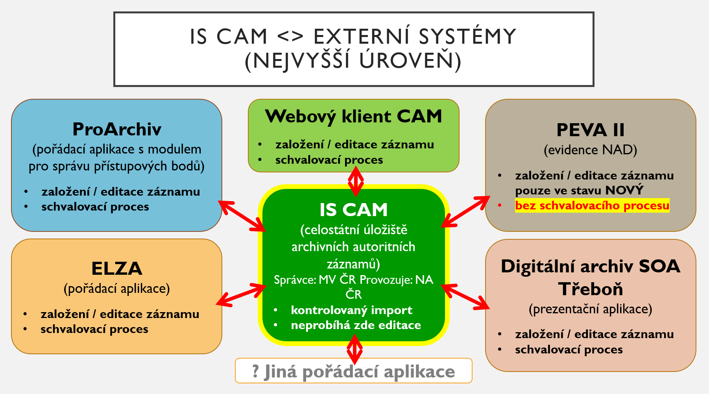

## 2 Potřeba vzniku nového modulu pro správu přístupových bodů

Z důvodu výše zmíněné existence IS CAM, jež se stal součástí Pravidel od její verze 3.0, bylo potřeba původní systém popisu přístupových bodů v pořádací aplikaci zcela změnit. Implementace IS CAM do ProArchivu byla dokončena vznikem modulu ProArchiv - Přístupové body (dále jen modul).

## 3 Základní popis modulu

Modul funguje samostatně a nezávisle na pořádací aplikaci. Je tvořen jádrem a grafickým uživatelským rozhraním. Jádro modulu s pořádací aplikaci komunikuje přes REST API rozhraní. Teoreticky může sloužit jako zdroj přístupových bodů i pro další aplikace. Grafické uživatelské rozhraní jádra modulu je nyní technicky součásti pořádací aplikace, aby byla zaručena vizuální kompatibilita. 

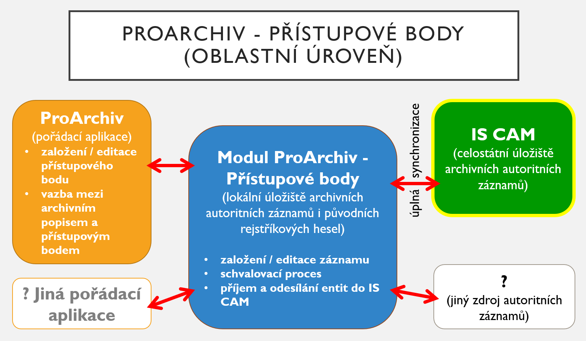

### 3.1 Struktura dat

Základní členění datových polí vychází z Pravidel. Modul je pro všechny instance pořádací aplikace totožný, neumožňuje klientskou konfiguraci zobrazení a uživatelských prvků popisu tak, jako je to umožněno v pořádací aplikaci. Tím je zaručen požadavek na kompatibilita se složitými datovými strukturami a procesy IS CAM. Struktura dat a mnohé procesy se řídí závaznou [Technickou dokumentací IS CAM](https://cam.nacr.cz/doc/) a [metodikou ke standardizaci výměnného formátu CAM](attachments-ap/Metodika_ke_standardizaci_vymenneho_formatu_CAM-VMV_2020-83.pdf). 

#### 3.1.1 Informace o záznamech mimo editační formuláře

Pro orientaci v záznamech přístupových bodech se vybrané údaje z nich „skládají“ do řádkové informace, která reprezentuje v co nejstručnější formě záznam mimo editační formulář **a zastupuje jej ve všech ostatních zobrazeních** (v našeptávačích, ve výsledcích výběrů apod.). Tato informace je tvořena obsahem stanoveného pole či vícero polí. 

V dalším textu příručky se mluví o takové zástupné interpretaci jako o "displayName“.

Pro přístupový bod jako takový se používá standardní displayName v podobě **Uživatelského označení** - tedy preferovaného označení (dále jako PREF) doplněného o stručnou charakteristiku (viz [Pravidla - 6.3.5 Označení entity - Struktura označení](../../zp/zp_hlavni_text-06/#struktura-oznaceni)). S případným ořezem po naplnění kapacity povoleného počtu znaků.

Pro účely zobrazení výsledků jednoduchého výběru se používá i speciální displayName pro zobrazení čistě variantního označení (dále jako VAR) ve formě "Jména z variantního označení (VAR pro Uživatelské označení)", např. "Otec vlasti  (VAR pro Karel IV. (císař : 1316-1378), král český a císař římský z rodu Lucemburků)".

### 3.2 Validace

Validace je v modulu pevně nastavena a neumožňuje úpravu na straně klienta tak, jak je tomu v pořádací aplikaci.

#### 3.2.1 Validace online

Zobrazuje se [stejným způsobem](manual_proarchiv.md#321-validace-online) jako v pořádací aplikaci.

#### 3.2.2 Validace celého záznamu

Jde o zásadní validaci záznamu přístupového bodu. Zobrazuje se ve speciální záložce Validace. Zobrazuje výčet chyb v popisu přístupového bodu. Tento výčet se aktualizuje vždy až po uložení záznamu!

Ve validaci celého záznamu jsou plně implementována [pravidla popisu](https://cam.nacr.cz/doc/ontology/rules/rules.html) dle technické dokumentace IS CAM. 

Změny stavů záznamů jsou závislé na vyhodnocení této validace, zvláště změna na stav "schválený" a proces odesílání do IS CAM. Detailněji bude popsáno v kapitole [Principy validace přístupového bodu](manual_modul_ap.md#59-principy-validace-pristupoveho-bodu).

### 3.3 Import a transformace existujících dat

Před spuštěním modulu dojde k importu přístupových bodů z pořádací aplikace ProArchiv do nových datových struktur modulu.

Vhledem k implementaci schvalovacího procesu a podmínek daných Pravidly budou všechny přístupové body z pořádací aplikace, které byly v kvalitě "validní", přepojeny do stavu "ke schválení" a označeny prefixem [R]. Dojde rovněž k zahození informace o typu přístupového bodu (rejstříkové heslo vs. popis původce), neboť toto již nebude v modulu rozlišováno.

U řady přístupových bodů dojde taktéž ke strojové harmonizaci s přístupovými body z IS CAM. Např. u geografických objektů na základě ztotožnění identifikátorů RÚIAN. Možnost strojové harmonizace je dána kvalitou a povahou vstupních dat a bude se u jednotlivých klientu lišit. Bude tedy třeba uplatnit individuální harmonizační strategii.

### 3.4 Synchronizace s IS CAM

Napojení modulu na IS CAM je závisle na přidělené roli dle [provozního řádu IS CAM](https://cam.nacr.cz/info/provoznirad2.html#urovne-pristupu-do-is-cam). Reálně přichází v úvahu omezená varianta s rolí CAM I (čtení záznamů z IS CAM) nebo plnohodnotná varianta s rolí CAM III (čtení a změna záznamů s IS CAM). Tento manuál prezentuje možnosti plnohodnotné varianty.

[DOPRACOVAT - ještě není implementováno] O tom, zda je konkrétní přístupový bod v aktuálním stavu synchronizován s IS CAM, podávájí informaci hodnoty v poli Synchronizace s IS CAM v Pomocných údajích.

#### 3.4.1 Princip synchronizace/přijímání entit z IS CAM do modulu

Dle nastaveného intervalu (výchozí je 5 minut) dochází k pravidelnému načítání nových/změněných záznamů archivních entit z IS CAM, a to následujícím způsobem:

| Situace                                                      | Průběh importu                                              |
| ------------------------------------------------------------ | ----------------------------------------------------------- |
| Entita ve stavu "nová" nebo "schválená", která ještě v modulu není (modul neeviduje její CAM ID) | Automatický import entity                                   |
| Nová verze entity ve stavu "nová" nebo "schválená", která již v modulu je (modul eviduje její CAM ID) a je ve stavu "schválený" nebo "nová z CAM", tzn. nedochází u ní v modulu k obsahovým změnám | Automatický import nové verze entity                        |
| Nová verze entity ve stavu "nová" nebo "schválená", která již v modulu je (modul eviduje její CAM ID) a je ve stavu "rozpracovaný" nebo "ke schválení", tzn. dochází u ní v modulu k obsahovým změnám | Nová verze čeká ve frontě Příchozí (konflikt) na rozhodnutí |
| Entita u níž došlo v IS CAM k zneplatnění nebo nahrazení, ale již v modulu je (modul eviduje její CAM ID) | Automatická změna stavu entity                              |

####  3.4.2 Princip synchronizace/zasílání entit z modulu do IS CAM

Po dokončení interního schvalovacího procesu a konečné změny stavu přístupového bodu na "schválený", je automaticky zobrazen ve frontě Odchozí.

Uživatel s rolí "operátor CAM" pomocí kontextové nabídky zvolí funkci "Odeslání PB do CAMu". Na pozadí proběhne poslední finální vyhodnocení, zda je splněna požadovaná validace a stav, a v případě bezvadného stavu dojde k odeslání do IS CAM. Poté záznam z fronty Odchozí zmizí. V případě nějakého konfliktu je operátor CAM informován a k odeslání nedojde. Konkrétní konfliktní situace viz níže.

Složité vyhodnocení navzájem propojených přístupových bodů je popsáno v popisu [fronty Odchozí](manual_modul_ap.md#58-fronta-odchozi).

### 3.5 Stavy přístupových bodů

!!! warning "Upozornění"

    V modulu je možno používat i speciální **"interní" stavy, konkrétně "interní ke schválení" a "interní schválený"**. Jejich použití je dobrovolné. Pokud má příslušná instance tyto stavy zobrazovat, musí být příslušně nakonfigurována.

Z důvodu implementace schvalovacího procesu nabývají záznamy přístupových bodů následujících stavů:

| Stav (v modulu) | Prefix | Stav (v IS CAM) | Oprávnění                  | Vysvětlení                                                   |
| ----------------- | ----------- | -------------------------- | ------------------------------------------------------------ | ------------------------------------------------------------ |
| ***původní***     | [N]      | -           | -                         | všechny nevalidní přístupové body po importu z pořádací aplikace, de facto původní, většinou nestrukturovaná rejstříková hesla; záznam v needitačním módu |
| ***rozpracovaný*** | [R]        | -           | zpracovatel\*, schvalovatel | nově založený záznam nebo záznam již dříve schváleného přístupového bodu, který prochází revizí (obsahovou změnou); **jediný stav, kdy je záznam v editačním módu** |
| ***ke schválení*** | [R]     | -           | zpracovatel\*, schvalovatel | zpracovatelem označený přístupový bod k finálnímu schválení; po importu z pořádací aplikace jsou takto označené i původní přístupové body v kvalitě "validní"; záznam v needitačním módu |
| ***interní ke schválení***\*\* | [R] | - | zpracovatel\*, schvalovatel | zpracovatelem označený přístupový bod k finálnímu schválení, který ale směřuje ke stavu **interní schválený** |
| ***nový z CAM***  | [R] | nová        | -                          | přístupový bod, který je v IS CAM ve stavu "nová" archivní entita; záznam v needitačním módu |
| ***schválený***   |    | schválená   | schvalovatel\*\*\*           | přístupový bod, který prošel schvalovacím procesem; do modulu se dostal buď importem z IS CAM nebo v modulu vznikl a prošel interním schvalovacím procesem; garantuje nejvyšší kvalitu; záznam v needitačním módu |
| ***interní schválený***\*\* | |  |  | přístupový bod, který prošel schvalovacím procesem; tento PB vznikl výhradně v modulu a prošel interním schvalovacím procesem; garantuje nejvyšší kvalitu; záznam v needitačním módu; **není určen k zaslání do IS CAM** (tzn. nezobrazuje se po schválení ve frontě Odchozí) |
| ***nahrazený*** | [X] | nahrazená | - | do tohoto stavu se může dostat pouze dříve evidovaný záznam, u kterého došlo v IS CAM k nahrazení; v modulu nelze editovat; záznamy tohoto stavu nebudou nabízeny v našeptávačích v pořádací aplikaci |
| ***neplatný*** | [X] | neplatná | - | do tohoto stavu se může dostat pouze dříve evidovaný záznam, u kterého došlo v IS CAM k zneplatnění; v modulu nelze editovat; záznamy tohoto stavu nebudou nabízeny v našeptávačích v pořádací aplikaci |

*) jako "zpracovatel" je chápán standardní uživatel s právy zápisu v pořádací aplikaci, tzn. "běžný" archivář

**) použití "interních" stavů (interní ke schválení a interní schválený) je nepovinné, jejich použití/viditelnost závisí na konkrétní instanci

***) do stavu "schválený" může přepnout schvalovatel, pokud ale není sám autorem poslední změny, tzn. není u záznamu "ke schválení" uveden v kolonce Změnil; tzv. pravidlo čtyř očí

### 3.6 Schvalovací proces

Principy a pravidla správy archivních autoritních záznamů popisují Pravidla v samostatné příloze (viz Pravidla - [Příloha č. 7 Základní pravidla správy archivních autoritních záznamů](../../zp/zp_hlavni_text-priloha07)). Modul ProArchiv - Přístupové body je plně respektuje. 

Práce v modulu je závislá na přihlášení v pořádací aplikaci ProArchiv. Zde administrátor přiděluje příslušná uživatelské oprávnění/role. Pro práci v modulu se uplatňují následující:

| Uživatelská role ProArchiv | Role dle Pravidel | Popis                                                        |
| -------------------------- | ----------------- | ------------------------------------------------------------ |
| výchozí role               | zpracovatel       | Může vytvářet nové přístupové body, upravovat stávající. Vše pak zaslat "ke schválení". |
| Schvalovatel PB            | schvalovatel      | Stejná práva jako zpracovatel + možnost schvalovat nové přístupové body nebo změny ve stávajících. |
| Operátor CAM               | -                 | Umožňuje zpracovávat frontu Odchozí (= zasílat schválené PB do IS CAM) nebo frontu Příchozí (Konflikty). Tato role musí být kumulovaná s rolí Schvalovatel PB (Operátor CAM musí být atestovaným schvalovatelem), nicméně uživatel s rolí Schvalovatel PB roli  Operátor CAM mít nemusí. |

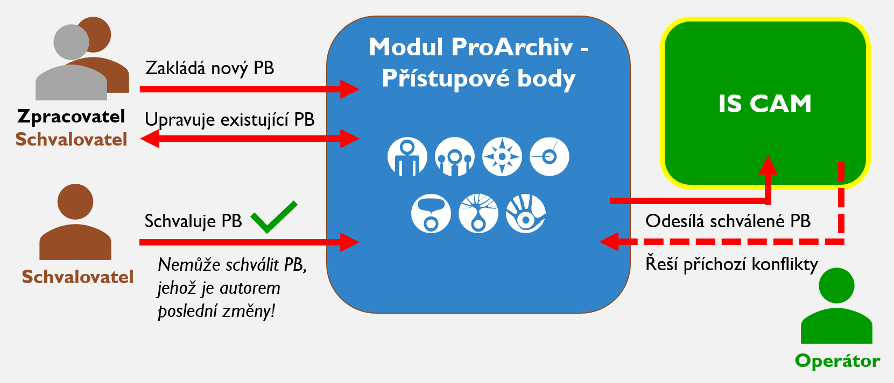

!!! warning "Upozornění"

    Schvalovací proces pro speciální **"interní" stavy** (tedy přechod z "interní ke schválení" na "interní schválený") je analogicky totožný jako standardní schvalovací proces. Interní schválený PB by měl mít stejnou kvalitu dle Pravidel, jako má PB ve stavu "schválený".

### 3.7 Návrat k poslední schválené verzi

Funkce Návrat k poslední schválené verzi umožňuje přepsat aktuální verzi PB z modulu ve stavu "rozpracovaný" nebo "ke schválení" poslední schválenou verzi (funguje i pro stav "interní schválený"). Jde o speciální funkci, která dokáže vyřešit např. tyto situace:

- uživatel přepne schválený přístupový bod omylem do stavu "rozpracovaný" - v tomto případě kontaktuje příslušného schvalovatele, aby navrátil PB do původního schváleného stavu
- schvalovatel usoudí, že uživatel nevhodně editoval původně schválený PB (editaci posunul původní význam přístupového bodu apod.)

Tuto funkci může uplatnit jen uživatel s rolí schvalovatele PB.

### 3.8 Nahrazení PB verzí z CAMu

Funkce Nahrazení PB verzí z CAMu umožňuje přepsat aktuální verzi PB z modulu aktuální schválenou verzi z IS CAM. Jde o speciální funkci, která dokáže odblokovat patové situace, jako například tuto:

Modul nemá zaimplementované tzv. [bezpečnostní profily](https://cam.nacr.cz/doc/admin/user_profiles.html). Uživatel změní prvky popisu, u kterých je uplatňován bezpečnostní profil, např. odmaže PREF u hlídaného geografického objektu. IS CAM takovou změnu při pokusu o zaslání samozřejmě nepřijme (kontrola uuid PREF označení). Modul se ale po interním schválení také nedokáže dostat k původní verzi. Aby se tato patová situace odblokovala, použije se tato speciální funkce a "natvrdo" se přepíše verze v modulu aktuální verzi z IS CAM.

Tuto funkci může uplatnit jen uživatel s rolí Administrátor.

## 4 Uživatelské rozhraní

### 4.1 Aplikační prostředí

#### 4.1.1 Přihlášení

Modul nedisponuje samostatným přihlášením. Spouští se z pořádací aplikace, ve které je již uživatel přihlášen, a to pomocí tlačítka 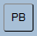 v nástrojové liště. Uživatelská oprávnění pro modul jsou rovněž přebírána z pořádací aplikace.

#### 4.1.2 Vícenásobný běh aplikace ve stejném okamžiku

Pro vícenásobný běh modulu platí [stejná pravidla](manual_proarchiv.md#42-aplikacni-prostredi) jako pro pořádací aplikaci.  

#### 4.1.3 Ergonomie zobrazení

Pro velikost zobrazení aj. v modulu platí [stejná pravidla](manual_proarchiv.md#423-ergonomie-zobrazeni) jako pro pořádací aplikaci.

#### 4.1.4 Ukládaní nových záznamů a změn

Aplikace má implementováno:

1. uživatelem řízené uložení pomocí tlačítka 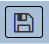 v nástrojové liště
2. automatické uložení při přechodu na jiný záznam (bez dalších otázek)

### 4.3 Základní rozdělení pracovní plochy modulu

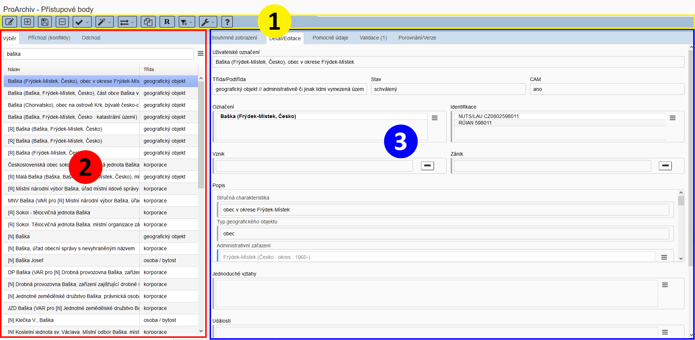

1 - [Lišta nástrojů (toolbar)](manual_modul_ap.md#44-lista-nastroju) | 2 - [Navigátor](manual_modul_ap.md#45-navigator) | 3 - [Detail](manual_modul_ap.md#46-detail)

### 4.4 Lišta nástrojů

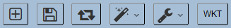 

#### 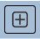 Nový přístupový bod

- Otevře formulář pro založení nového přístupového bodu

------

####  Uložení

- Pro ruční uložení změn

------

####  Změna stavu

- Otevře dialog pro změnu stavu

------

#### 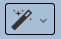 Různé funkce

- Změny
  - [Změna stavu](manual_modul_ap.md#53-zmeny-stavu)
  - [Změna podtřídy](manual_modul_ap.md#54-zmena-podtridy)
  - [Změna typu geografického objektu](manual_modul_ap.md#55-zmena-typu-geografickeho-objektu)
- [Práce s variantami](manual_modul_ap.md#5212-zkopirovani-variantniho-oznaceni-z-jineho-zaznamu)
- [Komunikace se zpracovateli](manual_modul_ap.md#5101-komunikace-mezi-schvalovatelem-a-zpracovatelem)
  - Uložení komentáře
  - Zaslání zprávy
- [Návrat k poslední schválené verzi](manual_modul_ap.md#37-navrat-k-posledni-schvalene-verzi)
- [Odstranit PB](manual_modul_ap.md#511-odstraneni-pristupoveho-bodu)
- [Nahrazení PB verzí z CAMu](manual_modul_ap.md#38-nahrazeni-pb-verzi-z-camu)
- [Hledání neplatných a nahrazených PB](manual_modul_ap.md#513-hledani-neplatnych-a-nahrazenych-pb)
- [Statistika](manual_modul_ap.md#514-statistika)
- [Test dostupnosti CAM](manual_modul_ap.md#512-test-dostupnosti-camu)

------

####  Nástroje

- Zobrazení zdroje - ukáže přesnou podobu zápisu přístupového bodu v databázi (json)

------

#### 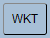 WKT editor

- Otevře v další záložce prohlížeče webovou stránku s WKT editorem

### 4.5 Navigátor

Je rozčleněn do následujících částí:

-   **Výběr** - záložka zobrazuje nástroje pro vyhledávání: jednoduchý a rozšířený výběr. Viz dále.
-   **Příchozí (konflikty)** - záložka zobrazuje frontu příchozích přístupových bodů z IS CAM, které jsou v konfliktu s lokální verzi přístupového bodu. Viz dále.
-   **Odchozí** - záložka zobrazuje frontu odchozích přístupových bodů, které jsou ve stavu "schváleno" připraveny na manuální export do IS CAM. Viz dále.

### 4.6 Detail

Zobrazení všech dostupných strukturovaných informací k zobrazenému záznamu. Princip zobrazení polí v Detailu je popsán níže.

<u>Členění Detailu:</u>

#### 4.6.1 Souhrnné zobrazení

Zobrazuje kompletní informace k přístupovému bodu v textové needitovatelné podobě

#### 4.6.2 Detail/Editace

Zobrazuje strukturované prvky popisu přístupového bodu. V této záložce probíhá samotná editace přístupového bodu. Prvky popisu jsou děleny do jednotlivých částí dle Pravidel: označení, identifikátory, vznik, zánik, popis, jednoduché vztahy a události.

#### 4.6.3 Pomocné údaje

Zobrazuje systémově generovaná data: uživatelská jména tvůrců a následných editorů přístupového bodu včetně časových značek; taktéž jednoznačný identifikátor (UUID) záznamu, CAM ID, identifikátor revize a permalink a [PB, které odkazují na tento záznam](manual_modul_ap.md#564-vyhledani-vzajemnych-vazeb-mezi-pristupovymi-body).

##### PB k nahrazení

V případě, že je zobrazen PB, který byl v IS CAM nahrazen (= stav "nahrazený"), poté je zde propagován v sekci "PB k nahrazení" i permalink PB, který jej nahradil. Tento údaj je potřebný k provedení náhrady PB ve vazbách na archivní popis, případně vzájemných vazbách mezi PB (viz funkce v pořádací aplikaci "[Nahrazení přístupového bodu za jiný](manual_proarchiv.md#5921-nahrazeni-pristupoveho-bodu-za-jiny)".

#### 4.6.4 Validace

Zobrazuje výčet chyb v popisu přístupového bodu. V záhlaví záložky se generuje i počet chyb.

#### 4.6.5 Porovnání/Verze

Zobrazuje grafické porovnání změn, a to porovnání změn mezi aktuální rozpracovanou verzí a předchozí schválenou verzí
nebo porovnání změn mezi aktuální verzí z modulu ProArchiv - Přístupové body a novou verzí z IS CAM.
Červeně jsou podbarveny odstraněné informace; žlutě informace nové.

## 5 Funkčnost - případy užití

Funkčnost aplikace je vázána na:

- logiku danou správným užitím prvků popisu dle Pravidel.
- přístupová práva, která mohou být nastavena různě. Pokud vám nebudou některé očekávané funkce fungovat, obraťte se na příslušného administrátora.

### 5.1 Vytváření nových přístupových bodů

#### 5.1.1 Ověření existence přístupového bodu

!!! warning "Upozornění"

    **Před založením nového přístupového bodu je vždy nejprve nutné provést hledání, zda již náhodou daný  přístupový bod neexistuje!** Vzhledem k tomu, že modul plně synchronizuje obsah IS CAM, dochází při interním vyhledávání k procházení všech možných zdrojů: jak lokální množiny přístupových bodu, tak i přístupových bodů z IS CAM.
    **Pokus o dohledání přístupového bodu je potřeba učinit jak před zakládáním nového v modulu, tak i při zakládaní v pořádací aplikaci (v plovoucím okně Napojené přístupové body nebo z prvků popisů napojených přístupové body jako "územní rozsah" apod.**

#### 5.1.2 Formulář pro založení nového přístupového bodu

Pro založení nového přístupového bodu slouží tlačítko  z nástrojové lišty modulu. V prostředí pořádací aplikace se pro založení používá ikona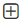z Nástrojů daného prvku popisu nebo plovoucího okna Napojené přístupové body.

Dojde k aktivaci jednoduchého formuláře, který má za cíl proces založení zjednodušit:

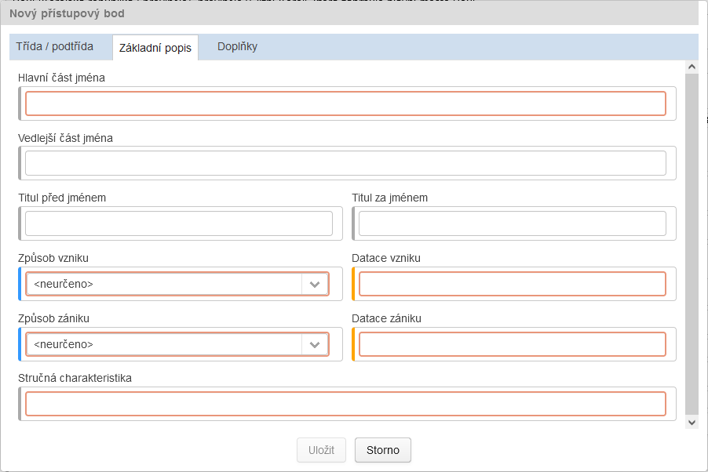

Formulář se dynamicky mění dle postupného vyplnění jednotlivých záložek: 1) třída a podtřída přístupového bodu, 2) základní popis, 3) doplňky. U mnoha prvku popisu je uplatněna validace ve formě kontroly vyplnění. Teprve pokud je vše v pořádku, aktivuje se tlačítko Uložit a přístupový bod je založen.

Nový přístupový bod je založen ve stavu "rozpracovaný". 

Jeho další editace probíhá výhradně v modulu. 

##### 5.1.2.1 Generování doplňků

Jednotlivé doplňky označení se mohou zapisovat ručně, u většiny je ale umožněno jejich generování z hodnot jiných prvků popisu. Chronologický doplněk se generuje z datačních polí, geografický u korporací ze vztahu "sídlo", u děl a výtvorů ze vztahu "umístění" apod. Toto se neděje automatizovaně, uživatel musí generování vždy vyvolat pomocí tlačítka 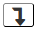.

!!! warning "Upozornění"

    Pokud se generuje doplněk ze vtahu, vždy je použit první výskyt tohoto vztahu. Viz dále [5.2.5 Editace Jednoduchých vztahů](manual_modul_ap.md#525-editace-jednoduchych-vztahu). 

### 5.2 Editace již založených přístupových bodů

Editace probíhá v záložce Detail/Editace.

Editovat lze pouze přístupový bod ve stavu "rozpracovaný".

Formulář pro editaci disponuje stejným [typem prvků popisu a jejich ovládáním](manual_proarchiv.md#61-typy-poli-a-jejich-ovladani) jako v pořádací aplikaci. Novým tlačítkem je pouze tlačítko na [generování doplňků](manual_modul_ap.md#5121-generovani-doplnku) .

Pro zjištění aktuálního stavu validity přístupového bodu je během editace potřeba záznam ručně uložit, poté dojde k aktualizaci v záložce Validace. 

Editační formulář je rozdělen do jednotlivých sekcí, které korespondují s Pravidly.

!!! tip "Tip"

    *Editační formulář nabízí uživateli vždy adekvátní nabídku prvků popisu, možných voleb/číselníkových hodnot a povolené třídy přístupových bodů při napojení ve vztazích.* 

#### 5.2.1 Editace Označení

Přístupový bod může mít vícero označení (viz [Pravidla 6.3.5](../../zp/zp_hlavni_text-06/#635-oznaceni-entity)). První (nahoře v seznamu) je preferované označení (dále PREF); je vyznačeno tučně. Označení se skládá s více dílčích prvků popisu, které se liší dle tříd.

##### 5.2.1.1. Změna preferovaného označení

Provádí se posunem na první místo v seznamu pomocí  v .

!!! warning "Upozornění"

    **Současná verze modulu nedisponuje pomocníkem pro přenesení doplňků z původního PREF do nového. Doplňky je potřeba zapsat u nového PREF ručně a u původního smazat!**

##### 5.2.1.2 Zkopírování variantního označení z jiného záznamu

Pro případy harmonizace byla vytvořena speciální funkce, která nakopíruje variantní označení z jednoho přístupového bodu (dále jako zdrojový PB) do druhého přístupového bodu (dále jako cílový PB) . Aby funkce zafungovala, musí být před její aplikací cílový PB přepnutý do stavu "rozpracovaný". Poté se postupuje následovně:

1. vybere se zdrojový PB (je zobrazen v detailu) 
2. v menu Různé funkce - Práce s variantami se aktivuje Kopírovat
3. vybere se cílový PB ve stavu "rozpracovaný" (je zobrazen v detailu)
4. v menu Různé funkce - Práce s variantami se aktivuje Vložit

Po každém provedeném cyklu kopírovat-vložit se vnitřní paměť vyprázdní. Pokud je tedy potřeba kopírovat variantní označení z jednoho zdroje do více cílů, musí se kopírovat znovu aktivovat před každým vložením.

#### 5.2.2 Editace Identifikace

V sekci Identifikace se zapisují kódované údaje/identifikátory (viz [Pravidla 6.3.12](../../zp/zp_hlavni_text-06/#6312-kodovane-udaje-identifikatory)).

!!! warning "Upozornění"

    **Pole Hodnota ověřená byla zavedená pro účely strojového importu databáze RÚIAN a států světa. Hodnoty neměňte a nových identifikátorů nezapisujte.**

#### 5.2.3 Editace Vzniku

Vznik je speciální výlučná událost v životě archivní autoritní entity. V rámci vzniku se uvádí způsob vzniku, datace vzniku, vztahy související se vznikem, případně typ vniku apod.

#### 5.2.3 Editace Zániku

Zánik je speciální výlučná událost v životě archivní autoritní entity. V rámci zániku se uvádí způsob zániku, datace zániku, vztahy související se zánikem, případně typ zániku apod.

#### 5.2.4 Editace Popisu

Do sekce Popis jsou začleněny společné prvky popisu:

##### Stručná charakteristika

Umožňuje jednořádkový zápis do 250 znaků.

##### Poznámka

Umožňuje víceřádkový popis.

##### Služební poznámka

Umožňuje víceřádkový popis.

##### Zdroje informací

Umožňuje víceřádkový popis.

##### Odkaz na zdroje informací

 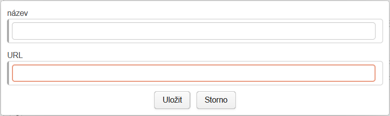

Do pole Název se zapisuje titulek odkazované webové stránky nebo dokumentu.

Do pole URL se povinně zapíše vlastní webový odkaz, např. https://... U pole je hlídaná platná syntaxe odkazu.

Speciální prvky popisu:

##### Definiční bod (souřadnice) a Hranice (souřadnice)

Slouží pro zápis souřadnic. V případě definičního bodu lze zapsat pouze jedna bodová souřadnice, u hranice lze použít všechny povolené typy: bod, linie, polygon, kolekce. Zápis souřadnic se provádí ve formátu WKT. Jak získat WKT formát? Pomocí [WKT editoru souřadnic](manual_modul_ap.md#61-wkt-editor-souradnic).

Editace se provádí výhradně přes - .

##### Poznámka k souřadnicím

Umožňuje víceřádkový popis.

##### Typ geografického objektu

Pole pouze pro čtení. Editace přístupového bodu se řeší ve vstupním formuláři (při zakládání) nebo následně přes Různé funkce - Změny - Změna typu geografického objektu.

!!! warning "Upozornění"

    **Nelze měnit typ geografického objektu u záznamu, jenž figuruje v administrativním zařazení u jiných záznamů. Je potřeba nejprve jeho použití odpojit, provést změnu typu geografického objektu a poté opět u podřízených záznamů připojit, pokud to kontrola hiearchie po změně dovolí.**

##### Administrativní zařazení

Pole pro zápis reference/napojení na jiný přístupový bod třídy "geografický objekt". Správné použitý typ geografického bodu hlídá validace.

##### Jazyk originálu

Pole pro vícenásobný zápis hodnot z číselníku jazyků.

##### Další víceřádková popisná pole

Jmenovitě: **Životopis, Dějiny, Genealogie, Popis, Genealogie, Funkce korporace, Vnitřní struktury korporace, Normy – konstitutivní, Normy - působnost korporace**.

#### 5.2.5 Editace Jednoduchých vztahů

Agregační prvek popisu pro zápis souvisejících vztahů (tzn. samostatných vztahů mimo konkrétní událost). Editace se provádí výhradně přes .

U každého vztahu se povinně vyplňuje **Typ vztahu** a **Související entita** (napojení na jiný přístupový bod). Je také možnost uvést položky **Datace vztahu od / Datace vztahu do** a **Poznámka**. Při vyplňování se postupuje dle Pravidel. Nabídka možných typů vztahů se odvíjí od zvolené třídy/podtřídy.

Pomocí  v rámci je možné jednotlivé vztahy pozicovat. Toto je důležité v případě, kdy se vztah používá pro našeptávání doplňku. Např. vztah "sídlo" u korporací slouží pro našeptání geografického doplňku. Pokud je uvedeno více sídel (vývoj v čase - datováno pomocí datace vztahu), je třeba zajistit, aby první výskyt vztahu "sídlo" v seznamu Vztahů obsahoval sídlo aktuální, ze kterého se bude doplněk našeptávat.   

#### 5.2.6 Editace Událostí

Agregační prvek popisu pro zápis událostí a s nimi souvisejících vztahů. Editace se provádí výhradně přes .

U každé události se povinně vyplňuje **Typ události**. Dále se uvádějí položky **Datace události od / do**,  **Vztahy** a **Poznámka**.

Vztahy se editují stejně jako [jednoduché vztahy](manual_modul_ap.md#525-editace-jednoduchych-vztahu).

Při vyplňování se postupuje dle Pravidel. Nabídka možných typů událostí a následných vztahů se odvíjí od zvolené třídy/podtřídy.

Pomocí  v rámci je možné jednotlivé události pozicovat. 

#### 5.2.7 Komentář

Textové pole umožňující víceřádkový popis. Pole není součástí popisné struktury dle IS CAM. Je určeno k internímu použití:

1. Zaznamenávají se zde informace z průběhu importu původních struktur přístupových bodů z pořádací aplikace do struktur použitých v modulu. Jde hlavně o přesun hodnot, které nemají v nových strukturách své jednoznačné místo a musí být následně "lidsky" vyhodnoceny a zpracovány, případně smazány.
2. Zaznamenávají se zde připomínky schvalovatele a zpětná vazba zpracovatele v rámci [schvalovacího procesu](manual_modul_ap.md#5101-komunikace-mezi-schvalovatelem-a-zpracovatelem).

##### 5.2.7 Uložení obsahu pole Komentář

!!! warning "Upozornění"

    Pole Komentář pracuje ve speciálním režimu a umožňuje editaci bez ohledu na stav přístupového bodu. **Ve stavu "rozepsaný"** lze změnu v komentáři uložit **pomocí tlačítka Uložit** v nástrojové liště. Pozor! Nedojde k automatickému uložení komentáře při opuštění záznamu pokud současně nedošlo ke změně jiného pole.
    **V ostatních needitačních stavech** (např. ke schválení, schválený) lze do Komentáře rovněž zapisovat, ale k uložení změn dojde výhradně po aktivaci příkazu z nástrojové lišty **Různé funkce - Uložení komentáře**. K automatickému uložení dojde i v případě, kdy schvalovatel použije příkaz Různé funkce - Komunikace se zpracovateli - Zaslání zprávy...

### 5.3 Změny stavů

Viz ikona  nebo Různé funkce - Změny - Změna stavu.

Nabídka stavů se odvíjí od stavu současného a od role, kterou daný uživatel v aplikaci má.

Možné přechody stavů:

| Aktuální stav |      | Možné nové stavy | Vysvětlení                                                   |
| ------------- | ---- | ---------------- | ------------------------------------------------------------ |
| původní       | >    | rozpracovaný     |                                                              |
| rozpracovaný  | >    | ke schválení     |                                                              |
| ke schválení  | >    | schválený        | Nabízí se jen uživatelům s rolí "schvalovatel".              |
| ke schválení  | >    | rozpracovaný     | Při zjištění, že záznam potřebuje ještě před schválením upravit. |
| schválený     | >    | rozpracovaný     | Při potřebě již dříve schválený záznam doplnit/obohatit/opravit (vytvořit jeho novou revizi). |
| nový z CAM    | >    | rozpracovaný     | Pokud je potřeba záznam upravit.                             |
| nový z CAM    | >    | ke schválení     | Pokud je potřeba záznam pouze schválit.                      |

Stavy "nahrazený" a "neplatný" nejdou změnit.

V případě, že vaše instance pracuje se speciálními "interními" stavy, nabízí se navíc tyto scénáře:

| Aktuální stav        |      | Možné nové stavy     | Vysvětlení                                                   |
| -------------------- | ---- | -------------------- | ------------------------------------------------------------ |
| rozpracovaný         | >    | interní ke schválení | Umožněno je v případě, že daný PB nemá CAM ID.               |
| interní ke schválení | >    | interní schválený    | Nabízí se jen uživatelům s rolí "schvalovatel".              |
| interní ke schválení | >    | rozpracovaný         | Při zjištění, že záznam potřebuje ještě před schválením upravit. |
| interní schválený    | >    | rozpracovaný         | Při potřebě již dříve schválený "interní" záznam doplnit/obohatit/opravit (vytvořit jeho novou revizi). |

### 5.4 Změna podtřídy

Viz Různé funkce - Změny - Změna podtřídy. Lze aplikovat pouze nad detailem přístupového bodu ve stavu "rozepsaný."

Slouží ke změně podtřídy přístupového bodu. V případě, že dříve použité prvky popisu, vztahy, události nebo jednotlivé číselníkové hodnoty nejsou u nové podtřídy přípustné, dojde k zaznamenání těchto informací do pole Komentář. 

U záznamů třídy "geografický objekt" se provádí změna podtřídy automaticky se [změnou typu geografického objektu](manual_modul_ap.md#55-zmena-typu-geografickeho-objektu).

!!! warning "Upozornění"

    **Změna třídy není možná!**

### 5.5 Změna typu geografického objektu

Speciální funkce pro záznamy třídy "geografický objekt". Umožňuje změnit typ geografického objektu, čímž může zároveň dojít k automatické změně podtřídy. U některých záznamů není možné změnu provést, neboť jsou chráněny speciálním bezpečnostním profilem. Jde o přístupové body z podtřídy "administrativně či jinak lidmi vymezená území", které byly importovány z RÚIANu a tvoří páteř hierarchie (administrativní zařazení)

### 5.6 Výběr

**Správné vyhledávání je základním předpokladem pro práci s přístupovými body. Pomocí vyhledání je vždy potřeba [ověřit existenci/neexistenci přístupového bodu](manual_modul_ap.md#511-overeni-existence-pristupoveho-bodu), než dojde k založení nového.** Vyhledávat lze pomocí dvou typů výběrů:

#### 5.6.1 Jednoduchý výběr

V záložce výběr jako výchozí výběrová možnost. Z rozšířeného výběru zpět na jednoduchý pomocí  - 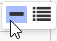

Pro základní vyhledávání ve všech přístupových bodech. **Hledá pouze v preferovaném nebo variantním označení entity, tedy bez stručné charakteristiky.**

#### 5.6.2 Rozšířený výběr

V záložce Výběr. Lze aktivovat pomocí  - 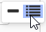vedle okna pro zápis jednoduchého výběru.

Umožňuje podrobné hledání dle tříd, podtříd, konkrétních části popisu entity (polí), dle pomocných údajů (stavu, uuid, položek Vytvořil/Vytvořeno, Změnil/Změněno, Schválil/Schváleno) apod.

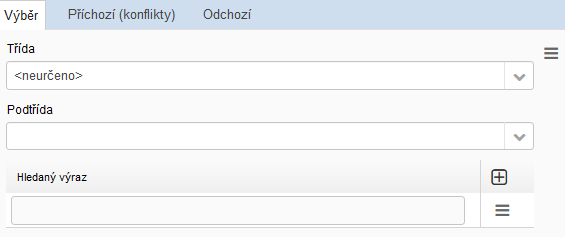

V prvním kroku lze omezit výběr konkrétní třídy, respektive podtřídy. V případě výchozí hodnoty <neurčeno> jsou prohledávány všechny třídy, respektive podtřídy.

Konkrétní podmínky pro vyhledávání se definují v sekci Hledaný výraz. Jednotlivé podmínky se přidávají pomoci . Jeden výsledný dotaz může mít více podmínek.

Konkrétní vyhledávací podmínka se zadává pomocí -  . Odstranění podmínky se provádí pomocí - .

!!! warning "Upozornění"

    Výsledný dotaz nesmí obsahovat prázdný řádek bez definované podmínky!

Jednotlivé části vyhledávací podmínky musí být vyplněny postupně:

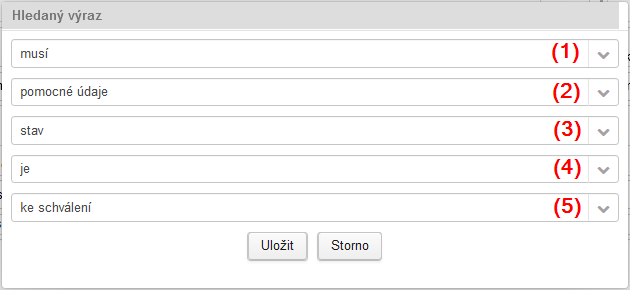

(1) <u>Základní operátor:</u> 

- ***musí*** - podmínka musí být vždy splněna

- ***může*** - podmínka může být splněna, tzn. v případě vícero zadaných podmínek neovlivní její splnění/nesplnění další zadané podmínky 

(2) <u>Výběr části přístupového bodu:</u>

| Název části přístupového bodu | Výčet možných polí                                           |
| ----------------------------- | ------------------------------------------------------------ |
| pomocné údaje                 | **uuid**, **CAM ID**, vytvořil, vytvořeno, **změnil**, **změněno**, **schválil**, **schváleno**, **stav**, **synchronizace s CAM**, komentář |
| označení                      | **hlavní část jména**, **vedlejší část jména**, titul před jménem, titul za jménem, datace použití jména od, datace použití jména do, typ formy jména, jazyk jména, pořadí události, **obecný doplněk**, **chronologický doplněk**, autor/tvůrce, **geografický doplněk** |
| identifikace                  | **zdroj identifikátoru**, platnost identifikátoru od, platnost identifikátoru do, **hodnota identifikátoru**, hodnota ověřena |
| popis                         | hranice (souřadnice), definiční bod (souřadnice), poznámka k souřadnicím, **typ geografického objektu**, **administrativní zařazení**, služební poznámka, popis, **zdroje informací**, odkaz na zdroje informací - url, odkaz na zdroje informací - název, **stručná charakteristika**, jazyk originálu, životopis, genealogie, dějiny, funkce korporace, vnitřní struktury korporace, normy - konstitutivní, normy - působnost korporace, |
| vznik                         | **způsob vzniku**, typ vzniku, **datace**, poznámka          |
| vznik.vztahy                  | datace vztahu od, datace vztahu do, **související entita**, poznámka |
| zánik                         | **způsob zániku**, typ zániku, **datace**, poznámka          |
| zánik.vztahy                  | datace vztahu od, datace vztahu do, **související entita**, poznámka |
| vztahy                        | datace vztahu od, datace vztahu do, **související entita**, poznámka |
| události                      | **typ události**, datace události od, datace události do, poznámka |
| události.vztahy               | datace vztahu od, datace vztahu do, **související entita**, poznámka |

(3) <u>Výběr možných polí:</u>

Viz výše

(4) <u>Upřesňující operátor:</u>

| Operátor      | Vysvětlení                                                   |
| ------------- | ------------------------------------------------------------ |
| obsahuje      | U textových polí jako výchozí hodnota; hledaným řetězcem musí vždy začínat celé slovo, nemusí jím ale končit. Např. řetězec "praž" najde slova "pražský", "pražské", "pražského" atd. Hledáním "raž" ale tato slova dohledána nebudou! |
| je            | Přesná striktní podmínka. Používá se vždy u číselníkových polí a u polí obsahujících konkrétní hledanou napojenou entitu. U textových polí porovnává striktně celý obsah pole. Toto funguje ale jen u jednořádkových polí. U víceřádkových polí vrací nulový výsledek (nepoužitelné). Proto se u textových polí doporučuje výhradně použití operátoru "obsahuje".  Operátor "je" je naopak jedinou možnosti při vyhledávání identifikátoru typu uuid a CAM ID |
| začíná        | Hledaným řetězcem musí vždy začínat celé pole.               |
| je vyplněno   | Vrací záznamy, kde prohledávané pole obsahuje konkrétní libovolnou hodnotu, tzn. není prázdné. |
| je nevyplněno | Vrací záznamy, kde je prohledávané pole prázdné.             |
| zahrnuje      | U polí s časovými údaji jako výchozí hodnota; hledaná hodnota musí být součásti celkového časového rozsahu prohledávaného pole. |

#### 5.6.3 Výsledky vyhledávání

**U jednoduchého výběru** jsou výsledky vyhledávání seřazeny abecedně vždy ve skupinách dle stavů záznamů v pořadí:  schválené -> nové z CAM -> ke schválení ->  rozpracované -> ostatní. V rámci těchto skupin vrací abecední seznam všech označení (PREF i VAR).

**U rozšířeného výběru** se jako výsledek vyhledávání vrací seznam PB reprezentovaných vždy jejich standardním displayName (tedy Uživatelským označením s PREF) bez ohledu na stav. To může mít za následek na první pohled nesprávně abecedně seřazený seznam výsledků hledání. Pokud je totiž hledaný výraz nalezen ve VAR označení, propaguje se do výsledku vyhledávání vždy jeho PREF označení. Řazen je tedy jako VAR, ale prezentován jako PREF.

#### 5.6.4 Vyhledání vzájemných vazeb mezi přístupovými body

Pokud je potřeba zjistit, které jiné přístupové body mají ve vztazích napojen konkrétní zobrazený přístupový bod, je možné toto zjistit v záložce Pomocné údaje - "PB, které odkazují na tento záznam".

Nejdříve je potřeba provést načtení těchto záznamů pomocí - 

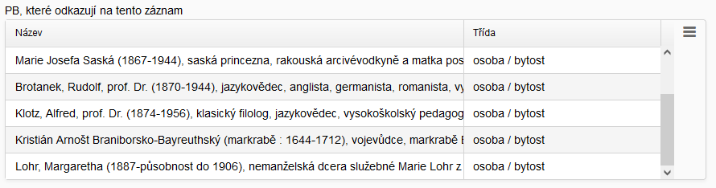

Nalezené přístupové body je pak možné pomocí  -  načíst do výběru pro další práci.

### 5.7 Fronta Příchozí (konflikty)

Zde dle nastaveného intervalu synchronizace z IS CAM zobrazují záznamy, které nemohly být do modulu automaticky aktualizovány. Jde zejména o:

| Varianta | Popis situace                                                | Možnosti řešení*                                             |
| -------- | ------------------------------------------------------------ | ------------------------------------------------------------ |
| 1        | Přístupové body, kde došlo k souběžné editaci v IS CAM a modulu - z IS CAM přichází nová revize a v modulu je buď nachystaná také nová revize nebo je původní schválený záznam stále rozpracovaný. | **Přijmout aktualizaci** - lokální verze záznamu bude plně nahrazená příchozí verzí z IS CAM; **Odmítnout aktualizaci** - verze z IS CAM bude zamítnuta a bude dovoleno zaslat do IS CAM verzi lokální. |

*) Možnosti řešení se vybírají z kontextové nabídky vyvolané nad konkrétním přístupovým bodem ve frontě.

Ve variantě 1 je konfliktní přístupový bod zobrazen jako ve frontě Příchozí (konflikt), tak ve frontě Odchozí. Při výběru tohoto záznamu z fronty Příchozí (konflikt) se v záložce Porovnání/Verze zobrazí zobrazují rozdíly mezi novou verzí z IS CAM a verzí lokální.  

### 5.8 Fronta Odchozí

Zde se budou postupně automaticky shromažďovat přístupové body určené k zaslání do IS CAM. Jde o lokální schválené přístupové body které doposud v IS CAM nejsou, nebo aktualizované schválené přístupové body, které již v IS CAM jsou a dojde tak k jejich aktualizaci.

Záznamy ve frontě Odchozí jsou řazeny dle datační hodnoty pole Schváleno a to sestupně. Nahoře jsou položky s mladší datací schválení, dole se starší.

Pomocí funkce **Odeslat PB do CAMu** vyvolané z kontextové nabídky vyvolané nad konkrétním jedním přístupovým bodem ve frontě dojde k finálnímu vyhodnocení validace a následnému zaslání do IS CAM. V případě problému je uživateli poskytnuto konkrétní hlášení. 

Ač se funkce na odeslání vyvolává u každého přístupového bodu zvlášť, může v případě [vzájemného provazbení přístupových bodů z fronty Odchozí](manual_modul_ap.md#581-vyhodnocovani-validity-propojenych-pristupovych-bodu-bez-cam-id) dojít k vícenásobnému odeslání. Aplikace před odesláním tuto možnost zkontroluje a vypíše související PB k odeslání. Mezi vypsanými je samozřejmě i ten iniciační. 

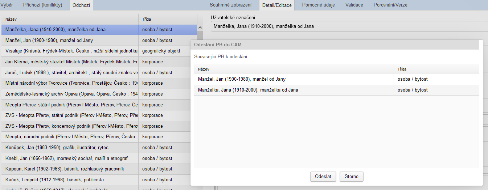

Pokud je seznam prázdný, odešle se pouze jeden iniciační přístupový bod.

!!! warning "Upozornění"

    Kvůli rychlosti se fronta Odchozí načítá vždy při jejím zobrazení. Během odesílání záznamů v ní uvedených nedochází k občerstvení fronty. Pro občerstvení seznamu Odchozí je potřeba ze záložky odejít a znovu na ní kliknout. Dříve se fronta Odchozí občerstvovalo po každém odchozím požadavku, toto ale vedlo ke zbytečným časovým prostojům. 

#### 5.8.1 Vyhodnocování validity propojených přístupových bodů bez CAM ID

Do fronty Odchozí se mohou dostat jen záznamy ve stavu "schválený", které neobsahují vazby na "neschválené" přístupové body bez CAM ID (=ty, které ještě nejsou v IS CAM). Ani vazba na "schválený" přístupový bod ale neznamená, že se záznam objeví ve frontě Odchozí. Onen napojený schválený přístupový bod totiž může obsahovat vazby na další přístupový bod, který však může být ještě ve stavu "ke schválení". Viz [validace napojených vztahů](manual_modul_ap.md#591-validace-napojenych-vztahu). Může tak existovat poměrně složitý řetězec navzájem propojených přístupových bodů, které ještě nejsou v IS CAM. 

!!! note "Systém vyhodnocování validity propojených přístupových bodů"

    Systém vyhodnocuje validitu ve vztazích napojených přístupových bodů rekurzivně. V případě, že takto propojený řetězec vztahů obsahuje nevalidní záznam, není žádný z validních záznamů řetězce připuštěn k odeslání do IS CAM. Tzn. že záznamy z navzájem propojeného řetězce se objeví ve složce Odchozí najednou, až jsou v bezvadném stavu všechny.

!!! tip "Tip"

    Pokud chce uživatel vidět všechny záznamy, které jsou schválené, ale ještě nesynchronizované s IS CAM, může si je vylistovat přes rozšířený výběr (musí: stav je schválený + musí: synchronizace s cam je ne). Pokud je počet takto nalezených záznamů vyšší než počet záznamů ve frontě Odchozí, znamená to, že existují záznamy, čekající na splnění validity v rámci propojeného řetězce. 

Z výše zmíněného popisu navzájem propojených řetězců vztahů vyplývá i fakt, že odesláním jednoho záznamu z takového řetězce dojde automaticky v rámci jedné vícenásobné dávky k odeslání všech zbylých záznamů z řetězce.

V případě, že v průběhu vícenásobné dávky dojde k chybě a dávka neodejde celá, systém zpětně vyhodnotí chyby a záznamy, které nebyly odeslané 100% nebo vůbec, a ty pak ve frontě Odchozí zůstávají.

### 5.9 Principy validace přístupového bodu

Přístupový bod je během své existence neustále validován. Mnoho úkonů je na výsledcích validace závislých.

Zobrazení stavu validačního procesu se zobrazuje v záložce Validace. K aktualizaci dochází vždy při uložení záznamu.

Ke kontrolám patří např.: 

- kontrola jedinečnosti preferovaného označení mezi všemi přístupovými body
- kontrola jedinečnosti některých typů identifikátorů
- kontrola vyplnění povinných prvků popisu nebo části entity (např. vznik a stručná charakteristika u fyzických osob, existence geografického doplňku u geografických objektů)
- kontrola správně napojené hierarchie v administrativním zařazení u geografických objektů
- kontrola stavů přístupových bodů napojených ve vztazích

#### 5.9.1 Validace napojených vztahů

Přístupový body často obsahuje ve vztazích napojené další přístupové body. Kvalita/stav těchto přístupových bodů v závislosti na změně stavu konkrétního záznamu je následující:

| Změna stavu                     | Akceptované stavy napojených PB (stav "schválený" je vždy bez problému) |
| ------------------------------- | ------------------------------------------------------------ |
| rozpracovaný > ke schválení     | U záznamu jsou akceptovány napojené přístupové body i ve stavu "rozpracovaný" a "ke schválení". |
| ke schválení > schválený        | U záznamu jsou akceptovány napojené přístupové body i ve stavu "ke schválení", které ještě nejsou v IS CAM (= nemají CAM ID). Napojené přístupové body s CAM ID mohou být i ve stavu "rozpracovaný". |
| schválený při zaslání do IS CAM | U záznamu jsou akceptovány napojené přístupové body bez CAM ID jen ve stavu "schválený". U napojených přístupových bodů s CAM ID je jejich stav irelevantní (zaslání do IS CAM neblokují). |

Nedostatky v napojených přístupových bodech se stále prezentují v záložce Validace.

V případě, že vaše instance pracuje se speciálními "interními" stavy, nabízí se navíc tyto scénáře:

| Změna stavu                         | Akceptované stavy napojených PB (stav "schválený" je vždy bez problému) |
| ----------------------------------- | ------------------------------------------------------------ |
| rozpracovaný > interní ke schválení | U záznamu jsou akceptovány napojené přístupové body i ve stavu "rozpracovaný", "ke schválení" a "interní ke schválení". |
| interní ke schválení > schválený    | U záznamu jsou akceptovány napojené přístupové body i ve stavu "ke schválení" a "interní ke schválení", které ještě nejsou v IS CAM (= nemají CAM ID). Napojené přístupové body s CAM ID mohou být i ve stavu "rozpracovaný". |

#### 5.9.2 Kontrola doplňků před schválením

Speciálním kontrolním mechanismem při přepínání ze stavu "ke schválení" > "schválený" je kontrola doplňku.

Pokud má PB "ke schválení" vyplněn doplněk, u nějž funguje našeptávač, aplikace zkontroluje, zda je vyplněný doplněk shodný s tím, který by vrátil našeptávač doplňků. Pokud je zjištěn rozdíl, objeví se schvalovateli hlášení s možným nesouladem doplňků. Schvalovatel má možnost změnu stavu odmítnout nebo přijmout.

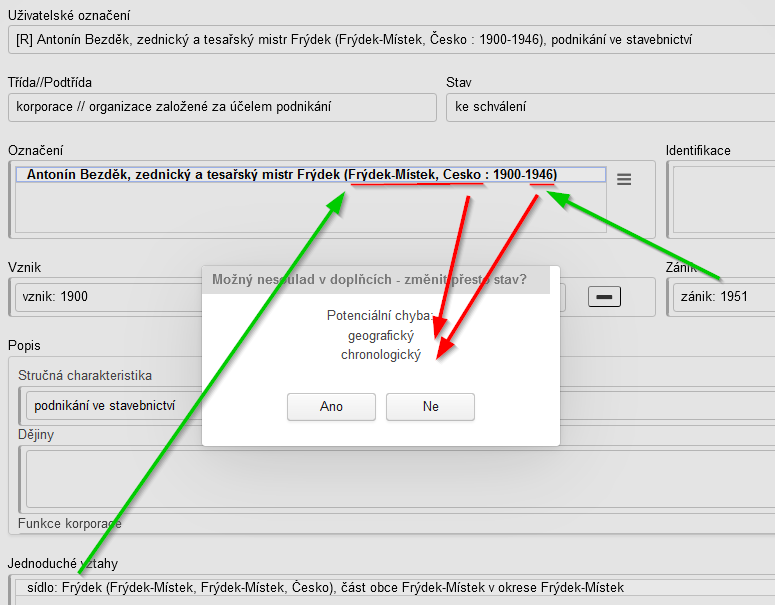

Často se totiž stává, že zpracovatel změní některý z popisných prvků, ze kterých je tvořen doplněk, ale doplněk nezaktualizuje.

!!! warning "Upozornění"

    **Pozor!** Tato funkcionalita může generovat i falešný poplach.** Např. v případě ručně dopisované otazníku u chronologických doplňků; ručně upraveného doplňku u geografických objektů (např. odstranění názvu okresu). Proto může schvalovatel změnit stav na "schválený" i přes toto hlášení.

Aplikace hlásí rovněž jakoukoli přítomnost doplňků u VAR ("VAR obsahuje doplněk"). Doplňky u VAR jsou totiž nepřípustné, pokud jsou stejné jako u PREF. Pokud je ale jeden z doplňků u VAR rozdílných, je doplněk u VAR povolen.

!!! warning "Upozornění"

    **Pozor!** Kontrolní mechanismus kontroluje jen vyplněné doplňky. Pokud zpracovatel na doplněk zcela zapomene a ponechá jej prázdný, aplikace nic nehlásí. 

### 5.10 Schvalovací proces v praxi

Uživatel uvedený jako autor poslední změny přístupového bodu (= Pomocné údaje - Změnil) nemůže provést jeho schválení.

#### 5.10.1 Komunikace mezi schvalovatelem a zpracovatelem

!!! warning "Upozornění"

    **Dostupnost zasílání emailových zpráv zpracovatelům závisí na konkretní instanci ProArchivu a zvolené správě uživatelů.**

Pokud schvalovatel usoudí, že PB zaslaný "ke schválení" je potřeba ještě dopracovat, vrátí jej zpět zpracovateli. Tento proces probíhá následovně:

1. **Schvalovatel napíše do pole Komentář své připomínky**. Následně v menu Různé funkce zvolí funkci **[Uložení komentáře](manual_modul_ap.md#527-ulozeni-obsahu-pole-komentar)**. V případě okamžitého následného použití funkce na Zaslání zprávy dojde k uložení Komentáře automaticky.
2. **Schvalovatel zašle zpracovateli email**, a to automatizovaně pomocí funkce **Zaslání zprávy zpracovateli** (viz Různé funkce - Komunikace se zpracovateli). Tento email s názvem "Potřebná úprava..." obsahuje uživatelské označení přístupového bodu, jeho permalink a obsah pole Komentář. Jako odesílatel je uveden schvalovatel a jeho emailový kontakt.  K dispozici je i varianta **Zaslání zprávy zpracovateli a schvalovateli**, která se používá na již "schválené" přístupové body u niž operátor CAM / lokální metodik před zasláním do IS CAM objeví nějakou chybu. Tato funkce zašle email jak zpracovateli, tak i schvalovateli. Předpokládá se, že požadovanou úpravu PB by měl provést primárně zpracovatel.
3. **Zpracovatel po obdržení takové emailu provede patřičné úpravy**. Pole **Komentář nemaže**, jen do něj **připíše sdělení**, že jej vypořádal. PB poté pošle znovu ke schválení (změnou stavu).
4. **Schvalovatel**, pokud je s opravou spokojen, **vymaže obsah pole Komentář a PB schválí**.

#### 5.10.2 Návrat k poslední schválené verzi

Pokud schvalovatel usoudí, že provedené změny nad dříve schváleným přístupovým bodem nejsou žádoucí, může provést **[návrat k poslední schválené verzi](manual_modul_ap.md#37-navrat-k-posledni-schvalene-verzi)** (viz stejnojmenná funkce v Různé funkce). 

Tuto funkci může aktivovat pouze uživatel s rolí schvalovatel nad přístupovými body ve stavu "rozpracovaný" a "ke schválení".

### 5.11 Odstranění přístupového bodu

Funkce Odstranění PB v menu Různé funkce slouží k odstranění záznamu přístupového bodu při splnění následujících podmínek:

- odstraňovaný PB nesmí být synchronizován s IS CAM (není v CAMu, nemá CAM ID; nesplnění podmínky = hlášení: Nelze provést pro PB synchronizované s CAM)
- odstraňovaný PB nesmí mít vazbu na jiný PB nebo archivní popis (nesplnění podmínky = hlášení: PB je použitý externí aplikací) 

### 5.12 Test dostupnosti CAMu

Test dostupnosti CAMu (viz stejnojmenná funkce v Různé funkce) slouží k zjištění dostupnosti a funkčnosti instance IS CAM.

### 5.13 Hledání neplatných a nahrazených PB

Funkce zobrazí seznam neplatných a nahrazených PB, které mají aktivní vazbu na jiné PB v systému.

### 5.14 Statistika

Funkce vypíše počty PB v modulu dle různých kritérií.

## 6 Speciální funkce

### 6.1 WKT editor souřadnic

Jde o samostatnou webovou aplikaci, která má uživatelům pomoci při získávání souřadnic v požadovaném formátu WKT.

!!! warning "Upozornění"

    **Provozovatel služeb Mapy.cz omezil přímé využívání mapových dlaždic - viz [komentář](https://napoveda.seznam.cz/forum/threads/168947/1).**

#### 6.1.1 Vytvoření souřadnic

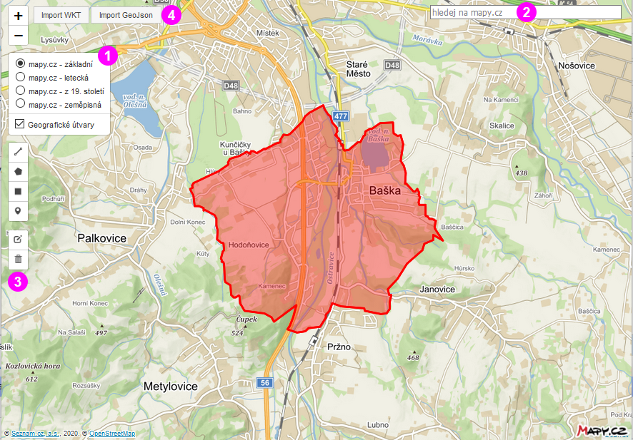

Vizuální editor umožňuje:

1 - přepínání mezi mapovými podklady

2 - vyhledávat na mapy.cz. Vybraný výsledek automaticky přidá bodovou souřadnici.

3 - ručně editovat souřadnice (viz dále)

4 - importovat souřadnice ve formátu WKT nebo GeoJson

<u>**Ruční editace souřadnic**</u>

Prvek popisu Souřadnice umožňuje uložit ***najednou více typů souřadnicových objektů***: více polygonů, více linií, kombinace bodů, linií a polygonů apod.

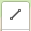 - pro vyznačení lineárního útvaru

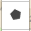 - pro vyznačení polygonu

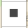 - pro vyznačení oblasti, tzn. pravoúhlého obdélníku či čtverce

 - pro vyznačení jednoho souřadnicového bodu

Další pracovní postup je řešen návodně formou bublinkových nápověd.

 - umožňuje vybraný souřadnicový objekt dodatečně editovat. Pro potvrzení změn je potřeba zvolit ve finále Uložit z lokální nabídky k dané funkci.

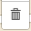 - umožňuje odstranit vybraný souřadnicový objekt (poté Uložit z lokální nabídky). Pomocí Odstranit vše je možno smazat všechny objekty najednou.

Pro potvrzení a uložení všech změn je potřeba zvolit tlačítko **Zkonvertovat do WKT**.

Následně dojde k vygenerování WKT řetězce, který bude po zakliknutí označen. Poté je možné jej pomocí obecné funkce operačního systému Kopírovat (Ctrl+C) a Vložit (Ctrl+V) do pole pro editaci souřadnic v modulu.

#### 6.1.2 Zobrazení souřadnic

Pokud je naopak potřeba již zapsané souřadnice ve WKT formátu zobrazit, je možné použít rovněž tento editor souřadnic. Z modulu pomocí obecné funkce operačního systému (Ctrl+C) zkopírujeme WKT řetězec a vložíme (Ctrl+V) pomocí tlačítka Import WKT do editoru.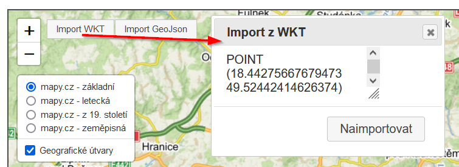 

#### 6.1.3 Úprava souřadnic

Pokud potřebujeme již dříve zapsané souřadnice poupravit, nejdříve si je přes Import WKT naimportujeme, pomocí 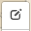 je zeditujeme a přes Zkonvertovat do WKT přepíšeme v modulu původní hodnotu.

#### 6.1.4 Získání a import souřadnic z jiných zdrojů

Souřadnice nemusí být získány jen vyhledáváním nebo "kreslením" přímo ve WKT editoru. Lze je naimportovat i z jiných zdrojů. **[Návod na import souřadnic (linií i polygonů) z OpenStreetMap](attachments-ap/Ziskani_a_import_souradnic_z_OpenStreetMaps.pdf).**
