# PROARCHIV - pořádací aplikace

***(uživatelská příručka)***

## 1 Úvod

***Uživatelská příručka k aplikaci ProArchiv17 je postupně doplňována! Neprošla jazykovou korekturou ;-)***

**[VERZE 2026-12-17]**

#### Seznam důležitých změn:

| Změny v aktuální verzi                                       | oproti verzi |
| ------------------------------------------------------------ | ------------ |
| [DOPRACOVAT] Vyhledávání v přílohách                         | 2025-12-17   |
| Speciální funkce [Vyhledej duplicitu inv. z. <> záznam TD](manual_proarchiv.md#569-vyhledej-duplicitu-inv-z-zaznam-td) | 2025-12-17   |
| [Změna možnosti zveřejnění u označených příloh](manual_proarchiv.md#zmena-moznosti-zverejneni-u-oznacenych-priloh) | 2025-12-17   |
| [Kontrola neveřejných jednotek popisu](manual_proarchiv.md#5104-kontrola-neverejnych-jednotek-popisu) | 2025-07-03   |
| [Sloučit s vnořeným záznamem - nad výběrem](manual_proarchiv.md#51621-sloucit-s-vnorenym-zaznamem-nad-vyberem) | 2025-07-03   |
| Export - [EAD3](manual_proarchiv.md#5183-ead3)               | 2025-07-03   |
| Statistiky - [Výroční zpráva](manual_proarchiv.md#5261-vyrocni-zprava) pro OASSS | 2025-07-03   |
| [Import z CSV - Aktualizace](manual_proarchiv.md#5221-import-z-csv-aktualizace) - aktualizace již zaspaných záznamů pomocí csv | 2025-07-03   |
| [Rozpoznání textu příloh](manual_proarchiv.md#5127-rozpoznani-textu-priloh) - nestandardní funkce, funguje jen ve spolupráci se ScribbleSense | 2024-11-06   |
| [Zobrazit pomůcku ve stromovém pohledu](manual_proarchiv.md#5165-zobrazit-pomucku-ve-stromovem-pohledu) | 2024-11-06   |
| [Přečíslování manipulačních čísel v hierarchii](manual_proarchiv.md#5193-precislovani-manipulacnich-cisel-v-hierarchii) | 2024-11-06   |
| [Import příloh dle csv](manual_proarchiv.md#5125-import-priloh-dle-csv) | 2024-11-06   |
| Změny v režimu [Možnost zveřejnění](manual_proarchiv.md#643-moznost-zverejneni) | 2023-12-05   |
| [Vyhledání použití neplatných/nahrazených PB](manual_proarchiv.md#5922-vyhledani-pouziti-neplatnychnahrazenych-pb) |              |
| Popis funkcí pro práci s přílohami: [Hromadné připojení příloh (napříč záznamy)](manual_proarchiv.md#5123-hromadne-pripojeni-priloh-napric-zaznamy) / [Hromadný import příloh z adresářů](manual_proarchiv.md#5124-hromadny-import-priloh-z-adresaru) |              |
| Popis funkce [Sjednocení číselníkových hodnot](manual_proarchiv.md#6121-sjednoceni-ciselnikovych-hodnot) |              |

!!! tip "Tip"

    Pokud se vám objevuje neaktualizovaná podoba stránek, proveďte pomocí Ctrl+F5 jejich opětovné načtení s vymazáním cache. 

Uživatelská příručka si klade za cíl primárně vysvětlit fungování a ovládání pořádací aplikace ProArchiv17, nikoli vysvětlovat metodické postupy uvedené v [**Základních pravidlech pro zpracování archiválií**](../zp/index.md) [^1] (dále Pravidla) a v konkrétních metodických příručkách jednotlivých archivů (dále Metodika). Nicméně tyto dvě oblasti spolu maximálně souvisí a v mnoha pasážích tak došlo k provázání manuálu s metodikou.

## 2 Potřeba vzniku nové pořádací aplikace

Aplikace **ProArchiv17** si klade za cíl praktickou implementaci nových Pravidel, jejichž požadavky se aplikace snaží zohlednit. 

### 2.1 Číselníky jako osvědčená cesta k unifikaci zápisu

V dřívějších aplikacích se plně osvědčilo zavedení číselníků, které prospěly k jednotnosti zápisu a zároveň omezily jeho chybovost. Optimalizované číselníky jsou integrovány i do aplikace ProArchiv17. Většinu číselníků tak nemůže měnit sám uživatel a jsou dostupné napříč archivními soubory a pomůckami.

### 2.2 Sjednocení rejstříků - přístupové body 

Dříve si každá archivní pomůcka k archivnímu fondu či sbírce s sebou nesla svá rejstříková hesla. Tato aplikace počítá s jediným zdrojem rejstříkových hesel (archivních autoritních záznamů - přístupových bodů). Archivní autoritní záznamy se budou připojovat k jednotce popisu vždy pod konkrétní **rolí**, čímž se stanou přístupovým bodem. Role jsou stanoveny pevně Pravidly či Metodikou a nelze je libovolně tvořit nebo měnit.[^2]

!!! warning "Upozornění"

    Dále v manuálu se bude používat pro všechny "archivní autoritní záznamy" zjednodušeně označení "přístupové body".

### 2.3 Repository a práce s přílohami

Všechny obrazové i jiné přílohy jsou ihned při pořádání kopírovány do repository. Je umožněn popis na úrovni jednotlivých příloh a jemnější nastavení pravidel publikace.

## 3 Základní principy / model fungování aplikace ProArchiv17

### 3.1 Struktura dat

#### 3.1.1 Datová pole (prvky popisu) vycházející z Pravidel

Základní členění dat vychází z Pravidel, ve kterých jsou definovány čtyři úrovně popisu: **Archivní soubor, Série, Složka** a **Jednotlivost.** [[odkaz: Pravidla, kapitola 3.3](../../zp/zp_hlavni_text-03/#33-urovne-popisu)]

Na všech úrovních popisu lze uplatnit univerzální prvky popisu, tak jak jsou popsány ve 4. kapitole Pravidel [[odkaz: Pravidla, kapitola 4](../../zp/zp_hlavni_text-04)]. **Složek** **a** **jednotlivostí** se týkají dále prvky rozšířeného popisu viz 5. kapitola Pravidel [[odkaz: Pravidla, kapitola 5](../../zp/zp_hlavni_text-05)]. Jednotlivé úrovně lze do sebe vnořovat v pořadí, v jakém jsou uvedeny. Série se dají dále dělit na série nižších úrovní, složky se dají dále dělit na podsložky a jednotlivosti na **části jednotlivostí**.

#### 3.1.2 Datová pole (prvky popisu) specifická pro konkrétní archiv

Tam, kde jsou stávající data popsána s větší podrobností, než jakou určují Pravidla, je toto jemnější členění zachováno tak, aby nedošlo ke ztrátě informace. Pro budoucí potřeby exportu do výměnných formátů (např. EAD3) budou tato pole namapována do odpovídajících, obecnějších polí podle Pravidel.

Možnost nadefinovat si vlastní pole nad rámec Pravidel umožnuje archivu prohloubit popis ve strukturované podobě, což nese pozitiva při prezentaci, vyhledávání (indexaci) a hlavně sjednocování popisu.

!!! note "Možnost přizpůsobení"

    Přidávání datových polí specifických pro konkrétní archiv se řeší programátorskou cestou (definicemi). Každý archiv si tedy může stanovit svůj seznam těchto polí podle svých potřeb, podle svých požadavků na rozšířený popis.

#### 3.1.3 Úrovně popisu v aplikaci ProArchiv

Úrovně popisu vycházejí z Pravidel. Z praktického hlediska došlo k několika rozšířením. Všechny úrovně popisu musejí být v souladu s [principy víceúrovňového popisu](manual_proarchiv.md#317-zakladni-principy-viceurovnoveho-popisu), tzn.: **musejí splňovat požadavky hierarchické integrity**.

##### 3.1.3.1  Archivní soubor

Nejvyšší úroveň popisu definovaná v Pravidlech [[odkaz: Pravidla, kapitola 3.3.1](../../zp/zp_hlavni_text-03/#331-archivni-soubor)]. **Seznam archivních souborů se bude čerpat výhradně z evidence NAD** (z programu PEvA). Aktualizace budou probíhat periodicky. Data vzniklá importem z PEvA budou jen pro čtení. Případné změny se musí provést v programu PEvA. 

##### 3.1.3.2  Série typu pomůcka

Aby bylo možno prezentovat vícero původních pomůcek k jednomu archivnímu souboru, aplikace pro kořenový uzel pomůcky definuje speciální úroveň - **sérii typu pomůcka**. Toto platí vždy, i v případě, že archivní soubor má pouze jednu pomůcku. 

Plné respektovaní hierarchické úrovně archivních souborů umožní některé pomůcky zařadit i na úroveň nižších sérií nadřazené pomůcky. Např. katalogy prezidiálních spisů v rámci inventáře celého úřadu apod. Série typu pomůcka tak půjde založit jak přímo pod archivním souborem, tak pod libovolnou sérií.

##### 3.1.3.3  Speciální série NEZAŘAZENÉ 

Pod úrovní příslušného archivního souboru bude existovat speciální úroveň **NEZAŘAZENÉ**, ve které budou umístěny oficiálně nezpracované archiválie z tematických databází, které nebyly doposud při pořádacích pracích zapracovány do hierarchie archivního souboru (do pomůcky = do některé ze sérií typu pomůcka).

##### 3.1.3.4  Série

Úroveň popisu definovaná v Pravidlech [[odkaz: Pravidla, kapitola 3.3.2](../../zp/zp_hlavni_text-03/#332-serie)]. První sérii lze založit pouze pod sérii typu pomůcka.

!!! warning "Upozornění"

    **Není dovoleno na jedné úrovni míchat série se složkami/jednotlivostmi.** Aplikace toto vyhodnotí jako chybu při validaci/autorizaci pomůcky. Pokud je dle úvahy zpracovatele vzhledem k rozsahu či jinému kritériu ze složek vhodné vytvořit série, je nutné totéž udělat pro všechny složky/jednotlivosti v dané sérii tak, aby nenastala situace, kdy složka (nebo jednotlivost) je na stejné úrovni jako série.

**<u>Špatně:</u>** Série 1 obsahuje jak (pod)sérii 1.1, tak složky a jednotlivosti.
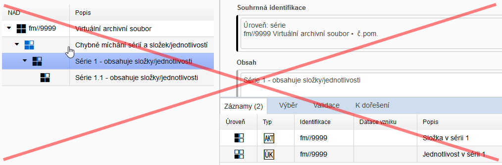

**<u>Správně:</u>** Série 1 obsahuje jen (pod)série 1.1 a 1.2, žádné složky ani jednotlivosti. Teprve až tyto (pod)série již složky a jednotlivosti obsahují.

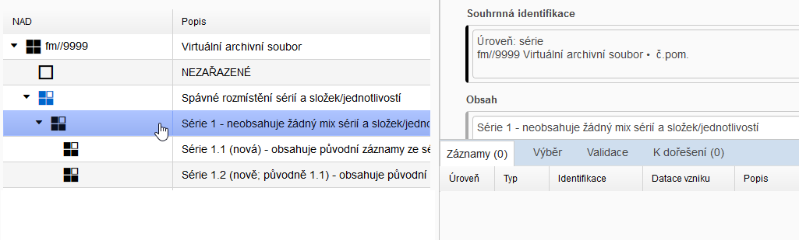

##### 3.1.3.5  Složka

Úroveň popisu definovaná v Pravidlech [[odkaz: Pravidla, kapitola 3.3.3](../../zp/zp_hlavni_text-03/#333-slozka)].

Pravidla umožňují za určitých podmínek složky vnořovat do složek, případně do složek vnořovat jednotlivosti. 

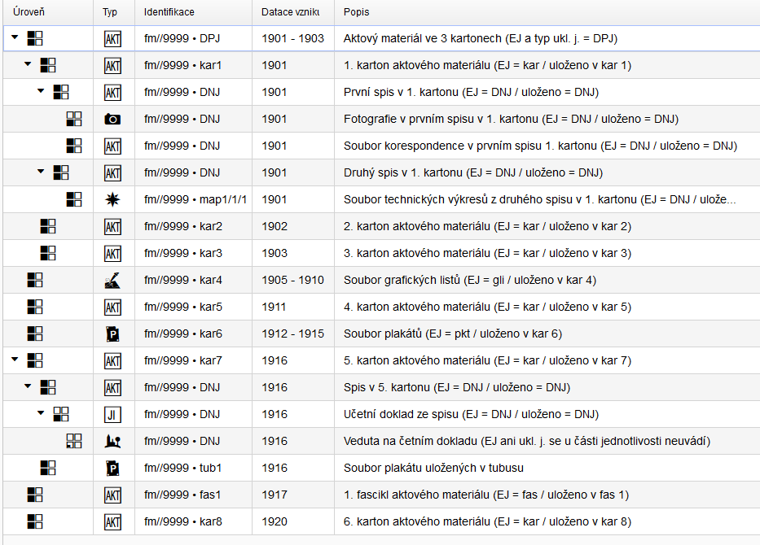

Výše zobrazený příklad ukazuje poměrně složitý rozpad jednotek popisu. U každé jednotky popisu úrovně složka či jednotlivost se vyplňuje vždy [evidenční jednotka](manual_proarchiv.md#6381-evidencni-jednotka-pocet) (dále EJ) a [ukládací jednotka](manual_proarchiv.md#639-ukladaci-jednotka) - tyto dva prvky je nutné odlišovat. Systém vždy hlídá, aby v jedné dílčí hierarchii byl druh evidenční jednotky uveden pouze jednou. 

**<u>Rozpad složky s definovanou skutečnou evidenční jednotkou</u>**

Pokud je do složky s definovanou skutečnou EJ vnořena další podsložka či jednotlivost, aplikace sama vyhodnotí (po uložení) její klasifikaci EJ jako "definováno v nadřazené jednotce popisu" - viz [dědičnost údaje o evidenční jednotce](manual_proarchiv.md#6384-dedicnost-udaje-o-evidencni-jednotce). 

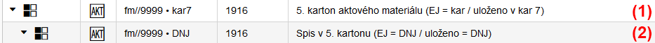

U položky (1) je zápis EJ a ukl. j. následující:

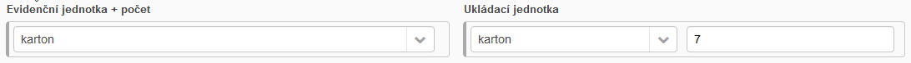

U položky (2) pak:

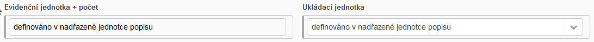

Položku "Evidenční jednotka + počet" zde uživatel nemá možnost změnit - aplikace tak hlídá dědičnost EJ.

Přiklad vnořování složek:

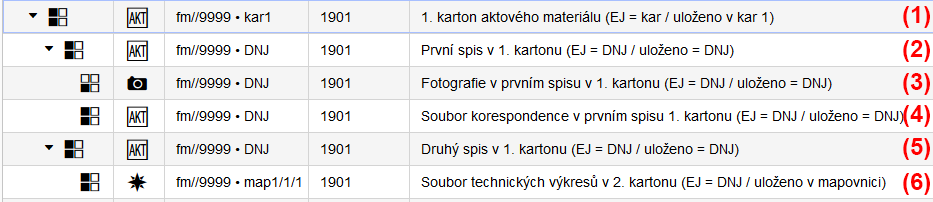

Zde je agenda jednoho kartonu (1) rozepsaná na jednotlivé spisy (2 a 5). První spis se dělí dále na jednotlivost podkategorie "fotografie" (3) a podsložku korespondence (4); v druhém spisu je zachycen soubor technických výkresů jako složka podkategorie "technický výkres" (6).

**<u>Složka jako "obal" pro složky s definovanou skutečnou evidenční jednotkou</u>**

Někdy může nastat situace, kdy je konkrétní dílčí agenda uložena ve více ukládacích jednotkách; ty musíme vždy rozepsat samostatnými záznamy. Pak vypadá hierarchie následovně:

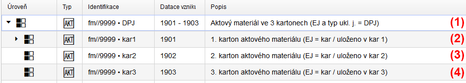

Položka (1) tvoří nejvýše postavenou složku. Zde se popíše vše, co je společné pro vnořené tři kartony. Na této úrovní by však bylo nesmyslné definovat EJ, použije se tedy hodnota "definováno v podřízených jednotkách popisu"; stejně tak u ukládací jednotky se se neuvádí jejich rozsah:

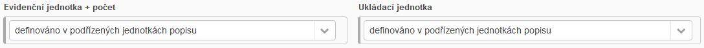

Položky (2,3,4) již prezentují skutečné kartony. Zde se teprve definují EJ a ukládací jednotky. Např. u položky (2):

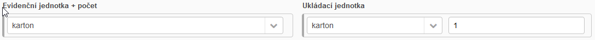

Stejným způsobem by byl řešen i komplikovaný příklad z Pravidel - viz [poznámka pod čarou 13](../../zp/zp_hlavni_text-03/#fn:13). 

!!! tip "Tip"

    U další množstevní EJ "fascikl" je princip použití totožný jako u "kartonu". 

##### 3.1.3.6  Složka manipulačního seznamu

Úroveň popisu definovaná v Pravidlech [[odkaz: Pravidla, kapitola 3.3.3](../../zp/zp_hlavni_text-03/#333-slozka) a [odkaz: Pravidla, kapitola 3.4.1](../../zp/zp_hlavni_text-03/#341-manipulacni-seznam)].

Pouze v manipulačním seznamu může složka obsahovat ***více druhů evidenčních jednotek***. Popis takovéto složky nelze dále prohlubovat. 

##### 3.1.3.7  Jednotlivost

Úroveň popisu definovaná v Pravidlech [[odkaz: Pravidla, kapitola 3.3.4](../../zp/zp_hlavni_text-03/#334-jednotlivost)].

##### 3.1.3.8 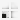 Část jednotlivosti

Úroveň popisu definovaná v Pravidlech [[odkaz: Pravidla, kapitola 3.3.4](../../zp/zp_hlavni_text-03/#334-jednotlivost)]. Pro popis se používají formuláře obdobně jako v případě jednotlivosti.

#### 3.1.4 Kategorie a podkategorie záznamů

**Pravidla** aplikují prvky rozšířeného popisu na základě typu archiválií (diplomatických kategorií, věcných a fyzických podobností aj.), příp. druhu EJ apod. Každý záznam o jednotce popisu na úrovni **složka** nebo **jednotlivost** již přímo popisuje konkrétní archiválie, kde je potřeba jednotlivé typy archiválii odlišit. Kvůli množstevním evidenčním jednotkám nelze typologii určovat na základě druhu evidenčních jednotek. Proto jsou pro odpovídající členění zavedeny **kategorie** a **podkategorie**. **<u>Každá složka či jednotlivost (část jednotlivosti) spadá vždy do určité kategorie a v případě potřeby dále do podkategorie.</u>** Díky kategorizaci všech jednotek popisu na úrovni složka a jednotlivost je umožněno nabízet vždy ty prvky rozšířeného popisu, které jsou pro daný typ archiválie relevantní. Blíže viz Metodika. Kategorie záznamů tak budou zejména respektovat požadavky na popis dle kapitol 5.3 až 5.23 Pravidel = okruhu rozšířeného popisu [[odkaz: Pravidla, kapitola 5.3](../../zp/zp_hlavni_text-05/#53-listiny-do-roku-1850-a-po-roce-1850)] a Metodiky. 

!!! warning "Upozornění"

    **Při určování kategorie/podkategorie záznamů se musí brát jako hlavní kritérium typové rozlišení archiválie (věcná a fyzická podobnost) NIKOLI vymezení evidenční jednotky!** Např. záznam kategorie/podkategorie, která popisuje fotografické archiválie, může být vymezen jednak jako EJ "fotografie na papírové podložce" (není součástí aktového materiálu), tak i jako EJ "karton" (pokud je součástí aktového materiálu).  

!!! note "Možnost přizpůsobení"

    Definování kategorií je pro použití aplikace klíčové, přičemž ale jejich seznam je pro danou instanci aplikace možno programátorsky změnit. Každý archiv si může stanovit svůj seznam kategorií podle svých potřeb, podle svých požadavků na rozšířený popis. Minimální potřebný seznam kategorií (podkategorií) je roven okruhu rozšířeného popisu (kapitol 5.3 až 5.23 Pravidel), tzn. minimálně 21.  

!!! tip "Tip"

    Správné určení kategorií je klíčové pro následnou prezentaci v Digitálním archivu ZAO / VadeMeCu. 

#### 3.1.5 Vztah pomůcek (archivních souborů) a tematických databází - režimy zobrazení

!!! warning "Upozornění"

    Tato kapitola je určena archivům, které ve svých dřívějších pořádacích systémech zapisovaly zvlášť archivní pomůcky a zvlášť katalogizovaly vybrané typy archiválií v tzv. tematických databázích.   

Tato aplikace odstraňuje „dvojkolejnost“ při práci na archivních pomůckách a na záznamech tematických databází. Každá jednotka popisu na úrovni složka či jednotlivost včetně jejich případných vnoření patří do určité kategorie a popř. podkategorie. Díky tomu jsou určité záznamy zařaditelné do odpovídající tematické databáze (v případě že zvolená kategorie je zároveň tematickou databázi). Výhoda spočívá v tom, že takováto **jednotka popisu existuje pouze jednou, jen je pokaždé zařazena do jiné hierarchie, tzn. je prezentována v jiném režimu zobrazení**. Jednou z hlediska svého zařazení do archivní pomůcky = **<u>režim zobrazení Archivní soubory</u>**, podruhé optikou tematické databáze = **<u>režim zobrazení Tematické databáze</u>**. Případné úpravy jednotky popisu se promítnou bez ohledu na to, v jakém režimu zobrazení byly vykonány. Počítá se samozřejmě i s možností vzniku jednotek popisu ze strany tematických databází. V tomto případě bude třeba před vznikem jednotky určit, ke kterému archivnímu souboru identifikovanému jednoznačně číslem **NAD** jednotka patří.

!!! summary "Důležité"

    **Zobrazení "[v režimu Archivní soubory](manual_proarchiv.md#45-navigator)" bude vždy primární a bude mít „rozhodující slovo“ v oblastech hierarchie popisu, validace aj.**


#### 3.1.6 Rozdělení datových entit

##### 3.1.6.1 Samostatné entity

Samostatnou entitou se rozumí taková entita, která má význam sama o sobě (je informačně "samonosná"), i bez vztahu k jiným entitám, zejména záznam o jednotce popisu, přístupový bod, hodnota v číselníku. Obsahuje **atributy**, jež můžou být **textové, číselné, nesoucí časovou informaci (prvky popisu) a také reference na jiné entity (vazby)**. V následujícím textu budou všechny tyto popisné entity označovány souhrnně jako "záznamy". 

##### 3.1.6.2 Funkce entit (role)

V předchozím odstavci je uvedeno, že entity mohou mít navzájem vztah. Výčet možných vztahů je založen jednak na samotných Pravidlech, dále pak vyplývá z Metodiky a také se předpokládá, že bude umožněno přidávat uživatelsky (s patřičným oprávněním) vztahy nové. Příkladem užití vztahu je vazba na přístupové body, kdy se mohou různé záznamy o jednotkách popisu odkazovat na tentýž přístupový bod. Např. osoba vystupuje jednou v roli „autor“, podruhé jako „autor výtvarné předlohy“ atd.

##### 3.1.6.3 Hodnoty číselníků

Hodnoty číselníků budou existovat a vznikat také jako entity, s tím rozdílem, že jejich smysl je pouze ve vztahu k jiným záznamům. Jednotlivé číselníky budou centrálně spravovány v rámci sekce **Pomocných evidencí**. Jejich změnu nebo rozšíření bude moci provést pouze administrátor po domluvě s garantem příslušné kategorie. Některá číselníková pole budou mít různé hodnoty v závislosti na použité kategorii - např. hodnoty číselníku „technika záznamu“ pro fotografie a grafické listy se výrazně liší.

##### 3.1.6.4 Výčtové hodnoty zabudované napevno v aplikaci

Na některé typy hodnot se úzce váže aplikační logika, a proto není možné povolit jejich modifikaci uživatelem ani administrátorem. Jsou to např. pravidla publikace (Stav pomůcky, Možnost zveřejnění) nebo seznam kategorií a podkategorií.

#### 3.1.7 Základní principy víceúrovňového popisu

V aplikaci ProArchiv jsou plně uplatněny princip víceúrovňového popisu dle kapitoly 3.2 Pravidel [[odkaz: Pravidla, kapitola 3.2](../../zp/zp_hlavni_text-03/#32-zakladni-principy-viceurovnoveho-popisu)].[^3] 

Pro průběžnou kontrolu hierarchické integrity rozepsané pomůcky slouží funkce [Validovat hierarchii](manual_proarchiv.md#5102-validovat-hierarchii).

##### 3.1.7.1 Dědičnost přiřazení k Archivnímu souboru a Pomůcce

!!! warning "Důležité"

    Určení archivního souboru je zcela zásadní pro zařazení všech záznamů o jednotkách popisu popisujících archiválie. Záznam o jednotce popisu na úrovni **"archivní soubor"** se v aplikaci nezakládá, je přejímán z evidence NAD (z programu PEvA). Údaj o příslušnosti podřízeného záznamu k archivnímu souboru je děděn, respektive je vždy automaticky dohledán v příslušné úrovni "archivní soubor".
    Podobně se chová i série typu **pomůcka**. Všechny v ní obsažené záznamy dědí informaci o své příslušnosti do této pomůcky (číslo pomůcky).

Z výše zmíněného vyplývá, že záznam na úrovní série, složky, jednotlivosti a části jednotlivosti samostatně informaci o archivním souboru a pomůcce neobsahuje. Na tento fakt je třeba pamatovat např. při [vyhledávání](manual_proarchiv.md#565-vicenasobny-vyber) (viz použití logického operátoru a příklad č. 2).

##### 3.1.7.2 Dědičnost dle standardu EAD3

V rámci standardu "EAD3 - český profil pro archivní pomůcky" jsou definovány prvky popisu, u kterých se explicitně vyjadřuje dědičnost:

| Prvek popisu EAD3               | Implementace v ProArchiv                                     |
| ------------------------------- | ------------------------------------------------------------ |
| Datace vzniku jednotky popisu   | Vizuálně se nedědí. Propsání do nižších úrovní musí být zajištěno exportním mechanismem pro EAD3. |
| Odkaz na původce                | Prvek popisu Původce aplikovaný v detailu popisného formuláře většinou na úrovní archivní soubor a série typu pomůcka zůstává zachován a slouží stejnému účelu jako nyní (tisk úvodu). Nedědí se níže. U role "původce" v plovoucím okně Napojené přístupové body je vizuální dědičnost zajištěna stejně jako u ostatních rolí - viz [Okno Napojené přístupové body - nová verze](manual_proarchiv.md#okno-napojene-pristupove-body-nova-verze). |
| Jazyk                           | Vizuálně se nedědí. Propsání do nižších úrovní musí být zajištěno exportním mechanismem pro EAD3. Pozn.: Prvek popisu Jazyk archiválií v pomůcce (uplatněný na sérii typu pomůcka) není dědičný vůbec. |
| Ukládací jednotka               | Viz [6.3.9.1 Dědičnost údaje o ukládací jednotce](manual_proarchiv.md#6391-dedicnost-udaje-o-ukladaci-jednotce). |
| Existence kopií jednotky popisu | Vizuálně se nedědí. Propsání do nižších úrovní musí být zajištěno exportním mechanismem pro EAD3. |
| Role entit                      | Plně implementovaná **vizuální dědičnost** v případě použití v plovoucím okně Napojené přístupové body - viz [Okno Napojené přístupové body - nová verze](manual_proarchiv.md#okno-napojene-pristupove-body-nova-verze). U speciálních rolí entit v podobě samostatných polí na formuláři se s dědičností nepočítá! Jde např. o Územní rozsah u matrik a pozemkových knih; Místo působení majitele typáře či Země (území) působení majitele typáře u sfragistického materiálu. |

Detailněji viz https://stands.nacr.cz/ead/current/prvky-popisu/dedicnost.html

#### 3.1.8 Informace o záznamech mimo editační formuláře

Pro orientaci v záznamech o jednotkách popisu i přístupových bodech se vybrané údaje z nich „skládají“ do řádkové informace, která reprezentuje v co nejstručnější formě záznam mimo editační formulář **a zastupuje jej ve všech ostatních zobrazeních** (v navigátoru, tabulce, ve výsledcích výběrů, v přístupových bodech apod.). Tato informace je tvořena obsahem stanoveného pole či vícero polí. Definice, která stanoví, jaká pole pro danou kategorii záznamu tvoří tento "název/popis", je naprogramovaná přímo v aplikaci.

V dalším textu příručky je uváděno jako „název (displayName)“. Vedle něj se mohou vyskytovat i agregované údaje o archivní identifikaci záznamu jako "identifikace (displayId").

### 3.2 Validace

Způsob validace závisí na kombinaci zvolených hodnot pro:

- **<u>Pravidla</u>** - uplatněno na sérii typu pomůcka nebo speciální sérii NEZAŘAZENÉ, vnořené záznamy tento údaj dědí
- **<u>Typ pomůcky</u>** - uplatněno na sérii typu pomůcka nebo speciální sérii NEZAŘAZENÉ, vnořené záznamy tento údaj dědí
- **<u>Úroveň popisu</u>** - uplatněno u každého záznamu o jednotce popisu
- **<u>Kategorie záznamu</u>** - uplatněno pouze u záznamů o jednotkách popisu na úrovních: složka / jednotlivost / část jednotlivosti

V rámci jedné pomůcky může být vnořena pomůcka jiná, tzn. jiná série typu pomůcka (např. když je část agendy popsána podrobněji – katalog prezidiálních spisů apod.) Jednotky popisu v rámci jednoho **archivního souboru** mohou tedy podléhat různým validačním požadavkům a to v závislosti na jejich umístění v hierarchii souboru.

!!! note "Možnost přizpůsobení"

    Validační pravidla definuje administrátor na základě metodických požadavků - vždy centrálně a s platností pro všechny uživatele v rámci instance aplikace. Toto nastavení se provádí společně s nastavením pro [zobrazení polí v Detailu](manual_proarchiv.md#62-princip-zobrazeni-poli-v-panelu-detail).

#### 3.2.1 Validace online

Spouštění online validace má na starosti samotná aplikace. Je plně automatická.

##### 3.2.1.1 Striktní validace

Tento způsob validace znamená, že nevalidní zápis má za následek znemožnění uložení záznamu.

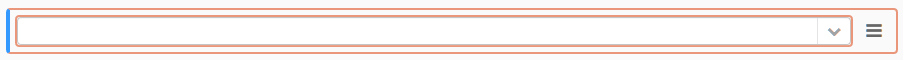

Vizuálně je pole se striktní validaci zvýrazněno vnitřním i vnějším (= dvojitým) oranžovým orámováním. Po zapsání validní hodnoty orámování zmizí.

!!! tip "Tip"

    **Únik ze striktní validace**, tzn. možnost opustit záznam, u kterého je alespoň na jednom prvku popisu uplatněna striktní validace, bez zadání validní hodnoty: přepnutím z režimu  "zápis" do režimu "jen pro čtení". Nedojde však k uložení žádné ze zapsaných hodnot! 

##### 3.2.1.2 Validace formou upozornění 

Pro každou kombinaci výše zmíněných faktorů bude možnost definovat pro každé pole požadavek na vyplnění. Při nesplnění takto nastaveného požadavku bude uživatel upozorněn (barevné ohraničení pole), nezabrání to však uložení rozpracovaného záznamu.

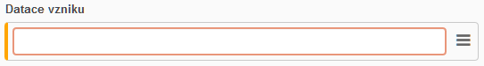

Vizuálně je pole s validaci formou upozornění zvýrazněno vnitřním oranžovým (= jednoduchým) orámováním. Po zapsání validní hodnoty orámování zmizí.

V původní verzi plovoucího okna Napojené přístupové body je upozornění na validaci řešeno oranžovým podtržením: 

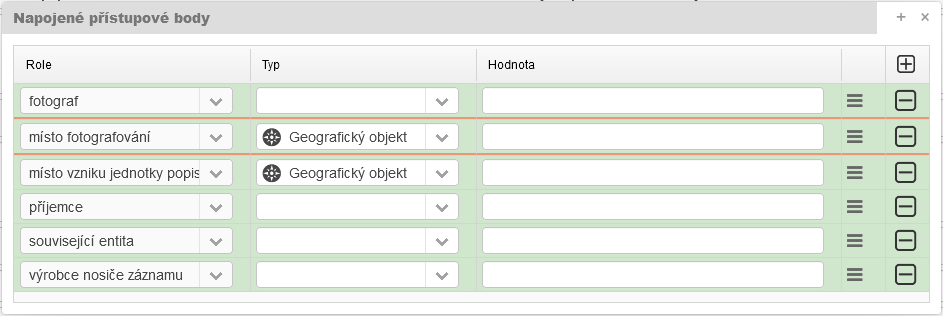

V **nové verzi plovoucího okna Napojené přístupové body není validace** vizuálně řešena. Lze ale podle ní filtrovat role k napojení: 

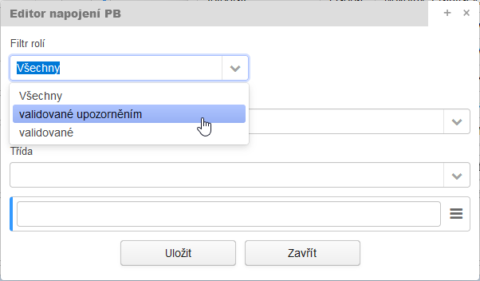

#### 3.2.2 Validace na vyžádání

Validace na vyžádání není automatizovaná. Spouští ji výhradně uživatel jako samostatný validační proces nebo je součástí jiného uživatelského procesu (finalizace/autorizace pomůcky apod.) 

Validace na vyžádání umožní např.:

- **[Validovat hierarchii](manual_proarchiv.md#5102-validovat-hierarchii)**
- **[Validovat jako autorizovanou pomůcku](manual_proarchiv.md#5103-validovat-jako-autorizovanou-pomucku)** – kontrola úrovní, vyplnění polí apod. = technická kontrola bezchybnosti pomůcky. Bez odstranění závad nebude možno pomůcku přepnout do stavu "zpracovaná" či "autorizovaná".


###  3.3 Import a transformace existujících dat

Dle požadavků archivů byla nebo postupně budou do aplikace ProArchiv přesunuta veškerá data z dřívějších pořádacích aplikací. V některých případech nebylo možno převést zdrojová data zcela do žádoucí podoby. Např. při převodu rejstříků do přístupových bodů nelze strojově určit typy odpovídajících tříd přístupových bodů (např. dílo/výtvor z místního nebo věcného rejstříku). V těchto případech bude třeba upřesnění provést ručně. Pomocí v této práci bude možnost vyhledat si záznamy, neodpovídající nastaveným **validačním pravidlům** a také zobrazení původní podoby každého jednoho záznamu ve stavu před importem.

### 3.4 Exporty dat

#### 3.4.1 Interní exporty – repository

Všechna data pořízená v aplikaci ProArchiv včetně digitálních příloh jsou a budou uložena v repository. Hlavním důvodem existence repository je potřeba centrálního uložení dat v lidsky čitelné podobě tj. ve formě nezávislé na určitém dodavateli, či specifické technologii. Z repository čerpá data i prezentační portál Digitální archiv ZAO / VadeMeCum. Formát dat v repository je dán interními potřebami archivu a musí být schopen beze zbytku nést veškeré informace vzniklé při pořizování. 

#### 3.4.2 Exporty pro okolní svět

Ostatní exportní formáty (např. EAD3) jsou určeny vnějšími autoritami, jejichž požadavky bude nutno respektovat. Podstatný je fakt, že strukturování dat vznikající uvnitř aplikace svojí podrobností přesahuje požadavky zvenčí, které jsou v dnešní době známy. Transformace interního formátu do některého formátu požadovaného z venku bude probíhat jednak přímým namapováním polí a jednak sloučením několika polí vstupních do jednoho pole výstupního. 

## 4 Uživatelské rozhraní

Tato kapitola je zařazena před kapitolu věnující se výčtu funkčností aplikace. Je to tak proto, že základní přehled o uživatelském členění aplikace může být při popisu funkčnosti užitečný, přispěje k větší názornosti.

### 4.1 Změna pohledu na data: komplexnost vs. specializovaný pohled

Aplikace ProArchiv nabízí na jednom místě možnost komplexního popisu, komplexního pohledu na data. 

Komplexní pohled již z logiky věci neumožňuje takové přesné a specifické zobrazení určité stejné skupiny dat, na jaké byly zvyklé archivy, které uplatňovaly onu "dvojkolejnost" popsanou v kapitole [3.1.5](manual_proarchiv.md#315-vztah-pomucek-archivnich-souboru-a-tematickych-databazi-rezimy-zobrazeni). Hlavní tabulkové zobrazení nemůže poskytnout takovou škálu sloupců, jak tomu bylo dříve, neboť musí být zobrazovat pouze společné prvky pro všechny. Naopak např. v Národním archivu byl komplexní hierarchický pohled na data uplatněn již v předchozím pořádacím programu Janus.

!!! tip "Tip"

    **Pokud chcete komplexnější pohled na data vybrané kategorie (jednotlivé hodnoty ve sloupcích dle prvků popisu, jejich možné řazení), můžete využít speciální [tabulkový pohled](manual_proarchiv.md#48-tabulkovy-pohled).**

### 4.2 Aplikační prostředí

Aplikace je webová, lze ji spustit ve standardním webovém prohlížeči. K doporučeným (testovaným) prohlížečům patří Mozilla Firefox, Microsoft Edge a Google Chrome.

!!! warning "Omezení"

    Aplikace není schopna reagovat na použití tlačítek „předchozí stránka“ a „následující stránka“ v prohlížeči. Intuitivnímu použití těchto tlačítek je třeba se vyhnout. 

#### 4.2.1 Přihlášení

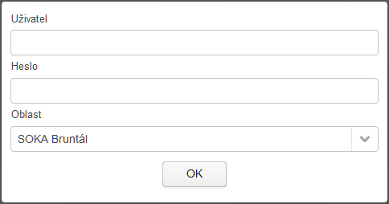

Standardně aplikace čerpá uživatele z domény (active directory)/LDAP, což v praxi znamená, že při přihlášení použijete stejné přihlašovací údaje, které zadáváte při přihlášení do počítače (Windows). Toto řešení se však v závislosti na instalaci v konkrétních archivech může lišit. Taktéž ne vždy je aktivní/přítomen výběr oblasti. 

##### 4.2.1.1 Práva ke čtení

Přihlášený uživatel má práva ke čtení ve všech archivních souborech. Záznamy tak může libovolně procházet, vyhledávat a číst. Taktéž má přístup do databáze archivních autoritních entit, tzn. do modulu ProArchiv - Přístupové body. 

##### 4.2.1.2 Práva k editaci

1. Tam, kde je při přihlášení implementován výběr oblasti (např. oblastní archivy), určuje vybraná oblast tu část archivu (rozuměj příslušné archivní soubory), do které bude moci přihlášený uživatel zapisovat. V ostatních oblastech má právo jen pro čtení.
2. Tam, kde není při přihlášení implementován výběr oblasti (např. Národní archiv), může být právo zápisu zpracovateli/zpracovatelům přidělováno administrátorem na konkrétní archivní soubor.

Archivní autoritní záznamy (přístupové body) nejsou závislé na oblastech ani "přidělených" archivních souborech a jsou pro zápis určeny všem přihlášeným uživatelům.

#### 4.2.2 Vícenásobný běh aplikace ve stejném okamžiku

S aplikací lze standardně pracovat vždy jen v jednom okně (nebo záložce) prohlížeče.  Pokud nastane potřeba spustit aplikaci na jednom PC ve stejný okamžik ve dvou oknech prohlížeče, je potřeba postupovat následovně: 

1. možnost: zvolit dva různé prohlížeče (např. Firefox a Chrome) najednou - v každém z nich pak otevřít jednu instanci aplikace.

2. možnost: v jednom prohlížeči otevřít první instanci ve standardním okně a druhou v anonymním okně.

Pokud uživatel spustit další instanci v druhém standardním okně (záložce) prohlížeče, bude na to upozorněn informačním sdělením. Ideální je toto nové okno (záložku) uzavřít a vrátit se zpět k původnímu oknu. Pokud však chcete pokračovat v novém okně (záložce), postupujte dle informací na obrazovce (Reaktivovat aplikaci v tomto okně).

#### 4.2.3 Ergonomie zobrazení

Samotná aplikace umožňuje nastavit počet sloupců v Detailním popisu (viz [Nastavení detailu](http://manual_proarchiv#5x1-nastaveni-detailu)). Zbytek nastavení ponechává na internetovém prohlížeči. 

##### 4.2.3.1 Velikost zobrazení (písma)

Aplikace přebírá z internetového prohlížeče nastavení velikosti písma a zobrazení. V tomto ohledu se při zvětšování či zmenšování písma nebo zobrazení chová jako klasická webová stránka.

##### 4.2.3.2 Kontrola pravopisu

Aplikace samotná neprovádí kontrolu pravopisu. Lze pro ni případně využít kontrolu pravopisu implementovanou v internetovém prohlížeči.

V Google Chrome je tato funkce ve výchozím nastavení, v Mozille Firefox je možné ji doinstalovat formou doplňku: [Český slovník pro kontrolu pravopisu](https://addons.mozilla.org/cs/firefox/addon/czech-spell-checking-dictionar/).

#### 4.2.4 Ukládaní nových záznamů a změn

Aplikace má implementováno:

1. automatické uložení při přechodu na jiný záznam (bez dalších otázek)
2. při přepnutí režimu "zápis" do režimu "čtení", kdy se zobrazí upozornění: *Máte neuložené změny. Uložit? Ano/Ne*. Pokud takto přepnete záznam s nesplněnou [striktní validací,](manual_proarchiv.md#3211-striktni-validace) vyskočí upozornění: *Jelikož záznam obsahuje nesprávně vyplněné pole se striktní validací, přepnutím do módu pro čtení budou zahozeny veškeré dosavadní změny. Chcete přepnout do módu pro čtení? Ano/Ne*.
3. automatické uložení rozpracovaného záznamu v případě nechtěného vypnutí okna webového prohlížeče nebo přerušení spojení. Funguje to následovně: při editaci záznamu dochází k pravidelnému (standardně každé 2 minuty) ukládaní dat do mezipaměti (ne přímo do záznamu v databázi). V případě, že dojde k výše zmíněným skutečnostem, aplikace vyhodnotí, zda uložená verze v mezipaměti je mladší, než verze uložená přímo u záznamu, pokud ano, uloží ji.

### 4.3 Základní rozdělení pracovní plochy aplikace

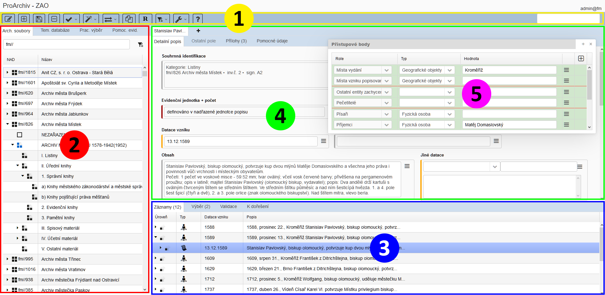

1 - [Lišta nástrojů (toolbar)](manual_proarchiv.md#44-lista-nastroju) | 2 - [Navigátor](manual_proarchiv.md#45-navigator) | 3 - [Tabulka](manual_proarchiv.md#46-tabulka) | 4 - [Detail](manual_proarchiv.md#47-detail) | 5 - [Napojené přístupové body](manual_proarchiv.md#475-napojene-pristupove-body-rejstrikyreference)

### 4.4 Lišta nástrojů

 

#### 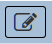 Režim zápisu

- Přepínaní mezi režimem pro čtení (výchozí stav) a pro zápis (tlačítko "zbělá")

-------------------------

####  Nový další záznam

- Založí nový záznam dle pravidel [5.1.8 Vytváření záznamů: "Nový další záznam"](manual_proarchiv.md#518-vytvareni-zaznamu-novy-dalsi-zaznam)

------

####  Nový dle předešlého

- Založí nový záznam dle pravidel [5.1.9 Vytváření záznamů: "Nový záznam dle předešlého"](manual_proarchiv.md#519-vytvareni-zaznamu-novy-zaznam-dle-predesleho)

------

####  Uložení

- Pro uložení všech typů záznamů (entit), tzn. všech změn zapsaných v detailu - hlavním formulářovém okně.

-----------------------------

#### 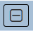 Odstranění záznamu

- odstraní vybraný záznam (entitu), tzn. ten (jednotka popisu, záznam z pomocné evidence apod.), který je právě zobrazen v detailu

-------------------------

#### 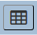 Tabulkový pohled

- Otevře v další záložce prohlížeče speciální tabulkový pohled na data konkrétní kategorie/podkategorie, případně záznamu napříč kategoriemi. 

------

####  Validace

- Výběr uživatelský zvolených validací: [Validovat aktuální záznam](manual_proarchiv.md#5101-validovat-aktualni-zaznam) / [Validovat hierarchii](manual_proarchiv.md#5102-validovat-hierarchii) / [Validovat jako autorizovanou pomůcku](manual_proarchiv.md#5103-validovat-jako-autorizovanou-pomucku) / [Kontrola neveřejných jednotek popisu](manual_proarchiv.md#5104-kontrola-neverejnych-jednotek-popisu)


------

####  Různé funkce

- [Vrácení hromadné akce](manual_proarchiv.md#5661-vraceni-hromadne-akce)
- [Práce se vzorem](manual_proarchiv.md#58-prace-se-vzorem)
- Generovací funkce: [Generovat dataci vzniku - generovaný údaj](manual_proarchiv.md#641-datace-vzniku-generovany-udaj) aj.
- Změny: [Změna úrovně popisu](manual_proarchiv.md#54-zmena-urovne-popisu) / [Změna podkategorie](manual_proarchiv.md#532-zmena-podkategorie) / [Změna stavu pomůcky](manual_proarchiv.md#511-stav-pomucky) / [Změna archivního souboru](manual_proarchiv.md#574-zmena-archivniho-souboru) / [Změna kategorie pův. inv. záznam](manual_proarchiv.md#5311-zmena-kategorie-puvodni-invkat-zaznam) / [Aktualizovat hierarchii evidenčních jednotek](manual_proarchiv.md#5164-aktualizovat-hierarchii-evidencnich-jednotek) / [Změna série na sérii typu pomůcka](manual_proarchiv.md#5163-zmena-serie-na-serii-typu-pomucka) / [Sloučit s vnořeným záznamem - nad výběrem](manual_proarchiv.md#51621-sloucit-s-vnorenym-zaznamem-nad-vyberem)
- Odstranit: [Odstranit neaktivní archivní soubor](manual_proarchiv.md#575-odstraneni-neaktivniho-archivniho-souboru)
- Přečíslování: [Přečíslování ukládacích jednotek](manual_proarchiv.md#5191-precislovani-ukladacich-jednotek) / [Přečíslování inventárních čísel](manual_proarchiv.md#5192-precislovani-inventarnich-cisel) / [Přečíslování manipulačních čísel v hierarchii](manual_proarchiv.md#5193-precislovani-manipulacnich-cisel-v-hierarchii)
- Práce s přílohami: [Hromadné připojení příloh (napříč záznamy)](manual_proarchiv.md#5123-hromadne-pripojeni-priloh-napric-zaznamy) / [Hromadný import příloh z adresářů](manual_proarchiv.md#5124-hromadny-import-priloh-z-adresaru) / [Import příloh dle csv](manual_proarchiv.md#5125-import-priloh-dle-csv)
- [Vlastnosti série NEZAŘAZENÉ](manual_proarchiv.md#622-uprava-zobrazeni-pro-specialni-serii-nezarazene)
- [Správa verzí pomůcek](manual_proarchiv.md#520-sprava-verzi-pomucek)
- [Sjednocení číselníkových hodnot](manual_proarchiv.md#6121-sjednoceni-ciselnikovych-hodnot)
- (výběrově) Rozpoznávání textu příloh: [Vytvoření požadavku k aktuálnímu záznamu / Vytvoření požadavku pro záznamy ve výběru](manual_proarchiv.md#5127-rozpoznani-textu-priloh)
- Export
  - [EAD3](manual_proarchiv.md#5183-ead3) - EAD3 - kompletní / EAD3 - bez neveřejného obsahu (PEVA)


------------

#### 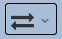 Synchronizace zobrazení

- Výběr funkcí, které slouží k synchronizaci zobrazeného detailu vůči navigátoru a tabulce. 

1) **<u>Synchronizovat navigátor</u>** - synchronizuje pozici navigátoru a tabulky (záložku "Záznamy") vůči právě zobrazenému detailu. Obecná funkce pro všechny entity. Funguje všude včetně pomocných evidencí. Je užitečná v případě, kdy má uživatel otevřeno více detailů v záložkách. Pohyb po ostatních záložkách v tabulce (mimo "Záznamy") automaticky nevyvolává synchronizaci navigátoru a tabulky. Pokud chce uživatel vědět, kde je entita zařazena, vyvolat synchronizaci pomocí této funkce. Ta pak ukáže např. záznam ze záložky "Výběr" v záložce "Záznamy" a k němu příslušnou pozici v navigátoru.

2) **<u>Zobrazit v tematické DB</u>** - synchronizuje pozici navigátoru a tabulky (záložku "Záznamy") vůči právě zobrazenému detailu. Navigátor se zobrazí režimu zobrazení Tematické databáze (ukáže jeho zařazení v hierarchii tematické databáze - v její případné kapitole).

-------------------
#### 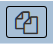 [Kopírování / Přesun](manual_proarchiv.md#57-kopirovani-presuny)

- Dle volby režimu zobrazení otevře okno pro kopírování / přesuny jednotek popisu

--------------------
####  [Napojené přístupové body](manual_proarchiv.md#475-napojene-pristupove-body-rejstrikyreference)

- Otevře plovoucí okno pro zobrazení napojených přístupových bodů k zobrazenému archivnímu popisu.

-----------------------
####  Správa přístupových bodů

- V nové záložce prohlížeče otevře okno se samostatným modulem pro správu přístupových bodů "ProArchiv - Přístupové body".

-----------------------
####  [Výběr / Hromadná nahrazení](manual_proarchiv.md#56-hledani-vybery-hromadna-nahrazeni)

- Výběr funkcí: Přidat do výběru / Odebrat z výběru / Vyprázdnit výběr / [Správa výběrů](manual_proarchiv.md#568-sprava-vyberu) / [Vícenásobný výběr](manual_proarchiv.md#565-vicenasobny-vyber) / [Rozšířený výběr](manual_proarchiv.md#563-rozsireny-vyber) / [Najdi a nahraď](manual_proarchiv.md#566-najdi-a-nahrad-hromadne-zmeny) /  (výběrově) Vyhledej duplicitu inv. z. <> záznam TD / [Výběr/nahrazení přístupových bodů](manual_proarchiv.md#592-hledani-v-pristupovych-bodech-v-prostredi-poradaci-aplikace) / [Vyhledání připojených přístupových bodů](manual_proarchiv.md#567-vyhledani-pripojenych-pristupovych-bodu) / [Vyhledání použití neplatných/nahrazených PB](manual_proarchiv.md#5922-vyhledani-pouziti-neplatnychnahrazenych-pb)

----------------------
####  Tisky

- Výběr tiskových sestav

----------------------

####  Úlohy

- Zobrazuje stav běžících úloh, které jsou spuštěny na pozadí. Ikona se dynamicky mění podle stavu úloh:

   nebo  = Žádná úloha neběží

   = Právě běžící úlohy...
  
  Funguje i jako proklik do [Seznamu úloh](manual_proarchiv.md#5131-seznam-uloh).

----------------------

####  Nastavení / nástroje

Nabídka pomocných funkcí a nastavení:

- Odhlásit - dojde k odhlášení z aplikace
- <u>Zobrazit zdrojová data</u> - u původních záznamů zobrazí jejich data v původní struktuře a ve stavu, který byl dostupný při importu do aplikace ProArchiv. Nemusí být dostupné pro všechny databáze.
- <u>[Uživatelské nastavení aplikace](manual_proarchiv.md#5x1-uzivatelske-nastaveni-aplikace)</u> - umožnuje definovat počet sloupců při zobrazení detailu (výchozí počet = 5) nebo doladit řazení polí či jejich skrývání.
- [Seznam úloh](manual_proarchiv.md#5131-seznam-uloh)
- [Zobrazení logů](manual_proarchiv.md#521-zobrazeni-logu)
- Vykazování
- Statistiky
  - [Výroční zpráva](manual_proarchiv.md#5261-vyrocni-zprava) - Celý archiv / Vybraný uzel


---------------------

####  Nápověda

- Otevře nápovědu ve vedlejší záložce prohlížeče. (Při prvním spuštění: Nutno povolit a zapamatovat otevíraní vyskakovacích oken z domény aplikace).

### 4.5 Navigátor

Je rozčleněn do následujících částí:

-   **Archivní soubory** - záložka zobrazuje hierarchický rozpad od nejvyšší úrovně (= archivní soubor) po nejnižší sérii.

-   **Tematické databáze** - záložka zobrazuje rozpad na jednotlivé archivy (dle prefixů archivů), dále pak na jednotlivé tematické databáze a jejich kapitoly.

-   **Pracovní výběr** - záložka, do které může uživatel umístit vybrané archivní soubory, s kterými intenzivněji pracuje. Pracovní výběr se automaticky ukládá (pro každého uživatele ten jeho) a při opětovném spuštění aplikace se znovu zobrazí. Viz dále.

-   **Pomocné evidence** - záložka zobrazuje pomocné evidence hierarchicky sdružené do určitých skupin (Číselníky, Evidence NAD a Správa uživatelů). Možnost editace záznamů z těchto pomocných evidencí je dána uživatelskými právy.

#### 4.5.1 Funkce spojené s navigátorem

Viz [5.1 Vytváření záznamů (prvků popisu, entit)](manual_proarchiv.md#51-vytvareni-zaznamu-prvku-popisu-entit)

Import/export:

- Viz Import/export ProArchiv = [5.18 Import/export pomůcky/série](manual_proarchiv.md#518-importexport-pomuckyserie) a [5.12.5.1 Exportovat strom pro přílohy](manual_proarchiv.md#51251-exportovat-strom-pro-prilohy)
- Viz [5.22 Import z CSV](manual_proarchiv.md#522-import-z-csv)

Viz [4.8.3 Přidávání záznamů do tabulkového pohledu - 4.8.3.1 z navigátoru](manual_proarchiv.md#4831-z-navigatoru)

Viz [5.16.1.1 Rozbalit / zabalit úrovně v navigátoru](manual_proarchiv.md#51611-rozbalit-zabalit-urovne-v-navigatoru)

Viz [5.6.4.3 Poslední záznam](manual_proarchiv.md#5643-posledni-zaznam)

Viz [5.6.4.4 Načíst archivní soubory z výběru](manual_proarchiv.md#5644-nacist-archivni-soubory-z-vyberu)

Viz [5.16.5 Zobrazit pomůcku ve stromovém pohledu](manual_proarchiv.md#5165-zobrazit-pomucku-ve-stromovem-pohledu)

Viz [5.16.6 Seřadit záznamy / Seřadit záznamy - celá hierarchie](manual_proarchiv.md#5166-seradit-zaznamy-seradit-zaznamy-cela-hierarchie)

### 4.6 Tabulka

Záznamy jsou zobrazeny dle svého **["Názvu" (displayName)](manual_proarchiv.md#318-informace-o-zaznamech-mimo-editacni-formulare)**. Zobrazení v tabulce se člení do několika záložek:

#### 4.6.1 Záznamy (záložka)

Zde jsou zobrazeny záznamy, které navazují - jsou vnořeny do nadřazených úrovní příslušného zobrazení navigátoru:

- <u>**v režimu zobrazení "Archivní soubory" / "Pracovní výběr"**</u> - jednotky popisu pro úrovně **složka**, **jednotlivost**, **část jednotlivosti**. Jedině v tomto režimu zobrazení je umožněn, podobně jako v navigátoru, hierarchický rozpad. 
- **<u>v režimu zobrazení "Tematické databáze"</u>** - rovněž jednotky popisu pro úrovně **složka**, **jednotlivost**, **část jednotlivosti**, avšak oproti režimu "Archivní soubory" není v tomto umožněn jejich vzájemný hierarchický rozpad. Proč? Vyjádření úrovňovosti bude vždy primární z pohledu Archivní soubor (zpracování v pomůcce). Synchronizace úrovňovosti v obou pohledech by byla komplikovaná.
- <u>**v režimu zobrazení "Pomocné evidence"**</u> - zobrazení záznamů z různých pomocných evidencí: číselníkové hodnoty, správa uživatelů apod. Bez vzájemné hierarchické vazby.

Ve sloupci **Identifikace** se zobrazuje zhuštěná informace o archivu, NAD, inv. číslu, signatuře a ukl. jednotce.

##### 4.6.1.1 Funkce spojené se záložkou Záznamy

Viz [5.1 Vytváření záznamů (prvků popisu, entit)](manual_proarchiv.md#51-vytvareni-zaznamu-prvku-popisu-entit)

Viz [5.8 Práce se vzorem](manual_proarchiv.md#58-prace-se-vzorem)

Viz [4.8.3 Přidávání záznamů do tabulkového pohledu - 4.8.3.1 z tabulky](manual_proarchiv.md#4831-z-tabulky)

Viz [5.16.2 Sloučit s vnořeným záznamem](manual_proarchiv.md#5162-sloucit-s-vnorenym-zaznamem)

Viz [5.7.1.1 Kopírování / Přesun konkrétního záznamu z tabulky](manual_proarchiv.md#5711-kopirovani-presun-konkretniho-zaznamu-z-tabulky)

Viz [5.16.1.2 Rozbalit podřízené záznamy](manual_proarchiv.md#51612-rozbalit-podrizene-zaznamy)

Viz [5.16.1.3 Rozbalit všechny záznamy v tabulce](manual_proarchiv.md#51612-rozbalit-podrizene-zaznamy)

#### 4.6.2 Výběr (záložka)

V této záložce se shromažďují všechny záznamy napříč celou aplikací, které uživatel přidal do výběru jednotlivě nebo pomocí funkce Hledání / Rozšířený výběr.

##### 4.6.2.1 Funkce spojené se záložkou Výběr

Viz [4.8.3 Přidávání záznamů do tabulkového pohledu - 4.8.3.1 z tabulky](manual_proarchiv.md#4831-z-tabulky)

Viz [5.12.6 Hromadné odstranění příloh u vybraných záznamů](manual_proarchiv/#5126-hromadne-odstraneni-priloh-u-vybranych-zaznamu)

Exportovat balíček - jde o experimentální funkci, která vytvoří zip s json daty vybraných záznamů.

#### 4.6.3 Validace (záložka)

Záložka zobrazuje vždy k právě zobrazenému detailu názvy polí, které mají nastavenou povinnost vyplnění:

- červené podbarvení - pro pole se [striktní validací](manual_proarchiv.md#3211-striktni-validace) - dokud nebude pole správně vyplněno, zůstanou ostatní navigační prvky uzamčeny, tzn. nebude možné tuto záložku opustit.
- žluté podbarvení - pro pole s [validací formou upozornění](manual_proarchiv.md#3212-validace-formou-upozorneni)

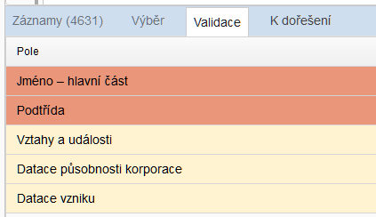

!!! tip "Tip"

    Kliknutí na konkrétní pole v této záložce přenese (zacílí) kurzor pro zápis přímo do tohoto pole v detailu. Můžete ihned psát. 

#### 4.6.4 K dořešení (záložka)

Po provedení nějaké uživatelské funkce (např. Přesunu, Validovat hierarchii) se v této záložce případně objeví záznamy, které je potřeba nějakým způsobem opravit - dořešit. Součástí zobrazení je kolonka Důvod, tzn. popis problému, který je potřeba opravit.


### 4.7 Detail

Zobrazení všech dostupných strukturovaných informací k zobrazenému záznamu. Princip zobrazení polí v Detailu je popsán [níže](manual_proarchiv.md#62-princip-zobrazeni-poli-v-panelu-detail).

<u>Členění Detailu:</u>

#### 4.7.1 Detailní popis

Zobrazuje kompletní nabídku polí (prvků popisu), které jsou pro danou kategorii (příp. podkategorii) záznamu v kombinaci s pravidly a typem pomůcky nastavená jako výchozí.

#### 4.7.2 Ostatní pole

Zobrazuje hodnoty polí, které daný záznam obsahuje. Tato pole ale nejsou pro danou kategorii (příp. podkategorii) záznamu v kombinaci s pravidly a typem pomůcky výchozí. V ideálním případě je tato záložka neaktivní - neobsahuje žádná pole.

#### 4.7.3 Přílohy

Zobrazuje přílohy (digitalizáty, pdf soubory apod.).

#### 4.7.4 Pomocné údaje

Zobrazuje systémově generovaná data: uživatelská jména tvůrců a následných editorů záznamu včetně časových značek; taktéž jednoznačný identifikátor (UUID) záznamu a permalink.

#### 4.7.5 Napojené přístupové body (Rejstříky/reference)

Nezobrazuje se jako záložka, ale jako plovoucí okno. 

##### Okno Napojené přístupové body - původní verze 

je určena pro klienty, kteří <u>nepoužívají modul pro správu přístupových bodů</u>. Zobrazuje:

1) všechny "zděděné" přístupové body s horních úrovní přímé hierarchie (šedě podbarveno) - bez možnosti editace

2) všechny výchozí role přístupových bodů (zeleně podbarveno) + ty, které uživatel přidal (bílé podbarveno) - editace

Okno se otevírá pomocí ikony v navigační liště. Lze měnit jeho rozměry a pozici. Okno zůstává zobrazeno tak dlouho, dokud ho uživatel nezavře. Při dalším otevření si pamatuje předchozí pozici. Hodnoty v okně se automaticky synchronizuji s právě zobrazeným záznamem.

##### Okno Napojené přístupové body - nová verze 

je určena pro klienty, kteří <u>používají modul pro správu přístupových bodů</u>. 

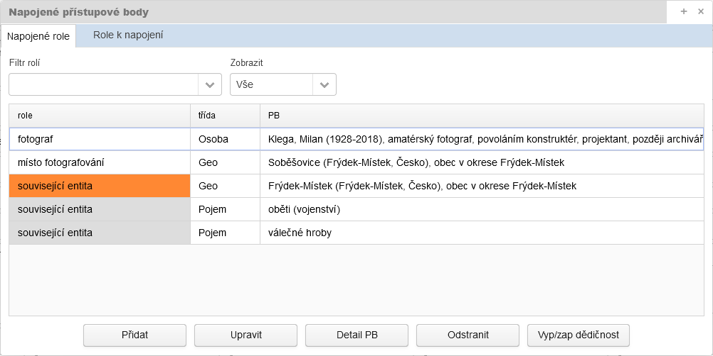

Okno je rozděleno do dvou záložek:

**Napojené role** - výchozí záložka; zobrazuje přístupové body vážící se k vybrané jednotce popisu.

| Podbarvení          | Význam                                                       |
| ------------------- | ------------------------------------------------------------ |
| Bílé podbarvení     | Přístupový bod je přímo připojen u dané jednotky popisu. Vazba mezi jednotkou popisu a přístupovým bodem je zapsána přímo v datech záznamu. V rámci rozšířeného výběru lze takto dohledat záznamy, které mají napojen hledaný přístupový bod. |
| Šedé podbarvení     | Přístupový bod je zděděn z vyšších úrovní. Vazba mezi jednotkou popisu a děděným přístupovým bodem není zapsána přímo v datech záznamu, u nějž je přístupový bod děděn shora. V rámci rozšířeného výběru nelze takto dohledat záznamy, které mají napojen hledaný děděný přístupový bod. |
| Oranžové podbarvení | Děděný přístupový bod má vypnutou dědičnost. U dané jednotky popisu a níže se nebude indexovat, zobrazovat v prezentaci apod. Samozřejmě platí stejná zásada o nedohledatelnosti jako o řádek výše. |

Řazení napojených přístupových bodů je řešeno abecedně dle role a v rámci role pak dle napojeného PB (třída řazení neovlivňuje).

Výčet položek je možno filtrovat:

1. možnost filtrace zobrazení napojených PB dle zvolené role

   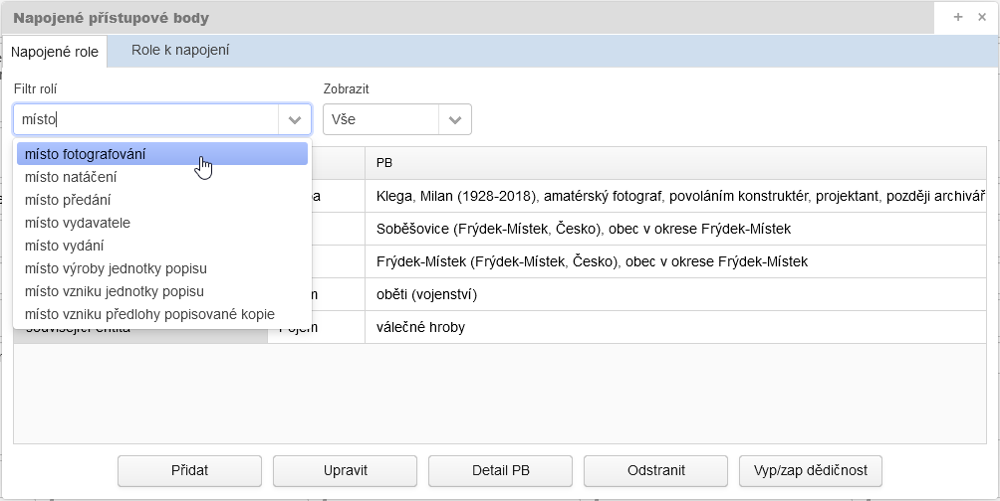

   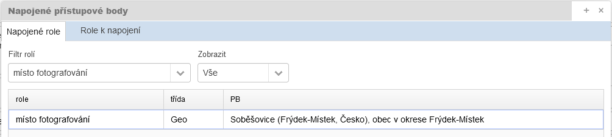

2. možnost filtrace zobrazení napojených PB dle vztahu k dědičnosti: vše / nezděděné / zděděné / vypnuté

   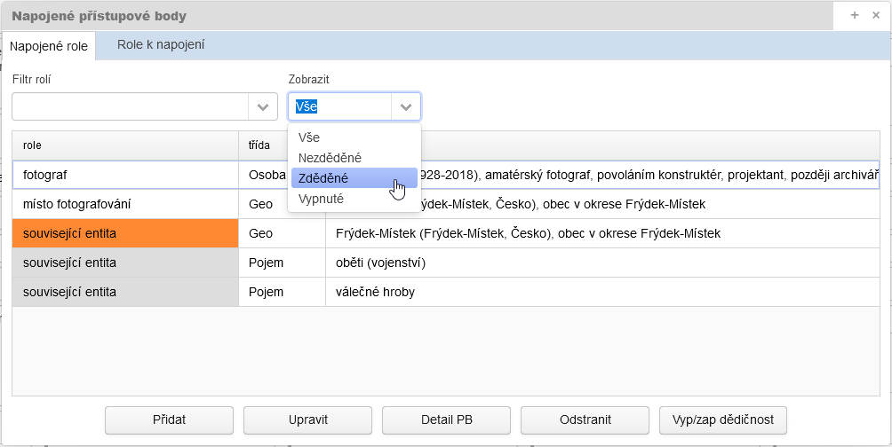

   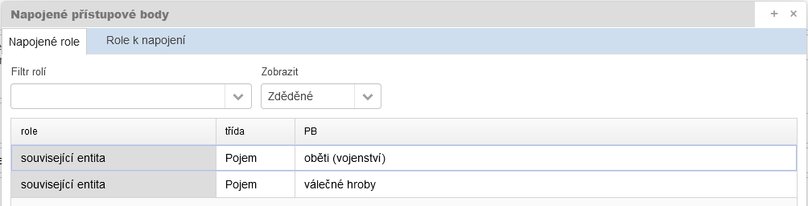

!!! warning "Upozornění"

    **Zapnutý filtr je držen po celou dobu vašeho přihlášení!** Myslete na to. Pokud neuvidíte očekávané role, nebo vidíte stále jen ty stejné, nebo třeba jen děděné, přesvědčte se, zda nemáte aktivní filtr, který nechcete.

**Role k napojení** - zobrazuje výčet doposud nepoužitých možných rolí daných administrátorským nastavením pro danou kombinaci kategorie, úrovně a pravidel.

**Funkční tlačítka** pro vytváření a editaci vazeb na přístupové body jsou přístupné jen z výchozí záložky Napojené role. Jejich použití ke vázáno na aktivní režim editace.

Tlačítko <u>Přidat</u> zobrazí Editor napojení PB:

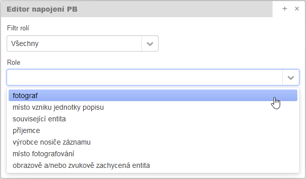 

Zde je možno vybrat roli ze seznamu možných rolí daných administrátorským nastavením pro danou kombinaci kategorie, úrovně a pravidel. Filtr rolí slouží pro možnou filtraci nabídky dle nastavené validace (všechny = kompletní nabídka dle nastavení / [validované upozorněním](manual_proarchiv.md#3212-validace-formou-upozorneni) / [validované](manual_proarchiv.md#3211-striktni-validace) = striktní upozornění).

Tlačítko <u>Upravit</u> umožnuje editovat již vytvořenou vazbu.

Tlačítko <u>Detail PB</u> otevře modální okno s textovým souhrnným zobrazením přístupového bodu a případným prolinkem do modulu pro správu přístupových bodu k možné editaci připojeného přístupového bodu.

Tlačítko <u>Odstranit</u> zruší vytvořenou vazbu.

Tlačítko <u>**Vyp/zap dědičnost**</u> umožňuje **vypnout (případně znovu zapnout) dědění přístupového bodu**. V případě vypnutí dědičnosti je role podbarvena oranžově. Pokud se u vypnuté (oranžové) vazby znovu použije tlačítko Vyp/zap dědičnost, dědění se znovu aktivuje (zašedne). Vypnutí dědění na konkrétní úrovni samozřejmě automaticky zajistí vypnutí (přerušení dědičnosti) i ve všech přímo podřízených jednotkách popisu. 

### 4.8 Tabulkový pohled

Speciální tabulkové zobrazení vybraných záznamů úrovně složka, jednotlivost či část jednotlivosti, u kterého platí:

- záznamy nelze v tabulkovém pohledu přímo editovat (lze je ale automaticky synchronizovat do editační části aplikace),
- tabulkový pohled nezobrazuje hierarchii mezi vybranými záznamy.

Sloupce tabulky odpovídají jednotlivým polím. Nastavení sloupců může uživatel [ovlivnit](manual_proarchiv.md#482-nastaveni-zobrazeni-tabulkoveho-pohledu).

Cílem bylo umožnit uživatelům komplexnější pohled na vybraná data, který nemohla poskytnou klasická tabulka v hlavním okně aplikace.

Aktivuje se tlačítkem  z lišty nástrojů, poté se otevře jako další záložka v okně prohlížeče.

#### 4.8.1 Lišta nástrojů / popis funkcí tabulkového pohledu

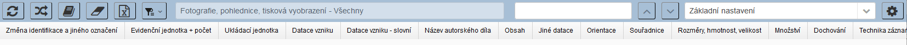

#####  Automaticky synchronizovat detail

- pokud je aktivní, synchronizuje automaticky zobrazení vybraného záznamů z tabulkového pohledu v hlavním okně aplikace, kde pak lze uplatnit jeho editaci

------

##### 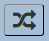 Vynulovat řazení

- vynuluje všechna zvolená řazení

------

##### 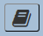 Nastavení kategorie

- otevře dialogové okno pro výběr kategorie (nutné), případně podkategorie (dobrovolné upřesnění). 

  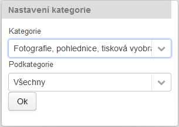
  
  **Pro zobrazení záznamů vícero kategorií je nutné použít volbu Všechny kategorie** (tato volba umožní načíst i záznamy typu série).

------

##### 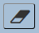 Vyprázdnit celý tabulkový pohled

- odstraní všechny záznamy z tabulkového pohledu (samozřejmě jen jejich zobrazení)

------

#####  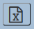 Export do xlsx

- vyexportuje všechny záznamy z tabulkového pohledu v přesné shodě (pořadí sloupců, řazení) do sešitu Excel (xlsx)

------

##### 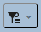 Správa výběrů

- umožňuje načítat/ukládat záznamy do/z tabulkového výběru do správy výběrů

------

##### 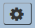 Upravit nastavení polí

- vstup do uživatelského [nastavení zobrazení](manual_proarchiv.md#482-nastaveni-zobrazeni-tabulkoveho-pohledu) (sloupce, řazení)

------

##### Hledání v tabulkovém pohledu

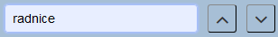

Zápisem dochází k automatickému prohledávání dat v tabulce. Je potřeba zadat vždy více než 3 znaky. Pokud je něco nalezeno, dojde k aktivaci šipek, které slouží k zacílení záznamů s nalezeným řetězcem.

Ve stavovém řádku vlevo dole se zobrazí počet nalezených záznamů.

##### Řazení v tabulkovém pohledu

<u>Kliknutím levého tlačítka</u> myši na záhlaví konkrétního sloupce se nastavuje řazení tabulky.  Do řazení je možno zapojit více sloupců s postupnou prioritou od prvního do posledního. <u>Opětovným kliknutím levého tlačítka</u> na již zvolené záhlaví v řazení se změní směr řazení. <u>Kliknutím pravého tlačítka</u> na již zvolené záhlaví v řazení se daný sloupec z řazení vyloučí.

Tlačítkem Vynulovat řazení se všechna řazení ruší.

Ve stavovém řádku vlevo dole se zobrazuje zvolené řazení.

#### 4.8.2 Nastavení zobrazení tabulkového pohledu

Každá kategorie záznamu má ve výchozím stavu určeno základní nastavení, které vychází z maximální množiny dostupných prvků popisu pro danou kategorii. U univerzální volby "Všechny kategorie" je rovněž určeno základní nastavení (většinou pole společná všem kategoriím), uživatel si však může zobrazení doplnit z nabídky všech polí, které má aplikace k dispozici napříč kategoriemi. 

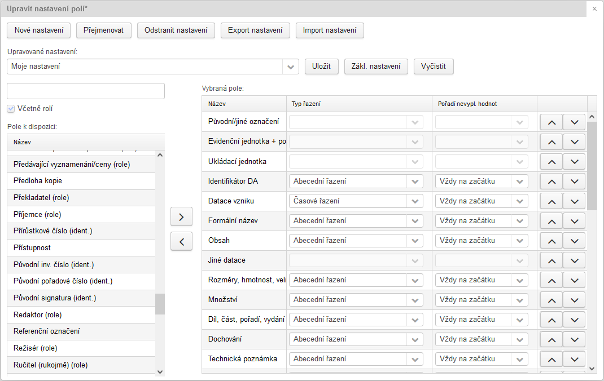

Pro efektivnější práci se doporučuje vytvořit si vlastní nastavení:

Pomoci tlačítka ***Nové nastavení*** založit a pojmenovat uživatelské nastavení.

Pomocí tlačítka ***Zákl. nastavení*** lze načíst základní nastavení, aby uživatel nemusel pracně vybírat vše od nuly.

V levém sloupci je kompletní nabídka polí pro danou kategorii. Lze si pomoci vyhledávacím políčkem nad tímto sloupcem - postupným zápisem názvu pole se nabídka zužuje. Šipkami mezi levým a pravým sloupcem se vybrané prvky popisu přesunují.

!!! tip "Tip"

    V nastavení lze použít i metodu **drag and drop** (táhni a pusť), kdy uživatel „uchopí“ pomocí levého tlačítka myši prvek popisu a přesune ho „přetažením“ na jiné místo.

V sekci vybraných polí je možno prvky popisu pozicovat nahoru/dolu: směr shora dolů odpovídá pořadí sloupců zleva doprava. Při pozicování lze taktéž využít funkce "drag and drop".

U každého prvku popisu lze nastavit **typ řazení** (dle charakteru dat):

- *abecední* - vše řadí jako text dle abecedy
- *číselné* - vše řadí jako číslo
- *časové* - u datačních polí, dle pozice na časové ose
- *speciální* - je definováno klientsky pro každou instanci aplikace. Např. pro inv. č. jde o kombinaci abecedního a číselného řazení: 1, 2, 3a, 3b, 4...

Nastavuje se taktéž výchozí **pořadí nevyplněných hodnot** (tzn. prázdná pole): Vždy na začátku / Vždy na konci.

V nastavení jsou jako samostatná pole (sloupce) nabízena i taková, která jsou sice v detailu součástí komplexního pole (např. Původní/jiné označení, Ukládací jednotka, Evidenční jednotka + počet), ale pro tabulkový pohled na data a hlavně možnost řazení mají význam v samostatném postavení:

- Inv. číslo (ident.) *vs. Původní/jiné označení*
- Signatura (ident.) *vs. Původní/jiné označení*
- Upřesňující identifikátor (ident.) *vs. Původní/jiné označení*
- Evidenční jednotka (druh) *vs. Evidenční jednotka + počet*
- Evidenční jednotka (počet) *vs. Evidenční jednotka + počet*
- Ukládací jednotka (typ) *vs. Ukládací jednotka*
- Ukládací jednotka (počet) *vs. Ukládací jednotka*
- jednotlivé role přístupových bodů

Např. komplexní pole Ukládací jednotka sice zobrazuje synteticky jak typ, tak hodnotu, nelze však podle něj řadit. Pokud je potřeba uplatnit řazení dle typu a hodnoty ukládací jednotky, je potřeba si je zobrazit samostatně a samostatně také uplatnit řazení.

Pomocí tlačítka ***Uložit*** je vždy potřeba změny provedené ve vybraném nastavení uložit.

Tlačítko ***Vyčistit*** kompletně vymaže nastavená pole!

------

Tlačítko ***Přejmenovat*** otevře dialog pro zápis nového názvu vybraného uživatelské nastavení.

Tlačítko ***Odstranit nastavení*** odstraní vybrané uživatelské nastavení!

Tlačítko ***Export nastavení*** uloží vybrané nastavení do externího .json souboru, který můžete využít pro vytvoření kopie vlastního nastavení nebo k zaslání jinému uživateli.

Tlačítko ***Import nastavení*** naimportuje nastavení z externího .json souboru.

------

Výběr uložených nastavení probíhá z lišty nástrojů tabulkového zobrazení (vpravo):

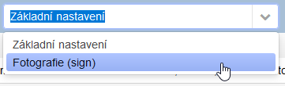

#### 4.8.3 Přidávání záznamů do tabulkového pohledu

!!! warning "Upozornění"

    **Výchozí maximální počet záznamů zobrazitelných v tabulkovém pohledu je 3000!** Při pokusu o přidání většího počtu bude tedy vždy přidáno jen prvních 3000 záznamů. Jednotlivé instance aplikace si mohou administrátorsky tento limit zvýšit dle svých technických možností.
##### 4.8.3.1 Z navigátoru

Provádí se volbou "Přidat všechny podřízené záznamy do tabulkového výběru" z kontextového menu (pravé tlačítko myši).

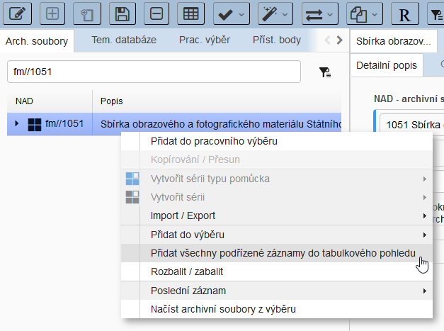

!!! tip "Tip"

    Pokud zvolíte univerzální kategorii "Všechny kategorie" a přidáte všechny podřízené záznamy ze série typu pomůcka, objeví se vám v tabulce kopletní pomůcka včetně sérií!

##### 4.8.3.1 Z tabulky

Provádí se volbou "Tabulkový pohled - Přidat označené / Přidat všechny záznamy do tabulkového výběru" z kontextového menu (pravé tlačítko myši).

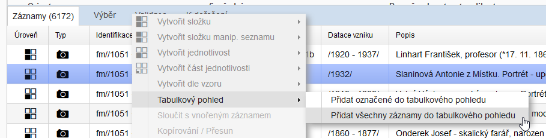

## 5 Funkčnost - případy užití

Funkčnost aplikace je vázána na:

- logiku danou správným hierarchickým uspořádáním, volbou kategorie, pravidel pořádání a typem pomůcky.
- přístupová práva, která mohou být nastavena různě. Pokud vám nebudou některé očekávané funkce fungovat, obraťte se na příslušného administrátora.

### 5.1 Vytváření záznamů (prvků popisu, entit)

Pojmem "záznam" chápeme prvek popisu, entitu.

#### 5.1.1 Vytváření záznamů - společné postupy

V rámci hierarchických úrovní se jednotlivé záznamy vytvářejí vždy vůči pozici **vybraného**, již zapsaného záznamu a to přes jeho kontextovou nabídku - volba **Vytvořit...** Kontextová nabídka se otevře po kliku pravým tlačítkem myši. K dispozici jsou následující možnosti:

- ***Vnořit*** - nový záznam bude vnořen do vybraného záznamu, a to na konec vnořených.
- ***Před*** - nový záznam bude vytvořen na stejné úrovni před vybraný záznam.
- ***Za*** - nový záznam bude vytvořen na stejné úrovni za vybraný záznam.

Možnosti jsou aktivní / neaktivní dle logiky hierarchického uspořádání a ostatních kritérií.

Tento princip vkládání funguje stejně jak navigátoru, tak v tabulce. V navigátoru se vytvářejí záznamy úrovně *série typu pomůcka* a *série* (archivní soubory), či *kapitola* (tematické databáze). V tabulce pak úrovně *složka*, *jednotlivost* a *část jednotlivosti*.

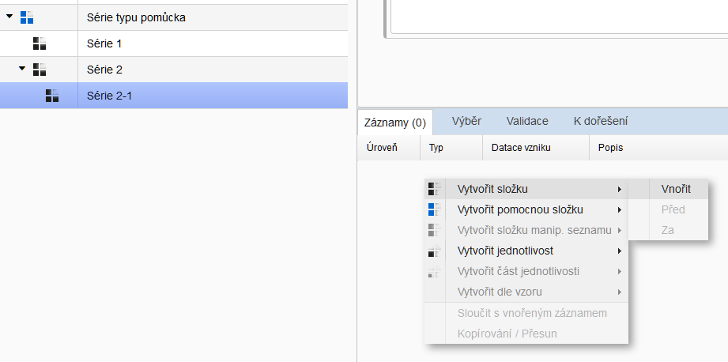 

Pokud je v sérii vytvářen první záznam úrovně složka nebo jednotlivost, je potřeba pravým tlačítkem myši kliknout do prázdného místa v tabulce.

!!! tip "Tip"

    Pokud jsou všechny možnosti neaktivní, ač by neměly být, zkontrolujte, zda nejste v režimu "pro čtení".

#### 5.1.2 Vytvoření nové pomůcky v režimu Archivní soubory

1. vybraný záznam: archivní soubor v navigátoru*
2. volba ***Vytvořit sérii typu pomůcka*** z kontextového menu (pravé tlačítko myši)
3. zápis požadovaného názvu do zobrazeného dialogu + nastavení pravidla a typu pomůcky

*) Série typu pomůcka může být založena i na některé z nižších úrovní série.

#### 5.1.3 Vytvoření série v režimu Archivní soubory

1. vybraný záznam: série typu pomůcka nebo série v navigátoru
2. volba ***Vytvořit sérii*** z kontextového menu (pravé tlačítko myši)
3. zápis požadovaného názvu do zobrazeného dialogu

#### 5.1.4 Vytvoření složky / jednotlivosti / části jednotlivosti v režimu Archivní soubory

1. vybraný záznam: série v navigátoru nebo složka / jednotlivost / část jednotlivosti v tabulce
2. volba ***Vytvořit*** ***složku /  jednotlivost*** ***/ část jednotlivosti*** z kontextového menu (pravé tlačítko myši)
3. volba kategorie, případně podkategorie

#### 5.1.5 Vytvoření kapitoly tematické databáze

Kapitoly se vytvářejí pro pomocné vnitřní členění – seskupování záznamu tematické databáze do větších množin a podmnožin.

1. vybraný záznam: hlavní uzel tematické databáze nebo kapitola v navigátoru
2. volba ***Vytvořit kapitolu*** z kontextového menu (pravé tlačítko myši)
3. zadání názvu kapitoly do zobrazeného dialogu

#### 5.1.6 Vytvoření složky / jednotlivosti / části jednotlivosti v tematické databázi

1. vybraný záznam: hlavní uzel tematické databáze nebo kapitola v navigátoru nebo složka / jednotlivost / část jednotlivosti v tabulce
2. volba ***Vytvořit*** ***složku / jednotlivost*** ***/ část jednotlivosti*** z kontextového menu (pravé tlačítko myši). Možnost Vnořit je neaktivní, neboť v režimu Tematické databáze se neuplatňují hierarchické vazby.
3. výběr archivního souboru, ke kterému popisovaná archiválie náleží

#### 5.1.7 Vytváření záznamů v pomocné evidenci

Vytváření záznamů ze strany záložky Pomocné evidence aktuálně umožněno jen administrátorům (přidávání číselníkových hodnot).

#### 5.1.8 Vytváření záznamů: "Nový další záznam"

Vytvoří nový prázdný záznam vždy za poslední vytvořený záznam bez ohledu, který záznam je zobrazen v detailu. Záznam je vytvořen ve stejné kategorii (případně podkategorii) a se stejnou úrovní. **Záznam je prázdný - bez vyplnění**.

#### 5.1.9 Vytváření záznamů: "Nový záznam dle předešlého"

Vytvoří nový prázdný záznam vždy za poslední vytvořený záznam bez ohledu, který záznam je zobrazen v detailu. Záznam je vytvořen ve stejné kategorii (případně podkategorii) a se stejnou úrovní a **obsahuje i stejně vyplněná pole, jako poslední vytvořený záznam**.

### 5.2 Odstraňování záznamů (prvků popisu, entit)

Právě zobrazený záznam lze odstranit pomocí funkce Odstranit  z lišty nástrojů. Pokud takový záznam obsahuje vnořené záznamy, bude potřeba jeho odstranění potvrdit ve dvou krocích.

### 5.3 Změna kategorie a podkategorie záznamu

#### 5.3.1 Změna kategorie

Vzhledem k tomu, že kategorie záznamu patří k základním stavebním kamenům pořádací aplikace, je na ní závislých mnoho věcí: od zobrazení polí detailního popisu až po validace. **Změnu kategorie tudíž nelze provést**, vyjma záznamů kategorie "původní inv./kat. záznam" (viz dále).

!!! tip "Tip"

    Pokud by přece jen vyvstala potřeba změnu kategorie provést, nezbývá uživateli nic jiného, než založit nový záznam požadované kategorie a ten původní tam přepsat (Ctrl+C a Ctrl+V v rámci jednotlivých polí).

##### 5.3.1.1 Změna kategorie původní inv./kat. záznam

Z důvodů potřeb reinventarizace lze uplatnit změnu kategorie pouze u "původního inv./kat. záznamu" - viz Různé funkce - Změny - Změna kategorie pův. inv. záznam - Aktuální záznam / Nad výběrem. Aplikace funkce "nad výběrem" požaduje, aby ve výběru byly záznamy stejné úrovně a dané kategorie.

#### 5.3.2 Změna podkategorie

Změna podkategorie je možná, pokud daná kategorie volbu podkategorií uplatňuje. Aplikuje se stejnojmennou funkcí z položky Různé funkce v liště nástrojů. Je potřeba vybrat, zda se změna bude provádět nad aktuálním záznamem (Změna podkategorie > Aktuální záznam) nebo nad všemi záznamy ve výběru (Změna podkategorie > Nad výběrem).

Pokud by došlo k tomu, že nově zvolená podkategorie neobsahuje ve výchozím stavu (v Detailním popisu) pole, která byla původně vyplněna, budou tato pole po změně zobrazena záložce Ostatní pole. V ideálním případě by pak měly být jejich hodnoty přeneseny do polí v Detailním popisu nebo vymazány.

Po změně podkategorie je rovněž potřeba upravit role přístupových bodů v okně Napojené přístupové body dle platné metodiky. 

Změna podkategorie je v režimu zobrazení "Tematické databáze" umožněna pouze nad aktuálním záznamem, nikoli nad výběrem.

### 5.4 Změna úrovně popisu

Změna úrovně popisu je umožněna proto, aby bylo možno opravit záznamy se špatně určenou úrovní při založení. Např. v tematické databázi byl záznam fotografie založen jako jednotlivost. Ve skutečnosti se jedná  o část jednotlivosti, neboť daná fotografie je nalepená v kronice. Pokud bychom chtěli záznam fotografie (jednotlivost) vnořit při přesunu do kroniky (jednotlivost), systém nám to neumožní, neboť to odporuje principům hierarchického uspořádání. Je tedy potřeba nejprve fotografii změnit úroveň z jednotlivosti na část jednotlivosti. Poté již přesun zafunguje.

Změna úrovně popisu se aplikuje stejnojmennou funkcí z položky Různé funkce v liště nástrojů. Je potřeba vybrat, zda se změna bude provádět nad aktuálním záznamem (Změna úrovně popisu > Aktuální záznam) nebo nad všemi záznamy ve výběru (Změna úrovně popisu > Nad výběrem).

Změna úrovně popisu je možná jen v režimu zobrazení "Archivní soubory".

!!! warning "Varování"

    Změnou úrovně popisu může dojít k dočasnému porušení hierarchické integrity (např. vznikne část jednotlivosti bez svého "rodiče" - jednotlivosti). Tato chyba by měla být pokud možno ihned odstraněna (např. [přesunem](manual_proarchiv.md#presuny-v-ramci-zobrazeni-archivni-soubory)). Chyba je tolerována nejpozději do okamžiku, kdy dojde k exportu dohotovené nebo aktualizované pomůcky. Export nebude dokončen, pokud nebude chyba opravena!   

### 5.5 Ostatní pole - odstranění

Pokud se kvůli některým provedeným změnám objeví u záznamu aktivní záložka Ostatní pole (xy), je potřeba se těmto polím věnovat a v ideálním případě hodnoty přenést do polí v Detailním popisu a následně z Ostatních polí původní obsah smazat.

K odstranění pole z Ostatních polí dojde:

- u pole s volným zápisem, když vymažeme jeho hodnotu
- u číselníkového pole, když nastavíme hodnotu na \<neurčeno\> nebo na prázdnou hodnotu


### 5.6 Hledání / Výběry / Hromadná nahrazení

#### 5.6.1 Obecné výběrové funkce

Výsledkem všech výběrů, kromě Hledání v navigátoru, je umístění nalezených záznamů do záložky Výběr v Tabulce. **Limit vrácených výsledků je 10000 záznamů!**

Hlavní ovládací prvky jsou umístěny v [Liště nástrojů - Výběr](manual_proarchiv.md#vyber-hromadna-nahrazeni):

**<u>Přidat do výběru</u>** - přidá zobrazený záznam / označené záznamy do záložky Výběr.

<u>**Odebrat z výběru**</u> - odebere označený záznam ze záložky Výběr.

**<u>Vyprázdnit výběr</u>** - odebere všechny záznamy ze záložky Výběr.

**<u>Správa výběrů</u>** - umožňuje ukládat a načítat obsah záložky Výběr.

[**<u>Vícenásobný výběr</u>**](manual_proarchiv.md#565-vicenasobny-vyber) - přepne zobrazení tabulky (záložku Záznamy) do speciálního režimu.

[**<u>Rozšířený výběr</u>**](manual_proarchiv.md#563-rozsireny-vyber) - otevře okno pro zadání výběrových kritérií.

[**Najdi a nahraď**](manual_proarchiv.md#566-najdi-a-nahrad-hromadne-zmeny) - otevře okno pro zadání kritérii. (Jen v režimu "zápis")

Výběr/nahrazování přístupových bodů - otevře modální okno pro prohledávání přístupových bodů, zjišťování jejich vazeb na archivní popis, nahrazování přístupových bodů apod.

**[Vyhledání připojených přístupových bodů](manual_proarchiv.md#567-vyhledani-pripojenych-pristupovych-bodu)** - otevře okno pro zadání výběrových kritérií.

Přidat záznamy do výběru lze taktéž z kontextového menu (pravé tlačítko myši) příkazem "Přidat do výběru". V navigátoru je navíc příkaz rozšířen na volby: Aktuální záznam a Vše vnořené (přidá všechny vnořené záznamy). 

Práce s výběrem kromě funkce "Najdi a nahraď" funguje i v režimu "pro čtení".

#### 5.6.2 Jednoduchý výběr z lišty nástrojů

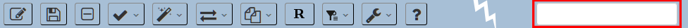

Jde o základní / nejjednodušší formu hledání:

-   zápis hledaného textu do okna vpravo nahoře
-   spuštění hledání – klávesa Enter
-   zobrazení vyhledaných záznamu v tabulce v záložce Výběr

**Tato funkce nezohledňuje pozici v navigátoru, tzn. prohledává veškerá data.** 

Tato funkce umí pracovat i s nealfanumerickými znaky tečkou a lomítkem kvůli prohledávání signatur (např. 53.1, F053/012).

#### 5.6.3 Rozšířený výběr

Jde o rozšířenou / sofistikovanou formu hledání. Volbou Výběr / Rozšířený výběr z lišty nástrojů se spustí plovoucí okno pro zadání vyhledávacích kritérií.

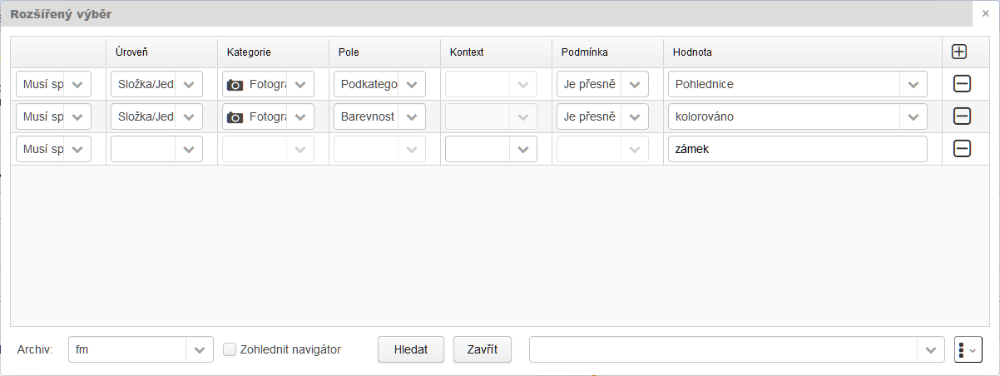

Konfigurace podmínek rozšířeného výběru má svojí přísnou logiku a je poměrně složitá (vyžaduje přesné logické zadávání). Věnujte proto zvýšenou pozornost následujícím vysvětlením a příkladům. 

!!! tip "Tip"

    Dvojklikem na záhlaví okna Rozšířeného výběru dojde k jeho srolování či zpětnému rozrolování. Umožní vám to pracovat s detailem formuláře bez nutnosti zavírání okna.

##### Co znamenají jednotlivé sloupce rozšířeného výběru?

*Pojmenování sloupců výběru vychází z primárního většinového užití (pohledávání archivního popisu). Pokud si však zvolíme jiné typy prohledávaných evidencí (sekundární užití), nesmíme tyto názvy sloupců brát doslovně Většinou pak mají trochu jiný význam (např. úroveň = ostatní druhy záznamů >> "kategorie" pak musíme chápat spíše jako položky podrobnějšího členění: uživatelé, číselníky apod.).* 

Jednotlivá kritéria výběru jsou rozdělena následovně:

**<u>Logický operátor (první sloupec):</u>** 

- ***Musí splňovat*** - výchozí hodnota; přísná podmínka. V případě vícenásobného použití (více řádku výběru) to bude mít za následek, že nalezené výsledky musí splňovat vždy každou z těchto podmínek. Analogicky se dá tento operátor přirovnat k *A zároveň*. 
- ***Může splňovat*** - méně přísná podmínka. Hraje roli de facto pouze v případech, kdy všechny násobné podmínky (řádky výběru) obsahují tuto podmínku. Budo to mít za následek, že nalezené výsledky budou splňovat alespoň jednu z podmínek. Pokud se tato podmínka vyskytuje na jedné úrovni s podmínkou *Musí splňovat*, stává se irelevantní. Funkční použití "musí..." zároveň s "může splňovat" - viz Vnořená podmínka. Analogicky se dá tento operátor přirovnat k *Nebo*.
- ***Nesmí splňovat*** -  přísná podmínka.

Tyto hodnoty lze kombinovat, poté určují, v jaké logické podmínce jsou vůči sobě dílčí kombinace (tzn. řádky) výběru, pokud je výběr definován více než jednou kombinací.

!!! warning "Varování"

    **S logickým operátorem "Musí splňovat" lze použít více kombinací/řádků výběru jen v případě, že bude u všech stejná úroveň.** Jinak funkce vrátí nulový počet nalezených záznamů - viz příklad č. 2.

**Vnořená podmínka**

Použití logických operátorů na stejné úrovni může byt někdy limitující. 

Např. pokud <u>budeme chtít dohledat fotografie, které v popisu obsahují výraz "Frýdek" **a zároveň** mají nastavenu barevnost na "barevné provedení" **nebo** "kolorováno"</u>, nesmíme podmínky specifikovat následovně: 

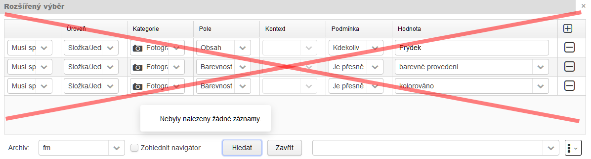

Nebyly nalezeny žádné záznamy, neboť jsme definovali nad jedním polem "Barevnost" hledání dvou různých hodnot, navíc všechny podmínky jako "musí splňovat". Pozn.: Teoreticky by to mohlo najít jen ty záznamy, které obsahuji zároveň fotografie kolorované i barevné. Nikoli tedy ty, které jsou buď kolorované, nebo barevné.

V případě, že bychom na 1. řádku uplatnili "musí splňovat" a na 2. a 3. "může splňovat", nalezlo by to všechny fotografie, které v popisu obsahují "Frýdek", a to nejen kolorované a barevné, ale i černobílé, tónované atd. Viz výše - irelevantnost podmínky "může splňovat".

Jak tedy správně dotaz formulovat? Použijeme tzv. **vnořenou podmínku**. Výběr vnořené podmínky je umístěn do kolonky *Úrovně*.

V standardním okně Rozšířený výběr nastavíme pouze 1. podmínku (... pole Obsah obsahuje Frýdek...) a jako 2. podmínku zvolíme Vnořená podmínka.

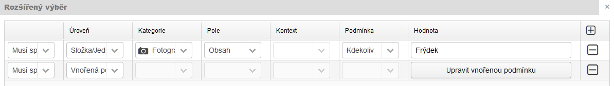

Pomocí tlačítka Upravit vnořená podmínku ji nadefinujeme: pole Barevnost je přesně "barevné provedení" a "kolorováno" - obě podmínky jako "může splňovat". 

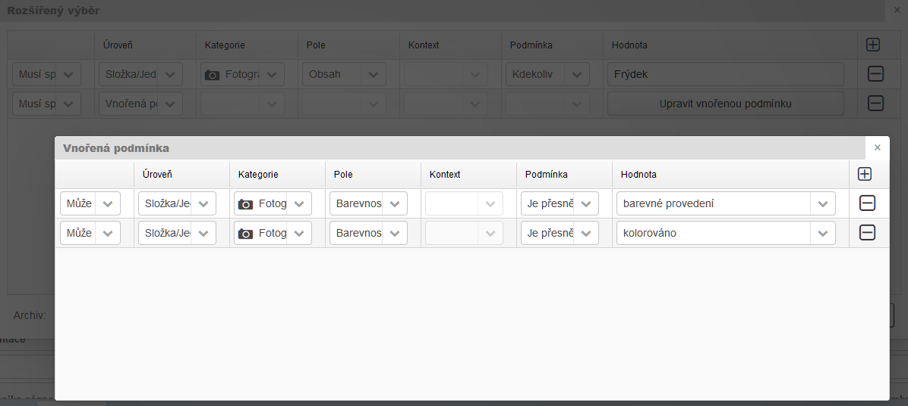

**<u>Úroveň</u>** 

Umožňuje specifikovat úroveň archivního popisu (sekundárně jiný typ evidence), ve které je hledáno. Výběr úrovně ovlivňuje nabídku dalších kritérii. 

- ***Prázdna hodnota*** - primárně umožňuje definovat pouze hledaný řetězec ve sloupci Hodnota. Jde de facto o stejný fulltextový způsob hledání jako u [5.6.2 Jednoduchý výběr z lišty nástrojů](manual_proarchiv.md#562-jednoduchy-vyber-z-listy-nastroju), avšak s tou zásadní výhodou, že zde lze **zohlednit konkrétní archiv nebo pozici navigátoru** (viz níže + příklad č. 1).

    Sekundárně lze použít i sloupec Kontext, který v tomto případě znamená *<u>výběr třídy přístupového bodu</u>* a v kombinaci s hodnotou, *kterou tvoří přístupový bod, prohledá a  vrátí záznamy, ke kterým je přístupový bod napojen (viz příklad č. 7)*

- ***Soubor / Série / Složka, jednotlivost, část jedn.*** - konkrétní úroveň archivního popisu

- Specifickou položkou je ***Vnořená podmínka*** - viz výše.

- Položkou ***Ostatní druhy záznamů*** se nasměřuje hledání do jiných pomocných evidencí (např. statické výstupy z PEVY, číselníkové hodnoty, seznamy uživatelů)

- ***Uložený výběr*** - umožní načíst uložený výběr. Další řádky (výběrová kritéria) pak upřesňují hledání jen v záznamech, které obsahuje uložený výběr. Platí zde omezující podmínka: pokud je použito "musí splňovat" pak úroveň v dalších řádcích se musí shodovat s úrovní záznamů v uloženém výběru. Např. pokud uložený výběr obsahuje jen záznamy úrovně série a další výběrové kritérium počítá s úrovní "složka/jednotlivost", nebude logicky nic nalezeno. V tomto případě se musí použít speciální úroveň "Je v podstromech". Funkční užití - viz příklad č. 11)

- ***Je v podstromech*** - speciální úroveň prohledávání, která vznikne díky specifikaci přes "Upřesňující podmínku" (viz příklad č. 12). Její použití vygeneruje omezenou množinu vyhledaných záznamů, **v jejich podzáznamech (podstromech)** se pak následně hledá dle dalších řádků / výběrových podmínek. Kromě upřesňující podmínky lze použít i "Je ve výběru" - pak hledá jen v podzáznamech (podstromech) záznamů, které již jsou fakticky ve výběru. **Pozor! Je třeba si uvědomit, že to nehledá přímo v záznamech definovaných upřesňující podmínkou či načtených z výběru, ale až v jejich podzáznamech (potomcích v hierarchii) - nelze to tedy uplatnit na "plochou" množinu záznamu bez hierarchie.**

**<u>Kategorie</u>**

Primárně pro výběr ze všech kategorií záznamů. Aktivní pouze, když úroveň = složka/jednotlivost/ část jednotlivosti (viz příklad č. 4). 

U volby úrovně = "Ostatní druhy záznamů" se tím myslí jednotlivé množiny hodnot.

**<u>Pole</u>**

Nabídka polí, která jsou aktuální pro zvolenou úroveň a případnou kategorii. Kromě popisných formulářových polí se v této nabídce vykytují **i role** používané při zápisu přístupových bodů (viz příklad č. 5).

!!! warning "Varování"

    Nabídka polí je přesná a korektní v případě, že je zvolena *úroveň* = "soubor" nebo "série". U *úrovně* = "složka, jednotlivost, část jedn." je nabídka přesná a korektní pouze pokud je zvolená nějaká *kategorie*. Pokud tomu tak není, jsou nabízena všechna obecná pole, která však nemusí být u všech záznamu uplatňována. Pokud např. u úrovně "složka, jednotlivost, část jedn." není vybrána *kategorie*, v nabídce polí se objevuje i pole Číslo pomůcky. Jeho prohledání ovšem vrátí nulový výsledek, neboť pole číslo pomůcky není u těchto úrovní uplatňováno (uplatňuje se pouze na sérii typu pomůcka). Jak hledat tedy hledat záznamy z konkrétní pomůcky? Viz příklad č. 2.

!!! tip "Tip"

    Pokud aplikace využívá [Vizuální editor souřadnic](manual_proarchiv.md#vizualni-editor-souradnic), je u prvku popisu Souřadnice k dispozici speciální možnost vyhledávání. Pomoci ní lze vyznačením kruhové oblasti na mapě najít všechny záznamy, které obsahují souřadnicové údaje (koordináty) z prohledávané oblasti - viz příklad č. 15. 

**<u>Kontext</u>** 

Nabídka se dynamicky proměňuje dle zvolených předchozích kritérií.

- Pokud je určena ***pouze úroveň*** nebo dokonce pokud úroveň určená vůbec není (prázdná hodnota) = poté nabízí výběr *<u>třídy přístupových bodů</u>*, což v kombinaci s hledanou hodnotou, kterou tvoří přístupový bod, prohledá a vrátí záznamy, ke kterým je přístupový bod napojen (viz příklad č. 7). Toto hledání neřeší, v jaké roli se přístupový bod nachází. Pokud bychom chtěli roli zohlednit, postupujeme dle příkladu č. 5 (role se určuje ve sloupci Pole). 

- Pokud je zároveň určená ***úroveň i pole, které se skládá z číselníkové hodnoty (kontextu)*** a zapsané hodnoty (např. Jiné datace - datace zpečetění / datace vydání dokumentu...; Původní/jiné označení - Inv. číslo / Signatura...) pak se právě zde <u>*číselníkové hodnoty*</u> nabízejí. Viz příklad č. 6.


**<u>Podmínka</u>**

Slouží pro upřesnění způsobu hledání:

- U polí s textovým zápisem nabízí pozici hledané hodnoty: 

  | Podmínka                       | Popis                                                        |
  | ------------------------------ | ------------------------------------------------------------ |
  |                                | Bez udání podmínky. Základní způsob hledání. Ostatní podmínky používejte v případě, že potřebujete hledat detailněji. |
  | *Kdekoli (celé pole)*          | Bere v úvahu obsah celého pole jako celek - v něm hledá kdekoli. |
  | *Na začátku (celé pole)*       | Bere v úvahu obsah celého pole jako celek - poté hledá, čím (hledaná hodnota) celé pole začíná. |
  | *Na konci (celé pole)*         | Bere v úvahu obsah celého pole jako celek - poté hledá, čím (hledaná hodnota) celé pole končí. |
  | *Kdekoli (v kořenech slov)*    | Rozdělí obsah pole na jednotlivé části (zjednodušeně slova) - poté hledá kdekoli |
  | *Na začátku (v kořenech slov)* | Rozdělí obsah pole na jednotlivé části (zjednodušeně slova) - poté hledá na začátku těchto slov - zda tato slova začínají hledanou hodnotou bez ohledu na jednotlivé pořadí slov v celém obsahu pole. |
  | *Na konci (v kořenech slov)*   | Rozdělí obsah pole na jednotlivé části (zjednodušeně slova) - poté hledá na konci těchto slov - zda tato slova končí hledanou hodnotou bez ohledu na jednotlivé pořadí slov v celém obsahu pole. |
  | *Celé slovo*                   | Hledá jen celá slova, nikoli kořeny slov. Např. přesné číselné hodnoty (viz příklad č. 6) |
  | *Fráze*                        | Vyhledá hledaný řetězec, tak jak je napsaný. Např. přesné pořadí slov a jejich tvarů. Hlavně zohledňuje nealfanumerické znaky. Viz příklad 10. |
  | *Je nevyplněno*                | V kombinaci s logickým operátorem "musí splňovat" a konkrétním polem najde záznamy, které dané pole vyplněno nemají (viz příklad č. 8). Pokud ale použijeme operátor "nesmí splňovat" najde přesný opak - záznamy s vyplněným zvoleným polem (viz příklad č. 9). |

- U číselníkových polí je potřeba zvolit *Je přesně* + vybrat požadovanou číselníkovou hodnotu.

- U polí pro zápis časových údajů nabízí:

  *Časový rozsah* - hledá čistý časový údaj = nezohledňuje odhady. Hodnota hledaného výrazu se zapisuje dle platné syntaxe (použití // závorek je u této podmínky irelevantní). Např. po zadání "1950" a najde 1950 i /1950/ i 1945 - 1960 i /1945 - 1960/ apod. Pokud bychom zadali "/1950/", výsledek bude stejný (použití viz příklad č. 3).

  *Časový rozsah - zohledňovat odhady* - zohledňuje odhady. Hodnota hledaného výrazu se zapisuje dle platné syntaxe včetně použití // závorek (u této podmínky relevantní). Např. po zadání "1950" a najde 1950 a 1945 - 1960 nikoli /1950/ a /1945 - 1960/ apod. Pokud bychom zadali "/1950/", výsledek bude opačný.

  *Výraz* - hledá nevalidní výrazy mimo platnou syntaxi zápisu. Např. "s.d." apod.

  *Nevalidní hodnota* - vyhledá všechny nevalidní časové údaje. Hodnota se u této podmínky nevyplňuje!
  
- Pro pole, které se skládají s více prvků popis, např. Popis obsahu u matrik - zde se automaticky uplatňuje *upřesňující podmínka* (použití viz příklad č. 13)

- Při kombinaci hledání v záznamech a k nim připojeným přístupovým bodům - rovněž se uplatňuje *upřesňující podmínka* (použití viz příklad č. 14)

- Pro speciální úroveň "Je v podstromech": *Je ve výběru* / *Vnořená podmínka* - viz výše (Úroveň)

**<u>Hodnota</u>**

Pro textový zápis hledaného výrazu; u číselníkových polí výběr z číselníkových hodnot.

!!! warning "Upozornění"

    **U textově zadávaných řetězců je si potřeba uvědomit, že vyhledávací mechanismus ne vždy zohlední nealfanumerické znaky** *(= znaky, které nejsou písmenem nebo číslem, např. tečka, čárka, lomítko, spojovník apod.)* U fulltextových dotazů (jednoduchý výběr z lišty nástrojů vpravo nahoře nebo "jednoduchý" rozšířený výběr z příkladu č. 1) je sice znak tečky a lomítka akceptován, ale v případě, kdy je již specifikováno kritérium "pole", pak již nikoli. Je pak potřeba specifikovat podmínku = Fráze. **U vyhledávání řetězců s nealfanumerickými znaky je proto vždy, pokud je volba aktivní, doporučeno použít podmínku = Fráze.** (viz příklad č. 10)    

**<u>Archiv</u>** 

Zde je možno omezit hledání jen nad konkrétním archivem. Výchozí stav = vybrány všechny archivy.

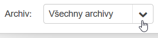

**<u>Zohlednit navigátor</u>**

Pokud je volba zatržena, hledání bude provedeno jen uvnitř úrovně, kterou máte vybranou v navigátoru, tzn. v režimu zobrazení Archivní soubory je to vždy maximálně jeden archivní soubor; v režimu zobrazení Tematické databáze lze zvolit všechny uzly (archiv - tematická databáze - případná kapitola) kromě hlavního uzlu Tematické databáze.

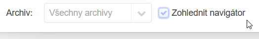

##### Správa uživatelských výběrů


Umožňuje spravovat nadefinované výběry: 

<u>Uložit</u> - uloží změny do zvoleného uloženého výběru nebo uloží jako nový, pokud není žádný předchozí vybrán. 

<u>Uložit jako nové</u> - uloží výběr jako nový po zadání názvu do "Jméno pro výběr".

<u>Odstranit</u> - odstraní z vaší kolekce výběrů zvolený uložený výběr. 

<u>Uložit definici výběrů</u> - vygeneruje externí soubor (.json) s nastavením všech vašich uložených výběrů.

<u>Načíst definici výběrů</u> - umožní načíst externě uloženou definici výběrů. 

1) *Načíst definici ze souboru* - zvolit umístění souboru s definicí (.json ) 

2) *Přidat* - V případě, že zvolený soubor již obsahuje výběr se stejným názvem jako již existující výběr, existující výběry budou ponechány a budou doplněny pouze rozdíly.

3) *Přepsat* - V případě, že zvolený soubor již obsahuje výběr se stejným názvem jako již existující výběr, existující výběry budou přepsány výběry ze souboru.

4) *Nahradit* - Všechny uložené výběry budou nahrazeny výběry ze souboru.

5) *Zavřít* - Zavře okno bez provedení akce.

##### Názorné příklady rozšířených výběrů

***Příklad č. 1*** - <u>Hledám výraz "most" ve všech záznamech v rámci archivu SOkA F-M</u>


```
Logický operátor = Musí splňovat; Hodnota = most + Archiv = fm.
```

------

***Příklad č. 2*** - <u>Hledám fotografie z pomůcky č. 491 v SOkA Frýdek-Místek</u>

Pokud neznám umístění pomůcky č. 491, provedu nejprve její hledání:


```
Logický operátor = Musí splňovat; Úroveň = Série; pole = Číslo pomůcky; podmínka = Celé slovo; hodnota = 491 + archiv = fm
```

Poté se postavím v navigátoru na uzlový bod pomůcky pokračuji v hledání již na úrovni = složka/jednotlivost...


```
Logický operátor = Musí splňovat; Úroveň = Složka/jednotlivost...; kategorie = Fotografie...; pole = Podkategorie; Podmínka = Je přesně; hodnota = Fotografie + zatržení "Zohlednit navigátor"
```

Vzhledem k tomu, že záznamy na úrovni složka/jednotlivost/část jednotlivosti přímo neobsahují údaje o nadřazeném archivním souboru a pomůcce (jsou jen děděny díky hierarchickému postavení), nezafungoval by následující kombinovaný dotaz:


----------

***Příklad č. 3*** - <u>Hledám všechny záznamy z archivního souboru Archiv města Místek (NAD 826, FM), které jsou datované v rozsahu 1850-1890.</u>

V navigátoru (režim zobrazení Archivní soubory) vyberu fond Archiv města Místek, poté provedu následující hledání:


```
Logický operátor = Musí splňovat; Úroveň = Složka/Jednotlivost...; pole = Datace vzniku; podmínka = Časový rozsah; hodnota = 1850-1890 + zatržení "Zohlednit navigátor"
```

****

***Příklad č. 4*** - <u>Hledám všechny listiny z Lenního dvora Kroměříž (NAD 1416, ZAO)</u>

V navigátoru (režim zobrazení Archivní soubory) vyberu fond Lenní dvůr Kroměříž, poté provedu následující hledání:


```
Logický operátor = Musí splňovat; Úroveň = Složka/jednotlivost...; kategorie = Listiny + zatržení "Zohlednit navigátor"
```

!!! note "Poznámka"

    Nalezeny budou skutečně všechny listiny, které mají kategorii záznamu = Listiny, tzn. jsou zapsané v tematické databázi (TD) Listiny. U starších pomůcek tak může nastat situace, kdy ne všechny tematicky příslušné archiválie byly dodatečně katalogizovány v příslušné TD. Přesnější popis tohoto hledání by měl tedy znít: "Hledám všechny záznamy kategorie Listiny z Lenního dvora Kroměříž (NAD 1416, ZAO)".

***Příklad č. 5*** - <u>Hledám všechny fotografie, jejichž autorem je Milan Klega</u>

Provedu následující hledání:


```
Logický operátor = Musí splňovat; Úroveň = Složka/Jednotlivost...; kategorie = Fotografie; pole = fotograf (role); kontext = Osoba; podmínka = Je přesně; hodnota zadaná výběrem z našeptávače
```

***Příklad č. 6*** - <u>Hledám záznam s inv. číslem 12 v konkrétní pomůcce</u>

V navigátoru (režim zobrazení Archivní soubory) vyberu konkrétní pomůcku, poté provedu následující hledání:


```
Logický operátor = Musí splňovat; Úroveň = složka/jednotlivost...; pole = Původní/jiné označení; podmínka = celé slovo*; hodnota = 12 + zatržení "Zohlednit navigátor"
*) pokud by nebyla použita podmínka "celé slovo", nalezlo by to i záznamy 120, 121...  
```

***Příklad č. 7*** - <u>Hledám všechna použití/napojení přístupového bodu třídy geografický objekt "Bílá (Frýdek-Místek, Česko)" v záznamech archivních souborů SOkA Frýdek-Místek</u>

Provedu následující hledání:


```
Logický operátor = Musí splňovat; Úroveň = prázdná; kontext = Geografický objekt; podmínka = Je přesně; hodnota = dosazen preferované označení přístupového bodu přes našeptávač + archiv = fm
```

***Příklad č. 8*** - <u>Hledám v pomůcce záznamy, u kterých není vyplněno pole Ukládací jednotka</u>

V navigátoru (režim zobrazení Archivní soubory) vyberu konkrétní pomůcku, poté provedu následující hledání:


```
Logický operátor = Musí splňovat; Úroveň = Složka/Jednotlivost...; pole = Ukládací jednotka; podmínka = Je nevyplněno + zatržení "Zohlednit navigátor"
```

***Příklad č. 9*** - <u>Hledám v pomůcce záznamy, u kterých je vyplněna Digitalizační sada (v poli Původní/jiné označení)</u>

V navigátoru (režim zobrazení Archivní soubory) vyberu konkrétní pomůcku, poté provedu následující hledání v kombinaci **Nesmí splňovat + Je nevyplněno**:


```
Logický operátor = Nesmí splňovat; Úroveň = Složka/Jednotlivost...; pole = Původní/Jiné označení; podmínka = Je nevyplněno + zatržení "Zohlednit navigátor"
```

***Příklad č. 10*** - <u>Hledám všechny záznamy archivního popisu, které jsem vytvořil</u>

Zajímají mě jak úrovně série, tak úrovně složky/jednotlivosti... Vzhledem k tomu, že kombinuji dvě různé úrovně, musím použít pouze logický operátor "může splňovat":


```
Logický operátor = Může splňovat; Úroveň = (1.) série/ (2.) Složka/Jednotlivost...; hodnota = přijmení uživatele (bez diakritiky)
```

!!! warning "Upozornění"

    Zápis jména do pole Vytvořil/Změnil se postupně měnil. Původně se zde automatizovaně zapisovalo přihlašovací jméno (r.michna), nyní se zde automatizovaně zapisuje lidsky čitelná podoba (Michna Radomír, Mgr.). Proto je potřeba jako hledaný řetězec ideálně zvolit příjmení bez diakritiky (velikost písmen nehraje roli). Budou tak zohledněny oba způsoby zápisu.

***Příklad č. 11*** - <u>Hledám (filtruji) záznamy z již uloženého výběru</u>

V uloženém výběru mám záznamy z archivu F-M kategorie Fotografie, pohlednice, tisková vyobrazení a nyní chci vyfiltrovat pouze pohlednice:


```
(1) Logický operátor = Musí splňovat; Úroveň = Uložený výběr; hodnota = (uložený výběr)
(2) Logický operátor = Musí splňovat; Úroveň = Složka/jednotlivost...; kategorie = Fotografie...; pole = Podkategorie; podmínka = Je přesně; hodnota = pohlednice
```

***Příklad č. 12*** - <u>Hledám všechny záznamy podkategorie technický výkres v autorizovaných archivních pomůckách dle NZP</u>

Nejprve je potřeba vyhledat všechny autorizované pomůcky dle NZP a následně v nich jen záznamy podkategorie "technicky výkres". Jelikož nemohu použít v jednom výběru hledání v různých úrovních (tedy sériích a složkách/jednotlivostech) najednou, použiji na prvním řádku speciální funkci/úroveň "**Je v podstromech**" spolu s "Upřesňující podmínkou":

```
(1-1) Logický operátor = Musí splňovat; Úroveň = série; pole = Stav pomůcky; podmínka = Je přesně; hodnota = autorizovaná
(1-2) Logický operátor = Musí splňovat; Úroveň = série; pole = Pravidla; podmínka = Je přesně; hodnota = NZP
```


Díky tomuto první řádku výběrové podmínky dojde poté k vyhledání oněch uzlových bodů (= autorizovaných pomůcek dle NZP), v jejichž obsahu (podstromech) se pak bude prohledávat dle dalších řádků (tzn. jen složky/jednotlivosti... podkategorie technický výkres):

```
(1) Logický operátor = Musí splňovat; Úroveň = Je v podstromech; podmínka = Upřesňující podmínka = nastavení viz výše
(2) Logický operátor = Musí splňovat; Úroveň = Složka/Jednotlivost...; kategorie = Mapy, atlasy a technické výkresy; pole = Podkategorie; podmínka = Je přesně; hodnota = technický výkres
```

***Příklad č. 13*** - <u>Hledám záznamy ve speciálních polích, která se skládají z dalších dílčích prvků popisu</u>

Některá pole na detailu popisného formuláře se needituji přímo, ale skládají se ze skupiny dílčích prvků popisu. Např. záznamy tematické databáze Matriky obsahují pole Popis obsahu, které se skládá s "charakteru", "poznámky" a "časového rozsahu". Pokud je potřeba v těchto dílčích polích hledat (např. všechny matriky narození, tzn. charakter = N), postupujeme následovně:


```
(1-1) Logický operátor = Musí splňovat; Úroveň = Složka/jednotlivost...; kategorie = Matriky; pole = Popis obsahu; hodnota = Upřesňující podmínka (je zvolena automaticky)
(1-2: okno upřesňující podmínky) pole = Charakter; podmínka = Je přesně; hodnota = N
```

*Příklad č. 14* - <u>Hledám všechny pomůcky, u kterých byl v příslušném archivu proveden export do formátu EAD3</u>


```
(1) Logický operátor = Musí splňovat; Úroveň = série; Pole = Stav pomůcky; Podmínka = Je přesně; Hodnota = autorizovaná
(2) Logický operátor = Nesmí splňovat; Úroveň = série; Pole = Datum posledního exportu do EAD3; Podmínka = Je nevyplněno
```

!!! tip "Tip"

    Některé zvláště kombinované dotazy působí složitě. Pokud je ale používáte častěji, neváhejte si je uložit pomoci [Správy uživatelských výběrů](manual_proarchiv.md#sprava-uzivatelskych-vyberu). Při jejich opětovném výběru pak stačí většinou jen změnit konec dotazu (hledanou hodnotu, prohledávanou oblast...)

##### Další příklady rozšířených výběrů

- <u>Vyhledání záznamů, které obsahují přílohy:</u> úroveň = Složka/Jednotlivost...; *kategorie = může být, ale nemusí*; pole = Existence kopií JP; podmínka = Je přesně; hodnota = ano
- <u>Vyhledání záznamů archivního popisu, které jsem vytvořil po určitém datu (např. od 1. 9. 2019 včetně):</u> (1) úroveň = Složka/Jednotlivost...; pole = Vytvořil; hodnota = "michna" + (2) úroveň = Složka/Jednotlivost...; pole = Vytvořeno; podmínka = Časový rozsah; hodnota = "1.9.2019 -"

#### 5.6.4 Hledání v navigátoru

Uplatněno v režimu zobrazení "Archivní soubory"


Umožňuje prohledávat, resp. filtrovat hlavní uzly navigátoru - archivní soubory.

Ve výchozím stavu je zobrazen prefix příslušného archivu, např. fm// pro SOkA Frýdek-Místek.

Spuštění hledání / filtrování - klávesou Enter nebo ikonou 

##### 5.6.4.1 Hledání dle čísla NAD

Pokud je číslo NAD vepsáno za příslušný prefix archivu, nalezne to archivní soubor pouze v daném archivu (např. fm//666 = Okresní úřad Místek). Pokud je prefix smazán a je vepsáno pouze číslo NAD, nalezne všechny odpovídající archivní soubory ve všech archivech, které aplikace spravuje (např. 666 = Okresní úřad Místek (SOkA Frýdek-Místek), Místní školní rada Stonava (SOkA Karviná) atd.).

##### 5.6.4.2 Hledání dle názvu archivního souboru

Pro hledání podle názvu je potřeba nejprve smazat prefix archivu, poté vepsat požadovaný název. Např. "archiv obce" nalezne všechny archivní soubory Archiv obce XY ve všech archivech, které aplikace spravuje.

##### 5.6.4.3 Poslední záznam

Funkce se aktivuje z kontextového menu záznamu v navigátoru a zobrazí v detailu (i tabulce) záznam, který splňuje následující kritérium:

- ***Poslední založený záznam v podstromu***
- ***Poslední založený záznam uživatelem xy*** (= právě přihlášeným uživatelem) ***v podstromu***
- ***Poslední uložený záznam v podstromu*** - tzn. naposledy upravený/aktualizovaný
- ***Poslední uložený záznam uživatelem xy*** (= právě přihlášeným uživatelem) ***v podstromu*** - tzn. naposledy upravený/aktualizovaný

!!! tip "Tip"

    Funkce Poslední záznam vám pomůže rychle najít místo, kde jste minule skončili.

##### 5.6.4.4 Načíst archivní soubory z výběru

Načte do navigátoru všechny archivní soubory, pod které se nacházejí v záložce [Výběr](manual_proarchiv.md#462-vyber-zalozka). Pozor! Akceptuje jen vybrané záznamy úrovně "archivní soubor"!

#### 5.6.5 Vícenásobný výběr

Přepne zobrazení tabulky (záložku Záznamy) do speciálního režimu, ve kterém je možno pomoci myší a tlačítek Ctrl nebo Shift vybrat více záznamů najednou pro následnou akci - např. Přidat do výběru.

Při aktivaci této funkce se název záložky Záznamy změní na Vícenásobný výběr - obsah zůstává stejný. Zároveň se zobrazí zatržení u této funkce v Liště nástrojů. Po deaktivaci přejde záložka Záznamy opět do standardního režimu.

!!! tip "Tip"

    Pokud chcete vybrat více záznamů, které následují přímo za sebou, klikněte na první z nich, stiskněte a držte klávesu Shift, zároveň klikněte na poslední záznam, který chcete vybrat, uvolněte klávesu Shift. Mělo by dojít k označení (zamodří se) řady záznamů za sebou.
    Pokud chcete vybrat více záznamů, které ale na sebe nenavazují, stiskněte a držte klávesu Ctrl a postupně klikejte na požadované záznamy v libovolném pořadí. Kliknutím na již vybraný záznam dojde naopak k jeho odznačení.
    Obě varianty se dají kombinovat.


#### 5.6.6 Najdi a nahraď / Hromadné změny

Funguje pouze v režimu "Zápis".

!!! tip "Tip"

    Pomoci funkce ["Vrácení hromadné akce"](manual_proarchiv.md#5661-vraceni-hromadne-akce) lze hromadnou změnu vrátit zpět. 

Funkce "Najdi a nahraď" funguje na principu nalezení požadované hodnoty (včetně libovolné hodnoty a stavu nevyplněno) a jejím následným nahrazením za hodnotu novou (či možnost úplného odstranění). Část pro definici nalezené hodnoty je principiálně stejná jako u [Rozšířeného výběru](manual_proarchiv.md#563-rozsireny-vyber): Úroveň / Kategorie / Pole / Kontext / Podmínka / Hodnota. Na rozdíl od rozšířenému výběru je dotazovací část této funkce vždy nutno specifikovat co nejvíc detailněji. **Jednotlivé kolonky nastavení Najdi a nahraď se zobrazují postupně a reagují na předchozí volby.**

<u>**Zdroj záznamů**</u>

Určuje, nad kterými záznamy akce hromadného nahrazení proběhne: Výběr = proběhne nad všemi záznamy ze záložky Výběr / Navigátor = proběhne nad všemi záznamy vnořenými pod úrovní, která je v navigátoru právě vybrána.

<u>**Úroveň**</u>

Nutno vybrat některou z úrovní.

<u>**Kategorie**</u>

Nutno vybrat **konkrétně některou z kategorií**, případně použít položku ***Společná pole*** (umožní následně vybrat *univerzální pole napříč kategoriemi* nebo *třídu přístupového bodu*) nebo ***Role přístupových bodů*** (umožní následně specifikovat konkrétní roli).

**<u>Pole</u>**

Nabízí výběr polí (nebo rolí) dle zvolené položky v části Kategorie.

**<u>Kontext</u>**

Uplatňuje se, pokud je v části Pole vybráno:

- **pole, které se skládá z číselníkových hodnot (kontextu) a zapsaných hodnot** (např. Původní/jiné označení, Jiné datace).  Nabízí <u>*číselníkové hodnoty*</u>; navíc je zde i univerzální hodnota ***<libovolné>***

- **role přístupového bodu**, poté nabízí *<u>třídy přístupového bodu</u>* 

**<u>Podmínka</u>**

- **Libovolná hodnota** - jakákoli hodnota, i nulová.
- **Nevyplněno** - nahradí jen prázdná pole. 
- *dále následují nabídky dalších podmínek, měnící se v závislosti na zvoleném typu pole* (<u>u textových polí a polí kontextem a hodnotou</u>: **Hodnota obsahuje** / **Hodnota začíná na** / **Hodnota končí na**; <u>u polí s kontextem a hodnotou</u> navíc: **Pouze kontext** (viz příklad č. 2); <u>u číselníkových polí a polí s přístupovými body:</u> **Se rovná**)

!!! tip "Tip"

    Při použití "Nevyplněno" lze provádět i hromadné doplňování hodnot do prázdných polí. 

<u>**Velikost písma**</u>

Uplatňuje se, pokud je v části Pole vybráno pole s textovým zápisem:

- **Nezáleží** - nezohledňuje velikost písmen
- **Záleží** - zohledňuje velikost písmen

**<u>Hledaná hodnota</u>**

Pro textový zápis hledaného výrazu; u číselníkových polí výběr z číselníkových hodnot. V případě podmínky "Libovolná hodnota" nebo "Nevyplněno" se nenabízí.

**<u>Operace</u>**

| Operace                                   | Popis                                                        |
| ----------------------------------------- | ------------------------------------------------------------ |
| Nahradit celé pole                        | Pokud nalezne hledaný výraz (nebo je zvoleno Nevyplněno či Libovolná hodnota), nahradí celé pole. |
| Nahradit nalezenou část                   | Pokud nalezne hledaný výraz (v kombinaci s podmínkou Hodnota obsahuje), nahradí jen ten. |
| Nahradit nalezenou část - všechny výskyty | Pokud nalezne hledaný výraz (v kombinaci s podmínkou Hodnota obsahuje), nahradí jen ten, a to i vícekrát, pokud se v poli vícekrát vyskytuje. |
| Nahradit za                               | Nahradí za jinou hodnotu (u číselníkových polí a přístupových bodů) |
| Přidat před                               | Pokud je zvolena Libovolná hodnota, přidá novou hodnotu před původní celý obsah. Je vhodné končit novou hodnotu mezerou nebo zvolit Druh spojovníku. |
| Přidat za                                 | Pokud je zvolena Libovolná hodnota, přidá novou hodnotu za původní celý obsah. Je vhodné začít novou hodnotu mezerou nebo zvolit Druh spojovníku. |
| Nahradit kontext                          | Umožňuje nahradit pouze kontext - číselníkovou hodnotu u polí skládajících se s kontextu a hodnoty (např. Původní/jiné označení). Viz příklad č. 2 |
| Odpojit první výskyt v záznamu            | Odpojí nalezený přístupový bod - jen první výskyt v záznamu. |
| Odpojit všechny výskyty u záznamu         | Odpojí nalezený přístupový bod - všechny výskyty.            |
| Přidat nový kontext a hodnotu na konec    | Přidá nový kontext + novou hodnotu (u polí skládajících se s kontextu a hodnoty, např. Původní/jiné označení). |
| Odstranit / Odstranit celou hodnotu       | Odstraní hodnotu - vymaže obsah pole.                        |
| Odstranit všechny hodnoty                 | Odstraní všechny zapsané hodnoty u polí s možnosti zápisu vícero hodnot (např. Jazyk). |
| Odstranit kontext i hodnotu               | Odstraní kontext i hodnotu (u polí skládajících se s kontextu a hodnoty, např. Původní/jiné označení). |
| Odstranit všechny hodnoty včetně kontextů | Odstraní všechny hodnoty včetně kontextů (u polí skládajících se s kontextu a hodnoty, např. Původní/jiné označení). |

<u>**Druh spojovníku**</u>

uplatňuje se pouze při operacích "Přidat před" a "Přidat za"; nabývá hodnot: 

- **Žádný** - novou hodnotu připojí přímo před/za původní hodnotu
- **Mezera** - před/za novou hodnotu umístí mezeru
- **Nový řádek** - vytvoří nový řádek u polí, kde je umožněn víceřádkový textový zápis; u jednořádkových polí se projeví jako mezera.

**<u>Nahrazovaný kontext</u>**

Uplatňuje se, pokud je v části Pole vybráno pole, které se skládá z číselníkových hodnot (kontextu) a zapsaných hodnot (např. Jiné datace - datace zpečetění / datace vydání dokumentu...; Původní/jiné označení - Inv. číslo /  Signatura...) pak se zde nabízejí *číselníkové hodnoty*. 

**<u>Třída přístupového bodu</u>**

Uplatňuje se, pokud je v části Pole vybrána role přístupového bodu.

**<u>Nová hodnota</u>**

Pro textový zápis nové hodnoty; u číselníkových polí výběr z číselníkových hodnot.

##### 5.6.6.1 Vrácení hromadné akce


**Pomocí tlačítka Vrátit umožní vrátit** původní podobu záznamů, které byly změněny <u>**poslední**</u> provedenou akcí Najdi a nahraď. Jde tedy o "krok zpět" poslední hromadné akce konkrétního uživatele. Je zobrazen zjednodušený textový zápis všech podmínek a operací hromadné změny. Tlačítko Záznamy do výběru umožní dotčené záznamy zobrazit v záložce Výběr.

!!! warning "Upozornění"

    Pokud mezi dokončením poslední hromadné akce a vyvoláním této funkce došlo ke změně některých dotčených záznamů, nebude u nich původní podoba vrácena. Uživatel na to bude upozorněn hlášením "Některé záznamy již nebylo možné vrátit" a dotyčné záznamy budou zobrazeny v záložce K dořešení.

##### Názorné příklady hromadných změn

***Příklad č. 1*** - <u>Chci dosadit v pomůcce u všech záznamů Možnost zveřejnění = popisná data + přílohy s možností stažení</u>

V navigátoru (režim zobrazení Archivní soubory) vyberu konkrétní pomůcku, poté provedu následující nahrazení:


```
Zdroj záznamů = Navigátor; Úroveň = Složka/Jednotlivost...; Kategorie = Společná pole; Pole = Možnost zveřejnění; Podmínka = Libovolná hodnota; Operace = Nahradit za; Nová hodnota = popisná data + přílohy s možností stažení
```

***Příklad č. 2*** - <u>Chci při reinventarizaci pomůcky změnit označení Inv. číslo</u>

V navigátoru (režim zobrazení Archivní soubory) vyberu konkrétní pomůcku, poté provedu následující nahrazení:


```
Zdroj záznamů = Navigátor; Úroveň = Složka/Jednotlivost...; Kategorie = Společná pole; Pole = Původní/jiné označení; Kontext = Inv. číslo; Podmínka = Pouze kontext; Operace = Nahradit kontext za jiný; Nahrazovaný kontext = Původní inv. číslo.
```

***Příklad č. 3*** - <u>Chci hromadně doplnit signaturu G 26</u>

Pokud se doplnění týká všech jednotek popisu určité série, pak v navigátoru (režim zobrazení Archivní soubory) vyberu konkrétní sérii, nebo akci aplikuji na výběrem:


```
Zdroj záznamů = Navigátor nebo Výběr; Úroveň = Složka/Jednotlivost...; Kategorie = Společná pole; Pole = Původní/jiné označení; Kontext = <libovolný>; Podmínka = Libovolná hodnota; Operace = Přidat novou hodnotu na konec; Nový kontext = Signatura; Nová hodnota = G 26
```

***Příklad č. 4*** - <u>Chci hromadně odstranit údaj o inventárním číslu</u>

Pokud se odstranění týká všech jednotek popisu určité série, pak v navigátoru (režim zobrazení Archivní soubory) vyberu konkrétní sérii, nebo akci aplikuji na výběrem:


```
Zdroj záznamů = Navigátor nebo Výběr; Úroveň = Složka/Jednotlivost...; Kategorie = Společná pole; Pole = Původní/jiné označení; Kontext = Inv. číslo; Podmínka = Libovolná hodnota; Operace = Odstranit kontext i hodnotu
```
***Příklad č. 5*** - <u>Chci hromadně přidat k vícero záznamům přístupový bod v určité roli</u>

Postupujeme následovně:


Kombinací kontextu "<libovolný>" a podmínky "Libovolná hodnota" docílíme toho, že se přístupový bod doplní jednak u záznamů, kde daná role ještě nebyla uplatněna, jednak i u těch, kde ano (třeba s jiným přístupovým bodem).

```
Zdroj záznamů = Navigátor nebo Výběr; Úroveň = Složka/Jednotlivost...; Kategorie = konkrétní kategorie; Pole = konkrétní role; Kontext = <libovolný>; Podmínka = Libovolná hodnota; Operace = Přidat novou hodnotu na konec; Typ přístupového bodu = třída přístupového bodu; Přístupový bod = konkrétní přístupový bod
```

Pokud chceme doplnit přístupový bod v určité roli jen k záznamům, u kterých doposud tato role není uplatněna, postupujeme následovně: 


Jako podmínku vybereme "Nevyplněná hodnota".

```
Zdroj záznamů = Navigátor nebo Výběr; Úroveň = Složka/Jednotlivost...; Kategorie = konkrétní kategorie; Pole = konkrétní role; Kontext = třída přístupového bodu; Podmínka = Nevyplněná hodnota; Operace = Přidat novou hodnotu na konec; Typ přístupového bodu = třída přístupového bodu; Přístupový bod = konkrétní přístupový bod
```

***Příklad č. 6*** - <u>Chci hromadně změnit vazbu archivního popisu k jednomu přístupovému bodu směrem na jiný přístupový bod</u>

Postupujeme následovně:


Kombinací kontextu "<libovolný>" docílíme toho, že se přístupový bod nahradí ve všech rolích. Hodnota = původní nahrazovaný PB; nová hodnota = nový PB.

```
Zdroj záznamů = Navigátor nebo Výběr; Úroveň = Složka/Jednotlivost...; Kategorie = společná pole; Pole = třída PB; Kontext = <libovolný>; Podmínka = se rovná; Hodnota = původní nahrazovaný PB; Operace = Nahradit za; Nová hodnota = nový PB
```

***Příklad č. 7*** - <u>Chci hromadně změnit vazbu archivního popisu k jednomu přístupovému bodu směrem na jiný přístupový bod **z rozdílné třídy**</u> 

Postupujeme následovně:


V Kategorii zvolíme Role přístupových bodů, jako Pole musíme vybrat **konkrétní roli přístupových bodů**. Pokud byl nahrazovaný přístupový bod napojen ve vícero různých rolích, je potřeba **tuto akci zopakovat vícekrát pro každou roli zvlášť**. Kontext = třída původního nahrazovaného PB; hodnota = původní nahrazovaný PB; třída přístupového bodu = třída nového PB; nová hodnota = nový PB.

```
Zdroj záznamů = Navigátor nebo Výběr; Úroveň = Složka/Jednotlivost...; Kategorie = role přístupových bodů; Pole = role PB; Kontext = třída původního nahrazovaného PB; Podmínka = se rovná; Hodnota = původní nahrazovaný PB; Operace = Nahradit za; Třída přístupového bodu = třída nového PB; Nová hodnota = nový PB
```

#### 5.6.7 Vyhledání připojených přístupových bodů

Funkce umožní vyhledat všechny připojené přístupové body u vybrané jednotky popisu včetně všech vnořených záznamů:


Lze blíže specifikovat i rozsah hledání dle tříd přístupových bodů:


Nalezené přístupové body se zobrazí v modálním okně [Výběr/nahrazení přístupových bodů](manual_proarchiv.md#592-hledani-v-pristupovych-bodech-v-prostredi-poradaci-aplikace).

!!! tip "Tip"

    Zvlášť užitečná je tato funkce k získání přehledu o všech přístupových bodech vyhotovené pomůcky. 

#### 5.6.8 Správa výběrů

Umožňuje ukládat a načítat obsah záložky Výběr.

##### Načíst výběr

- ***Ze souboru*** - načte seznam záznamů do výběru ze souboru s koncovkou .uuid
- ***Ze schránky*** - umožní nakopírovat přes schránku/clipboard seznam uuid (např. z excelové tabulky)
- konkrétní uložené kolekce výběrů, pokud existují (omezený počet těch nejnovějších)
- ***Jiný výběr*** - umožní výběr z uložených kolekcí výběrů (ideálně pokud je uložených výběrů více a nejsou všechny vidět výše)

##### Uložit aktuální výběr

- ***jako nově uložený výběr*** - vytvoří novou kolekci výběrů

- konkrétní uložené kolekce výběrů, pokud existují -  přepíše vybranou položku aktuálním výběrem

-  ***Jiný výběr*** - přepíše vybranou položku aktuálním výběrem (ideálně pokud je uložených výběrů více a nejsou všechny vidět výše)

*Pokud potřebujete obsah výběru uložit do externího souboru, použijte volbu Exportovat výběr - aktuální výběr.*

##### Odstranit uložený výběr

- konkrétní uložené kolekce výběrů, pokud existují - odstraní vybranou položku

- ***Jiný výběr*** - odstraní vybranou položku (ideálně pokud je uložených výběrů více a nejsou všechny vidět výše)

##### Exportovat výběr

- ***Aktuální výběr*** - vyexportuje aktuální obsah záložky Výběr do .uuid souboru

- konkrétní uložené kolekce výběrů, pokud existují - vyexportuje zvolenou kolekci do .uuid souboru

- ***Jiný výběr*** - vyexportuje vybranou položku do .uuid souboru (ideálně pokud je uložených výběrů více a nejsou všechny vidět výše)

Poznámka: **Soubor uuid obsahuje seznam uuid (jednoznačných identifikátorů).**

#### 5.6.9 Vyhledej duplicitu inv. z. <> záznam TD

Jde o výběrovou funkci (dle potřeb klienta). Slouží k nalezení záznamů vzniklých původním "dvojkolejným" způsobem popisu, tedy duplicitních záznamů typu původní inventární záznam vs. záznam tematické databáze (dále TD) tam, kde je to ve vztahu 1:1. Jde převážně o jednotliviny (knihy, listiny, solitérní mapy a plány apod.). Pokud klient používá/používal pro popis jedné konkrétní archiválie záznamy kategorie "pův. inv. záznam" a zároveň záznamy TD, tak byly při prvotním importu dat do ProArchivu zpravidla tyto záznamy jednotlivostí TD vnořené pod záznamy jednotlivostí kategorie pův. inv. záznam na základě shody identifikačních údajů.

Tuto speciální vyhledávací funkci Je potřeba vyvolat vždy nad vybranou sérii typu pomůcka (tzn. je právě zobrazena v detailu), která je ve stavu jiném než "autorizovaná". Po úspěšném nalezení se zobrazí vybrané záznamy v záložce Výběr. Poté je možné využít funkci [Sloučit s vnořeným záznamem - nad výběrem](manual_proarchiv.md#51621-sloucit-s-vnorenym-zaznamem-nad-vyberem).

### 5.7 Kopírování / Přesuny

Všechna kopírování a přesuny se provádějí pomocí plovoucího okna Kopírování / Přesun - viz Lišta nástrojů. Obsah okna je závislý na režimu zobrazení: 

- **volba Archivní soubory** - zobrazuje primární hierarchický rozpad dle uspořádání archivních souborů

- **volba Tematické databáze** - zobrazuje rozpad na jednotlivé archivy a jejich tematické databáze

#### 5.7.1 Princip práce v plovoucím okně pro Kopírování / Přesun

Okno je rozděleno na dvě části - levou a pravou. Kopírování / Přesun probíhá v režimu "odkud - kam" (podobně jako u oblíbených souborových manažerů typu Total Commander).

Ikony  šipek umožňují synchronizovat levou část s pravou / pravou s levou.

Přítomná je i funkce pro filtrování archivních souboru - stejné použití jako při [Hledání v navigátoru](manual_proarchiv.md#564-hledani-v-navigatoru).

Zobrazení kompletní hierarchické cesty uvozené tlačítkem Domů  se mění dynamicky a jednotlivé uzly oddělené > fungují jako linky pro rychlejší návrat na požadovaný uzel.

Na straně, **<u>odkud</u>** chceme záznam kopírovat / přesouvat, lze vybírat **jeden i více záznamů**. Výběr vícero záznamů se provádí stejně jako při [Vícenásobném výběru](manual_proarchiv.md#565-vicenasobny-vyber) (kombinace s tlačítky Shift / Ctrl).

Na straně, **<u>kam</u>** chceme záznam zkopírovat / přesunutou, musí být vybrán **pouze jeden záznam** a **pomocí jeho kontextového menu *(pravé tlačítko myši)* zvolena varianta Kopírovat / Přesunout + příslušná pozice *(Vnořit / Před / Za)***.

Volba stran "odkud / kam" není určena striktně. Lze kopírovat / přesouvat zleva doprava i zprava doleva.

##### 5.7.1.1 Kopírování / Přesun konkrétního záznamu z tabulky

!!! tip "Tip"

    Pokud je kopírování nebo přesun vyvolán z kontextové nabídky vybraného záznamu, je vždy automaticky zvolena aktuální varianta režimu zobrazení a zároveň dojde v levé polovině plovoucího okna k zacílení vybraného záznamu, v pravé části okna je pak zvolena stejná úroveň (okolí záznamu). 

#### 5.7.2 Kopírování

Kopírováním se vytvoří nové záznamy. Původní záznamy zůstanou nedotčeny. **Při kopírování s nekopírují přílohy!** Pokud se kopíruje série typu pomůcka ve stavu "autorizovaná", její kopie je vytvořena vždy ve stavu "rozepsaná".

Kopírování lze omezit jen na zkopírování položek Navigátoru, tzn. jen do úrovně série, nebo kopírovat vše (tedy včetně složek, jednotlivostí a části jednotlivostí):


!!! tip "Tip"

    Kopírováním pouze do úrovně série lze přenášet strukturu pomůcky, např. pokud v aplikaci nalezneme pomůcku, která svou strukturou sérií vyhovuje požadavkům na pořádací schéma naší nové pomůcky. 

!!! warning "Upozornění"

    **Kopírování není aktivní v režimu zobrazení Tematické databáze.** Zde lze využít v případě potřeby funkci [Vytvořit dle vzoru](manual_proarchiv.md#58-prace-se-vzorem).

#### 5.7.3 Přesuny

Přesunem dojde k přemístění záznamu(ů).

##### Přesuny v rámci zobrazení "Archivní soubory"

!!! warning "Upozornění"

    **Přesun lze provést pouze v rámci jednoho archivního souboru! Výjimku mají uživatelé s rolí Správce pomůcek.** Ti mohou přesouvat záznamy z neautorizovaných pomůcek mezi archivními soubory ve své oblasti i napříč oblastmi (mezi archivy). Pokud přesouvají záznamy mezi archivy, musí být přihlášeni do oblasti, odkud budou přesun provádět.

<u>Příklady nejčastějšího užití:</u>

Při umístění záznamu vytvořeného ze strany tematické databáze (bude umístěn v sérii NEZAŘAZENÉ) do správné hierarchické pozice v pořádané pomůcce. 

Nebo pokud potřebujeme opravit hierarchické postavení po změně úrovně - vnoření části jednotlivosti do jednotlivosti apod.

##### Přesuny v rámci zobrazení "Tematické databáze"

!!! warning "Upozornění"

    **Přesun lze provést pouze v rámci jedné tematické databáze jednoho  archivu!**

<u>Příklady nejčastějšího užití:</u>

Vkládání nebo přemísťování záznamů do kapitol tematické databáze.

#### 5.7.4 Změna archivního souboru

Běžný uživatel nemá možnost přesouvat záznamy mezi archivními soubory dané oblasti, do které je přihlášen. S jedinou výjimkou, a tou jsou záznamy ve speciální sérii NEZAŘAZENÉ. Ty lze pomocí funkce "Změna archivního souboru" (viz Různé funkce - Změny) přesunout do jiného archivního souboru v oblasti přihlášení. Záznam se přesune rovněž do série NEZAŘAZENÉ.

#### 5.7.5 Odstranění neaktivního archivního souboru

Uživatel s rolí "Správce pomůcek" může smazat archivní soubor ve stavu "neaktivní", který nemá vnořený žádný další záznam, kromě prázdné série NEZAŘAZENÉ. Pokud by nějaký záznam obsahoval, funkce se nevykoná a vypíše se hlášení: "Archivní soubor nemůže byt odstraněn, neboť  obsahuje vnořené jednotky popisu." 

### 5.8 Práce se vzorem

Aplikace umožňuje použít při zakládání záznamů na úrovni složka / jednotlivost / část jednotlivosti již vytvořený záznam jako vzor. Záznam vytvořený podle vzoru bude obsahovat veškeré informace ze svého vzoru, kromě identifikačních údajů z pole *Původní/jiné označení*.

Správa vzoru se ovládá z Lišty nástrojů - Různé funkce - Práce se vzorem:

<u>Označit vzor</u> - označení právě zobrazený záznam z tabulky jako vzor.

<u>Zobrazit vzor</u> - zobrazí označený vzor v další záložce Detailu. Užitečné, pokud si uživatel není jistý, jaký vzorový záznam si vybral.

<u>Zrušit vzor</u> - zruší nastavení vzoru.

Založení podle vzoru probíhá z kontextové nabídky (pravé tlačítko myši) - ***Vytvořit dle vzoru*** (Vnořit / Před / Za) - analogicky k [Vytváření záznamů](manual_proarchiv.md#51-vytvareni-zaznamu-prvku-popisu-entit).

Maximální počet vytvořených záznamů podle vzoru je 10. Pokud jich například potřebujete vytvořit 15, musíte akci provést 2x (poprvé 10, podruhé 5).

### 5.9 Práce s přístupovými body

Pod pojmem přístupové body budeme v tomto manuálu chápat souhrnně  všechny archivní autoritní záznamy sloužící pro popis původce, rejstříkových hesel a dalších typů přístupových bodů. Přístupové body tvoří jeden ze základních kamenů archivního popisu.

V aplikaci ProArchiv17 tvoří přístupové body samostatné záznamy a jsou umístěny v samostatném aplikačním modulu [**ProArchiv - Přístupové body**](manual_modul_ap.md). Zde probíhá i samotná editace a správa přístupových bodů. Pořádací aplikace s tímto modulem nepřetržitě komunikuje. Mezi archivním záznamem a přístupovým bodem pak vzniká dle potřeby **vazba** ***(reference)***. Tato vazba je zároveň charakterizována **rolí**, ve které napojený přístupový bod vystupuje u konkrétního archivního záznamu. Informace o roli je tedy uložena vždy u konkrétního archivního záznamu. Přístupový bod je samostatný, univerzální - popisuje sám sebe.

!!! summary "Souhrn"

    **V modulu Proarchiv - Přístupové body** jsou uloženy informace o vazbě přístupového bodu na archivní popis spolu s informací, v jaké roli je vazba vytvořena.
    **V pořádací aplikaci ProArchiv** jsou strukturovaně uloženy informace o samotném přístupovém bodu. V modulu tedy není primárně dostupná informace o tom, zda je přístupový bod připojen k archivnímu popisu. Naopak modul disponuje informacemi o vzájemných vazbách mezi přístupovými body.  

!!! warning "Upozornění"

    **V provozu je národní databáze archivních autoritních záznamů pod názvem Centrální archivní modul pro správu archivních entit (dále IS CAM). Současné znění Pravidel (v3.0 a vyšší) již obsahuje komplexní metodiku pro popis archivních autoritních záznamů. Modul ProArchiv - Přístupové body je s IS CAM plně kompatibilní. Režim přístupu závisí na přidělené roli (čtení/zápis).**
    
    Modul ProArchiv - Přístupové body:
    
    1. implementuje strukturu popisu dle Pravidel, čímž je zaručena plná kompatibilita s IS CAM
    2. zaručuje lepší ergonomii popisu včetně našeptávačů doplňků
    3. implementuje schvalovací proces

#### 5.9.1 Základní principy práce s přístupovými body v pořádací aplikaci

V pořádací aplikaci je umožněno:

1. připojovat přístupové body k jednotkám archivního popisu
2. zobrazit detail připojeného přístupového bodu
3. založit nový přístupový bod se základní sadou popisných polí
4. nahradit přístupový bod za jiný (oprávněný uživatel) a při té příležitosti i smazat přístupový bod vez vazby (oprávněný uživatel)

#### 5.9.2 Hledání v přístupových bodech v prostředí pořádací aplikace

Modální okno pro hledání v přístupových bodech v prostředí pořádací aplikace se aktivuje z menu Výběr - **Výběr/nahrazovaní přístupových bodů**.


Nejprve je potřeba provést vyhledání zápisem hledaného řetězce do vyhledávacího pole vlevo nahoře. Hledá se vždy v preferovaném nebo variantním označení. Po stisknutí klávesy ENTER dojde k vyhledání. V levém navigátoru se zobrazí nalezené záznamy. Při označení vybraného záznamu se zobrazí v záložce **Detailní popis** jeho Souhrnné zobrazení.

Po aktivaci záložky **Seznam použití** dojde k aktualizaci počtu použití a výpisu jednotek archivního popisu, u kterých je přístupový bod připojen. Pomocí tlačítka **Seznam použití do výběru** lze tyto výsledky zobrazit i ve standardní záložce Výběr pořádací aplikace.

Pomocí tlačítka **Detail PB** dojde k přepnutí do modulu ProArchiv - Přístupové body.

Pomocí tlačítka Nahradit je volána funkce na nahrazení přístupového bodu za jiný.

##### 5.9.2.1 Nahrazení přístupového bodu za jiný

 

Provede nahrazení vybraného přístupového bodu za jiný. Např. nevalidní přístupový bod nahradíme validním/schváleným. V prvním kroku je potřeba pomocí tlačítka Spočítat napojení na arch. popis nechat dopočítat Počet napojení. Poté se zaktivizuje zápis do kolonky Nahradit za. Zde se vybere přístupový bod, který nahrazovaný nahradí. Vy výchozím stavu je zapnutá volba Nahradit i v PB (tzn. provede nahrazení i ve vazbách mezi přístupovými body) a Odstranit nahrazený (po úspěšném nahrazení bude nahrazovaný přístupový bod vymazán).

!!! warning "Upozornění"

    **Při pokusu o nahrazení přístupového bodu, který je již v IS CAM (tzn. nahrazovaný má CAM ID), dojde jen ke změně napojení u dotčených jednotek popisu. K nahrazení ve vazbach mezi přístupovými body a k odstranění nahrazovaného pochopitelně NEDOJDE i při zadání "Ano".** Toto se týka i přístupových bodu ve stavu "neplatný" a "nahrazený". Vše je potřeba vypořádat v modulu pro správu přístupových bodů. 


!!! warning "Upozornění"

    **Funkci lze použít pouze při záměně přístupových bodů ze stejné třídy.**
    Pokud potřebujeme nahradit přístupový bod z jiné třídy, musíme použít funkci Najdi a nahraď - viz [Názorné příklady hromadných změn - příklad 7](manual_proarchiv.md#nazorne-priklady-hromadnych-zmen). 

***V současnosti je použití této funkce vyhrazeno pouze uživatelům s rolí "hromadné úpravy příst. bodů"!***

##### 5.9.2.2 Vyhledání použití neplatných/nahrazených PB

Provede vyhledání přístupových bodů ve stavu neplatný či nahrazený (oba s prefixem [x]), které mají vazbu na jednotky archivního popisu. Výsledný seznam ve formě html souboru je nabídnut ke stažení.

Následně pomocí funkce [Nahrazení přístupového bodu za jiný](manual_proarchiv.md#567-vyhledani-pripojenych-pristupovych-bodu) je potřeba tyto přístupové body nahradit. V případě stavu "nahrazený" je informace o tom, kterým PB je nahrazen, zobrazena v záložce Pomocné údaje v modulu pro správu přístupových bodů - viz [PB k nahrazení](manual_modul_ap.md#pb-k-nahrazeni).

### 5.10 Validace na vyžádání

#### 5.10.1 Validovat aktuální záznam

Základní validace zobrazeného záznamu. Zobrazí [záložku Validace](manual_proarchiv.md#463-validace-zalozka) v režimu tabulka. 

#### 5.10.2 Validovat hierarchii

Funkce provede validaci [hierarchické integrity](manual_proarchiv.md#317-zakladni-principy-viceurovnoveho-popisu) v celé vybrané větvi hierarchie. Výchozím bodem je aktuálně zobrazený prvek popisu, kontrolují se pak hierarchické vazby do něj vnořených záznamů. Záznamy, které hierarchickou integritu porušují, jsou poté zobrazeny v [záložce K dořešení](manual_proarchiv.md#464-k-doreseni-zalozka).

#### 5.10.3 Validovat jako autorizovanou pomůcku

Funkce provede kompletní kontrolu pomůcky - hierarchie, vyplnění polí, časové souvislosti apod. Zpracovatel si tak ještě před odevzdáním pomůcky k posouzení a autorizaci může ověřit, zda má vše v pořádku z "technického" hlediska.

#### 5.10.4 Kontrola neveřejných jednotek popisu

Funkce provede kontrolu zvolené hierarchie (pomůcky), zdali neobsahuje následující příznaky zveřejnění:

- neurčeno
- nepublikovat
- nepublikovat včetně vnořených záznamů

Záznamy obsahující tyto příznaky umístí do záložky **K dořešení** a zároveň vypíše varovné hlášení s konkrétními počty na úrovních sérií a složek/jednotlivostí/částí jednotlivostí.


Stejná kontrola byla včleněna i do procesu autorizace pomůcky.

!!! summary "Souhrn"

    Pomoci této funkce nabyde zpracovatel i správce pomůcek lepší přehled o jednotkách popisu, které nebudou zveřejněny v Digitální badatelně, v exportu do EAD3 pro PEVU, v tiskových výstupech atd. Odhalí se tak snadněji účelové chtěné nezveřejnění od nechtěného, vzniklého dočasně v procesu zpracování.  

### 5.11 Stav pomůcky

Stav pomůcky odráží jednotlivé etapy "života" pomůcky; nabývá následujících hodnot:

| **Stav pomůcky**           | **Kdo může stav změnit**                                     | **Kdo má právo zápisu**                                      | **Co to znamená**                                            |
| -------------------------- | ------------------------------------------------------------ | ------------------------------------------------------------ | ------------------------------------------------------------ |
| rozepsaná                  | = zpracovatel (role v aplikaci = výchozí) při založení / změna *zrušená* *>* *rozepsaná* nebo *autorizovaná* *>* *rozepsaná* nebo = operátor   PEVY (role v aplikaci = správce pomůcky) / *zpracovaná* *>* *rozepsaná* = zpracovatel (role v aplikaci = výchozí) | = zpracovatel, respektive všichni z daného archivu           | Výchozí stav - automaticky při  založení nové série typu pomůcka. Změna *zrušená* / *autorizovaná* > *rozepsaná* = při reinventarizaci. |
| zpracovaná                 | *rozepsaná* *>* *zpracovaná* = zpracovatel (role v aplikaci = výchozí) / *autorizovaná > zpracovaná* nebo *zrušená > zpracovaná*= operátor PEVY (role v aplikaci = správce pomůcky) | = zpracovatel, respektive všichni z daného   archivu         | Změna rozepsaná > zpracovaná = zpracovatel dokončil pořádací práce.   Pomůcka ve stavu „zpracovaná“ je předána oponentovi.   Poté zpracovatel může zapracovat   případné změny. **Při této akci dochází k [validaci celé pomůcky](manual_proarchiv.md#5103-validovat-jako-autorizovanou-pomucku). Pokud validace najde chyby, pomůcka nebude do stavu "zpracována" přepnuta!** |
| autorizovaná   (schválená) | *zpracovaná* *>* *autorizovaná* nebo *zrušená* *>* *autorizovaná*= operátor PEVY (role v aplikaci = správce pomůcky) | Viz [Úpravy schválených autorizovaných pomůcek](manual_proarchiv.md#upravy-schvalenych-autorizovanych-pomucek) | Změna zpracovaná > autorizovaná = pomůcka je hotova a schválená –   jedině pomůcka s tímto stavem bude zveřejněna v DA |
| zrušena                    | *autorizovaná* *>* *zrušená* = operátor PEVY (role v aplikaci = správce pomůcky); taktéž technicky *rozepsaná* *>* *zrušená*  nebo *zpracovaná* *>* *zrušená* - prakticky se nepředpokládá | kdokoli                                                      | Změna autorizovaná > zrušena = při zrušení pomůcky           |

**Změna stavu pomůcky** - v detailu musí být zobrazena příslušná série typu pomůcka. Poté zvolit z Lišty nástrojů funkci Změna stavu pomůcky.


Výběr stavu:


Uskutečnění změny stavu je závisle na uživatelské roli (viz výše).

#### Autorizace pomůcky ve vztahu k připojeným přístupovým bodům

Autorizace pomůcky proběhne úspěšně, pokud v ní připojené přístupové body jsou v následujících stavech:

- schválený
- ke schválení
- rozpracovaný
- nový z CAM

Naopak stavy "původní", "nahrazený" a "neplatný" znemožní autorizaci pomůcky.

#### Úpravy schválených autorizovaných pomůcek

| Co je umožněno/zakázáno dělat v pomůckách ve stavu „autorizovaná“? (platí pro ZAO) |                                                              |
| ------------------------------------------------------------ | ------------------------------------------------------------ |
| Změnu obsahu polí ve všech podřízených záznamech. *(Např. kvůli opravě překlepů.)* | ***ano***                                                    |
| Mazání záznamů                                               | **ne**                                                       |
| Přidávání záznamů                                            | **ne** – pokud nemá nad sebou definovanou EJ / ***ano***   – pokud již má nad sebou definovanou EJ |
| Připojování přístupových bodů                                | ***ano***                                                    |
| Připojování  / odpojování příloh (skenů)                     | ***ano***                                                    |
| Přesuny záznamů                                              | **ne**                                                       |

### 5.12 Práce s přílohami

Přílohy k danému záznamu jsou zobrazeny v záložce Přílohy v sekci Detail.

Veškeré akce jsou dostupné z kontextového menu (pravé tlačítko myši) nad jednotlivými náhledy příloh. 


Pokud záznam ještě nemá připojenou přílohu, kontextové menu se vyvolá nad prázdným (bílým) náhledem (čtvercem).


#### 5.12.1 Kompletní nabídka kontextového menu pro práci s přílohami:

- ##### Připojit 

  *Na konec / Před / Za* - dle zvolené pozice otevře dialog na připojení **jedné přílohy**. Volba Připojit otevře dialogové okno operačního systému pro výběr souboru (Nahrát soubor) - dále Otevřít - otevře se okno Vlastnosti přílohy - Uložit. 

  Solitérní příloha lze technicky připojit ze všech disků, které má počítač přihlášeného uživatele k dispozici. Případná omezení jsou řešena pouze metodicky dle jednotlivých archivu.

- ##### **Připojit více**

  *Na konec / Před / Za* - dle zvolené pozice otevře dialog na připojení **více příloh**. Volba Připojit více otevře modální okno pro výběr souborů. Zde je několik voleb:

  Výběr - dialogové okno operačního systému pro výběr souboru (Nahrát soubor), zde je možno vybrat (označit) soubory k připojení. Lze použit opakovaně k výběru různých souborů z různých lokací.

  Editovat - umožní upravit Vlastnosti přílohy

  Odstranit - odstraní označený soubor ze seznamu

  Přílohy lze technicky připojit ze všech disků, které má počítač přihlášeného uživatele k dispozici. Případná omezení jsou řešena pouze metodicky dle jednotlivých archivu.

- ##### Hromadně připojit

  *Na konec / Před / Za* - dle zvolené pozice otevře dialog na připojení **[Hromadné připojení příloh](manual_proarchiv.md#5122-hromadne-pripojeni-priloh)**. 

  Dialog hromadného připojení má předem nadefinovaná umístění, ze kterých je hromadné připojení akceptováno (např. speciální síťové disky). Toto lze nakonfigurovat dle potřeb jednotlivých klientů.

- ##### Odpojit

  *Odpojit aktuální přílohu* - odpojí přílohu, kterou byla tato funkce vyvolána.

  *Odpojit označené přílohy* - odpojí všechny označené přílohy = ty, které mají zatržení v pravém dolním rohu náhledu.

  *Odpojit všechny přílohy* - odpojí všechny přílohy.

- ##### **Vyjmout**

  Po operaci "vyjmout" je potřeba vždy uplatnit operaci "vložit". "Vyjmout" provede to, že aktuální přílohu, nad kterou byla funkce vykonána, nebo všechny označené (= zatržené) si uloží do paměti a provede s nimi následující operaci "vložit". Analogicky shodná funkce jako Vyjmout - Vložit ve Windows, Wordu apod.

- ##### Vložit

  *Na konec / Před / Za* - této funkci musí předcházet "vyjmout".

- ##### Označení

  *Označit vše* / *Odznačit vše*

  *Označit dle rozsahu* - umožňuje definovat rozsah vybraných příloh. Definuje se pomocí pořadových čísel příloh (počáteční číslo oddělené pravou kulatou závorkou) a znaků - a ,. Např. 1-2,4-5 vybere přílohy 1,2,4 a 5.

  *Obrátit označení* - to, co bylo před tím označené odznačí a naopak.

- ##### Zobrazit

  *Zobrazit aktuální přílohu / Zobrazit výběr / Zobrazit vše* - otevře v další záložce prohlížeče zobrazovací modul Zoomify pro detailní prohlížení příloh (pouze obrazové přílohy).

- ##### Vlastnosti přílohy

  Otevře modální okno pro zobrazení nebo editaci Vlastnosti přílohy. Vlastnosti přílohy obsahují další informace platné vždy pro konkrétní přílohu: název přílohy, popis přílohy, původní název atd.

  Taktéž atribut ***Možnost zveřejnění*** - [jde o nejnižší (nejpodrobnější) úroveň nastavení zveřejnění konkrétní přílohy](manual_proarchiv.md#zverejneni-jednotlivych-priloh).

- ##### Stáhnout

  *Aktuální přílohu* - prohlížeč nabídne standardní dialog pro otevření nebo uložení stahovaného souboru.

  *Označené přílohy / Všechny přílohy* - vybraná množina příloh se buď nabídne přímo ke stažení v podobě .zip souboru, nebo (pokud je její součet velikosti na 200MB nebo obsahuje více než 200 příloh) přejde dokončení stahování do [Úloh](manual_proarchiv.md#513-ulohy).

- ##### **Záložky**

  Umožňuje vytvářet záložky:

  *Nová záložka* - definice rozsahu příloh v záložce + název záložky + popis záložky + publikovatelnost (publikovat/nepublikovat)

!!! warning "Upozornění"

    **Jde o experimentální funkci, která nemá dosah do publikačních systémů Digitální archiv/VadeMeCum, Digitální badatelna a jiných exportů (EAD3 apod.)**

- ##### Zobrazení obsahu přílohy

  Nestandardní funkce souvisí s [5.12.7 Rozpoznání textu příloh](manual_proarchiv.md#5127-rozpoznani-textu-priloh), zobrazí textový obsah přílohy získaný pomocí OCR/HTR.
  
- ##### Změna možnosti zveřejnění u označených příloh

  Otevře modální okno pro výběr nabídky Možnost zveřejnění. Po potvrzení volby se provede změna u všech vybraných/označených příloh daného záznamu.

#### 5.12.2 Hromadné připojení příloh


Horní levé pole ukazuje ***zvolenou cestu*** až po cílovou složku.

 = zpět v historii složek - listuje nazpět v historii dříve použitých cest

 = dopředu v historii složek - listuje dopředu v historii dříve použitých cest

 = o úroveň výše - vylistuje obsah nadřazené složky

 (ikony) nebo (řádkový výpis) = změna režimu zobrazení - možnost přepnutí zobrazení vylistovaných souborů.

Volba ***Disky*** umožňuje zvolit společný síťový (nabídka dle jednotlivých archivů)\.

Volba ***Soubory a složky*** ukazuje obsah vybrané složky (cesty) v závislosti na zvoleném režimu zobrazení *(ikony nebo řádkový výpis)*.

Volba ***Ukázat náhledy*** - při zatržení se generuje jednoduchý náhled vybrané přílohy (jen obrazový formát).

Pole ***Filtr*** umožňuje filtrovat podle názvu souborů - např. "1078*" zobrazí v *Soubory a složky* jen ty soubory, které začínají na "1078".

Tlačítko ***Přidat do seznamu*** přidá označené soubory ***do tabulkového seznamu***, ve kterém se dají provádět ještě následující operace:  odebrat soubor ze seznamu; posunout soubor nahoru , dolů . 

!!! tip "Tip"

    **<u>Označení souborů se provádí:</u>** **a) pomocí stlačené klávesy Ctrl a následného klikání na jednotlivé soubory** (zohledňuje pořadí výběru) nebo **b) pomocí stlačené klávesy Shift a kliknutí na první soubor a poslední soubor výběru** (označí nakliknuté soubory a zároveň všechny mezi).

Tlačítko ***Spustit připojení*** spustí připojení ihned:


Pomocí kalendáře  lze naplánovat spuštění na pozdější dobu a poté tlačítkem ***Naplánovat připojení*** tuto úlohu aktivovat:


Spuštěné úlohy lze přenést na pozadí pomocí tlačítka ***Pokračovat na pozadí***, případně ***Zastavit*** (ne vždy).

**Všechna hromadná připojení generují zprávy do [Seznamu úloh](manual_proarchiv.md#5131-seznam-uloh)** (a to i připojení spuštěná přímo). Je potřeba tento seznam sledovat, promazávat zprávy o bezchybně vykonaných připojeních, naopak dořešit úlohy, které byly vykonány s chybou!

#### 5.12.3 Hromadné připojení příloh (napříč záznamy)

Spouští se z menu Různé funkce - Práce s přílohami


Složitější ale efektivní napojování příloh k záznamům na základě shody identifikačních údajů a názvů souborů. Umožňuje v názvech souborů dohledat požadovaný řetězec, který se kryje s identifikačními údaji.

Je možno definovat příponu/přípony souborů.

Dále možno definovat zástupný znak za znak /, jenž je v názvech souborů nepřípustný, ale v identifikaci se poměrně často používá.

V případě, že v názvech souborů je vybraný číselný identifikátor zarovnán zleva nulami (např. 0001, 0002...), kdežto v identifikaci nikoli (1,2...), je možno toto kompenzovat pomocí volby "Doplnit 0 zleva..." + počet znaků.

Volba "Libovolné pokračování" umožňuje navíc definovat i znaky před hledanou identifikací. Její deaktivace zase umožní "Mapovat začátek názvu", pokud název souborů identifikací začíná. Je ale potřeba poté zaznamenat případné znaky za identifikací.

#### 5.12.4 Hromadný import příloh z adresářů

Spouští se z menu Různé funkce - Práce s přílohami


Tato funkce umožňuje napojování sady příloh k záznamům na základě shody identifikačních údajů a názvů adresářů. Ke konkrétnímu záznamu je v případě nalezené shody připojen obsah adresáře, jehož celý název se identifikačně shoduje. Jak je z příkladu patrné, nejčastější užití je pro produkty hromadné digitalizace používající jako identifikátor digitalizační sadu, případně kód záznamu. 

#### 5.12.5 Import příloh dle csv

V rámci menu Různé funkce - Práce s přílohami existuje funkce **Import příloh dle csv**.

Ta umožňuje vytvořit v csv souboru párovací seznam s uuid záznamů a s názvy souborů příloh, které se mají takto připojit.

Pokud je potřeba k jednomu záznamů (uuid) připojit více souborů, oddělují se jejich názvy svislítkem "|".

 

V nastavení funkce je potřeba vybrat složku, která obsahuje zaznamenané soubory příloh. Pozor! Je potřeba příslušnou složku označit, ne rozkliknout:

 

Např. pokud jsou přílohy v adresáři M:/13_mapy_a_plany/194_1032_archiv_obce_komorni_lhotka, pak se 194_1032_archiv_obce_komorni_lhotka jen označí a nerozklikne.

Dále se vybere soubor csv.

Kde vzít csv s uuid záznamů?

##### 5.12.5.1 Exportovat strom pro přílohy

Seznam uuid záznamů pro doplnění umí vyexportovat funkce vyvolána z kontextového menu navigátoru - viz Import / Export - Import / Export ProArchiv: **Exportovat strom pro přílohy**. Tabulka csv obsahuje i další sloupce, ty ale nejsou pro importní funkci relevantní. Důležité jsou pouze sloupce UUID a Soubory. 

#### 5.12.6 Hromadné odstranění příloh u vybraných záznamů

Pomocí funkce "Hromadně odstranit přílohy" z kontextového menu záložky Výběr lze odstranit všechny přílohy u vybraných záznamů.

!!! warning "Upozornění"

    **Pozor! Tato akce je nevratná.** Budete vyznání k potvrzení "Opravdu odstranit všechny přílohy u záznamů ve výběru?" Ano / Ne.

#### 5.12.7 Rozpoznání textu příloh

!!! warning "Upozornění"

    Jde o nestandardní funkci. Rozpoznání textu příloh je závisle na spolupráci aplikace ProArchiv s OCR/HTR aplikací na rozpoznávání textu ScribbleSense.
    Detailnější popis poskytuje specializovaný manuál **"Metodika práce s aplikacemi ProArchiv17 a ScribbleSense pro OCR přepis archiválií"** vydaná Zemským archivem v Opavě.

##### 5.12.7.1 Vytvoření požadavku na OCR/HTR

V menu Různé funkce - Rozpoznání textu příloh lze pomocí:

- Vytvoření požadavku k aktuálnímu záznamu - vytvořit požadavek na OCR/HTR k aktuálnímu záznamu
- Vytvoření požadavku pro záznamy ve výběru - vytvořit požadavky na OCR/HTR k záznamům ve výběru

##### 5.12.7.2 Vizualizace OCR/HTR v pořádací aplikaci

U záznamů s dokončeným OCR/HTR přepisem se zobrazuje:

1. v názvu záložky Přílohy text (.../OCR),
2. v pomocných údajích je u záznamu v rámci pole "Modifikace obsahu příloh" vidět datum posledního exportu OCR/HTR dat z aplikace ScribbleSense. Pokud je pole prázdné, k dokončenému OCR/HTR ještě nedošlo.
3. v záložce Přílohy lze vidět konkrétní rozpoznaný obsah pomocí volby [Zobrazení obsahu přílohy](manual_proarchiv.md#zobrazeni-obsahu-prilohy).

!!! tip "Tip"

    Pomocí existence/neexistence hodnoty v poli "Modifikace obsahu příloh" lze dohledat v Rozšířeném výběru záznamy, u kterých došlo k OCR/HTR:
    Nastavení: **nesmí splňovat**; úroveň = Složka/Jednotlivost...; kategorie = může být, ale nemusí; pole = Modifikace obsahu příloh; podmínka = **Je nevyplněno**

### 5.13 Úlohy

Některé časově náročnější úlohy jsou primárně spuštěny na pozadí nebo může být jejich průběh na pozadí přepnut (např. hromadné připojování příloh).

Běžný uživatel vidí vždy pouze seznam svých úloh, naopak uživatel s administrátorskou rolí vidí seznam všech úloh spuštěných v aplikaci.

V liště nástrojů lze vidět aktuální stav - zda nějaká úloha běží = , či neběží = . 

#### 5.13.1 Seznam úloh

Viz Nastavení / nástroje  


Seznam se automaticky aktualizuje v krátkých intervalech, což může v případě listování větším množstvím položek způsobovat problém s automatickým vrácením na začátek. Proto lze automatickou aktualizaci vypnout (zrušením zatržení) a používat pouze manuální tlačítkem Aktualizovat.

Pomocí tlačítka "Odstranit všechny bez chyb" lze hromadně vymazat zprávy o úlohách, které skončily bezchybně. 

 - symbol pro běžící nebo čekající úlohu

 - symbol pro dokončenou úlohu bez chyb

 - symbol pro dokončenou úlohu s chybou

 - symbol pro dokončenou úlohu s výsledkem ke stažení

 - tlačítko pro zobrazení průběhu/nastavení běžící/čekající úlohy

 - tlačítko pro odstranění záznamu o úloze

U každé dokončené úlohy lze stáhnout její průběh (log).

### 5.14 Pracovní výběr

Stejnojmenná záložka v navigátoru. Slouží k uživatelsky definovanému zobrazení vybraných archivních souborů, jejichž skladba je vázaná k danému uživatelskému účtu. Je stabilní i po odhlášení a následném přihlášení. Uživatel si zde umístí archivní soubor(y), se kterým aktuálně pracuje, a urychlí tak jeho případné hledání při dalších pracovních seancích.

Přidání archivního souboru se provádí ze záložky Archivní soubory: vybrat příslušný archivní soubor a z kontextové nabídky (pravé tlačítko myši) zvolit "Přidat do pracovního výběru".

Odstranění se provádí ze záložky Pracovní výběr: vybrat příslušný archivní soubor a z kontextové nabídky (pravé tlačítko myši) zvolit "Odstranit z pracovního výběru".

Jinak se navigátor v této záložce chová naprosto stejně, jako v záložce Archivní soubory.

Zobrazené archivní soubory jsou pouze virtuálně duplikovány a synchronizovány = nezmizí ze záložky Archivní soubory.

### 5.15 Práce s pomocnými evidencemi

Jako pomocné evidence jsou nyní chápány:

**<u>Přístupové body</u>** - práce s nimi je popsána [výše](manual_proarchiv.md#59-prace-s-pristupovymi-body).

**<u>Číselníky</u>** - běžný uživatel může jednotlivé číselníky a jejich hodnoty pouze procházet (ke čtení). Editace je umožněna jen administrátorovi.

**<u>PEVA</u>** - tato sekce zobrazuje údaje z Evidence NAD (archivní soubory + pomůcky) dle jednotlivých archivů. Údaje jsou pouze "ke čtení". Aktualizují se automaticky z exportních xml PEVY.

**<u>Správa uživatelů</u>** - obsahuje seznam všech uživatelů, případně skupin, načtených z Active Directory (LDAP). Editace rolí, oblastí a stavu aktivity je umožněna jen administrátorovi.

V budoucnu budou jako pomocné evidence naimportovány i všechny potřebné živé databáze z BACH Aplikací, které nejsou tematickými databázemi.

### 5.16 Speciální funkce

#### 5.16.1 Rozbalit / zabalit

##### 5.16.1.1 Rozbalit / zabalit úrovně v navigátoru

Z kontextového menu (pravé tlačítko myši) u záznamu v navigátoru lze vyvolat funkci pro rozbalení nebo zabalení všech vnořených sérií. Pokud je výchozí pozice zabalená, provede se po kliku její úplné rozbalení. Pokud je, byť jen částečně, rozbalená, provede se zabalení.

!!! warning "Upozornění"

    Rozbalení velkého počtu zabalených úrovní může trvat poměrně dlouho. Pokud stále vidíte ve středu obrazovky "ukazatel průběhu"  , vyčkejte, až zmizí. Teprve poté můžete pokračovat v práci.

##### 5.16.1.2 Rozbalit podřízené záznamy

V sekci tabulkového zobrazení v záložce Záznamy rozbalí vše pod konkrétním záznamem.

##### 5.16.1.3 Rozbalit všechny záznamy v tabulce

V sekci tabulkového zobrazení v záložce Záznamy rozbalí vše v rámci všech zobrazených záznamů.

#### 5.16.2 Sloučit s vnořeným záznamem

Speciální funkce, kterou lze uplatnit pouze u záznamů kategorie Původní inv./kat. záznam. 

Slouží k tomu, aby mohl být inventární záznam nahrazen záznamem tematické databáze v případě, že oba popisují kompletní jednu archiválii (tzn. celou evidenční jednotku). Uplatňuje se výhradně u jednotlivostí, např. inv. záznam listiny, kroniky, urbáře a pozemkové knihy apod. Použití u množstevních evidenčních jednotek by bylo chybné. Nelze sloučit inventární záznam popisující celý spis se záznamem tematické databáze, který popisuje pouze část onoho spisu (např. technický výkres)!

Algoritmus funkce technicky hlídá a povolí sloučení/nahrazení jen takového pův. inv. záznamu, který má pod sebou vnořený pouze jeden záznam tematické databáze. Z pův. inv. záznamu se do záznamu tematické databáze přesunou údaje o konkrétní evidenční jednotce. 

Funkce "Sloučit s vnořeným záznamem" se vyvolá nad vybraným inventárním záznamem pomocí kontextové nabídky (pravé tlačítko myši):


Inventární záznam listiny je nahrazen záznamem listiny z tematické databáze, tzn. záznam z tematické databáze se posune o úroveň výše na místo původního nyní smazaného inventární záznamu. Část jednotlivosti v podobě pečetě je nadále svázána se svým "rodičem" - záznamem listiny (přesune se automaticky spolu s ním).


Funkce se používá v případě reinventarizace, resp. nového zpracování dřívější pomůcky, kde je efektivnější přesunout původní záznamy tak, jak byly, a poté pomocí této funkce inventární záznamy "odmazávat", než přesouvat samostatně jeden záznam tematické databáze za druhým.

Se spuštěním Digitální badatelny se otevírá prostor k odstranění "dvojkolejnosti" v pomůckách dle "starých" pravidel, přičemž tato funkce by k tomu měla vydatně napomoci.

##### 5.16.2.1 Sloučit s vnořeným záznamem - nad výběrem

Výše zmíněnou funkci lze použít i nad vícero záznamy ve Výběru. Záznamy, které budou zpracovány musí ale splnit standardní podmínky: musí být z oblasti, do které je zpracovatel přihlášen; nesmí figurovat v "autorizované" pomůcce apod.

Před samotným provedením sloučení proběhne analýza všech záznamů z výběru, zda splňují tyto podmínky. Zobrazí se reálný počet "připravených" záznamů / všech záznamů z výběru. Záznamy, které nesplní podmínky, budou přeskočeny.

#### 5.16.3 Změna série na sérii typu pomůcka

Funkce umožňuje změnit běžnou sérii na sérii typu pomůcka.

!!! warning "Upozornění"

    Pozor! Tato funkce je nevratná. Pokud je potřeba docílit původního stavu (běžná série), je nutné sérii založit znovu do stejné hierarchie před nebo za změněnou sérii typu pomůcka, vnořené záznamy do ní přesunout a poté změněnou sérii typu pomůcka smazat.

#### 5.16.4 Aktualizovat hierarchii evidenčních jednotek

Funkce opraví zápis evidenční jednotky v datech tak, aby v přímé hierarchii byla evidenční jednotka použita pouze jednou. Může se totiž stát, že při častých změnách evidenčních jednotek během zpracování (používání DPJ a DNJ, změny jednotlivin na množstevní EJ) zůstanou v datech zaznamenány chybné údaje. Tato funkce je opraví.

#### 5.16.5 Zobrazit pomůcku ve stromovém pohledu

Funkce se aktivuje z kontextového menu záznamu v navigátoru a zobrazí v nové záložce prohlížeče obsahově zjednodušenou tabulkovou podobu pomůcky se zaměřením na hierarchickou strukturu.

 

!!! tip "Tip"

    Toto zobrazení umí vizuálně odhalit např. "prázdné" záznamy v pomůcce.

#### 5.16.6 Seřadit záznamy / Seřadit záznamy - celá hierarchie

Jde o pokročilou funkci, která umí seřadit záznamy v rámci konkrétní úrovně navigátoru, tedy záznamy typu složka, jednotlivost dle řazení, které je dostupné v [Tabulkovém pohledu](manual_proarchiv.md#48-tabulkovy-pohled).

<u>Jednoduchý příklad:</u>

V sérii jsou záznamy typu složka a jednotlivost

 

u kterých je uvedena signatura.

  

Záznamy chceme se řadit dle signatury vzestupně.

V rámci [Tabulkového pohledu](manual_proarchiv.md#48-tabulkovy-pohled) musíme mít vytvořeno [nastavení](manual_proarchiv.md#482-nastaveni-zobrazeni-tabulkoveho-pohledu), které se dá aplikovat na zvolou kombinaci záznamu. V našem případě jde o nastavení pro "Všechny kategorie", neboť pracujeme se záznamy vícero kategorií. V daném nastavení musí figurovat v rámci Vybraných polí i pole "Signatura (ident.)", neboť podle něj chceme řadit. Zde je naprosto minimální nastavení právě jen s tímto polem. Nastavení je uloženo pod názvem "Řadit dle signatury".


Postavíme se tedy v navigátoru na Sérii 1 a pomocí kontextové nabídky vyvoláme funkci Seřadit záznamy

 

Zvolíme Kategorie = Všechny kategorie; Řadit dle nastavení = Řadit dle signatury; Řadit dle pole = Signatura (ident.) vz.

Funkce nejprve provede simulace nového řazení:

 

Pokud jsme spokojeni, zvolíme Aplikovat řazení.

 

Záznamy se přeuspořádaly dle zapsané signatury!

Funkce "Seřadit záznamy - celá hierarchie" provede řazení v rámci vícero sérií.

V nastavení funkce lze přidat více položek, podle kterých se májí záznamy řadit s prioritou 1 až x.

### 5.17 Tisky

Z postupné nabídky zvolte typ tiskové sestavy:

 

Otevře se dialogové okno pro výběr šablon. Vyberte tu, která je pro požadovaný účel dána metodikou:

 

Některé šablony disponují možností výběru jednotlivých části tiskového výstupu.

Po zvolení Spustit se vygeneruje samostatný soubor ve formátu .docx (Microsoft Word). Ten můžete buď přímo otevřít, nebo uložit:

 

Modul Tisky tedy nezprostředkovává přímé tisky odeslané na tiskárnu, ale vytvoří samostatného textové soubory, které mohou být před samotným tiskem ještě po formální a typografické stránce upraveny v textovém editoru, pomocí kterého pak skutečný tisk proběhne.

#### Správa šablon

Pomocí tlačítka se dostanete do Správy šablon pro danou tiskovou kombinaci.


V ní existuje vždy minimálně <<Základní šablona>>, případně další šablony dodané administrátorem. Která šablona je nejvhodnější, určuje interní metodika archivu.

Pomocí tlačítek "Stáhnout šablonu" si můžete jakoukoli z šablon stáhnout, v počítači pak upravit + uložit a poté znovu nahrát do aplikace (Nahrát novou šablonu). Tato šablona se bude zobrazovat jen vám. Uživatelské šablony můžete rovněž mazat.

!!! warning "Upozornění"

    Upravování vlastních šablon provádějte jen, pokud rozumíte co děláte ;-)

#### Nahrazení konce řádků ve wordovském dokumentu

Aplikace při exportu, bohužel, posílá do wordovského dokumentu jiné konce řádku, než Word očekává. 

Po zobrazení skrytých znaků ve Wordu vidíte:


Při pokusu o zarovnání do bloku pak:


V tuto chvíli to nelze na straně aplikace opravit, proto se musí konce řádku opravit až ve Wordu. Jak?

1. Manuálně každý nevalidní konec řádku smazat, tzn. postavit se kurzorem na je ho konec, zmáčknout DELETE a následně ENTER. Skrytý znak (=špatně) se nahradí za (=dobře).

2. Nebo hromadně v celém dokumentu najednou (efektivnější a rychlejší): vybereme celý obsah dokumentu pomocí Ctrl+A, zvolíme funkci Nahradit (Ctrl+H), rozklikneme volbu Více >> a do pole Najít nastavíme hodnotu "Ručně zadaný konec řádku" z číselníku Zvláštní...

   

   ... a do pole Nahradit čím pak hodnotu "Znak konce odstavce".

   

   

   Na závěr zvolíme Nahradit vše!

### 5.18 Import/export pomůcky/série

Aplikace umožňuje exportovat celou "sérii typu pomůcka", případně i obyčejnou "sérii" do externího souboru xml. 

Tato funkce je vhodná třeba pro provedení zálohy vašeho rozpracovaného pořádání na testovací verzi aplikace a jeho obnovení po reimportu/občerstvení dat.

!!! warning "Upozornění"

    V ostré verzi aplikace tato funkce není primárně chápána jako záložní. **Dá se takto použít pouze u nových rozpracovaných a ještě neautorizovaných pomůcek.** Důvodem je vždy změna jednoznačného identifikátoru (uid) u naimportovaného záznamu. Pokud by byla pomocí tohoto importu obnovena již autorizovaná pomůcka nebo již zveřejněný záznam tematické databáze, nefungoval by v Digitálním archivu permalink na původní verzi daného záznamu!

Jak se tato funkce používá?

#### 5.18.1 Export

V levém navigátoru **klikněte pravým tlačítkem myši** (kontextová nabídka) na vámi vytvořenou sérii typu pomůcka nebo běžnou sérii či podsérii - zkrátka na tu, kterou chcete i s vnořenými záznamy odzálohovat. 

Z nabídky Import / Export zvolte variantu **Import / Export ProArchiv** a volbu **Exportovat uzel**. Vyskočí vám okno Otevírání xy.backup.xml

Nechte zatrženo Uložit soubor - OK a někam si soubor xml uložte. Klidně si jej i při ukládání přejmenujte.

#### 5.18.2 Import

Pro naimportování si zvolte v levém navigátoru vždy nadřazenou úroveň - obsah xml se vnoří vždy do něj. Např. pokud jste si vyexportovali úroveň "série typu pomůcka", pak import vyvolejte nad úrovni "archivní soubor". Opět přes kontextovou nabídku Import / Export zvolte variantu **Import / Export ProArchiv**  a volbu **Importovat uzel**. Poté Nahrát soubor - zvolte uložené xml. Poté Spustit import.

#### 5.18.3 EAD3

Viz Různé funkce - Export - EAD3.

Aplikace umožňuje exportovat pomůcku (tedy sérii typu pomůcka) do formátu XML dle standardu **EAD3 - český profil** (https://stands.nacr.cz/ead/).

Export umožňuje dvě varianty výstupu:

- **EAD3 - kompletní** - v xml jsou zobrazeny všechny jednotky popisu v plném popisném rozsahu, jen je u nich navíc uplatněn speciální atribut [audience="internal"](https://stands.nacr.cz/ead/current/archdesc/omezeni-pristupu.html#moznosti-zverejneni-jednotky-popisu). 
- **EAD3 - bez neveřejného obsahu (PEVA)** - v xml jsou zobrazený všechny zveřejnitelné jednotky popisu v plném popisném rozsahu; jednotky popisu s příznakem zveřejnění "nepublikovat" a "<neurčeno>" se pak propagují jen s obsahem "Neveřejná jednotka popisu"; jednotky popisu s příznakem "nepublikovat včetně vnořených záznamů" se nepropagují vůbec včetně všech podřízených záznamů. U propagace příloh se postupuje analogicky. 

!!! warning "Upozornění"

    V současné době PEvA povoluje zasílání jen zveřejnitelných jednotek popisu - viz [Postupy v IS PEvA II jako důsledek archivních procesů (verze 1.1)](https://mv.gov.cz/chh/ViewFile.aspx?docid=22495449): *"Do úložiště systému PEvA II se vždy ukládají pouze e-AP, které neobsahují údaje, které nelze publikovat v důsledku aktuálně platných právních norem."*
    **Pro export směrem do PEvA je proto potřeba používat variantu exportu "EAD3 - bez neveřejného obsahu (PEVA)"!**

##### 5.18.3.1 Datum posledního exportu do EAD3

Obě exportní varianty propisují dataci exportu u všech zahrnutých jednotek popisu do pole Datum posledního exportu do EAD3 (v záložce Pomocné údaje).

Tento údaj slouží k tomu, aby šly "exportované" jednotky popisu snadno dohledat. Viz příklad č. 14 v sekci [Názorné příklady rozšířených výběrů](manual_proarchiv.md#nazorne-priklady-rozsirenych-vyberu).

### 5.19 Přečíslování

!!! warning "Upozornění"

    **Přečíslovací funkce provádí hromadnou změnu dat. Postupujte uvážlivě. Neexistuje "krok zpět"!** Na druhou stranu se ale nemusíte obávat funkci použít, je vykonávána dvoukrokově. V prvním kroku dojde k nasimulovaní funkce, tzn.vidíte, jaký bude výsledek. Teprve jeho potvrzením spustíte druhý krok - aplikování na skutečná data.
    **Funkci nelze použít na záznamech autorizované pomůcky** (vypíše hlášku o nemožnosti provedení změn). 

#### 5.19.1 Přečíslování ukládacích jednotek


<u>*Operace:*</u>

- **Se zachováním shodných čísel - Kompletní přečíslování** = stávající hodnoty ukládacích jednotek přečísluje tak, že např. hodnotu 1 změní na hodnotu 2 všude, kde je 1 použito (tzn. může být klidně použito vícekrát na různých místech hierarchie).

*<u>Aplikovat na:</u>*

- **Akt. záznamy + všechny podzáznamy** = zohledňuje aktuální pozici v navigátoru. Pokud tuto funkci spustíte nad sérii typu pomůcka, budou dotčeny záznamy celé pomůcky; pokud nad sérií, budou dotčeny záznamy jen zvolené série.

*<u>Ukládací jednotka:</u>*

Nabídka všech typů ukládacích jednotek. Hodnoty budou změněny vždy pouze u zvoleného typu!

*<u>Nová hodnota:</u>*

Nová počáteční **číselná hodnota**, kterou bude začínat první výskyt zvoleného typu ukl. jednotky ve zvolené hierarchii. Další hodnoty vždy obdrží hodnotu +1 (samozřejmě v závislosti na zvolené operaci).

*<u>Jednotky s nevyplněným ukl. číslem:</u>*

- **Ignorovat nevyplněné** = nevyplněné hodnoty nebudou ničím nahrazeny, budou přeskočeny
- **Nevyplněným dát nové číslo** = všem nevyplněným bude přiděleno vždy další nové číslo, které bude na řadě 
- **Nevyplněným dát stejné číslo** = všem nevyplněným bude přiděleno stejné číslo, jako první nevyplněné

**Spustit** = provede 1. krok: simulaci zvolených podmínek. Vypíše tabulku změn "původní  ukl. číslo >> nové ukl. číslo" + dotaz "... **Pokračovat? Ano/Ne**". Po zvolení Ano dojde ke skutečnému přečíslování. 


Tlačítko **Uložit souhrn hromadných změn** slouží k vygenerování seznamu změn (konkordanční tabulky) do externího souboru (masschange.txt) k případnému využití při faktickém přečíslování ukládacích jednotek. 

Patrně budou doprogramovány další možné operace pro přečíslování ukl. jednotek dle potřeby.

#### 5.19.2 Přečíslování inventárních čísel

Funguje podobně jako přečíslování ukládacích jednotek.

Lze vyvolat pouze nad/uvnitř série typu pomůcka podle "starých pravidel". **Provádí změny jen u záznamů kategorie původní inv./kat. záznam!**

<u>*Operace:*</u>

- **Od začátku - včetně nevyplněných** = dosadí nově hodnotu inv. čísla i záznamům, u kterých nebylo doposud inv. číslo vyplněno.
- **Od začátku - ignorovat nevyplněné** = záznamy bez vyplněného inv. čísla budou vynechány.

*<u>Aplikovat na:</u>*

- **Akt. záznamy + všechny podzáznamy** = zohledňuje aktuální pozici v navigátoru. Pokud tuto funkci spustíte nad sérii typu pomůcka, budou dotčeny záznamy celé pomůcky; pokud nad sérií, budou dotčeny záznamy jen zvolené série.

*<u>Nová hodnota:</u>*

Nová počáteční **číselná hodnota**, kterou bude začínat první výskyt inv. čísla ve zvolené hierarchii. Další hodnoty vždy obdrží hodnotu +1 (samozřejmě v závislosti na zvolené operaci).

**Spustit** = provede 1. krok: simulaci zvolených podmínek. Vypíše tabulku změn "původní inv. číslo >> nové inv. číslo" + dotaz "... **Pokračovat? Ano/Ne**". Po zvolení Ano dojde ke skutečnému přečíslování.

Tlačítko **Uložit souhrn hromadných změn** slouží k vygenerování seznamu změn (konkordanční tabulky) do externího souboru (masschange.txt) k případnému využití při faktickém přečíslování inventárních čísel. 

#### 5.19.3 Přečíslování manipulačních čísel v hierarchii

Slouží k přečíslování manipulačních čísel u zvolených ukládacích jednotek.

- **Ukl. jednotka - typ** = výběr konkrétního typu ukládací jednotky, na kterou bude přečíslování aplikováno; volba je povinná
- **Ukl. jednotka - hodnota** = volbou konkrétní hodnoty/čísla ukládací jednotky bude přečíslování zacíleno na tuto konkrétní ukládací jednotku; pokud nebude vyplněno, bude přečíslování aplikováno na všechny ukládací jednotky zvoleného typu

**Spustit** = provede 1. krok: simulaci zvolených podmínek. Vypíše tabulku změn "původní manip. číslo >> nové manip. číslo" + dotaz "... **Pokračovat? Ano/Ne**". Po zvolení Ano dojde ke skutečnému přečíslování.

Tlačítko **Uložit souhrn hromadných změn** slouží k vygenerování seznamu změn (konkordanční tabulky) do externího souboru (masschange.txt) k případnému využití při faktickém přečíslování manipulačních čísel. 

!!! warning "Upozornění"

    **Funkce umí pracovat jen s konkrétním typem ukládací jednotky.** Záznamy, kde je použit typ ukládací jednotky "definováno v nadřazené jednotce popisu" nebudou zohledněny. Taktéž není nijak zohledněna úroveň jednotky popisu. Funkce prohledává všechny úrovně a dosazuje nová manipulační čísla postupně hierarchicky do hloubky, poté přejde na další vyšší úroveň v pořadí.  

### 5.20 Správa verzí pomůcek

Aplikace umožňuje ukládat verze pomůcek/sérií typu pomůcka. Cílem nebyla plnohodnotná správa verzí s pokročilým aparátem funkcí, ale jen základní možnost udělat otisk stavu pomůcky (snapshot) v určitém čase a v kombinaci s jinými funkcemi jej umět zobrazit.

První verze pomůcek vznikla automaticky při prvotním importu dat do ProArchivu.

Funkce je spustitelná nad "sérii typu pomůcka" z menu Různé funkce - **Správa verzí pomůcek**.


<u>Vytvoření nové verze</u> (otištění stavu pomůcky) se provádí tlačítkem **Nová verze**, odstranění pak tlačítkem **Odstranit**. Obě tyto funkce jsou spustitelné pouze **uživatelem v roli "správce pomůcek"**.

Pro <u>zobrazení vybrané verze</u> pomůcky ze seznamu je potřeba učinit několik kroků:

1. vybrat příslušnou verzi (řádek se označí modře)
2. pomocí tlačítka **Export** vyexportovat xml soubor a uložit jej na lokální disk
3. pomocí výše popsané funkce [**5.18.2 - Import**](manual_proarchiv.md#5182-import), naimportovat uložený xml soubor do zvoleného umístění (zde ideálně pod příslušný archivní soubor dané verze pomůcky). **Pozor!** *Naimportovaná pomůcka bude mít patrně stejný název jako pomůcka, ze které jste verzi exportovali. Je tedy vhodné ji ihned přejmenovat, ať se v tom vyznáte. Naimportovaná pomůcka bude mít vždy stav "rozepsaná" a bude na konci všech pomůcek pod příslušným archivním souborem.*  

!!! warning "Upozornění"

    **Verze pomůcek jsou uloženy vždy spolu s "mateřskou" pomůckou. Pokud dojde k odstranění této pomůcky, budou automaticky odstraněny i všechny její uložené verze viditelné v okně Správa verzí pomůcek!**
    Pomůcka naimportována do aplikace z xml souboru (verze) je svébytná kopie pomůcky. Je ji v systému potřeba udržovat jen nezbytně dlouhou dobu, poté by měla být vymazána. Dokud v systému přetrvává, je zahrnuta do všech operací, např. hledání. Taktéž je potřeba myslet na to, že takováto kopie, nemusí obsahovat všechny dříve platné reference, tzn. číselníkové hodnoty či přístupové body. Pokud byla mezitím číselníková hodnota nebo přístupový bod smazán, kopie pomůcky bude o tyto údaje ochuzena (dostane o tom informaci ve fázi importu).  

Vzhledem k tomu, že u správy verzí pomůcek nejde v podstatě o nic jiného, než o plnohodnotné použití funkcí [import/export](manual_proarchiv.md#518-importexport-pomuckyserie), platí všechna upozornění, která jsou u těchto funkcí popsána. 

### 5.21 Zobrazení logů

U některých akcí se zaznamenává průběh (log). V současné době jde o akce:

- Nahrazení přístupového bodu za jiný
- Najdi/nahraď
- Přesun přístupových bodů


Logy lze filtrovat dle akcí (kategorie) a dle časového intervalu, ve kterém došlo ke spuštění akce.


U konkrétního popisu akce se na konci zobrazuje v závorce číslo udávající počet dotčených záznamů. Pomoci Přidej do výběru je pak lze zobrazit v záložce Výběr. 

### 5.22 Import z CSV

Aplikace umožňuje importovat jednotky popisu od série až po část jednotlivosti z externího souboru CSV. 

Tato funkce je vhodná pro import celých archivních pomůcek nebo jejich částí vytvořených v jiných aplikacích, podobně i archivních pomůcek přepsaných z tištěné podoby, jednotek popisu vytvořených v průběhu digitalizace nebo jednotek popisu vzniklých z předávacích seznamů.

!!! warning "Upozornění"

    Funkce umožňuje pouze import jednotek popisu, nikoli archivních entit (přístupových bodů).

#### 5.22.1 Import

V levém navigátoru **klikněte pravým tlačítkem myši** (kontextová nabídka) na vámi zvolenou sérii typu pomůcka nebo běžnou sérii či podsérii. 

Z nabídky Import / Export zvolte variantu **Import / Export - Import z CSV**, kde se nacházejí dvě volby:

- **Import z CSV - Nové záznamy**: vytvoří se nové záznamy z importovaných dat, přičemž v případě existence podřízených jednotek popisu ve zvolené sérii se nově importované jednotky popisu vytvoří na konci
- **[Import z CSV - Aktualizace](manual_proarchiv.md#5221-import-z-csv-aktualizace)**: stávající záznamy se doplní/přepíšou z importovaných dat

Vyskočí vám okno Import z CSV.

Prostřednictvím tlačítka ***Nahrát soubor*** vyberte soubor CSV a stiskněte ***Spustit import***. Pokud je zvolena aktualizace dat, zaškrtnutím volby **Přepsat hodnoty pokud je na vstupu prázdná hodnota** dojde k náhradě původně vyplněného pole za příslušné prázdné pole (v souboru CSV musí být tento sloupec prázdný).

V případě nalezení nějaké fatální chyby v souboru CSV se import zastaví a zobrazí uvedená chyba. V případě importu nevalidní hodnoty do číselníkového pole dojde k importu údajů a k zobrazení chyby v Tabulce na záložce K dořešení.

##### 5.22.1 Import z CSV - Aktualizace

Speciální varianta importu sloužící k aktualizaci již zapsaných záznamů. Podmínkou je, aby importní soubor vždy obsahoval uuid všech obsažených záznamů. K jejich získání slouží funkce **Exportovat záznamy pro modifikaci**, která se vyvolá z kontextové nabídky - Import / Export - **Import / Export ProArchiv**. V úvodní fázi potřeba vybrat kategorii/podkategorii (možno uplatnit i Všechny kategorie) a poté označit (zamodří se) pole určená k exportu (pomocí kláves Shift/Ctrl více polí najednou):


V následném kroku je pak potřeba vybrat ještě zdroj pro export: Navigátor / Tabulka / Tabulka - označené / Výběr / Výběr - označené.

Exportovaný soubor bude obsahovat u každé položky/řádku obligatorní uuid + hodnoty vybraných polí. V případě, že máte exportováno vícenásobné pole (číselník nebo číselník + hodnota), objeví se hodnoty ve exportním csv zřetězené. Např. pro pole Původní/jiné označení jako "Inv. číslo:123;Signatura:A1;Spisová značka:54 C 217 / 2005". Přepisem hodnot se pak tyto hodnoty po importu aktualizačního csv zaktualizují.

Do exportovaného csv je možno doplňovat další pole dle dané syntaxe - viz [5.22.2 Soubor CSV](manual_proarchiv.md#5222-soubor-csv).

Pokud jsou např. v csv již vyexportované hodnoty vícenásobných polí, např. Původní/jiné označení, lze další nové hodnoty přidat pomocí samostatných sloupců: Původní/jiné označení Typ1 + Původní/jiné označení Hodnota1.

!!! warning "Upozornění"

    Proces aktualizace pomocí csv je náročný na přesnost předpřipravených dat. Je vhodné si tedy jeho fungování nejlépe vyzkoušet v testovací instanci.

#### 5.22.2 Soubor CSV

Struktura souboru CSV odráží podobu tabulky s řádky a se sloupci. Oddělovačem jednotlivých sloupců je svislítko (Ctrl + Alt + W) a údaje ve sloupcích jsou psány bez uvozovek. 

Tabulka obsahuje v prvním řádku záhlaví a v dalších řádcích záznamy jednotek popisu. Struktura tabulky je volná (sloupce si lze uživatelsky zvolit, nezáleží na pořadí sloupců). 

Záhlaví obsahuje názvy polí ProArchivu ve stejné podobě, v jaké se zobrazují uživateli. Ostatní řádky v tabulce obsahují údaje jednotek popisu tak, jak jdou jednotky popisu po sobě bez ohledu na použitou úroveň popisu. U každého řádku je určeno, o jakou jde úroveň (sloupec Úroveň popisu), v případě sérií se úroveň série zapisuje do samostatných sloupců (sloupce 1. úroveň série, 2. úroveň série až n-tá úroveň série). Indikátorem pro zaznamenání správné úrovně série je vložení neprázdného znaku do příslušného sloupce. U každého řádku je určeno, o jakou jde kategorii a podkategorii (sloupce Kategorie, Podkategorie). Tyto údaje se zapisují plným názvem. Pokud je zvolena aktualizace dat, řádek musí obsahovat UUID záznamu v ProArchivu (sloupec UUID).

| Úroveň popisu | 1. úroveň série | 2. úroveň série | 3. úroveň série | Kategorie       | Podkategorie |
| ------------- | --------------- | --------------- | --------------- | --------------- | ------------ |
| série         | ano             |                 |                 |                 |              |
| série         |                 | ano             |                 |                 |              |
| série         |                 |                 | ano             |                 |              |
| jednotlivost  |                 |                 |                 | Kroniky         |              |
| série         |                 |                 | ano             |                 |              |
| složka        |                 |                 |                 | Aktový materiál |              |
| složka        |                 |                 |                 | Aktový materiál |              |

Údaje importované do jednoduchých číselníkových polí (např. pole Jazyk) se zapisují do jednoho sloupce a oddělovačem jednotlivých hodnot je středník.

| Jazyk          |
| -------------- |
| čeština;latina |

Údaje do složitých číselníkových polí, které jsou dány číselníkem (kontextem) + hodnota (pole Evidenční jednotka a Ukládací jednotka) se rozepisují do dvou sloupců, např. Evidenční jednotka Typ a Evidenční jednotka Číslo.

| Evidenční jednotka Typ | Evidenční jednotka Číslo | Ukládací jednotka Typ | Ukládací jednotka Číslo |
| ---------------------- | ------------------------ | --------------------- | ----------------------- |
| úřední kniha           | 1                        | kniha                 | 41                      |
| karton                 |                          | karton                | 173                     |

V případě opakovatelnosti polí (pole Původní/jiné označení a Jiné datace) se údaje rozepisují obdobně do dvou sloupců s číselným označením, např. Jiné datace Typ1, Jiné datace Hodnota1, Jiné datace Typ2 a Jiné datace Hodnota2.

| Původní/jiné označení Typ1 | Původní/jiné označení Hodnota1 | Původní/jiné označení Typ2 | Původní/jiné označení Hodnota2 |
| -------------------------- | ------------------------------ | -------------------------- | ------------------------------ |
| Signatura                  | 1.1.1.2                        | Inv. číslo                 | 2                              |
| Signatura                  | 1.3.1.2                        |                            |                                |

Pokud je potřeba importovat údaj se zalomením řádku, je nutné takovou hodnotu sloupce uzavřít do dvojitých uvozovek.

!!! warning "Upozornění"

    Microsoft Excel exportuje víceřádkové hodnoty do CSV včetně dvojitých uvozovek automaticky. LibreOffice Calc má v dialogovém okně před exportem do CSV rovněž jako oddělovač dvojité uvozovky ve výchozím stavu.

Soubor CSV musí být uložen v kódování UTF-8 bez BOM.

!!! warning "Upozornění"

    Změnu kódování umožňuje i Poznámkový blok v rámci MS Windows.

### 5.23 Nastavení

#### 5.23.1 Uživatelské nastavení aplikace

Uživatelské nastavení aplikace (viz Lišta nástrojů - Nastavení) umožnuje uživatelsky:

- **definovat počet sloupců při zobrazení detailu** (záložka Vlastnosti aplikace). Výchozí počet = 5 (sloupců), poskytuje nejideálnější rozmístění polí. Pokud např. z důvodu nižšího rozlišení pracovní stanice pěti sloupcové zobrazení ztrácí na přehlednosti a čitelnosti, může uživatel snížit počet sloupců na 3 nebo 4 přepsáním původní hodnoty 5 a potvrzením OK.
- **definovat vlastní řazení polí nebo jejich skrývání**. Uplatňuje se vždy pro konkrétní kombinaci: pravidla + úroveň + typ pomůcky + kategorie/podkategorie. [DOPRACOVAT]

### 5.24 Administrace

Přístupné menu jen pro uživatele v roli "administrátor".


Blíže popsáno na speciální administrátorské wiki.

### 5.25 Přístupová práva a role

Kombinovatelnost: uživatel může mít delegováno více rolí.

Pozn.: druhý sloupec znázorňuje číslo role, které se uplatňuje u klientu se správou uživatelů v textových konfiguračních souborech.

| prázdný seznam              |      | výchozí stav; uživatel má právo pro čtení ve všech oblastech + právo zápisu do oblasti, kterou má administrátorem nastavenou v seznamu oblastí a do které je pak zrovna přihlášen |
| --------------------------- | ---- | ------------------------------------------------------------ |
| Čtenář                      | 6    | uživatel má pouze právo pro čtení do všech oblastí           |
| Správce pomůcek             | 5    | uživatel má právo přepínat pomůcky do/ze stavu Autorizovaná - viz [5.11 Stav pomůcky](manual_proarchiv.md#511-stav-pomucky) |
| Správce přístup. bodů       | 4    | uživatel má právo u přístupových bodů přepínat hodnoty v polích Autorizováno a Export - **při použití s Modulem na správu přístupových bodů se stává tato funkce irelevantní!** |
| Hromadné úpravy příst. bodů | 8    | uživatel má právo používat: a) funkci Nahrazení přístupového bodu za jiný; b) provádět hromadné změny v přístupových bodech formou Najdi a nahraď (**s modulem pro správu PB použití Najdi a nahraď již není možné**) |
| Schvalování PB              | 101  | uživatel má právo schvalovat přístupové body                 |
| Operátor PB                 | 102  | uživatel má právo zasílat přístupové body do IS CAM          |
| Oponent                     | 7    | nemá nyní uplatnění - systém oponentského řízení není implementován |
| Supervizor                  |      | nemá nyní uplatnění                                          |
| Administrátor               | 2    | veškeré administrátorské funkce + výše zmíněné role          |

### 5.26 Statistiky

#### 5.26.1 Výroční zpráva

Generuje statistické údaje pro potřeby **Výroční zprávy o činnosti archivů** zasílané za příslušný kalendářní rok na **OASSS** - viz https://mv.gov.cz/clanek/metodiky.aspx?q=Y2hudW09Nw%3d%3d.

Pro potřeby výroční zprávy se použije volba **Celý archiv**. Tento statistický soupis je potřeba generovat vždy ve stejnou dobu, ideálně na počátku roku následujícího. Některé hodnoty pro výkaz se totiž dělají formou odečtu hodnot z loňského výkazu od hodnot aktuálních. Vygenerování výsledku trvá déle (v řádu hodin dle počtu dat v instanci), proto je potřeba úlohu nechat běžet na pozadí. Jakmile je statistický soupis hotový, je jej možno stáhnout v okně Seznam úloh.

Ukázka výstupu:

```
Statistika pro výroční zprávu o činnosti archivů k 02.09.2025 07:36
===================================================================

Jednotky popisu
---------------
- soubory: 22080
- části souborů: 3
- série typu pomůcka: 8455
- série: 105939
- složky: 977675
- jednotlivosti: 858652
- části jednotlivostí: 22769

Součet (=Počet jednotek popisu – aktuální stav): 1995573

Přístupové body
---------------
Celkem (=Počet přístupových bodů – aktuální stav): 132569
- z toho Počet přístupových bodů zapsaných v IS CAM: 14373
- z toho Počet přístupových bodů lokálních: 118196
Počet vazeb přístupových bodů – aktuální stav: 1206345
```


Odkaz na metodiku výpočtu "Počet změn archivních entit za rok": https://cam.nacr.cz/info/metodikyadokumentace.html#navod-k-zjisteni-hodnoty-pocet-zmen-archivnich-entit-za-rok-pro-ucely-vyrocni-zpravy.

## 6. Datová pole / Prvky popisu

### 6.1 Typy polí a jejich ovládání

Jednotlivé typy polí jsou na formuláři odlišené barevnou svislou linkou. 

**Kliknutím na ikonu Nástroje  se objeví nabídka funkci** v závislosti na zvoleném režimu "čtení / zápis" a typu pole:

 <u>Detailní pohled</u> - otevře plovoucí okno pro lepší čitelnost a editaci zapisovaného textu

 <u>Otevřít</u> - zobrazí příslušnou hodnotu v detailním zobrazení. Určeno hlavně pro zobrazení detailu přístupového bodu nebo detailu komponent, které jsou dále strukturovány (např. Územní rozsah, Popis obsahu u Matrik).

 <u>Přidat do seznamu</u> - přidá zvolenou hodnotu, resp. číselníkovou specifikaci + hodnotu do obsahu pole. Určeno hlavně pro pole Původní/jiné označení, Jiná datace a Evidenční jednotky + počet.

<u>Odebrat ze seznamu</u> - odebere označenou hodnotu, která byla již dříve vložena. Pro pole s vícenásobným zápisem hodnot.

 <u>Posunout dolů</u> - posune vybranou položku ze seznamu níže.

 <u>Posunout nahoru</u> - posune vybranou položku ze seznamu výše.

 <u>Přidat</u> - otevře detail pro zápis nové hodnoty (např. přístupového bodu) nebo skupiny dále strukturovaných polí (např. Územní rozsah, Popis obsahu u Matrik).

 <u>Vymazat</u> - vymaže text z prvního řádku (editačního). Pro pole s vícenásobným zápisem hodnot.

 Znovu načíst... - např. Přepočítat evidenční jednotky

#### 6.1.1 Pole pro textový zápis

  Narativní forma zápisu. Umožňuje vepsat libovolný řetězec.

#### 6.1.2 Pole pro výběr číselníkových hodnot nebo rejstříkových hesel (přístupových bodů)

  Nelze zapsat libovolnou hodnotu. Hodnota je pouze vybrána (číselník, rejstřík).

**Číselníková pole** - hodnoty se zadávají výběrem z číselníků pomocí 

 Pole umožnuje zvolit vždy jen jednu hodnotu.

 Pole umožňuje zadat více hodnot - funkce *Přidat do seznamu* / *Odebrat ze seznamu*.

!!! tip "Tip"

    Číselníkové hodnoty se nabízí rovněž, pokud do pole začneme psát předpokládanou hodnotu. Tento způsob vhodný u polí, kde je velké množství hodnot, např. Jazyk.

**Číselník (kontext) + hodnota** - jde o speciální pole, které kombinují výběr kontextu z číselníku a zapsání jeho konkrétní hodnoty (např. Původní/jiné označení; jiné datace; doplněk u přístupových bodů aj.):


!!! tip "Tip"

    U tohoto pole lze již zapsané hodnoty dodatečně editovat. Dvojitým poklepáním na hodnotu v seznamu. Pro uložení musí následovat taktéž dvojité kliknutí do oblasti číselníkového výběru (do levé části).


**Rejstříková pole** - se zadávají stejně jako při zápisu do speciálního plovoucího okna pro Přístupové body - zápisem do pole se postupně zobrazují dostupná rejstříková hesla, která obsahují zapisovaný řetězec. Z nich je možno si vybrat nebo zvolit pomoci *Přidat* zápis zcela nového rejstříkového hesla.

##### 6.1.2.1 Sjednocení číselníkových hodnot

U administrátorky řízených číselníků může administrátor sloučit dvě a více hodnot:

Při aktivním multinásobném výběru vybereme z nabídky číselníkových hodnot ty položky, které chceme sloučit, včetně té, která zůstane jako dominantní.


Z Různé funkce zvolíme Sloučení číselníkových hodnot a označíme tu, která je dominantní, která v systému zůstane. Zvolíme Sjednotit.


V daném příkladu všechny jednotky popisu, u kterých byla uplatněna hodnota "spolky divadelní amatérské" bude nově zobrazovat "spolky ochotnické". 


#### 6.1.3 Pole pro zápis číselných hodnot

  Umožní zapsat pouze číselnou hodnotu (číslice). Např. Počet u evidenční jednotky.

#### 6.1.4 Pole pro zápis časových rozsahů / Syntaxe zápisu časových údajů

  Datace musí vždy vyjadřovat konkrétní časový okamžik = přesný bod nebo interval na časové ose.

##### Druh kalendáře

**Aplikace ProArchiv má na pevno nastaveno používání gregoriánského kalendáře.** Zapisovat strojově čitelné datační údaje v jiných kalendářích není možné. Takový údaj je možno zapsat pouze slovně do pole *Datace vzniku - slovní*.

##### Solitérní časový údaj vs. časový rozsah

Interní strojový zápis datace bude vždy zapsán formou intervalu i v případě solitérního zápisu, nicméně uživatelská syntaxe pro zápis do datačních polí bude umožňovat zápis solitérní datace nebo rozsahu: přičemž platí, že solitérní datace se může zapisovat pouze pro vyjádření v rámci intervalu 1 sekunda až 1 rok (dále = datace). Vyjádření datace nad 1 rok >>  vždy zápis rozsahem mezi dolní a horní hranici rozsahu (dále = datace – datace).

Postupujeme dle [internetové jazykové příručky Ústavu pro jazyk český AV ČR](https://prirucka.ujc.cas.cz/?id=795): 

!!! tip "Tip"

    *Dvacátá léta* jsou ta, která mají na místě desítek dvojku, tedy např. 1820–⁠1829, 1920–⁠1929, 2020–⁠2029. *Třicátá léta* jsou 1830–⁠1839, 1930–⁠1939, 2030–⁠2039 atd. Pro roky 1900–⁠1909, 1910–⁠1919, 2000–⁠2009, 2009–⁠2019 atp. čeština žádné specifické pojmenování nemá („nultá“ a „desátá“ léta se užívají zřídka). Tato období většinou označujeme jako *první léta století, začátek století, první desetiletí, druhé desetiletí* apod.
    
    Do *prvního století* počítáme roky 1, 2, …, 100, do *druhého století* roky 101, 102, …, 200. *Dvacáté století* začalo 1. ledna 1901 a skončilo o půlnoci z 31. prosince 2000 na 1. ledna 2001. *Devadesátá léta dvacátého století* však skončila o rok dříve, 31. prosince 1999. Rok 2000 byl posledním rokem *desátého desetiletí dvacátého století* a zároveň posledním rokem *dvacátého století*. *Dvacáté první století* začalo dnem 1. ledna roku 2001 a skončí o půlnoci z 31. prosince 2100 na 1. ledna 2101, přičemž *devadesátá léta dvacátého prvního století* budou léta 2090–⁠2099.
    
    Datum 1. ledna 2001 analogicky považujeme i za počátek *třetího tisíciletí*, jež skončí o půlnoci z 31. prosince 3000 na 1. ledna 3001.

Mezi dolní a horní hranicí rozsahu se píše ***spojovník*** bez mezer. 

!!! warning "Varování"

    ***Jako spojovník není akceptována pomlčka (vizuálně delší vodorovná čárka než spojovník/znak minus).*** Pravidla pravopisu sice pomlčku pro zápis od-do nařizují, ale takováto pomlčka se komplikovaně píše (standardně není na klávesnici), proto se v aplikaci používá u datace spojovník (klávesa vlevo od pravého Shift nebo klávesa minus na numerické klávesnici).

##### Úroveň přesnosti - sekunda až rok(y):

```
den.mesic.rok hodina:minuta:sekunda
vždy v číselném vyjádření DD.MM.RRRR hh:mm:ss
```

např. 28.3.1977 12:30:45 – **maximální přesnost solitérní datace**

```
den.mesic.rok hodina:minuta:sekunda - den.mesic.rok hodina:minuta:sekunda
```

např. 2.11.1993 20:07:26 - 3.11.1993 3:7:26 – **maximální přesnost datace rozsahem**

Přesnost je možno snižovat:

```
den.mesic.rok hodina:minuta
```

```
den.mesic.rok hodina
```

Pokud používáme přesnost na měsíce, zapisujeme: název měsíce textově v nominativu + mezera + číselné vyjádření roku.

```
mesic rok
```

např. duben 1960

```
rok
```

např. 1945

##### Úroveň přesnosti - století:

```
století
```

Aplikace nově umožňuje datovat století. Syntaxe zápisu pro zápis století je tvořenou *číslovkou+tečkou+mezerou+zkratkou+tečkou*, např. "20. st.".

##### Otevřené časové rozsahy

Otevřené časové rozsahy (např. -1930 = před rokem 1930) nejsou přípustné!

##### Nula na začátku

Nula na začátku dílčího časového údaje je irelevantní. Např. 01.01.0789 02:09:05 = 1.1.789 2:9:5 = 0 není potřeba uvádět. Aplikace po přeuložení záznamu  nadbytečné nuly sama odstraní.

##### Odhad

Odhad je vyjádřen, resp. uzavřen mezi lomítka // nebo [] (např. /1920/ nebo [1920])

!!! warning "Upozornění"

    V jedné instanci aplikace je vždy nastaven jednotný způsobob vyjádření odhadu: buď pomocí // nebo []. Kombinování nemí možné!

*Možné varianty:*

odhad solitérní datace = /datace/ nebo [datace]

odhad časového rozsahu celého = /datace-datace/ nebo [datace-datace]

odhad dolní hranice časového rozsahu = /datace/-datace *nebo* [datace]-datace

odhad horní hranice časového rozsahu = datace-/datace/ *nebo* datace-[datace]

##### Datace před naším letopočtem

Aplikace nově umožňuje zápis datace před našim letopočtem. Syntaxe zápisu pro zápis datace před našim letopočtem je tvořena *datací+mezerou+zkratkoupř+tečkou+mezerou+zkratkoun+tečkou+mezerou+zkratkoul+tečkou*, např. "146 př. n. l." nebo "2. st. př. n. l.". 

Přesnost datace před našim letopočtem je totožná jako u datace našeho letopočtu, tzn. od století až po sekundu. Století před našim letopočtem začíná rokem s nulou na konci a končí rokem s jedničkou na konci. Např.  2 st. př. n. l.:  - **1. 1. 200** 00:00:00 až - **31. 12. 101** 23:59:59.

##### Priorum a posteriorum

!!! warning "Upozornění"

    **Priorum a posteriorum není v polích pro zápis časových údajů uplatňováno!** Lze jej zapsat pouze do standardního textového pole *Datace vzniku - slovní*. U tohoto pole se neuplatňuje kontrola syntaxe zápisu časových údajů, umožňuje libovolný zápis. Slouží primárně k povinnému zápisu **časového rozsahu pomůcky s vyznačením prior a posterior** na úrovní série typu pomůcka. Na ostatních úrovních je zápis nepovinný.

##### Příklady zápisu

<u>Validní</u>:

```
17. st.
1975
duben 1975
3.4.1975
3.4.1975 14:00 (pozn. celé hodiny musí vždy končit :00)
3.4.1975 14:30
3.4.1975 14:30:12
/17. st./ nebo [17. st.]
/1975/ nebo [1975]
/duben 1975/
/3.4.1975/
/3.4.1975 14:00/ nebo [3.4.1975 14:00]
/3.4.1975 14:30/ nebo [3.4.1975 14:30]
/3.4.1975 14:30:12/ nebo [3.4.1975 14:30:12]
17. st.-18. st.
/17. st.-18. st./ nebo [17. st.-18. st.]
1945-1975
/1945-1975/ nebo [1945-1975]
1945-/1975/ nebo 1945-[1975]
/1945/-1975 nebo [1945]-1975
3.4.1945 14:30-1975
/3.4.1945 14:30-1975/ nebo [3.4.1945 14:30-1975]
/3.4.1945 14:30/-1975 nebo [3.4.1945 14:30]-1975
3.4.1945 14:30-/1975/ nebo 3.4.1945 14:30-[1975]
146 př. n. l.
1.3.96 př. n. l.
2. st. př. n. l.
23.9.63 př. n. l.-19.8.14
/146 př. n. l./ nebo [146 př. n. l.]
/2. st. př. n. l/ nebo [2. st. př. n. l]
a další kombinace
```

<u>Nevalidní:</u>

```
3. 4. 1945
1945 - 1975
/1945/-/1975/ nebo [1945]-[1975]
//1945/-/1975// nebo [[1945]-[1975]]
```

### 6.2 Princip zobrazení polí v panelu Detail

Pole, která jsou nabízena v záložce **Detailní popis**, se mohou pro danou kategorii (podkategorii) záznamu měnit v závislosti na kombinaci zvolených hodnot pro:

- **<u>Pravidla</u>** - uplatněno na sérii typu pomůcka nebo speciální sérii NEZAŘAZENÉ, vnořené záznamy tento údaj dědí

- **<u>Typ pomůcky</u>** - uplatněno na sérii typu pomůcka nebo speciální sérii NEZAŘAZENÉ, vnořené záznamy tento údaj dědí

- **<u>Úroveň popisu</u>** - uplatněno u každého prvku popisu (záznamu)

- **<u>Kategorie záznamu</u>** - uplatněno pouze u záznamů na úrovních: složka / jednotlivost / část jednotlivosti


To znamená, že pro záznam v pomůcce typu inventář pořádané podle původních pravidel nemusí být nutně  zobrazena všechna pole, která se zobrazují u záznamů v pomůcce typu inventář pořádaných podle "nových" základních pravidel.

Zároveň se zobrazením polí se definuje i požadavek na jejich validaci, rovněž dle kombinace výše zmíněných 4 hodnot. Viz [Validace](manual_proarchiv.md#32-validace).

!!! note "Možnost přizpůsobení"

    **Zobrazení a validace polí jsou v dané instanci aplikace (v archivu) jednotné. Změnu může provést pouze administrátor.** Uživatel si sám pole přidat nemůže. Každý archiv (instance aplikace) si tak může stanovit svou definici zobrazení a validace podle svých požadavků na rozšířený popis.
    ***Při nastavení je potřeba postupovat s rozvahou. <u>Je důrazně doporučeno, aby zobrazení polí bylo pro danou kategorii, která je zároveň tematickou databázi, víceméně jednotné ve všech kombinacích</u>. Naopak nastavení validace vybraných polí může být různé. Takový záznam pak při změně pravidla či typu pomůcky zůstane v oblasti zobrazení kompaktní, pouze se mu zpřísní nebo zmírní požadavky na vyplněnost určitých polí.*** 

Kvůli výše zmíněným principům se  může jevit nabídka polí zbytečně široká. Jde však o to, pokrýt i ojedinělé případy použití určitého pole. Méně frekventovaná pole jsou umisťována do dolních partií formuláře.

Pokud dojde v průběhu "života" záznamu ke změně některé z výše zmíněných 4 hodnot (tzn. změní se definice jeho zobrazení), mohou se některá dříve vyplněná pole ocitnout v záložce [Ostatní pole](manual_proarchiv.md#472-ostatni-pole). Tato záložka zabraňuje tomu, aby nedošlo ke ztrátě informací.

#### 6.2.1 Zobrazení polí v režimu zobrazení "Tematické databáze"

Výše zmíněné principy zobrazení Detailu jsou plně uplatněny v primárním režimu zobrazení "Archivní soubory". Toto své zobrazení si záznamy přenesou i do režimu zobrazení "Tematické databáze".  Dva záznamy fotografií, každý z jiného archivního souboru, tak mohou mít rozdílné požadavky na validaci konkrétních polí, pokud např. první záznam si nese z režimu zobrazení "Archivní soubory" kombinaci = podle starých pravidel + typ pomůcky "inventář", oproti tomu druhý záznam nese kombinaci = podle nových základních pravidel + typ pomůcky "katalog". Aby však oba formuláře vykazovaly stejný seznam polí, je potřebné respektovat výše zmíněné doporučení! 

#### 6.2.2 Úprava zobrazení pro speciální sérii NEZAŘAZENÉ

Speciální série NEZAŘAZENÉ v režimu zobrazení "Archivní soubory" musí mít rovněž nastavenou kombinaci: pravidla + typ pomůcky, a to proto, aby aplikace věděla, jak má v ní obsažené záznamy zobrazovat. Dle jednotlivých archivů by měly mít ve výchozím stavu všechny série NEZAŘAZENÉ nastavenou takovou kombinaci, která má co nejširší nabídku polí + méně přísné požadavky na validaci.

Výchozí stav se dá přenastavit: 1) vybrat požadovanou sérii NEZAŘAZENÉ; 2) V Liště nástrojů - Různé funkce zvolit Vlastnosti série NEZAŘAZENÉ + zvolit požadovanou kombinaci.

Všechny záznamy založené v režimu zobrazení "Tematické databáze" tak budou automaticky zařazeny do série NEZAŘAZENÉ příslušného archivního souboru.

!!! warning "Upozornění"

    Vzhledem ke speciálnosti této série se u ní nezobrazují žádná pole v Detailním popisu, nýbrž až v záložce Ostatní pole. Zde tedy získáte přehled o nastavených pravidlech a typu pomůcky. Byť obě pole nabízejí standardně číselníkové hodnoty a umožňují jejich změnu, ke změně zde nedojde. Vždy vyskočí upozornění: "Sérii NEZAŘAZENÉ nelze měnit ani odstranit. Pro změnu pravidel a typu pomůcky viz Různé funkce - Editace série NEZAŘAZENÉ".

### 6.3 Identifikační pole

V této kapitole budou detailněji popsána tzv. identifikační pole, jež tvoří základní kostru hierarchického archivního popisu a zároveň údaje v nich obsažené vedou k jednoznačné identifikaci popisované archiválie.

#### 6.3.1 NAD - archivní soubor

Zobrazuje číslo evidenčního listu NAD a název archivního souboru - základního stavebního kamene hierarchie archivního popisu. Pole pouze pro čtení. Přes Nástroje [ + ] lze otevřít detailní popis archivního souboru v Pomocných evidencích - PEvA.

Obsah pole má zásadní vliv na vnořené záznamy - viz [výše](manual_proarchiv.md#3171-dedicnost-prirazeni-k-archivnimu-souboru-a-pomucce). 

#### 6.3.2 Původce

Pole pro zobrazení a připojení původce(ů) archivního souboru. Zobrazen je jeho název (uživatelské označení přístupového bodu). Přes Nástroje [ + /  ] lze otevřít /přidat detailní popis původce. 

Pro připojení původce se postupuje stejně jako při připojování přístupových bodů. Nejprve je potřeba provést **pokus o dohledání již zapsaného původce**. Tento výběr se provádí následovně: zápisem do pole se postupně zobrazují dostupné přístupové body, která obsahují zapisovaný řetězec (něco jako "našeptávač"). Z nich je možno si vybrat.  

Rychlejší je používat u hledaného řetězce vždy jedinečnou část. Např. u pro vyhledání "Místní národní výbor Bíla" je výhodnější hledat "Bíla" než "Místní národní výbor".

##### 6.3.2.1 Dědičnost pole Původce

U pole Původce umístěného na formuláři (většinou na úrovní archivní soubor a série typu pomůcka) se nepočítá s dědičností směrem níže. Dědičnost lze zajistit použitím role "původce" v plovoucím okně "Napojené přístupové body".

#### 6.3.3 Číslo pomůcky

Pole pro zápis čísla pomůcky u dokončené a autorizované pomůcky; uplatňuje se pouze na úrovni série typu pomůcka.

#### 6.3.4 Úroveň popisu

Rovněž pole pouze pro čtení. Textové vyjádření úrovně popisu - koresponduje s použitými ikonami v navigátoru a tabulce. Viz [Použití úrovní popisu v ProArchiv](manual_proarchiv.md#313-urovne-popisu-v-aplikaci-proarchiv).

#### 6.3.5 Souhrnná identifikace

Souhrnná identifikace je pole, které nelze uživatelsky editovat. Vždy zobrazuje aktuální informace o základní identifikaci záznamu: jeho kategorii, případně podkategorii, příslušnost k archivnímu souboru (prefix archivu, číslo NAD a název archivního souboru), všechny uložené identifikátory z pole Původní/jiné označení) a referenční označení.

#### 6.3.6 Referenční označení

Viz Pravidla [[odkaz: Pravidla, kapitola 4.2.1](../../zp/zp_hlavni_text-04/#421-referencni-oznaceni-poradove-cislo-pro-manipulacni-seznam)]

Referenční označení bude automaticky vygenerováno aplikací při změně stavu pomůcky ze "zpracovaná" na "autorizovaná". Poté bude zobrazeno v Souhrnné identifikaci.

Taktéž generování referenčních označení u dodatečně vytvořených záznamů v autorizovaných pomůckách proběhne přes změnu stavu. Aby mohla být již dříve autorizovaná pomůcka doplněna dalšími jednotkami popisu, musí být její stav změněn z "autorizovaná" na "zpracovaná". Ve stavu "autorizovaná" je totiž pomůcka [chráněna proti zápisu](manual_proarchiv.md#upravy-schvalenych-autorizovanych-pomucek). Po doplnění záznamů proběhne opět změna stavu ze "zpracovaná" na "autorizovaná" a přitom se k novým záznamům doplní referenční označení.

##### 6.3.6.1 Pořadové číslo manipulačního seznamu

V případě záznamů z pomůcky typu "manipulační seznam" je prvek popisu Referenční označení využit i pro zaznamenání **pořadového čísla manipulačního seznamu** (nezaměňovat s pořadovým číslem v tiskových sestavách). Jeho generování probíhá automatizovaně při autorizaci pomůcky. Vždy se generuje celé číslo od 1 do x od série typu pomůcka směrem níže (série typu pomůcka nebude číslo obsahovat). Dle nastavení klientských instancí se dodatečné generování pořadových čísel po přidání záznamů do již autorizované pomůcky zajišťuje ve dvou variantách:

a) nové záznamy obdrží nová další čísla v pořadí; čísla u původních záznamu zůstanou zachována 

b) při následných autorizacích dojde k novému přečíslování záznamů od 1 do x; čísla u původních záznamu tak mohou být změněna

#### 6.3.7 Původní/jiné označení

Editační pole pro zápis typu identifikátoru + jeho hodnoty. Uplatňuje se na úrovních: složka / jednotlivost / část jednotlivosti. Viz Pravidla [[odkaz: Pravidla, kapitola 4.2.2](../../zp/zp_hlavni_text-04/#422-jina-oznaceni)]. Např. informace o inventárním čísle, signatuře apod.

#### 6.3.8 Evidenční jednotka

##### 6.3.8.1 Evidenční jednotka + počet

Uplatněno na úrovni *složka a jednotlivost* v pomůcce typu inventář nebo katalog. Slouží k zápisu druhu evidenční jednotky a jejího počtu. Zapsaný údaj musí korespondovat s evidencí NAD. **Umožňuje zapsat vždy pouze <u>jeden druh</u> evidenční jednotky a jeho počet.**

Pokud je zvolena úroveň jednotlivost, aplikace automaticky dosadí počet = 1. Pokud je zvolena úroveň složka, aplikace umožní zapsat libovolnou celou číselnou hodnotu.

!!! warning "Upozornění"

    **U množstevních evidenčních jednotek (karton / fascikl / DAJ) se kolonka pro zápis počtu nezobrazuje! Počet těchto evidenčních jednotek dopočítává systém v celkových součtech automaticky na základě vazby na jedinečnost ukládací jednotky.**
    Např. V jednom kartonu s ukládacím číslem 15 jsou tři složky aktového materiálu. Všechny tyto tři složky mají uvedenou v poli "Evidenční jednotka + počet" hodnotu "karton" a v ukládací jednotce "karton 15". Systém poté v součtu vykáže tyto 3 složky jako 1 kus evidenční jednotky karton. *Pokud bychom to u každé složky měli teoreticky vyjádřit i počtem, vypadalo by to následně: 1. složka = druh EJ: karton / počet EJ: 1; 2. složka = druh EJ: karton / počet EJ: 0; 3. složka = druh EJ: karton / počet EJ: 0. Pro uživatele by však bylo komplikované udržovat si povědomí o tom, kde psát 1 a kde 0, proto byl zvolen výše zmíněný systém.*

##### 6.3.8.2 Evidenční jednotky + počet

Uplatněno na úrovni *složka manipulačního seznamu* v pomůcce typu manipulační seznam. Slouží k zápisu druhu evidenční jednotky a jejího počtu. Zapsané údaje musí korespondovat s evidencí NAD. **Umožňuje zapsat <u>jeden a více druhů</u> evidenčních jednotek a jejich počet.**

Do kolonky počet aplikace umožní zapsat libovolnou celou číselnou hodnotu.

Pro množstevní evidenční jednotky platí stejné upozornění jako v kapitole 6.3.8.1.

##### 6.3.8.3 Evidenční jednotka + součet

Uplatněno vždy na úrovni *série typu pomůcka*, nepovinně pak na kterékoli *sérii*.

Nejde o editační pole, nýbrž o pole, které nasčítává údaje z vnořených úrovní: složek a jednotlivostí. Toto generování neprobíhá automaticky, je závislé na uživatelském spuštění funkce. 

Funkce se spouští z Nástrojů  pomocí Přepočítat evidenční jednotky . 

**Automaticky je tato funkce spuštěna i při autorizaci pomůcky.**

Kromě druhu a počtu evidenčních jednotek se vygeneruje i absolutní časový rozsah konkrétní evidenční jednotky.

##### 6.3.8.4 Dědičnost údaje o evidenční jednotce

Pokud dojde k rozšíření popisu pod úroveň, na které je definovaná evidenční jednotka, informace o evidenční jednotce se dědí. Respektive podřízená jednotka popisu má v daném poli automaticky vygenerovanou informaci **"definováno v nadřazené jednotce popisu"**. Např. spis na úrovni "složka" má uživatelsky doplněnou evidenční jednotku "karton", dílčí část spisu (např. přiložená fotografie - úroveň jednotlivost) obsahuje informaci "definováno v nadřazené jednotce popisu".

!!! warning "Upozornění"

    U některých původních záznamů může hodnota "definováno v nadřazené jednotce popisu" v poli "Evidenční jednotka - počet" vypadat nelogicky. Např. při pohledu přes tematické databáze. Je to dáno tím, že byl záznam TD při prvotním importu zapouzdřen pod příslušný inventární záznam, od kterého informaci o EJ dědí.

Další speciální hodnotou je **"definováno v podřízených jednotkách popisu"**, která se uplatňuje v případě, kdy je složka použita v hierarchii nad podsložkami s definovanou EJ. 

Detailněji vysvětleno výše - viz [3.1.3.5 Složka](manual_proarchiv.md#3135-slozka).

##### 6.3.8.5 Identifikátor DA

Slouží pro zápis jednoznačného identifikátoru digitální archiválie uložené v Digitálním archivu (myšlen tím národní digitální archiv  pro ukládání digitálních archiválií (DAJ) dle archivního zákona a vyhlášky č. 645/2004 Sb.)

<u>Použití "Identifikátoru DA" společně s evidenční jednotkou "DAJ"</u> je uplatňováno u **digitálních archiválií** (born-digital). ***V kombinaci s EJ "DAJ" je vyplnění "Identifikátoru DA" povinné! Zároveň se v poli "Ukládací jednotka" uvede "definováno v identifikátoru DA".***

<u>Použití "Identifikátoru DA" společně s evidenční jednotkou "karton" nebo "fascikl"</u> je uplatňováno u tzv. **hybridních archiváliích**.

V případě, že pole "Evidenční jednotka + počet" bude obsahovat druh "DAJ", bude hodnota nového pole "Identifikátor DA" použita pro počítání evidenční jednotky DAJ v poli "Evidenční jednotka + součet" na sérii typu pomůcka (dle výše zmíněného principu podle jedinečnosti hodnot). Tzn. pokud bude existovat pět jednotek popisu s vyplněným polem "Identifikátor DA" u dvou bude identifikátor totožný, u dalších tří různý - výsledný počet v poli "Evidenční jednotka + součet" bude DAJ = 4. 

V případě, že pole "Evidenční jednotka + počet" bude obsahovat druh "karton" nebo "fascikl" a zároveň bude vyplněn "Identifikátoru DA", bude hodnota nového pole "Identifikátor DA" použita pro počítání evidenční jednotky DAJ v poli "Evidenční jednotka + součet" na sérii typu pomůcka. Zároveň bude i záznamu takové hybridní archiválie započítávána i analogová EJ "karton" nebo "fascikl".

Pokud ale bude v poli "Evidenční jednotka + počet" uveden jiný druh EJ (např. "úřední kniha") a zároveň bude uveden "Identifikátor DA", jeho hodnota nebude v poli "Evidenční jednotka + součet" zohledňována. 

#### 6.3.9 Ukládací jednotka

Uplatněno na úrovních *složka/složka manipulačního seznamu a jednotlivost* ve všech typech pomůcek. U kartoték pak i na úrovni *část jednotlivosti*.

Slouží k zápisu typu a čísla ukládací jednotky.

!!! warning "Upozornění"

    **Je třeba rozlišovat mezi evidenční a ukládací jednotkou!** V předešlých pořádacích aplikacích se často kombinoval u množstevních evidenčních jednotek druh EJ s ukládacím číslem. V ProArchivu je toto striktně odlišeno. Typ ukládací jednotky skutečně koresponduje s fyzickou podobou archiválie. Např. "kniha" vyjadřuje ukládací jednotku pro evidenční jednotky: úřední kniha, podací protokol, elench, rukopis v knižní vazbě apod. **Pouze u množstevních evidenčních jednotek *karton / fascikl* je logické a zároveň povinné uvádět stejný typ ukládací jednotky jako je druh EJ! U evidenční jednotky DAJ se uvede "definováno v identifikátoru DA" a zaroveň se vyplní "Identifikátor DA".**

!!! note "Možnost přizpůsobení"

    Nabídka typu ukládacích jednotek je v dané instanci aplikace (v archivu) jednotná. Změnu může provést pouze administrátor. Každý archiv (instance aplikace) si tak může stanovit svůj seznam ukládacích jednotek a princip jejich číslování (jedna souvislá číselná řada napříč všemi typy ukládacích jednotek nebo pro každý typ samostatná číselná řada).

Ukládací jednotky se zobrazují v tabulce ve sloupci Identifikace, a to formou značek (mj. DNJ = definováno v nadřazené jednotce popisu / DPJ = definováno v podřízených jednotkách popisu).

##### 6.3.9.1 Dědičnost údaje o ukládací jednotce

Pokud dojde k rozšíření popisu pod úroveň, na které je definovaná ukládací jednotka, informace o ukládací jednotce se dědí. Respektive podřízená jednotka popisu má v daném poli při zakládáni automaticky doplněnou informaci **"definováno v nadřazené jednotce popisu"**.  Oproti evidenční jednotce lze ale tuto informaci uživatelsky změnit. To umožňuje ukládat např. technické výkresy, které jsou součástí spisů, mimo karton třeba do mapovnic.

Další speciální hodnotou je **"definováno v podřízených jednotkách popisu"**, která se uplatňuje v případě, kdy je složka použita v hierarchii nad podsložkami s definovanou EJ. 

##### 6.3.9.2 Vazba mezi evidenční a ukládací jednotkou

Přestože je ukládací jednotka většinou nezávislá na EJ, lze vydefinovat případy, kdy je vazba vyžadována:

| EJ                                         |      | Ukl. jednotka                              |
| ------------------------------------------ | ---- | ------------------------------------------ |
| definováno v podřízených jednotkách popisu | \>>  | definováno v podřízených jednotkách popisu |
| karton                                     | \>>  | karton                                     |
| fascikl                                    | \>>  | fascikl                                    |

Požadavek na tuto vazbu hlídá i režim validací.

##### 6.3.9.3 Manipulační číslo

Komponenta zobrazující ukládací jednotku zobrazuje také kolonku pro zápis Manipulačního čísla. K čemu slouží?

Ukládací jednotky typu "karton" a "fascikl" zahrnují většinou více jednotek popisu. Jejich detailnější rozlišení by bylo možné jen na základě referenčního označení. Toto ale není pro běžnou praxi (objednávání archiválii a jejich přípravu, GI) příliš použitelné. Proto je účelné přistoupit k dalšímu rozlišení a to formou uvedení manipulačního čísla. 

**Jde o pole pro zápis pouze číselné hodnoty. Jeho způsob a povinnost vyplnění se bude řídit metodikami jednotlivých archivů, ale obecně se předpokládá jeho užívání v kombinaci s typem ukládací jednotky "karton" nebo "fascikl" následovně:**

- Pokud daná ukládací jednotka obsahuje více než jednu jednotku popisu, zapíše se do pole "manipulační číslo" číselná hodnota od 1 do x. V rámci jedné ukládací jednotky bude uplatněna vždy samostatná číselná řada. Konkrétní číslo (pořadí) se odvíjí od postavení v hierarchické struktuře pomůcky. Manipulační číslo zároveň poslouží i k praktickému řazení jednotek popisu v kartonech.

Manipulační číslo bude ve výstupech z aplikace (tisky, exporty do DA) prezentováno pospolu s ukládací jednotkou. Např. kar 4/1, kar 4/2...

**Manipulační číslo je vhodné vyplňovat nejen u aktového materiálu, ale i u jednotlivostí uložených v kartonech/fasciklech.** 

**Konkrétní manipulační číslo se uvádí pouze jednou. V případě, že je popis záznamu s uvedeným manipulačním číslem dále prohlubován, jeho hodnota se dědí.**

Čistě technicky je hodnota manipulačního čísla datově samostatná, není vázaná na číslo ukládací jednotky. To by mělo umožnit např. přečíslování čísel ukládacích jednotek beze změny manipulačního čísla.

!!! summary "Souhrn"

    Účelem manipulačního čísla je zkrátka doplnit informaci z ukládací jednotky v těch případech, kdy není pro každou jednotku popisu v pomůcce jednoznačná.

### 6.4 Další pole se zvláštním režimem fungování

#### 6.4.1 Datace vzniku - generovaný údaj

Uplatněno vždy na úrovni *série typu pomůcka*, nepovinně pak na kterékoli *sérii*.

Nejde o editační pole, nýbrž o pole, které nasčítává údaje z vnořených úrovní: složek a jednotlivostí. Toto generování neprobíhá automaticky, je závislé na uživatelském spuštění funkce. Již vygenerovaný údaj se automaticky neaktualizuje. Pokud došlo ve vnořených jednotkách popisu ke změně v datacích, je potřeba funkce spustit znovu.

Viz Různé funkce - Generovací funkce - Generovat dataci vzniku - generovaný údaj


#### 6.4.2 Souřadnice

Viz Pravidla [[odkaz: Pravidla, kapitola 5.2.6](../../zp/zp_hlavni_text-05/#526-souradnice) a [kapitola 6.3.11](../../zp/zp_hlavni_text-06/#6311-souradnice)]. 

!!! warning "Upozornění"

    Aplikace umožňuje nově využít [Vizuální editor souřadnic](manual_proarchiv.md), který umí zobrazit mapové podklady ze serveru mapy.cz. Původní editor souřadnic funguje rovněž. Výběr editoru je řešen centrálně pro konkrétní instanci aplikace (volí administrátor v konfiguračním souboru aplikace), za chodu nelze mezi verzemi přepínat. Při použití vizuálního editoru je potřeba zajistit splnění ["Smluvního ujednání pro službu Mapy API"](https://api.mapy.cz/)!

##### Vizuální editor souřadnic

V režimu "pro čtení" (- ) se zobrazí mapový podklad s vyznačením uložených souřadnic. 

V režimu "zápisu" je dostupná plnohodnotná editace souřadnic ( - ).


Vizuální editor umožňuje:

1 - přepínání mezi mapovými podklady

2 - vyhledávat na mapy.cz. Vybraný výsledek automaticky přidá bodovou souřadnici.

3 - ručně editovat souřadnice (viz dále)

4 - importovat souřadnice ve formátu WKT  nebo GeoJson

<u>**Ruční editace souřadnic**</u>

Prvek popisu Souřadnice umožňuje uložit ***najednou více typů souřadnicových objektů***: více polygonů, více linií, kombinace bodů, linií a polygonů apod.

 - pro vyznačení lineárního útvaru

 - pro vyznačení polygonu

 - pro vyznačení oblasti, tzn. pravoúhlého obdélníku či čtverce

 - pro vyznačení jednoho souřadnicového bodu

Další pracovní postup je řešen návodně formou bublinkových nápověd.

 - umožňuje vybraný souřadnicový objekt dodatečně editovat. Pro potvrzení změn je potřeba zvolit ve finále Uložit z lokální nabídky k dané funkci.

 - umožňuje odstranit vybraný souřadnicový objekt (poté Uložit z lokální nabídky). Pomocí Odstranit vše je možno smazat všechny objekty najednou.

Pro potvrzení a uložení všech změn je potřeba zvolit Uložit v dolním kraji okna Editoru souřadnic!

##### Původní editor souřadnic

Původní znění - viz [odkaz na stažení (formát pdf)](attachments/manual_proarchiv-puvodni_editor_souradnic.pdf)

#### 6.4.3 Možnost zveřejnění 

Slouží k určení formy přístupnosti vůči veřejnosti (badatelům), resp. možnosti zveřejnění informací v prezentačním systému archivu. V určitých kombinacích ovlivňuje i export dat, tiskové výstupy apod. 

**Existuje víceúrovňový systém možností zveřejnění.**

**V pořádací aplikaci budou vidět vždy všechny záznamy a všechny přílohy bez ohledu na zvolenou možnost zveřejnění.** 

Níže zmíněné možnosti zveřejnění jsou technickým instrumentem. Co a jakým způsobem zveřejňovat rozhoduje zpracovatel v souladu se zákonem na ochranu osobních údajů, s autorským zákonem, na základě smluvních vztahů apod.

!!! warning "Upozornění - starý Digitální archiv ZAO / VadeMeCum vs. nová Digitální badatelna"

    **Nová Digitální badatelna zobrazuje kompletní hierarchii jednotek popisu** od archivního souboru, přes sérii typu pomůcka, série, složky, jednotlivosti až po část jednotlivosti. Badatel uvidí, co je nad i pod zobrazenou jednotkou popisu. **K tomu je potřeba opatřit VŠECHNY jednotky popisu polem Možnost zveřejnění.**

##### Možnost zveřejnění aktuálního záznamu

Jde o nejnižší (nejpodrobnější) úroveň nastavení zveřejnění celého záznamu. Uplatňuje se nastavením jedné z číselníkových hodnot v poli Možnost zveřejnění u každého záznamu:

| Hodnota                                     | Akce                                                         |
| ------------------------------------------- | ------------------------------------------------------------ |
| Nepublikovat                                | Celý záznam nebude zveřejněn.                                |
| **Nepublikovat včetně vnořených záznamů**   | Celý záznam a všechny jemu podřízené záznamy nebudou zveřejněny. Jde o výjimku, díky které bude možné směrem dolů zneviditelnit jednotky popisu bez ohledu na příznak zveřejnění nastavený na každé z nich. Jde o jakousi SUPER HODNOTU, která přebije hodnoty vnořených záznamů, DĚDÍ se tedy při indexaci natvrdo směrem dolů. |
| Pouze popisná data                          | Zveřejní pouze popisná data, přílohy nikoli.                 |
| Popisná data + přílohy bez možností stažení | Zveřejní popisná data i přílohy. Přílohy ve formátu jpg (obrázky) nebudou nabízeny s možností stažení. |
| Popisná data + přílohy s možností stažení   | Zveřejní popisná data i přílohy. Všechny přílohy budou nabízeny s možností stažení. |

!!! warning "Upozornění - starý Digitální archiv ZAO / VadeMeCum vs. nová Digitální badatelna"

    Byla přidána nová hodnota **"nepublikovat včetně vnořených záznamů"**. Tuto hodnotu bude jak stávající Digitální archiv ZAO / VadeMeCum, tak nová (chystaná) Digitální badatelna interpretovat v plném rozsahu.

**Interpretace hodnoty "neurčeno"**

Pokud nebude patřičná hodnota Možnost zveřejnění uživatelem zvolena a zůstane výchozí stav "neurčeno", bude jej prezentační portál interpretovat jako "nepublikovat"!

##### Zveřejnění celé pomůcky

<u>**1) v Digitálním archivu ZAO/VadeMeCu**</u>

Jde o vyšší úroveň nastavení zveřejnění. Uplatňuje se na sérii typu pomůcka. Pouze pokud je pomůcka ve stavu **„autorizovaná“**, všechny podřízené záznamy je možno prezentovat dle jejich Možnosti zveřejnění (viz výše). U ostatních stavů pomůcky jsou Možnosti zveřejnění u podřízených záznamů irelevantní = nejsou zveřejněny vyjma záznamů v kategoriích, které jsou zároveň tematickými databázemi.

!!! summary "Souhrn - starý Digitální archiv ZAO / VadeMeCum"

    **Záznamy tematických databází nejsou na stavu pomůcky závislé.** Naopak záznamy kategorií mimo tematické databáze na stavu pomůcky závislé **jsou**, tzn. dokud není pomůcka autorizovaná, tyto záznamy se nezveřejnění, i když mají zveřejnění nastaveno.

<u>**2) v Digitální badatelně**</u>

V nové Digitální badatelně se zveřejnění pomůcky zobrazuje na základě interpretace hodnot pro Možnost zveřejnění na všech jejich jednotkách popisu. Zamezení zveřejnění celé rozpracované pomůcky pak je umožněno díky hodnotě "nepublikovat včetně vnořených záznamů". Naopak bude umožněno i zobrazení jednotek popisu v rozpracované pomůcce. Zpracovatel tak bude mít větší svobodu v rozhodování, co zveřejnit a co ne.

<u>Scénář 1 - V rozepsané pomůcce chci zveřejnit některé již hotové záznamy</u>

Důvodem může být i přeuspořádání starší pomůcky, jejíž některé frekventované záznamy s digitalizáty (kroniky, fotografie, mapy apod.) byly již dříve zveřejněny. A my nechceme čekat, až bude nová pomůcka hotova, chceme tyto záznamy dále zveřejňovat.
Aby nebyla porušena hierarchie stromu, která vede až ke konkrétním zveřejněným záznamům, je strom kompletně přiznán, ale některé jednotky popisu jsou anonymizované dle výběru "nepublikovat" (případně taktéž "neurčeno") v poli Možnost zveřejnění.

<u>Scénář 2 - Nechci zveřejnit nic z rozepsané pomůcky ani ji samotnou</u>

Na pomůcce je příznak zveřejnění = “nepublikovat včetně vnořených záznamů”. Uvnitř pomůcky pak mohou být záznamy s konkrétními možnostmi zveřejnění (předchystáno do budoucna, až dojde k dokončení a zveřejnění celé pomůcky), jsou však nyní "přebity" volbou na úrovní pomůcka, tedy skryty.

!!! summary "Souhrn - nová Digitální badatelna"

    **V nové Digitální badatelně se zveřejnění všech záznamů bez ohledu na úroveň zobrazuje v hierarchické struktuře na základě interpretace hodnot pro Možnost zveřejnění.**

##### Zveřejnění jednotlivých příloh

!!! warning "Upozornění - starý Digitální archiv ZAO / VadeMeCum vs. nová Digitální badatelna"

    Princip zveřejnění jednotlivých příloh bude v nové Digitální badatelně platit stejně. Samozřejmě muže být ovlivněn hodnotou "nepublikovat včetně vnořených záznamů", použitou na některé z vyšších úrovní.

Jde o nejnižší (nejpodrobnější) úroveň nastavení zveřejnění konkrétní přílohy (jednotlivého digitalizátu).

Na každou přílohu lze aplikovat konkrétní možnost zveřejnění. Toto detailnější nastavení "přebíjí" nastavení u záznamu, kde Možnost zveřejnění =  "Popisná data + přílohy bez možnosti stažení" NEBO "Popisná data + přílohy s možností stažení". Např. Záznam s 20 skeny má nastaveno "Popisná data + přílohy s možností stažení" + u skenu č. 3, 4, 5 bude nastaveno "zveřejnit bez možnosti stažení" = Skeny 1-2, 6-20 stáhnout půjdou; 3-5 se zobrazí bez možnosti stažení.

<u>Jak toto nastavit?</u>

U každé přílohy je ve Vlastnostech přílohy na výběr Možnost zveřejnění: Dle nadřízené JP / Nepublikovat / Publikovat - bez možnosti stažení / Publikovat - s možností stažení. Je možné provést nastavení i pro vícero označených příloh najednou - viz [Změna možnosti zveřejnění u označených příloh](manual_proarchiv.md#zmena-moznosti-zverejneni-u-oznacenych-priloh)

Pokud má záznam nastavenou Možnost zveřejnění = "nepublikovat" NEBO "pouze popisná data", budou nastavení u jednotlivých příloh ignorovaná.

[^1]: Základní pravidla pro zpracování archiválií. Verze 3.0. Vydáno jako příloha metodického pokynu AS MVČR č. 1/2021 (čj. MV-23313-5/AS-2021)
[^2]: V některých dřívějších pořádacích systémech byl uplatňován podobný princip. Např. v Národním archivu se role pod názvem „specifikace“ používaly i v minulosti.  Jinde, např. v ZAO, plnily funkci rolí samostatná pole na popisných formulářích, která generovala odkazy do rejstříků.
[^3]: Toto je zásadní změna pro archivy (např. ZAO), které používaly pořádací aplikace bez hiearchie, hlavně u tzv. tematických databází. V inventářích byl hierarchický princip uplatňován relativně dobře, byť v zjednodušené podobě (kapitoly - inventární záznamy). U tematických databází byly jednotlivé záznamy samostatné (soběstačné). Kapitoly byly pouze pomocné a dobrovolné, nevyjadřovaly vztah k archivnímu souboru. Laicky řečeno, šlo o "placatá" data. Záznam tematické databáze tak nesl plnohodnotnou informaci o své identifikaci (archivní soubor, číslo pomůcky). Naopak v Národním archivu současné poždavky na hierarchicky popis v zásadě odpovídaly fungování předcházející pořádací aplikace Janus.